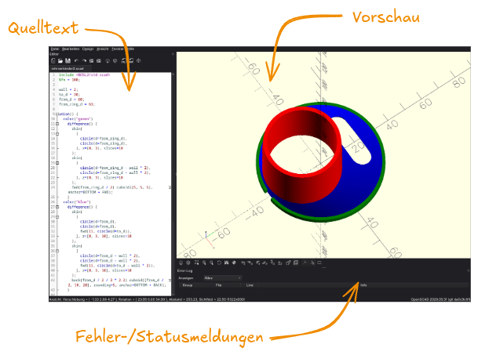
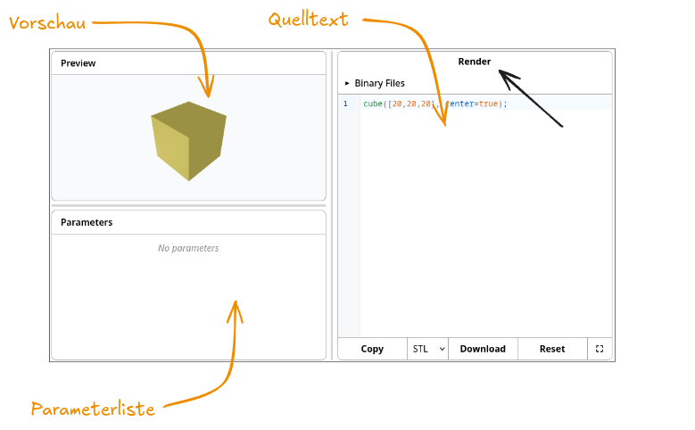

# Bedienung

## Lokal



Wenn du OpenSCAD lokal installiert hast, dann sieht das Programm wahrscheinlich so aus, wie auf dem Screenshot. Manchmal unterscheidet sich die Anordnung der Bereich ein wenig.

**Quelltext**: Hier siehst du einen einfachen Editor zur Bearbeitung des Programms.

**Vorschau**: Hier siehst du die grafische Vorschau deines Programms.

**Fehler-/Statusmeldungen**: Hier siehst du Meldungen, wenn etwas schiefgegangen ist.

## Browser



Wenn du OpenSCAD im Browser verwendest, dann sieht der Bereich ein wenig anders aus.

**Quelltext**: Auch hier siehst du einen einfachen Editor zur Bearbeitung des Programms.

**Vorschau**: Auch im Browser siehst du die grafische Vorschau deines Programms.

**Parameterlist**: In der Browserversion ist die Parameterliste immer sichtbar, in der lokalen muss man diese erst aktivieren.

**Fehler-/Statusmeldungen**: Vielleicht vermisst du die Fehler- und Statusmeldungen. Diese erscheinen in der Browserversion über der Vorschau, wenn eine vorliegt.

## Vorschau

In beiden Varianten funktioniert die Vorschau gleich.

| Interaktion      | Wirkung            |
| ---------------- | ------------------ |
| Linke Maustaste  | Modell drehen      |
| Rechte Maustaste | Modell verschieben |
| Mausrad          | Zoom               |

Hier kannst du es ausprobieren:

:::openscad
```scad
cube([2,4,5]);
```
:::
