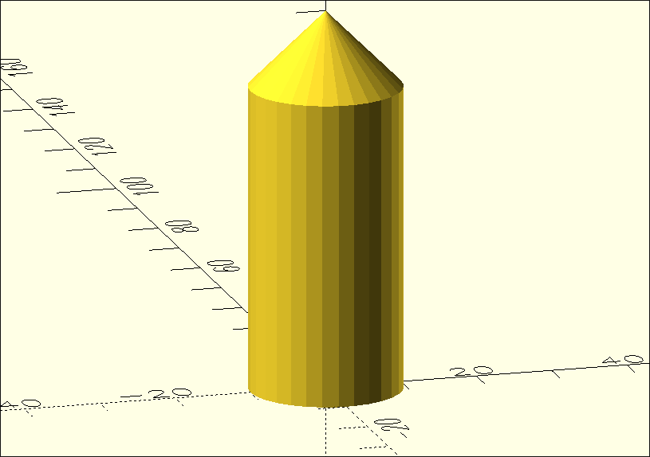

# 3D-Körper - Übung

Im letzten Kapitel hast du die grundlegenden 3D-Körper in OpenSCAD kennengelernt. Jetzt ist es an der Zeit, das Gelernte anzuwenden und ein eigenes 3D-Modell zu erstellen.

## Model 1



:::snippet{#aufgabe}
Bilde das obige Modell in OpenSCAD nach.
:::

:::openscad
```scad

```
:::

:::snippet{#aufgabe}
Verändere den Quelltext so, dass aus dem runden Modell ein eckiges wird.

Tipp: Erinnere dich an `$fn` aus dem Kapitel über die Kugel.
:::

## Model Fernsehturm

{height="400px"}

:::snippet{#aufgabe}
Bilde den Berliner Fernsehturm in OpenSCAD nach. Nutze dafür nur Zylinder und Kugeln.
:::

:::openscad
```scad

```
:::