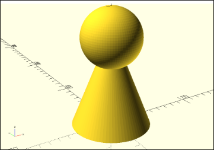
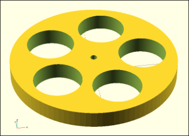
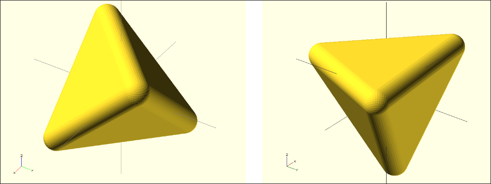
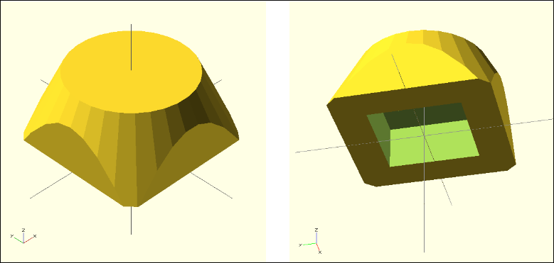
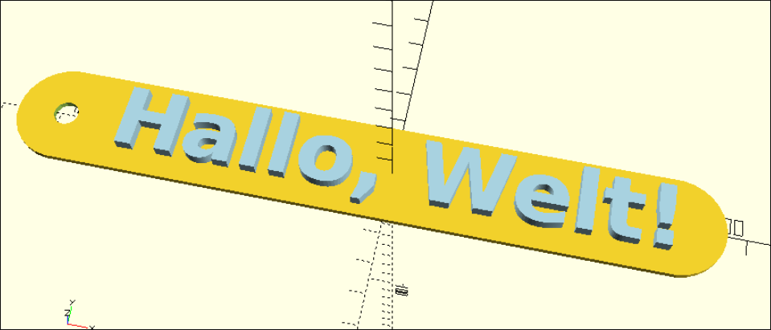

# Übungen

Bilde die jeweiligen Objekte in OpenSCAD nach. Lies dir die Tipps durch, wenn du nicht weiterkommst.

## Modell: Spielfigur



:::snippet{#aufgabe}
Baue die Spielfigur nach. Sie besteht aus einfachen 3D-Körpern.
:::

:::collapsible{title="Tipps"}
Verwende `sphere` für Kopf und Gelenke, `cylinder` für Rumpf und Beine. Nutze `translate`, um die Teile richtig zu positionieren. Starte mit dem Rumpf in der Mitte und arbeite dich nach oben und unten vor.
:::

:::openscad{height="500px"}
```scad

```
:::

## Modell: Rad mit Aussparungen



:::snippet{#aufgabe}
Baue das Rad nach. Es besteht aus einem flachen Zylinder, aus dem mehrere Löcher ausgespart sind.
:::

:::collapsible{title="Tipps"}
Nutze `difference()`. Das Rad ist ein flacher Zylinder (`cylinder`). Die Speichen-Aussparungen sind kleinere Zylinder, die mit `for`-Schleife und `rotate` gleichmäßig verteilt werden.
:::

:::openscad{height="500px"}
```scad

```
:::

## Modell: Tetraeder mit abgerundeten Kanten



:::snippet{#aufgabe}
Baue den Tetraeder nach. Er hat abgerundete Kanten und Ecken.
:::

:::collapsible{title="Tipps"}
Nutze die Minkowski-Summe aus [Komplexe Transformationen](./12-komplexe-transformationen.md): `minkowski()` mit einem `polyhedron` und einer kleinen `sphere`. Den Tetraeder (Dreieckspyramide) kannst du als `polyhedron` mit 4 Punkten und 4 Flächen definieren.
:::

:::openscad{height="500px"}
```scad

```
:::

## Modell: Podest, innen hohl



:::snippet{#aufgabe}
Baue das Podest nach. Es ist ein Quader, der innen hohl ist – wie eine Box ohne Deckel.
:::

:::collapsible{title="Tipps"}
Nutze `difference()`. Ziehe einen kleineren Quader von einem größeren ab. Der innere Quader darf oben aus dem äußeren herausragen, damit kein Deckel entsteht.
:::

:::openscad{height="500px"}
```scad

```
:::

## Modell: Schlüsselanhänger



:::snippet{#aufgabe}
Baue den Schlüsselanhänger nach. Er hat eine abgerundete Form und ein Loch für den Schlüsselring.
:::

:::collapsible{title="Tipps"}
Nutze `hull()` für die abgerundete Grundform (zwei Zylinder verbinden). Das Loch für den Ring ist ein kleiner Zylinder, den du mit `difference()` abziehst. Mach das Modell flach (niedriger `h`-Wert).
:::

:::openscad{height="500px"}
```scad

```
:::
