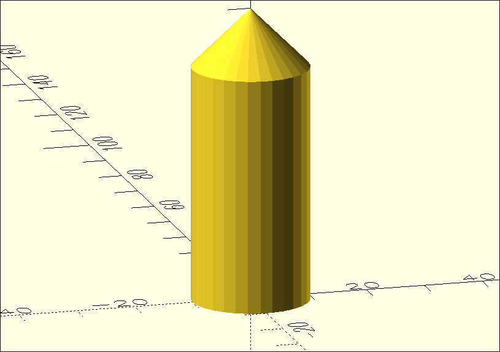

# Übungen – 3D-Körper

Im Kapitel [3D-Körper – Vertiefung](./02-3d-koerper) hast du die grundlegenden 3D-Körper in OpenSCAD kennengelernt. Jetzt ist es an der Zeit, das Gelernte anzuwenden und ein eigenes 3D-Modell zu erstellen.

## Model 1



::::snippet{#aufgabe}
Bilde das obige Modell in OpenSCAD nach.

:::openscad{height="400px"}

```scad
// Beispiel: Grundform
cube([20, 20, 20]);
// Dein Code hier
```
:::

::::

::::snippet{#aufgabe}
Verändere den Quelltext so, dass aus dem runden Modell ein eckiges wird.

Tipp: Erinnere dich an `$fn` aus [3D-Körper – Vertiefung](./02-3d-koerper).

:::openscad{height="400px"}

```scad
// Starte mit einer runden Kugel
$fn=50;
sphere(d=50);
```
:::

::::

## Model Fernsehturm

{height="400px"}

::::snippet{#aufgabe}
Bilde den Berliner Fernsehturm in OpenSCAD nach. Nutze dafür nur Zylinder und Kugeln.

:::openscad{height="400px"}

```scad
// Beispiel: Grundform mit Zylindern und Kugeln
cylinder(h=100, r=20);
translate([0, 0, 100]) sphere(r=15);
// Dein Code hier
```
:::

::::
---

## Selbsttest

::::multievent

**1. Du willst mehrere Körper an verschiedenen Stellen platzieren. Was brauchst du?**

{r1{für jeden Körper eine eigene Datei}}

{r1{!vor jedem Körper ein translate mit seinen Koordinaten}}

{r1{eine Schleife}}

{r1{einen Slicer}}

{h{Ohne Verschiebung starten alle Körper im Ursprung und liegen übereinander.}}
{H{Richtig.}}

**2. Dein Modell sieht in der Vorschau eckig aus, obwohl es rund sein soll. Was hilft?**

{r2{den Radius vergrößern}}

{r2{!die Auflösung über die Variable fn erhöhen}}

{r2{center auf true setzen}}

{r2{das Modell drehen}}

{h{Die Rundung wird durch viele ebene Flächen angenähert.}}
{H{Richtig.}}

**3. Woran erkennst du, dass zwei Körper beim Drucken ein einziges Teil ergeben?**

{r3{Sie haben dieselbe Farbe.}}

{r3{!Sie berühren oder überlappen sich.}}

{r3{Sie stehen in derselben Zeile im Quelltext.}}

{r3{Das lässt sich nicht erkennen.}}

{h{Der Drucker trägt Material auf – was zusammenhängt, bleibt zusammen.}}
{H{Richtig. Getrennt stehende Teile fallen nach dem Druck auseinander.}}

::::
