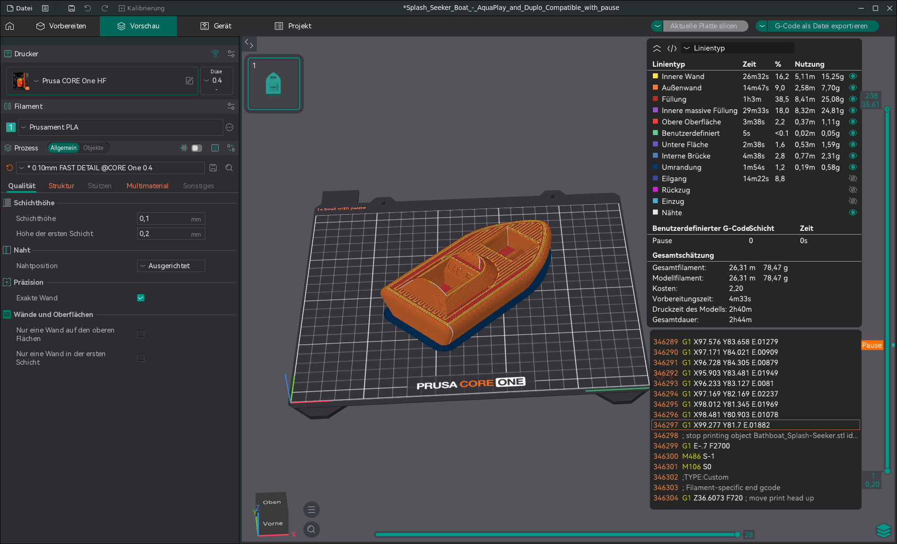
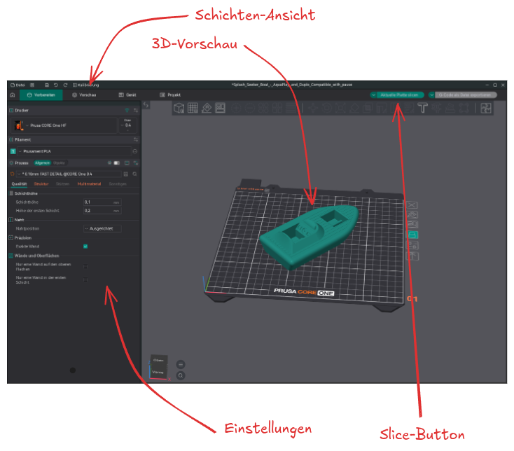

# Slicer-Software

Dein 3D-Modell – zum Beispiel ein Schlüsselanhänger, eine Handyhalterung oder ein Gehäuse – kann der Drucker nicht direkt drucken. Dazu brauchst du ein **Slicer-Programm** (von englisch *to slice* = schneiden).

## Was macht ein Slicer?

Ein Slicer bereitet dein Modell für den Drucker vor und erledigt dabei drei Dinge:

1. **Schneiden** – Das Modell wird in viele dünne Schichten (wie Scheiben eines Brotlaibs) zerlegt.
2. **Planen** – Für jede Schicht berechnet der Slicer, welchen Weg der Druckkopf fahren muss.
3. **Übersetzen** – Das Ergebnis wird als **G-Code**-Datei gespeichert – eine Art Anleitung, die der Drucker versteht.



## Welche Slicer-Programme gibt es?

Es gibt verschiedene kostenlose Slicer-Programme. Für den Schulunterricht eignet sich besonders **OrcaSlicer** – ein modernes Open-Source-Programm, das mit allen gängigen Druckern funktioniert.

| Slicer | Hersteller | Besonderheit |
| -------- | ---------- | ------------ |
| **OrcaSlicer** | Community | **Kostenlos, Open Source**, modern, schnelle Druckprofile |
| PrusaSlicer | Prusa Research | Kostenlos, Open Source, optimal für Prusa-Drucker |
| Cura | Ultimaker | Kostenlos, weit verbreitet, viele Einstellungen |

Für dieses Hyperbook verwenden wir **OrcaSlicer**, da es ein Open-Source-Projekt ist und mit allen Druckern funktioniert.

## Die Oberflächen eines Slicers



Ein Slicer-Programm wie OrcaSlicer hat folgende Bereiche:

- **3D-Vorschau** – Hier siehst du dein Modell und kannst es drehen, vergrößern oder ausrichten.
- **Einstellungen** – Hier stellst du ein, wie das Modell gedruckt werden soll (z. B. Schichtdicke, Füllung).
- **Schichten-Ansicht** – Nach dem "Slicen" kannst du durch die einzelnen Schichten blättern und sehen, wie der Drucker das Modell aufbaut.
- **Slice-Button** – Startet die Berechnung. Danach siehst du, wie lange der Druck dauert und wie viel Material verbraucht wird.

## Vom Modell zum gedruckten Objekt

Der Weg von deinem Modell zum fertigen Druck ist immer gleich:

```
3D-Modell  →  STL-Datei exportieren  →  OrcaSlicer  →  G-Code-Datei  →  3D-Drucker
```

Was genau in einer G-Code-Datei steht, erfährst du in [G-Code](../03-3d-druck/02-gcode.md).

:::multievent
Was ist die Aufgabe eines Slicers?

{r1{Das 3D-Modell direkt drucken.}}

{r1{!Das 3D-Modell in druckerverständlichen G-Code umwandeln.}}

{r1{Das 3D-Modell in OpenSCAD öffnen.}} {r1{Das Filament schmelzen.}}

In welchem Dateiformat exportiert man ein Modell aus OpenSCAD, um es in den Slicer zu laden?

{r2{.scad}}

{r2{.png}} 

{r2{!.stl}}

{r2{.gcode}}
:::
