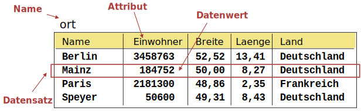
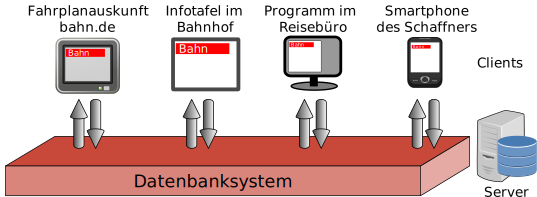

# Speichern von Daten in Tabellen 📊

## 🎯 Von der Sammlung zur Struktur

Du hast Daten über Städte gesammelt. Aber wie speichert man diese **übersichtlich und sinnvoll**?

**Die Lösung:** Tabellen! (Wie in Excel, aber viel mächtiger! 💪)

## 📋 Was ist eine relationale Datenbank?

:::snippet{#merken}
Eine **relationale Datenbank** ist eine **Sammlung von Tabellen**, die miteinander in Beziehung (**Relation**) stehen können.

**Eine Datenbanktabelle besteht aus:**

| Element | Bedeutung | Beispiel |
|---------|-----------|----------|
| 📝 **Tabellenname** | Eindeutiger Name der Tabelle | "Stadt", "Land" |
| 🔤 **Attribute** (Spalten) | Eigenschaften der gespeicherten Daten | "Name", "Einwohner", "Land" |
| 🎯 **Datentyp** | Wertebereich für jedes Attribut | Text, Zahl, Kommazahl, Datum |
| 📄 **Datensätze** (Zeilen) | Einzelne Einträge mit konkreten Werten | "Berlin", 3500000, "Deutschland" |
:::

### 📊 Beispiel: Stadt-Tabelle

**Merke dir die Begriffe:**
- 📋 **Tabelle** = Die gesamte Datensammlung zu einem Thema
- 🔤 **Attribut/Spalte** = Eine Eigenschaft (z.B. "Name")
- 📄 **Datensatz/Zeile** = Ein kompletter Eintrag (z.B. alle Daten über Berlin)
- 🎯 **Wert** = Ein einzelner Eintrag in einer Zelle

:::alert{info}
**Woher kommt "relational"?**

Der Begriff kommt aus der Mathematik (Relationenalgebra). Er bedeutet, dass Tabellen **Beziehungen** (Relationen) zueinander haben können.

Beispiel: Die Tabelle "Stadt" ist mit der Tabelle "Land" verbunden, weil jede Stadt zu einem Land gehört!
:::

## ⚛️ Atomare Werte - Eine wichtige Regel!

:::snippet{#merken}
**Regel:** Ein Wert in einer Tabellenzelle soll **atomar** sein.

**Atomar bedeutet:** Nur **ein einzelner Wert**, keine Listen oder mehrere Werte!
:::

### ❌ Falsch: Nicht atomare Werte

**Problem:** Die Tabelle speichert in der Spalte "Lehrer" eine **Liste** von Lehrern!

**Warum ist das schlecht?**
- 🔍 Schwer zu durchsuchen ("Welche Klassen hat Herr Müller?")
- 📊 Schwer zu sortieren
- 🔄 Schwer zu ändern (Was, wenn ein Lehrer dazukommt?)

### ✅ Richtig: Atomare Werte

**Bessere Lösung:** Mehrere Tabellen nutzen!

**Tabelle 1: Klasse**
| KlassenID | Klassenname |
|-----------|-------------|
| 1 | 9a |
| 2 | 9b |

**Tabelle 2: Klasse_Lehrer** (Verbindungstabelle)
| KlassenID | LehrerName |
|-----------|------------|
| 1 | Müller |
| 1 | Schmidt |
| 2 | Weber |

**Vorteil:** Jetzt ist jeder Wert atomar und trotzdem können mehrere Lehrer einer Klasse zugeordnet werden! 🎯

## 👥 Gleichzeitiger Zugriff - Der große Vorteil!

### 🤔 Excel vs. Datenbank - Was ist der Unterschied?

**Du fragst dich vielleicht:** "Warum nicht einfach Excel nutzen? Das hat doch auch Tabellen!"

**Gute Frage!** Hier ist der Unterschied:

#### ❌ Problem mit Excel/Calc

**Excel-Regel:** Nur **eine Person** darf gleichzeitig Änderungen machen!
- 🔒 Person 1 bearbeitet → Alle anderen können nur zuschauen
- ⏳ Alle anderen müssen warten
- 😤 Nervt bei Teamarbeit!

#### ✅ Vorteil von Datenbanken

**Datenbanken erlauben:** **Hunderte oder Tausende** Benutzer können **gleichzeitig** Daten ändern!

**Stell dir vor:**
- 📱 **Instagram:** Millionen Nutzer posten gleichzeitig Bilder
- 🎮 **Online-Spiel:** Tausende Spieler gleichzeitig aktiv
- 🛒 **Amazon:** Gleichzeitig Bestellungen, Bewertungen, Warenkorb
- 🎵 **Spotify:** Millionen hören gleichzeitig Musik

**Ohne Datenbank wäre das unmöglich!** ❌

:::alert{success}
**Merke:** Datenbanken sind für **viele gleichzeitige Zugriffe** optimiert!
:::

## 🌐 Eine Datenbasis für viele Programme

### 🚂 Beispiel: Deutsche Bahn

Denk mal an die Bahn - wie viele verschiedene Programme nutzen die **gleichen** Fahrplandaten?

**Programme, die auf die Bahn-Datenbank zugreifen:**
- 💻 **Fahrplanauskunft** im Internet (bahn.de)
- 📱 **DB Navigator App** auf deinem Smartphone
- 🎫 **Buchungssystem** im Reisebüro
- 📺 **Anzeigetafeln** im Bahnhof
- 🚂 **Schaffner-Tablet** im Zug (für Anschlüsse)
- 🔔 **Verspätungs-Benachrichtigungen**

### 🏢 Das Client-Server-Prinzip

:::snippet{#merken}
**So funktioniert's:**

🖥️ **Server** (einer)
- Zentrale Datenbank
- Läuft 24/7
- Verwaltet alle Daten
- Beantwortet Anfragen

📱 **Clients** (viele)
- Verschiedene Programme/Apps
- Stellen Anfragen an den Server
- Bekommen Antworten zurück
- Zeigen Daten an
:::

**Vorteile:**
- ✅ **Eine Wahrheit:** Alle sehen die gleichen (aktuellen!) Daten
- ✅ **Zentral:** Änderungen nur an einem Ort nötig
- ✅ **Sicher:** Zugriffsrechte zentral verwaltet
- ✅ **Flexibel:** Neue Programme können einfach hinzugefügt werden

:::collapsible{title="🎮 Weitere Beispiele aus deinem Alltag"}
**Instagram/TikTok:**
- Server: Datenbank mit allen Posts, Likes, Kommentaren
- Clients: App, Website, verschiedene Geräte

**Netflix:**
- Server: Datenbank mit Filmen, Bewertungen, Watchlists
- Clients: TV-App, Smartphone, Tablet, Browser

**Schule:**
- Server: Datenbank mit Noten, Stundenplänen, Vertretungsplan
- Clients: WebUntis-App, Stundenplan-App, Lehrer-PC
:::