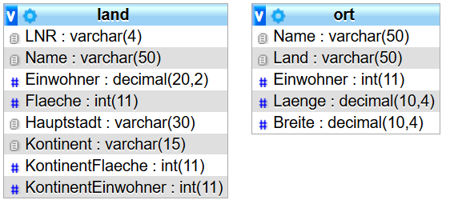
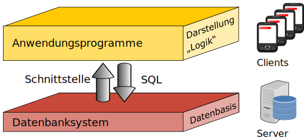

# Die erste Datenbank

Als Beispieldatenbank dient jetzt eine Datenbank mit Geo-Basisdaten. Zunächst sind nur zwei Tabellen vorhanden:



Es gibt also die Tabellen ort und land. Die Attribute der Tabellen sind darunter mit ihren Datentypen in MySQL genannt.

:::alert{info}
Für die nachfolgenden Aufgaben wird die Terra1-Datenbank von inf-schule.de verwendet. Du kannst sie hier herunterladen, falls du sie lokal ausprobieren möchtest:

::download[Terra1-Datenbank (SQLite)]{src="https://sqlide.openpatch.org/assets/databases/terra1.sqlite"}
:::

## SQL

Wenn unterschiedliche Programme auf die gleiche Datenbank zugreifen sollen, dann muss eine einheitliche "Sprache" vereinbart werden. Mit dieser **Schnittstellen-Sprache** können die Programme auf die Daten der zentralen Datenbank zugreifen.



Die wichtigste Sprache ist **SQL - Structured Query Language**.

### Aufgabe 1

:::snippet{#aufgabe}
Führe die folgende SQL-Anweisung in der Terra1-Datenbank aus, um alle Orte in Deutschland mit ihren Einwohnerzahlen anzuzeigen. Drücke dazu auf den grünen "Play"-Button.
:::

:::sqlide{db="https://sqlide.openpatch.org/assets/databases/terra1.sqlite"}

```mysql Statements.sql
SELECT name, einwohner
  FROM ort
WHERE land = 'Deutschland'
```
:::

:::snippet{#aufgabe}
Was bedeuten die einzelnen Teile (SELECT / FROM / WHERE) des SQL-Befehls?

Vielleicht hilft es dir, Teile des SQL-Befehls zu verändern und ihn erneut auszuführen. 
:::

::textinput{placeholder="Schreibe hier deine Antwort und deine Überlegungen..." height="100px"}

## Aufgabe 2

:::snippet{#aufgabe}
Schreibe SQL-Befehle, um

- alle Orte in Frankreich auszugeben.
- alle Orte in Deutschland auszugeben und zwar deren Namen, Länge und Breite.
:::

:::sqlide{db="https://sqlide.openpatch.org/assets/databases/terra1.sqlite"}

```mysql Statements.sql
SELECT
```
:::