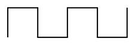
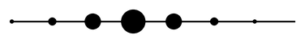
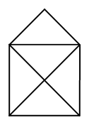

# Erster Einsatz der Turtle

Wir betrachten noch einmal unser erstes Beispiel zum Einsatz der Turtle – diesmal etwas ausführlicher:

:::pyide{canvas}

```python
from turtle import *

# Die Turtle wird als Schildkröte dargestellt:
shape("turtle")

# Die Zeichenfläche wird 400 Pixel breit und 300 Pixel hoch:
screensize(400, 300)

# Jetzt bewegt sich die Turtle:
forward(100)
right(90)
forward(50)
dot(20)
```

:::

Ein paar Hinweise zu diesem Beispiel:

:::snippet{#merken}
| Befehl | Wirkung |
| --- | --- |
| `from turtle import *` | macht alle Turtle-Befehle verfügbar. Diese Zeile gehört an den Anfang **jedes** Turtle-Programms. |
| `shape("turtle")` | stellt die Turtle als Schildkröte dar. |
| `screensize(400, 300)` | legt die Größe der Zeichenfläche fest (Breite, Höhe in Pixel). |
| `forward(100)` | bewegt die Turtle 100 Pixel vorwärts. |
| `backward(50)` | bewegt die Turtle 50 Pixel rückwärts. |
| `right(90)` | dreht die Turtle um 90 Grad nach rechts. |
| `left(90)` | dreht die Turtle um 90 Grad nach links. |
| `dot(20)` | lässt die Turtle einen Punkt mit Durchmesser 20 Pixel zeichnen. |

Bei `forward`, `right` und `left` kannst du natürlich auch andere Werte einsetzen – zum Beispiel `right(30)` für eine Drehung um 30 Grad.
:::

## Aufgabe 1: Zeichnungen nachbauen

:::snippet{#aufgabe}
Stelle die nachfolgenden Zeichnungen mit der Turtle nach. Nutze für jede Zeichnung den zugehörigen Programmierbereich.

Überlege dir **vorher auf Papier**, in welcher Reihenfolge die Turtle laufen und sich drehen muss.
:::

### a) Zick-Zack



:::pyide{canvas}

```python
from turtle import *
shape("turtle")
screensize(600, 300)

# Dein Code hier
```

:::

::::collapsible{title="Tipp 1: Wie fange ich an?"}

Die Turtle schaut am Anfang nach **rechts**. Die erste Linie geht aber nach **oben**. Mit welchem Befehl drehst du sie zuerst?

::::

::::collapsible{title="Tipp 2: Das Muster"}

Sieh dir die Zeichnung genau an: Es wiederholt sich immer dieselbe Abfolge aus vier Strecken. Zwischen den Strecken wird abwechselnd nach rechts und nach links gedreht – jedes Mal um 90 Grad.

Alle Strecken sind gleich lang (50 Pixel).

::::

::::collapsible{title="Tipp 3: Der Anfang als Code"}

```python
left(90)
forward(50)
right(90)
forward(50)
right(90)
forward(50)
left(90)
forward(50)
```

Diesen Block musst du nur noch mehrfach wiederholen.

::::

:::protect{password="turtle-1-3-1" description="Lösung. Erfrage das Passwort bei deiner Lehrkraft."}

```python
from turtle import *
shape("turtle")
screensize(600, 300)

left(90)
forward(50)
right(90)
forward(50)
right(90)
forward(50)
left(90)
forward(50)
left(90)
forward(50)
right(90)
forward(50)
right(90)
forward(50)
left(90)
forward(50)
left(90)
forward(50)
```

:::

### b) Punktekette



:::pyide{canvas}

```python
from turtle import *
shape("turtle")
screensize(600, 300)

# Dein Code hier
```

:::

::::collapsible{title="Tipp 1: Wie zeichne ich einen Punkt?"}

Mit `dot(20)` zeichnet die Turtle einen Punkt an ihrer aktuellen Position. Sie bewegt sich dabei **nicht**. Du musst also abwechselnd zeichnen und vorlaufen.

::::

::::collapsible{title="Tipp 2: Welche Größen?"}

Die Punkte werden zur Mitte hin größer und danach wieder kleiner. Verwende die Durchmesser 5, 10, 20, 30, 20, 10, 5.

Der Abstand zwischen den Punkten beträgt jeweils 50 Pixel.

::::

:::protect{password="turtle-1-3-2" description="Lösung. Erfrage das Passwort bei deiner Lehrkraft."}

```python
from turtle import *
shape("turtle")
screensize(600, 300)

dot(5)
forward(50)
dot(10)
forward(50)
dot(20)
forward(50)
dot(30)
forward(50)
dot(20)
forward(50)
dot(10)
forward(50)
dot(5)
```

:::

### c) Das Haus vom Nikolaus

Jetzt versuche dich am Haus vom Nikolaus. Es soll – wie beim Zeichnen auf Papier – **in einem Zug** entstehen, ohne den Stift abzusetzen.



:::pyide{canvas}

```python
from turtle import *
shape("turtle")
screensize(400, 400)

# Dein Code hier
```

:::

::::collapsible{title="Tipp 1: Nicht alle Winkel sind 90 Grad"}

Bei `right(90)` kannst du jeden beliebigen Winkel einsetzen, also auch `right(45)` oder `right(135)`.

Im Haus vom Nikolaus kommen genau drei Winkel vor: 45°, 90° und 135°.

::::

::::collapsible{title="Tipp 2: Wie lang sind die schrägen Linien?"}

Die Wände sind 100 Pixel lang. Für die schrägen Strecken hilft der Satz des Pythagoras:

- Die **Diagonalen** des Quadrats sind $100 \cdot \sqrt{2} \approx 141$ Pixel lang.
- Die beiden **Dachschenkel** sind jeweils etwa 71 Pixel lang.

::::

::::collapsible{title="Tipp 3: Der Weg in einem Zug"}

Starte unten links, drehe dich nach oben und laufe:

linke Wand hoch → Dach links hoch → Dach rechts runter → rechte Wand runter → Diagonale nach links oben → Boden → Diagonale nach rechts oben

Am Ende landest du wieder oben rechts.

::::

:::protect{password="turtle-1-3-3" description="Lösung. Erfrage das Passwort bei deiner Lehrkraft."}

```python
from turtle import *
shape("turtle")
screensize(400, 400)

left(90)
forward(100)     # linke Wand hoch
right(45)
forward(71)      # Dach links
right(90)
forward(71)      # Dach rechts
right(135)
forward(100)     # rechte Wand runter
left(135)
forward(141)     # Diagonale nach links oben
right(135)
forward(100)     # Boden
right(135)
forward(141)     # Diagonale nach rechts oben
right(135)
forward(100)     # rechte Wand hoch
```

:::

---

## Selbsttest

::::multievent

**1. Welche Zeile darf in keinem Turtle-Programm fehlen?**

{r1{!from turtle import *}}

{r1{import turtle}}

{r1{shape("turtle")}}

{r1{screensize(400, 300)}}

{h{Ohne diese Zeile kennt Python die Befehle forward und right gar nicht.}}
{H{Genau! Erst diese Zeile stellt die Turtle-Befehle bereit.}}

**2. Die Turtle steht am Start und schaut nach rechts. Wohin schaut sie nach left(90)?**

{r2{Nach links}}

{r2{!Nach oben}}

{r2{Nach unten}}

{r2{Weiterhin nach rechts}}

{h{Stell dir vor, du stehst selbst da und schaust nach rechts. Du drehst dich um eine Vierteldrehung nach links.}}
{H{Richtig! Aus „nach rechts" wird durch eine Linksdrehung um 90 Grad „nach oben".}}

**3. Welche Befehle bewegen die Turtle von der Stelle?** (Mehrfachauswahl)

{c1{!forward}}

{c1{!backward}}

{c1{right}}

{c1{left}}

{c1{dot}}

{h{Zwei der Befehle drehen die Turtle nur, einer zeichnet nur.}}
{H{Richtig! Nur forward und backward verändern die Position.}}

**4. Wie viele Grad sind es beim Haus vom Nikolaus an der Dachspitze?**

{z{90}} Grad

{h{Die beiden Dachschenkel treffen sich rechtwinklig.}}
{H{Richtig, die Dachspitze ist ein rechter Winkel.}}

**5. Ergänze: Der Befehl {t{dot}}(20) zeichnet einen Punkt mit dem Durchmesser 20.**

{h{Der englische Begriff für Punkt.}}
{H{Richtig!}}

::::
