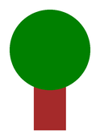
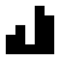
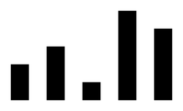
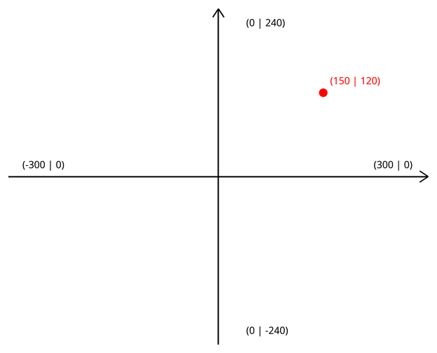
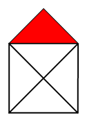
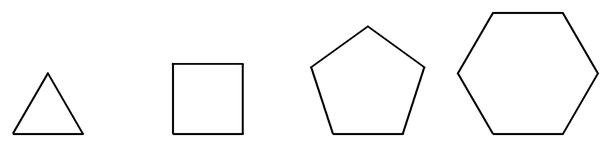

# Weitere Funktionen der Turtle

Um vielfältigere Zeichnungen zu erstellen, sehen wir uns ein paar weitere Funktionen der Turtle an.

:::snippet{#merken}
| Befehl | Wirkung |
| --- | --- |
| `speed(0)` | schaltet die Animation aus – die Zeichnung erscheint sofort. Kleine Werte wie `speed(1)` sind langsam, größere wie `speed(10)` sind schnell. |
| `pencolor("red")` | setzt die Stiftfarbe auf Rot. |
| `pensize(10)` | setzt die Strichstärke auf 10 Pixel. |
| `penup()` | hebt den Stift an – die Turtle läuft, ohne zu zeichnen. |
| `pendown()` | setzt den Stift wieder ab. |
| `hideturtle()` | versteckt die Turtle. Die Zeichnung bleibt sichtbar. |

Eine Übersicht über alle Farbnamen findest du auf [w3schools.com](https://www.w3schools.com/colors/colors_x11.asp).
:::

## Aufgabe 1: Erst denken, dann testen

:::snippet{#aufgabe}
Gegeben ist das folgende Programm.

a) Skizziere **zunächst ohne Rechner** auf Papier die Zeichnung, die sich ergibt.

b) Führe das Programm danach aus und vergleiche. Erkläre gegebenenfalls Abweichungen.
:::

:::pyide{canvas}

```python
from turtle import *
shape("turtle")
screensize(500, 200)

speed(5)

pensize(10)
forward(40)

pencolor("red")
pensize(20)
forward(40)

pencolor("green")
pensize(40)
forward(40)

pencolor("yellow")
pensize(80)
forward(40)

penup()
forward(80)
pencolor("magenta")
pendown()
dot(50)
```

:::

::::collapsible{title="Tipp: Worauf muss ich achten?"}

Zwei Dinge sind leicht zu übersehen:

1. Die Turtle startet in der **Mitte** der Zeichenfläche, nicht am linken Rand.
2. Zwischen dem gelben Balken und dem magentafarbenen Punkt ist der Stift angehoben – dort entsteht eine Lücke.

::::

## Aufgabe 2: Vier Zeichnungen

:::snippet{#aufgabe}
Entwickle für jede der folgenden vier Zeichnungen ein eigenes Programm.
:::

### a) Ein Baum



:::pyide{canvas}

```python
from turtle import *
shape("turtle")
screensize(400, 400)

# Dein Code hier
```

:::

::::collapsible{title="Tipp 1: Woraus besteht der Baum?"}

Der Baum besteht aus nur zwei Teilen:

- der **Stamm** ist eine einzelne, sehr dicke Linie,
- die **Krone** ist ein einzelner großer Punkt.

::::

::::collapsible{title="Tipp 2: Konkrete Werte"}

Stamm: `pensize(40)` und `pencolor("brown")`, dann 100 Pixel nach oben.

Krone: `pencolor("green")` und dann `dot(100)`.

Denke daran, die Turtle vorher nach oben zu drehen und ans untere Ende zu setzen.

::::

:::protect{password="turtle-1-4-1" description="Lösung. Erfrage das Passwort bei deiner Lehrkraft."}

```python
from turtle import *
shape("turtle")
screensize(400, 400)

penup()
goto(0, -120)
left(90)
pendown()

pensize(40)
pencolor("brown")
forward(100)

pencolor("green")
dot(100)
```

:::

### b) Eine Kerze


:::pyide{canvas}

```python
from turtle import *
shape("turtle")
screensize(400, 400)

# Dein Code hier
```

:::

::::collapsible{title="Tipp: Der Aufbau"}

Die Kerze funktioniert wie der Baum, hat aber drei Teile: einen dicken gelben Körper, einen dünnen schwarzen Docht und eine orange Flamme als Punkt.

Vergiss nicht, zwischendurch die `pensize` wieder zu verkleinern.

::::

:::protect{password="turtle-1-4-2" description="Lösung. Erfrage das Passwort bei deiner Lehrkraft."}

```python
from turtle import *
shape("turtle")
screensize(400, 400)

penup()
goto(0, -120)
left(90)
pendown()

pensize(40)
pencolor("gold")
forward(140)

pensize(3)
pencolor("black")
forward(20)

pencolor("orange")
dot(30)
```

:::

### c) Ein Säulendiagramm



:::pyide{canvas}

```python
from turtle import *
shape("turtle")
screensize(500, 400)

# Dein Code hier
```

:::

::::collapsible{title="Tipp 1: Wie zeichne ich eine Säule?"}

Eine Säule ist eine dicke Linie nach oben. Damit die nächste Säule wieder unten beginnt, muss die Turtle denselben Weg **rückwärts** zurücklaufen – am besten mit `backward`.

::::

::::collapsible{title="Tipp 2: Der Weg zur nächsten Säule"}

Nach jeder Säule gilt: Stift anheben, nach rechts drehen, um die Säulenbreite vorlaufen, wieder nach oben drehen, Stift absetzen.

```python
penup()
right(90)
forward(20)
left(90)
pendown()
```

Die Höhen sind 40, 60, 20, 100 und 80.

::::

:::protect{password="turtle-1-4-3" description="Lösung. Erfrage das Passwort bei deiner Lehrkraft."}

```python
from turtle import *
shape("turtle")
screensize(500, 400)

pensize(20)
penup()
goto(-120, -100)
left(90)
pendown()

forward(40)
backward(40)
penup()
right(90)
forward(20)
left(90)
pendown()

forward(60)
backward(60)
penup()
right(90)
forward(20)
left(90)
pendown()

forward(20)
backward(20)
penup()
right(90)
forward(20)
left(90)
pendown()

forward(100)
backward(100)
penup()
right(90)
forward(20)
left(90)
pendown()

forward(80)
backward(80)
```

Das ist ganz schön viel Schreibarbeit. Im nächsten Kapitel lernst du **Schleifen** kennen – damit wird dieses Programm deutlich kürzer.

:::

### d) Ein Säulendiagramm mit Abstand



:::snippet{#aufgabe}
Verändere dein Programm aus Teil c) so, dass zwischen den Säulen ein Abstand entsteht.
:::

:::pyide{canvas}

```python
from turtle import *
shape("turtle")
screensize(500, 400)

# Dein Code hier
```

:::

::::collapsible{title="Tipp"}

Du musst nur **eine einzige Zahl** ändern: die Strecke, die die Turtle bei angehobenem Stift zur Seite läuft.

::::

## Das Koordinatensystem

Die Zeichenfläche der Turtle hat ein Koordinatensystem, das du aus dem Mathematikunterricht kennst. Der **Ursprung (0 | 0) liegt genau in der Mitte**, die y-Achse zeigt nach oben.



:::snippet{#merken}
| Befehl | Wirkung |
| --- | --- |
| `goto(150, 120)` | setzt die Turtle direkt auf den Punkt (150 \| 120). |
| `home()` | setzt die Turtle zurück auf (0 \| 0) und dreht sie nach rechts. |
| `screensize(640, 480)` | legt die Größe der Zeichenfläche fest. Bei dieser Größe reicht sie von -320 bis 320 (x) und von -240 bis 240 (y). |

**Achtung:** `goto` zeichnet eine Linie, wenn der Stift unten ist. Möchtest du nur springen, hebe ihn vorher mit `penup()` an.
:::

## Aufgabe 3: Mit Koordinaten arbeiten

:::snippet{#aufgabe}
Analysiere das folgende Programm durch wiederholtes Testen. Erkläre dann, was die neu eingeführten Funktionen bewirken.

Verändere anschließend die Koordinaten und beobachte, wohin die Punkte wandern.
:::

:::pyide{canvas}

```python
from turtle import *
shape("turtle")
screensize(600, 400)
speed(0)

penup()

goto(-200, 150)
dot(20)

goto(200, 150)
dot(20)

goto(0, 0)
pencolor("gray")
dot(20)

goto(-200, -150)
pencolor("red")
dot(20)

goto(200, -150)
dot(20)
```

:::

## Flächen füllen

Bisher haben wir nur Linien gezeichnet. Die Turtle kann Flächen auch **ausfüllen**:

:::pyide{canvas}

```python
from turtle import *
shape("turtle")
screensize(400, 400)

pencolor("green")
fillcolor("yellow")
pensize(10)

begin_fill()
right(45)
forward(100)
right(45)
forward(200)
right(45)
forward(100)
end_fill()
```

:::

:::snippet{#merken}
- `begin_fill()` markiert den **Anfang** einer Fläche.
- `end_fill()` markiert das **Ende**. Die umschlossene Fläche wird automatisch gefüllt.
- `fillcolor("yellow")` legt die Füllfarbe fest.
- Ist der Weg nicht geschlossen, verbindet Python Start- und Endpunkt automatisch mit einer geraden Linie.
:::

## Aufgabe 4: Rotes Dach

:::snippet{#aufgabe}
Modifiziere deine Zeichnung vom Haus vom Nikolaus so, dass das **Dach rot ausgefüllt** wird.
:::



:::pyide{canvas}

```python
from turtle import *
shape("turtle")
screensize(400, 400)

# Deine Lösung aus der letzten Lektion, ergänzt um die Füllung
```

:::

::::collapsible{title="Tipp 1: Wo setze ich begin_fill?"}

Das Dach besteht aus genau zwei Strecken: dem linken und dem rechten Dachschenkel. `begin_fill()` gehört direkt **davor**, `end_fill()` direkt **danach**.

::::

::::collapsible{title="Tipp 2: Warum wird trotzdem ein Dreieck gefüllt?"}

Weil Python den Weg automatisch schließt: Vom Ende des rechten Dachschenkels zieht es eine unsichtbare Linie zurück zum Anfang des linken. Genau das ergibt das Dreieck.

::::

:::protect{password="turtle-1-4-4" description="Lösung. Erfrage das Passwort bei deiner Lehrkraft."}

```python
from turtle import *
shape("turtle")
screensize(400, 400)

left(90)
forward(100)     # linke Wand hoch

fillcolor("red")
begin_fill()
right(45)
forward(71)      # Dach links
right(90)
forward(71)      # Dach rechts
end_fill()

right(135)
forward(100)     # rechte Wand runter
left(135)
forward(141)     # Diagonale nach links oben
right(135)
forward(100)     # Boden
right(135)
forward(141)     # Diagonale nach rechts oben
right(135)
forward(100)     # rechte Wand hoch
```

:::

## Aufgabe 5: Regelmäßige Vielecke

Ein **regelmäßiges Vieleck** hat gleich lange Seiten und gleich große Winkel.



:::snippet{#aufgabe}
Zeichne die vier abgebildeten regelmäßigen Vielecke. Alle Seiten sind 70 Pixel lang.
:::

:::pyide{canvas}

```python
from turtle import *
shape("turtle")
screensize(400, 400)

# Dein Code hier
```

:::

::::collapsible{title="Tipp 1: Wie groß ist der Drehwinkel?"}

Die Turtle läuft einmal komplett um die Figur herum und schaut am Ende wieder in die Startrichtung. Insgesamt hat sie sich also um **360 Grad** gedreht.

Bei einem Vieleck mit $n$ Ecken verteilt sich diese volle Drehung gleichmäßig auf $n$ Drehungen.

::::

::::collapsible{title="Tipp 2: Die Formel"}

$$\text{Drehwinkel} = \frac{360°}{\text{Anzahl der Ecken}}$$

Also: Dreieck 120°, Viereck 90°, Fünfeck 72°, Sechseck 60°.

::::

:::protect{password="turtle-1-4-5" description="Lösung. Erfrage das Passwort bei deiner Lehrkraft."}

```python
from turtle import *
shape("turtle")
screensize(400, 400)

# Fünfeck als Beispiel - für die anderen Vielecke
# ändere die Anzahl der Wiederholungen und den Winkel.
forward(70)
left(72)
forward(70)
left(72)
forward(70)
left(72)
forward(70)
left(72)
forward(70)
left(72)
```

:::

---

## Selbsttest

::::multievent

**1. Was bewirkt penup()?**

{r1{Die Turtle wird versteckt}}

{r1{!Die Turtle läuft weiter, zeichnet aber keine Linie mehr}}

{r1{Die Turtle bleibt stehen}}

{r1{Die Zeichnung wird gelöscht}}

{h{Der Stift wird angehoben – die Turtle kann sich aber weiterhin bewegen.}}
{H{Richtig! Mit penup() bewegt sich die Turtle, ohne eine Spur zu hinterlassen.}}

**2. Wo liegt der Punkt (0 | 0) auf der Zeichenfläche?**

{r2{Links oben}}

{r2{Links unten}}

{r2{!In der Mitte}}

{r2{Rechts unten}}

{h{Sieh dir noch einmal das Bild vom Koordinatensystem an.}}
{H{Richtig! Anders als bei vielen anderen Grafiksystemen liegt der Ursprung in der Mitte.}}

**3. Welchen Drehwinkel brauchst du für ein regelmäßiges Achteck?**

{z{45}} Grad

{h{Teile die volle Drehung von 360 Grad durch die Anzahl der Ecken.}}
{H{Richtig! 360 geteilt durch 8 ergibt 45.}}

**4. Welche beiden Befehle gehören zusammen, um eine Fläche zu füllen?** (Mehrfachauswahl)

{c1{!begin_fill}}

{c1{!end_fill}}

{c1{fillcolor}}

{c1{start_path}}

{c1{penup}}

{h{Gesucht sind die beiden Befehle, die Anfang und Ende der Fläche markieren – nicht der Befehl für die Farbe.}}
{H{Richtig! fillcolor legt nur die Farbe fest, das Füllen selbst erledigen begin_fill und end_fill.}}

**5. Die Turtle steht auf (0 | 0). Nach penup() und goto(100, -50) steht sie …**

{r3{… rechts oberhalb des Ursprungs, mit Linie}}

{r3{!… rechts unterhalb des Ursprungs, ohne Linie}}

{r3{… links unterhalb des Ursprungs, ohne Linie}}

{r3{… wieder auf (0 | 0)}}

{h{Ein positiver x-Wert bedeutet rechts, ein negativer y-Wert bedeutet unterhalb der Mitte.}}
{H{Richtig!}}

::::
