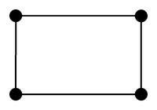
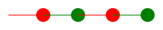

# Variablen mit der Turtle

Wir beginnen mit einem Beispiel. Es zeichnet zweimal dasselbe Quadrat – aber auf zwei unterschiedliche Arten.

:::pyide{canvas}

```python
from turtle import *
shape("turtle")
screensize(400, 400)
speed(0)

# schlechtes Beispiel:

forward(100)
right(90)
forward(100)
right(90)
forward(100)
right(90)
forward(100)
right(90)

# besseres Beispiel:

laenge = 100

forward(laenge)
right(90)
forward(laenge)
right(90)
forward(laenge)
right(90)
forward(laenge)
right(90)
```

:::

:::snippet{#merken}
- In einer **Variablen** kannst du einen Wert ablegen und ihn später wiederverwenden.
- Mit `laenge = 100` speicherst du den Wert 100 unter dem Namen `laenge`.
- Um den Wert zu verwenden, schreibst du einfach den Namen, z. B. `forward(laenge)`.
- Du kannst einen neuen Wert in einer bestehenden Variablen ablegen – der alte Wert wird dabei **überschrieben**.
- Namen darfst du frei wählen. Sinnvoll sind sprechende Namen wie `laenge`, `breite` oder `farbe`. Umlaute und Leerzeichen sind nicht erlaubt.
:::

## Aufgabe 1: Warum ist das besser?

:::snippet{#aufgabe}
Im Programmtext steht bereits, dass das Vorgehen im zweiten Teil besser ist.

Argumentiere, **warum** ein Vorgehen wie im zweiten Teil vorzuziehen ist.

Probiere dazu aus: Ändere das Quadrat in beiden Teilen auf die Seitenlänge 150. Wie viele Stellen musst du jeweils anfassen?
:::

::textinput{placeholder="Das zweite Vorgehen ist besser, weil ..."}

::::collapsible{title="Tipp: Woran könnte ich denken?"}

Überlege dir zwei Dinge:

1. Wie viele Zahlen musst du ändern, wenn das Quadrat größer werden soll?
2. Was passiert, wenn du dabei versehentlich eine Zahl vergisst?

::::

## Aufgabe 2: Ein Rechteck

:::snippet{#aufgabe}
Gegeben ist die folgende Vorlage.

a) Vervollständige sie so, dass die Turtle ein Rechteck mit der Breite und der Höhe zeichnet, die in den Variablen gespeichert sind.

b) Modifiziere sie anschließend so, dass zusätzlich **in jeder Ecke ein Punkt** gezeichnet wird. Die Größe der Punkte soll ebenfalls in einer Variablen stehen.

**Prüfe deine Lösung:** Ändere danach nur die Werte in den Variablen. Das Rechteck muss sich passend verändern, ohne dass du sonst etwas anfasst.
:::



:::pyide{canvas}

```python
from turtle import *
shape("turtle")
screensize(400, 300)

breite = 160
hoehe = 100
punkt = 16

# Dein Code hier
```

:::

::::collapsible{title="Tipp 1: Wie sieht ein Rechteck aus?"}

Ein Rechteck besteht aus vier Seiten, aber nur zwei verschiedenen Längen: Breite, Höhe, Breite, Höhe. Zwischen den Seiten wird jedes Mal um 90 Grad gedreht.

::::

::::collapsible{title="Tipp 2: Wo kommen die Punkte hin?"}

Ein Punkt gehört immer genau dorthin, wo die Turtle gerade steht – also **vor** jeder Seite, bevor sie losläuft.

::::

:::protect{password="turtle-2-1-1" description="Lösung. Erfrage das Passwort bei deiner Lehrkraft."}

```python
from turtle import *
shape("turtle")
screensize(400, 300)

breite = 160
hoehe = 100
punkt = 16

dot(punkt)
forward(breite)
dot(punkt)
left(90)
forward(hoehe)
dot(punkt)
left(90)
forward(breite)
dot(punkt)
left(90)
forward(hoehe)
left(90)
```

:::

## Aufgabe 3: Nicht nur Zahlen

In Variablen kann man nicht nur Zahlen speichern.

:::snippet{#aufgabe}
Analysiere den folgenden Programmtext. Erkläre Schritt für Schritt die Befehle und fasse am Ende zusammen, was für eine Zeichnung entsteht.

Sage voraus, was passiert, **bevor** du das Programm ausführst.
:::

:::pyide{canvas}

```python
from turtle import *
shape("turtle")
screensize(500, 220)

erste_farbe = "red"
zweite_farbe = "green"

pencolor(erste_farbe)
forward(50)
dot(20)

pencolor(zweite_farbe)
forward(50)
dot(20)

pencolor(erste_farbe)
forward(50)
dot(20)

pencolor(zweite_farbe)
forward(50)
dot(20)
```

:::



:::snippet{#merken}
Ein Text in Anführungszeichen heißt in Python **String** (deutsch: Zeichenkette).

- `farbe = "red"` speichert den **Text** `red`.
- `zahl = 100` speichert die **Zahl** 100.

Die Anführungszeichen sind wichtig: Ohne sie würde Python nach einer Variablen namens `red` suchen und einen Fehler melden.
:::

:::snippet{#aufgabe}
Ändere in dem Programm oben nur die **beiden ersten Zeilen** so, dass die Punkte abwechselnd blau und magentafarben werden.
:::

---

## Selbsttest

::::multievent

**1. Was macht die Anweisung laenge = 50?**

{r1{Sie prüft, ob laenge gleich 50 ist}}

{r1{!Sie speichert den Wert 50 unter dem Namen laenge}}

{r1{Sie zeichnet eine Linie der Länge 50}}

{h{Ein einzelnes Gleichheitszeichen ist in Python kein Vergleich, sondern eine Zuweisung.}}
{H{Richtig! Das einfache Gleichheitszeichen weist einen Wert zu.}}

**2. Ein Programm führt nacheinander aus: zahl = 10, dann zahl = 25, dann print(zahl). Was wird ausgegeben?**

{z{25}}

{h{Die zweite Zuweisung überschreibt die erste.}}
{H{Richtig! In der Variablen steht immer nur der zuletzt zugewiesene Wert.}}

**3. Welche Variablennamen sind in Python erlaubt?** (Mehrfachauswahl)

{c1{!laenge}}

{c1{!seite_1}}

{c1{meine länge}}

{c1{!hoehe}}

{h{Achte auf Leerzeichen und Umlaute.}}
{H{Richtig! Leerzeichen und Umlaute sind in Variablennamen nicht erlaubt.}}

**4. Warum stehen bei farbe = "red" Anführungszeichen?**

{r2{Damit die Farbe kräftiger wird}}

{r2{!Weil es sich um einen Text handelt und nicht um eine Zahl}}

{r2{Anführungszeichen sind immer nötig}}

{h{Vergleiche mit laenge = 100 – dort stehen keine Anführungszeichen.}}
{H{Genau! Texte kommen in Anführungszeichen, Zahlen nicht.}}

**5. Was ist der Hauptvorteil von Variablen?**

{r3{Das Programm läuft schneller}}

{r3{!Man muss einen Wert nur an einer Stelle ändern}}

{r3{Man braucht weniger Speicher}}

{h{Denke an Aufgabe 1: Wie viele Stellen musstest du jeweils anfassen?}}
{H{Genau! Änderungen an einer zentralen Stelle sparen Arbeit und vermeiden Fehler.}}

::::
