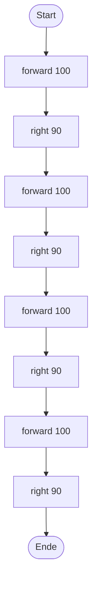
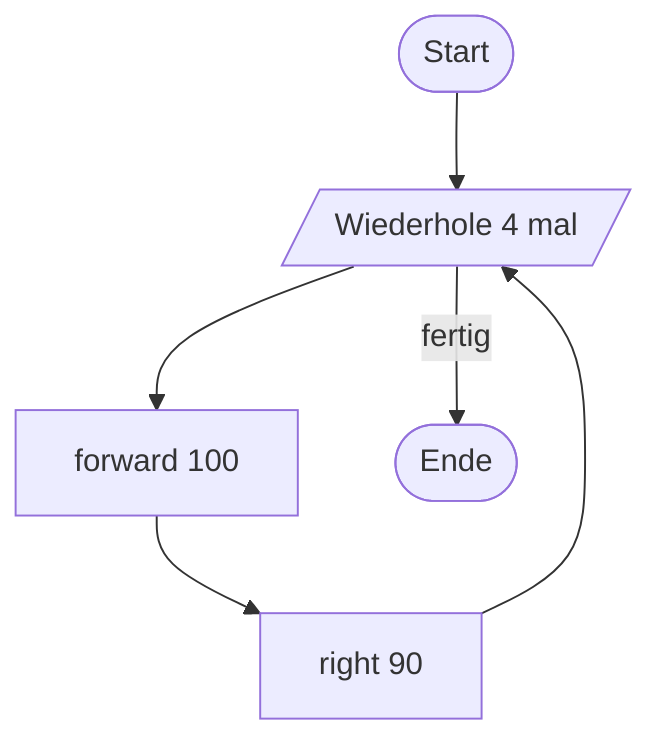
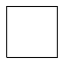
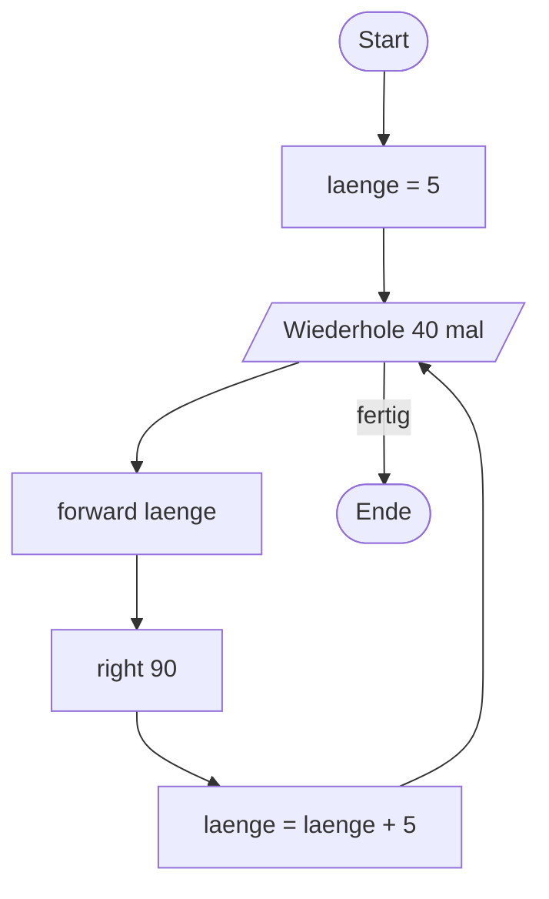
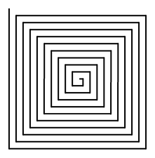
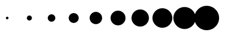
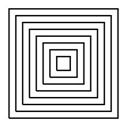

# Schleifen

Beim Säulendiagramm im letzten Kapitel hast du dieselben fünf Zeilen fünfmal abgetippt. Das war mühsam – und je größer das Programm wird, desto unübersichtlicher wird es.

Dafür gibt es **Schleifen**.

## Flussdiagramme

Bevor wir programmieren, planen wir. Ein **Flussdiagramm** (auch: Programmablaufplan) stellt den Ablauf eines Programms grafisch dar.

:::snippet{#aufgabe}
Unten siehst du zwei Flussdiagramme. Sie stellen jeweils den Ablauf eines Turtle-Programms dar.

a) Interpretiere die beiden Diagramme. Gehe darauf ein, welche Bedeutung die verschiedenen Symbole haben.

b) Fasse zusammen, welches Ergebnis die beschriebenen Programme liefern. Sind die Ergebnisse gleich?
:::

**Diagramm A – ohne Schleife**



**Diagramm B – mit Schleife**



:::snippet{#merken}
Die wichtigsten Symbole im Flussdiagramm:

| Symbol | Bedeutung |
| --- | --- |
| Abgerundetes Rechteck | Start oder Ende des Programms |
| Rechteck | eine Anweisung |
| Parallelogramm | Ein- oder Ausgabe, auch der Schleifenkopf |
| Raute | eine Bedingung – der Ablauf verzweigt sich |
| Pfeil | zeigt an, wie es weitergeht |
:::

## Die `for`-Schleife

In Python setzt man eine Wiederholung mit einer `for`-Schleife um:

:::pyide{canvas}

```python
from turtle import *
shape("turtle")
screensize(400, 400)

for i in range(4):
    forward(100)
    right(90)
```

:::

:::snippet{#merken}
- `for i in range(4):` bedeutet: **„Wiederhole den folgenden Block viermal."**
- Der Doppelpunkt `:` am Ende der Zeile ist **Pflicht**.
- Alle Zeilen, die wiederholt werden sollen, müssen **eingerückt** sein – üblicherweise um vier Leerzeichen.
- Die Einrückung entscheidet, was zur Schleife gehört. Was nicht eingerückt ist, läuft erst **nach** der Schleife.
- `i` ist eine Zählvariable. Sie nimmt nacheinander die Werte 0, 1, 2, 3 an. Oft braucht man sie gar nicht.
:::

:::snippet{#aufgabe}
Teste, wie wichtig die Einrückung ist: Rücke im Beispiel oben die Zeile `right(90)` **nicht** ein und führe das Programm aus.

Erkläre, was passiert und warum.
:::

::::collapsible{title="Auflösung: Was passiert da?"}

Ohne Einrückung gehört `right(90)` nicht mehr zur Schleife. Das Programm läuft dann so ab:

1. viermal `forward(100)` – die Turtle läuft eine lange gerade Linie,
2. danach **einmal** `right(90)`.

Statt eines Quadrats entsteht eine 400 Pixel lange Strecke.

::::

## Aufgabe 1: Drei Zeichnungen mit Schleifen

:::snippet{#aufgabe}
Für jede der folgenden drei Zeichnungen gilt:

a) Entwickle zuerst ein **Flussdiagramm** auf Papier.

b) Überführe dein Flussdiagramm anschließend in ein Programm.
:::

### a) Die Punktekette


:::pyide{canvas}

```python
from turtle import *
shape("turtle")
screensize(500, 300)

# Dein Code hier
```

:::

::::collapsible{title="Tipp 1: Was wiederholt sich?"}

Sieh dir die Zeichnung an: Es sind zehn Punkte in gleichem Abstand. Was passiert bei jedem einzelnen Punkt? Genau zwei Dinge.

::::

::::collapsible{title="Tipp 2: Der Schleifenrumpf"}

```python
for i in range(10):
    dot(20)
    forward(25)
```

Damit die Kette mittig steht, setze die Turtle vorher mit `penup()` und `goto(-120, 0)` an den Startpunkt.

::::

:::protect{password="turtle-2-3-1" description="Lösung. Erfrage das Passwort bei deiner Lehrkraft."}

```python
from turtle import *
shape("turtle")
screensize(500, 300)

penup()
goto(-120, 0)

for i in range(10):
    dot(20)
    forward(25)
```

:::

### b) Die Treppe


:::pyide{canvas}

```python
from turtle import *
shape("turtle")
screensize(500, 400)

# Dein Code hier
```

:::

::::collapsible{title="Tipp 1: Was ist eine Stufe?"}

Eine Stufe besteht aus zwei Strecken: einmal nach oben, einmal nach rechts. Dazwischen und danach muss gedreht werden.

::::

::::collapsible{title="Tipp 2: Der Schleifenrumpf"}

```python
for i in range(6):
    left(90)
    forward(40)
    right(90)
    forward(40)
```

::::

:::protect{password="turtle-2-3-2" description="Lösung. Erfrage das Passwort bei deiner Lehrkraft."}

```python
from turtle import *
shape("turtle")
screensize(500, 400)

penup()
goto(-150, -120)
pendown()

for i in range(6):
    left(90)
    forward(40)
    right(90)
    forward(40)
```

:::

### c) Das Quadrat



:::snippet{#aufgabe}
Zeichne ein Quadrat mit der Seitenlänge 100 – diesmal mit einer Schleife statt mit acht einzelnen Befehlen.
:::

:::pyide{canvas}

```python
from turtle import *
shape("turtle")
screensize(400, 400)

# Dein Code hier
```

:::

## Aufgabe 2: Erst zeichnen, dann programmieren

:::snippet{#aufgabe}
Gegeben ist das folgende Flussdiagramm.

a) Zeichne **zunächst ohne Rechner** auf Papier das Bild, das sich ergibt.

b) Implementiere danach das Programm und überprüfe dein Ergebnis.
:::



:::pyide{canvas}

```python
from turtle import *
shape("turtle")
screensize(700, 700)
speed(0)

# Dein Code hier
```

:::

::::collapsible{title="Tipp 1: Was ist hier neu?"}

Neu ist, dass sich die Variable `laenge` **innerhalb** der Schleife verändert. Bei jedem Durchlauf wird die Strecke also 5 Pixel länger als beim vorherigen.

::::

::::collapsible{title="Tipp 2: Wo gehört die Variable hin?"}

Achte genau auf die Einrückung:

- `laenge = 5` steht **vor** der Schleife und wird nur einmal ausgeführt.
- `laenge = laenge + 5` steht **in** der Schleife und wird bei jedem Durchlauf ausgeführt.

::::



:::protect{password="turtle-2-3-3" description="Lösung. Erfrage das Passwort bei deiner Lehrkraft."}

```python
from turtle import *
shape("turtle")
screensize(700, 700)
speed(0)

laenge = 5

for i in range(40):
    forward(laenge)
    right(90)
    laenge = laenge + 5
```

Es entsteht eine **quadratische Spirale**: Weil jede Strecke etwas länger ist als die vorherige, schließt sich das Quadrat nie.

:::

## Aufgabe 3: Das Säulendiagramm – noch einmal

:::snippet{#aufgabe}
Erinnerst du dich an das Säulendiagramm aus dem letzten Kapitel? Dort hast du fünf fast identische Blöcke abgetippt.

Schreibe das Programm mit einer Schleife neu, sodass **fünf gleich hohe** Säulen entstehen.

Überlege danach: Warum lassen sich die **unterschiedlich hohen** Säulen mit den Mitteln dieser Lektion noch nicht elegant zeichnen?
:::

:::pyide{canvas}

```python
from turtle import *
shape("turtle")
screensize(500, 400)

pensize(20)
penup()
goto(-120, -100)
left(90)
pendown()

# Dein Code hier
```

:::

::::collapsible{title="Auflösung zur zweiten Frage"}

Eine Schleife wiederholt immer **genau denselben** Block. Die fünf Höhen 40, 60, 20, 100 und 80 folgen aber keiner Regel – man kann sie nicht ausrechnen.

Dafür braucht man **Listen**. Die lernst du in Kapitel 5 kennen.

::::

## Zusatzaufgaben

:::snippet{#aufgabe}
Entwickle Programme, in denen die Turtle jeweils eine dieser Zeichnungen erstellt.
:::

### a) Wachsende Punkte



:::pyide{canvas}

```python
from turtle import *
shape("turtle")
screensize(600, 300)

# Dein Code hier
```

:::

::::collapsible{title="Tipp"}

Das funktioniert wie bei der Spirale: Führe eine Variable `groesse` ein, verwende sie bei `dot(groesse)` und vergrößere sie am Ende jedes Schleifendurchlaufs.

::::

### b) Quadrate ineinander



:::pyide{canvas}

```python
from turtle import *
shape("turtle")
screensize(500, 500)
speed(0)

# Dein Code hier
```

:::

::::collapsible{title="Tipp 1: Zwei Schleifen"}

Für jedes einzelne Quadrat brauchst du eine Schleife mit vier Durchläufen. Und diese Quadrate wiederum sollen achtmal gezeichnet werden – mit jeweils größerer Seitenlänge.

Eine Schleife **in** einer Schleife nennt man verschachtelte Schleife. Mehr dazu in Lektion 6.

::::

::::collapsible{title="Tipp 2: Der gemeinsame Mittelpunkt"}

Alle Quadrate haben denselben Mittelpunkt. Ein Quadrat mit der Seitenlänge `seite` beginnt also bei `goto(-seite/2, -seite/2)`.

::::

---

## Selbsttest

::::multievent

**1. Wie oft wird der eingerückte Block bei for i in range(7): ausgeführt?**

{z{7}} mal

{h{Die Zahl in den Klammern gibt die Anzahl der Wiederholungen an.}}
{H{Richtig!}}

**2. Welche Zeichen dürfen bei einer for-Schleife nicht fehlen?** (Mehrfachauswahl)

{c1{!Der Doppelpunkt am Ende der for-Zeile}}

{c1{!Die Einrückung der wiederholten Zeilen}}

{c1{Ein Semikolon am Zeilenende}}

{c1{Geschweifte Klammern um den Block}}

{h{Python markiert Blöcke anders als viele andere Programmiersprachen.}}
{H{Richtig! In Python legen Doppelpunkt und Einrückung den Block fest – keine Klammern.}}

**3. Welche Zeichnung entsteht bei diesem Programm? Die Turtle führt for i in range(3): forward(100) und left(120) aus.**

{r1{Ein Quadrat}}

{r1{!Ein gleichseitiges Dreieck}}

{r1{Eine gerade Linie}}

{r1{Ein Sechseck}}

{h{Drei Seiten und ein Drehwinkel von 120 Grad – 3 mal 120 ergibt 360.}}
{H{Richtig! Drei gleich lange Seiten mit 120 Grad Drehung ergeben ein gleichseitiges Dreieck.}}

**4. Welches Symbol stellt im Flussdiagramm eine Anweisung dar?**

{r2{Ein abgerundetes Rechteck}}

{r2{!Ein Rechteck}}

{r2{Eine Raute}}

{r2{Ein Pfeil}}

{h{Das abgerundete Rechteck ist für Start und Ende reserviert.}}
{H{Richtig!}}

**5. Was passiert, wenn in einer Schleife eine Zeile versehentlich nicht eingerückt wird?**

{r3{Python meldet immer einen Fehler}}

{r3{!Die Zeile wird nur einmal nach der Schleife ausgeführt}}

{r3{Die Zeile wird gar nicht ausgeführt}}

{h{Denke an das Experiment mit dem Quadrat weiter oben.}}
{H{Richtig! Nicht eingerückte Zeilen gehören nicht mehr zur Schleife.}}

::::
