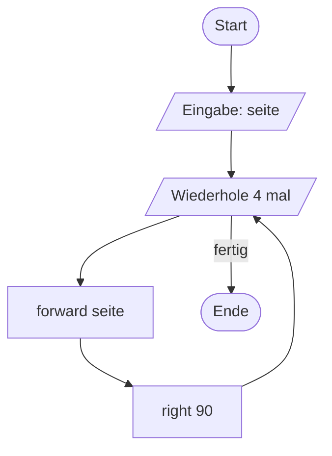
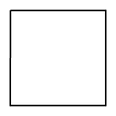
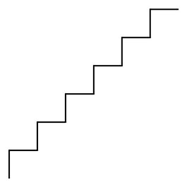

# Eingaben mit `input`

Bisher liefen deine Programme immer gleich ab. Interessant wird es, wenn die **Benutzerin oder der Benutzer** mitbestimmen kann.

Im Flussdiagramm wird eine Eingabe als **Parallelogramm** dargestellt:



:::snippet{#aufgabe}
Formuliere Vermutungen, wie das folgende Programm abläuft. Führe es danach aus und gib verschiedene Werte ein.
:::

:::pyide{canvas}

```python
from turtle import *
shape("turtle")
screensize(400, 400)

seite = int(input("Bitte Seitenlänge eingeben: "))

for i in range(4):
    forward(seite)
    right(90)
```

:::



## Warum `int(...)`?

:::snippet{#merken}
`input()` liefert **immer einen Text**, auch wenn du eine Zahl eingibst. Mit Texten kann die Turtle aber nicht rechnen.

Deshalb musst du umwandeln:

| Schreibweise | Ergebnis |
| --- | --- |
| `input("Frage: ")` | Text, z. B. `"100"` |
| `int(input("Frage: "))` | ganze Zahl, z. B. `100` |
| `float(input("Frage: "))` | Kommazahl, z. B. `100.5` |

`int` steht für *integer* (ganze Zahl), `float` für Kommazahl.
:::

:::snippet{#aufgabe}
Entferne im Programm oben das `int(` und das zugehörige `)`, sodass nur noch `seite = input("Bitte Seitenlänge eingeben: ")` dasteht.

Führe es aus, gib `100` ein und lies die Fehlermeldung. Erkläre, was Python hier bemängelt.
:::

::::collapsible{title="Auflösung: Die Fehlermeldung verstehen"}

Python meldet etwas wie:

```
TypeError: can't multiply sequence by non-int of type 'float'
```

Sinngemäß: *„Ich kann mit einem Text nicht rechnen."*

Für Python ist `"100"` nicht die Zahl Hundert, sondern die Zeichenfolge aus einer Eins und zwei Nullen. Erst `int("100")` macht daraus die Zahl 100.

::::

## Aufgabe 1: Die Punktekette wird einstellbar

Die Punktekette aus der letzten Lektion kennst du bereits.


:::snippet{#aufgabe}
Modifiziere deine Lösung schrittweise:

a) Nach dem Start kann man eingeben, **wie groß** die Punkte sein sollen.

b) Danach kann man eingeben, **wie weit** die Punkte voneinander entfernt sein sollen.

c) Schließlich kann man auch eingeben, **wie viele** Punkte gezeichnet werden sollen.
:::

:::pyide{canvas}

```python
from turtle import *
shape("turtle")
screensize(600, 300)

# Dein Code hier
```

:::

::::collapsible{title="Tipp 1: Eine Eingabe nach der anderen"}

Baue die Aufgabe wirklich in drei Schritten. Nach jedem Schritt sollte das Programm laufen, bevor du den nächsten angehst.

Beginne mit:

```python
groesse = int(input("Wie groß sollen die Punkte sein? "))
```

und verwende `groesse` dann bei `dot(...)`.

::::

::::collapsible{title="Tipp 2: Die Anzahl in der Schleife"}

Eine eingelesene Zahl darf auch in `range` stehen:

```python
anzahl = int(input("Wie viele Punkte? "))

for i in range(anzahl):
    ...
```

::::

:::protect{password="turtle-2-4-1" description="Lösung. Erfrage das Passwort bei deiner Lehrkraft."}

```python
from turtle import *
shape("turtle")
screensize(600, 300)

groesse = int(input("Wie groß sollen die Punkte sein? "))
abstand = int(input("Wie weit sollen die Punkte auseinander sein? "))
anzahl = int(input("Wie viele Punkte sollen es sein? "))

penup()
goto(-250, 0)

for i in range(anzahl):
    dot(groesse)
    forward(abstand)
```

:::

## Aufgabe 2: Die Treppe wird einstellbar



:::snippet{#aufgabe}
Modifiziere auch dein Treppen-Programm mit geeigneten Eingabeaufforderungen.

Überlege dabei selbst: **Welche Werte sind hier sinnvoll einstellbar?**
:::

:::pyide{canvas}

```python
from turtle import *
shape("turtle")
screensize(500, 400)

# Dein Code hier
```

:::

::::collapsible{title="Tipp: Was kommt infrage?"}

Bei der Treppe bieten sich drei Größen an: die **Anzahl der Stufen**, die **Stufenhöhe** und die **Stufenbreite**.

Wenn Höhe und Breite gleich sein sollen, reicht eine einzige Eingabe für beides.

::::

## Aufgabe 3: Ein Beispiel ohne Turtle

:::snippet{#aufgabe}
Entwickle ein Programm, das Folgendes leistet:

Nach dem Start wird man aufgefordert, eine Zahl einzugeben. Nach der Eingabe wird das **Quadrat** der Zahl angezeigt.

Gibt man also zum Beispiel 5 ein, erhält man als Ausgabe 25.
:::

:::pyide

```python
# Dein Code hier
```

:::

:::protect{password="turtle-2-4-2" description="Lösung. Erfrage das Passwort bei deiner Lehrkraft."}

```python
zahl = int(input("Bitte eine Zahl eingeben: "))
print(zahl * zahl)
```

Alternativ mit dem Potenzoperator:

```python
zahl = int(input("Bitte eine Zahl eingeben: "))
print(zahl ** 2)
```

:::

## Aufgabe 4: Vieleck nach Wunsch

:::snippet{#aufgabe}
In der letzten Lektion hast du regelmäßige Vielecke gezeichnet.

Entwickle ein Programm, das Folgendes leistet: Nach dem Start gibt man ein, **was für ein Vieleck** man haben möchte. Gibt man zum Beispiel eine 5 ein, wird ein regelmäßiges Fünfeck gezeichnet.
:::

:::pyide{canvas}

```python
from turtle import *
shape("turtle")
screensize(400, 400)

# Dein Code hier
```

:::

::::collapsible{title="Tipp: Den Winkel berechnen lassen"}

Du kennst die Formel bereits:

$$\text{Drehwinkel} = \frac{360°}{\text{Anzahl der Ecken}}$$

Diese Rechnung darf Python für dich erledigen – schreibe sie einfach hin:

```python
winkel = 360 / ecken
```

::::

:::protect{password="turtle-2-4-3" description="Lösung. Erfrage das Passwort bei deiner Lehrkraft."}

```python
from turtle import *
shape("turtle")
screensize(400, 400)

ecken = int(input("Wie viele Ecken soll das Vieleck haben? "))
winkel = 360 / ecken

for i in range(ecken):
    forward(70)
    left(winkel)
```

:::

## Zusatzaufgabe: Auch Farben einlesen

Mit `input` kann man nicht nur Zahlen einlesen:

:::pyide{canvas}

```python
from turtle import *
shape("turtle")
screensize(400, 400)

farbe = input("Bitte Farbe eingeben: ")

pencolor(farbe)

for i in range(4):
    forward(100)
    right(90)
```

:::

:::snippet{#brain}
Fällt dir auf, dass hier **kein** `int(...)` steht?

Eine Farbe ist ein Text – und `input` liefert ohnehin einen Text. Es gibt also nichts umzuwandeln.

Probiere Farben wie `red`, `blue`, `orange` oder `magenta` aus.
:::

:::snippet{#aufgabe}
Erweitere deine Lösungen zur Punktekette und zur Treppe so, dass man auch die **Farbe** wählen kann. Wie genau du das gestaltest, ist dir überlassen.
:::

---

## Selbsttest

::::multievent

**1. Was liefert input() zurück?**

{r1{Immer eine ganze Zahl}}

{r1{!Immer einen Text}}

{r1{Eine Zahl, wenn man eine Zahl eingibt}}

{h{Auch wenn du 100 eintippst, macht Python daraus zunächst nichts anderes als Zeichen.}}
{H{Richtig! input liefert immer einen Text – deshalb ist die Umwandlung nötig.}}

**2. Welche Zeile liest eine ganze Zahl korrekt ein?**

{r2{seite = input("Länge: ")}}

{r2{!seite = int(input("Länge: "))}}

{r2{seite = int("Länge: ")}}

{r2{int(seite) = input("Länge: ")}}

{h{Erst wird eingelesen, dann wird umgewandelt – die Umwandlung liegt also außen.}}
{H{Richtig!}}

**3. Wofür brauchst du float statt int?**

{r3{Für Texte}}

{r3{!Für Zahlen mit Nachkommastellen}}

{r3{Für sehr große Zahlen}}

{h{Denke an 734.5 aus der Lektion über die Grundrechenarten.}}
{H{Richtig! float wandelt in eine Kommazahl um.}}

**4. Welche Eingaben müssen NICHT umgewandelt werden?** (Mehrfachauswahl)

{c1{!Ein Farbname wie red}}

{c1{!Der Name einer Person}}

{c1{Eine Seitenlänge, mit der gerechnet wird}}

{c1{Eine Anzahl für range}}

{h{Umgewandelt werden muss immer dann, wenn mit dem Wert gerechnet wird.}}
{H{Richtig! Texte bleiben Texte, nur Zahlen müssen umgewandelt werden.}}

**5. Wie wird eine Eingabe im Flussdiagramm dargestellt?**

{r4{Als Rechteck}}

{r4{Als Raute}}

{r4{!Als Parallelogramm}}

{r4{Als abgerundetes Rechteck}}

{h{Das Symbol ist ein schräg gestelltes Viereck.}}
{H{Richtig! Ein- und Ausgaben zeichnet man als Parallelogramm.}}

::::
