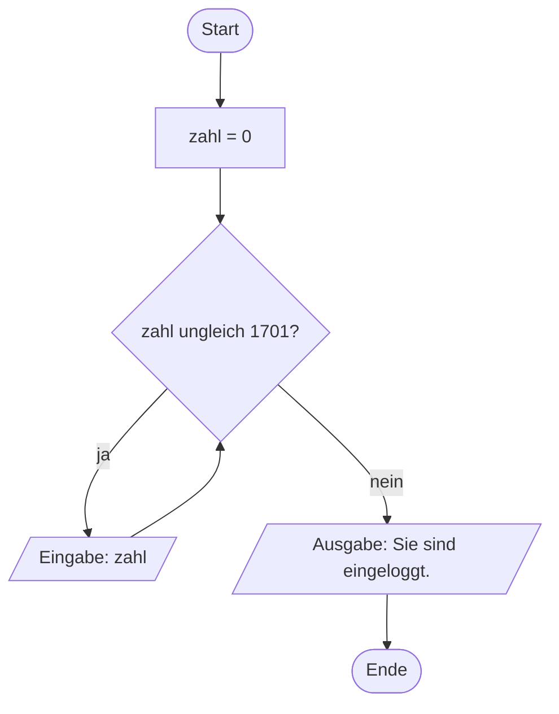
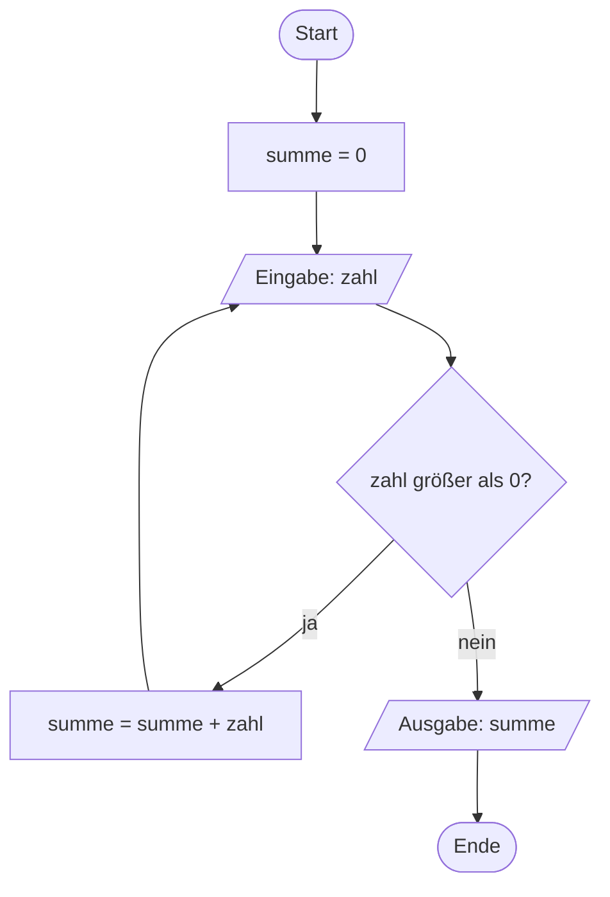

# Schleifen mit `while`

Bei der `for`-Schleife steht **vorher fest**, wie oft wiederholt wird. Oft weiß man das aber nicht.

Stell dir eine Anmeldung mit Geheimzahl vor: Wie oft muss man nachfragen? Einmal? Fünfmal? Das hängt davon ab, wann die richtige Zahl eingegeben wird.

## Ein neues Element im Flussdiagramm



Neu ist die **Raute**: Sie stellt eine Bedingung dar. Je nachdem, ob sie erfüllt ist, geht es unterschiedlich weiter.

:::snippet{#aufgabe}
a) Analysiere das Flussdiagramm und die zugehörige Implementierung. Führe das Programm aus und probiere verschiedene Eingaben.

b) Erkläre, warum sich ein solcher Ablauf mit einer `for`-Schleife **nicht** umsetzen ließe.
:::

:::pyide

```python
zahl = 0

while zahl != 1701:
    zahl = int(input("Bitte Geheimzahl eingeben: "))

print("Sie sind eingeloggt.")
```

:::

:::snippet{#merken}
- `while bedingung:` bedeutet: **„Wiederhole, solange die Bedingung wahr ist."**
- Vor **jedem** Durchlauf wird die Bedingung geprüft. Ist sie von Anfang an falsch, läuft die Schleife kein einziges Mal.
- Wie bei `for` gilt: Doppelpunkt am Ende, eingerückter Block darunter.
- Damit die Schleife irgendwann endet, muss sich im Rumpf etwas ändern, das die Bedingung beeinflusst.
:::

:::snippet{#brain}
**Achtung, Endlosschleife!**

Wenn sich die Bedingung nie ändert, läuft die Schleife ewig weiter. Zum Beispiel hier:

```python
zahl = 0
while zahl != 1701:
    print("Bitte Geheimzahl eingeben!")
```

Hier wird `zahl` nie verändert – das Programm hört nie auf.

Falls dir das passiert: Du kannst ein laufendes Programm im Programmierbereich jederzeit **stoppen**.
:::

## Aufgabe 1: Ein Flussdiagramm umsetzen

:::snippet{#aufgabe}
a) Analysiere das folgende Flussdiagramm und beschreibe den Programmablauf in eigenen Worten.

b) Entwickle eine dazu passende Implementierung.
:::



:::pyide

```python
# Dein Code hier
```

:::

::::collapsible{title="Tipp 1: Was macht das Programm?"}

Es addiert so lange eingegebene Zahlen auf, bis jemand eine Zahl eingibt, die nicht größer als 0 ist. Dann wird die Summe ausgegeben.

::::

::::collapsible{title="Tipp 2: Die erste Eingabe"}

Achte auf die Reihenfolge im Diagramm: Die erste Eingabe passiert **vor** der Prüfung. Deshalb steht auch im Programm eine Eingabe vor der Schleife – und eine weitere am Ende des Schleifenrumpfs.

::::

:::protect{password="turtle-2-5-1" description="Lösung. Erfrage das Passwort bei deiner Lehrkraft."}

```python
summe = 0
zahl = int(input("Bitte eine Zahl eingeben (0 oder kleiner beendet): "))

while zahl > 0:
    summe = summe + zahl
    zahl = int(input("Bitte eine Zahl eingeben (0 oder kleiner beendet): "))

print(summe)
```

:::

## Aufgabe 2: Punkte nach Wunsch

:::snippet{#aufgabe}
Es soll ein Programm geplant und umgesetzt werden, das Folgendes leistet:

Die Benutzerin oder der Benutzer wird nach einer **Wunschfarbe** gefragt. Wird eine Farbe eingegeben, zeichnet die Turtle einen Punkt mit dem Durchmesser 20 in dieser Farbe und geht 20 Pixel vor. Dieser Vorgang wiederholt sich, **solange nicht das Wort `stopp` eingegeben wird**.

a) Entwickle zunächst einen geeigneten Ansatz mithilfe eines Flussdiagramms auf Papier.

b) Implementiere dann deinen Ansatz.
:::


:::pyide{canvas}

```python
from turtle import *
shape("turtle")
screensize(600, 300)

penup()
goto(-250, 0)

# Dein Code hier
```

:::

::::collapsible{title="Tipp 1: Womit vergleiche ich?"}

Hier wird kein Zahlenwert verglichen, sondern ein Text. Das geht genauso:

```python
while farbe != "stopp":
    ...
```

::::

::::collapsible{title="Tipp 2: Wann wird eingelesen?"}

Wie in Aufgabe 1 brauchst du **zwei** Eingaben: eine vor der Schleife (damit die Bedingung überhaupt geprüft werden kann) und eine am Ende des Schleifenrumpfs.

::::

:::protect{password="turtle-2-5-2" description="Lösung. Erfrage das Passwort bei deiner Lehrkraft."}

```python
from turtle import *
shape("turtle")
screensize(600, 300)

penup()
goto(-250, 0)

farbe = input("Welche Farbe? (stopp zum Beenden) ")

while farbe != "stopp":
    pencolor(farbe)
    dot(20)
    forward(20)
    farbe = input("Welche Farbe? (stopp zum Beenden) ")
```

:::

## Aufgabe 3: `while` oder `for`?

:::snippet{#aufgabe}
Stell dir vor, zwei verschiedene Programme sollen entwickelt werden:

**Variante I:** Man wird nach einer Wunschfarbe gefragt. Bei jeder Eingabe zeichnet die Turtle einen Punkt mit Durchmesser 20 in dieser Farbe und geht 20 Pixel vor. Der Vorgang wiederholt sich, **solange die Turtle noch im Fenster zu sehen ist**.

**Variante II:** Man wird nach einer Größe gefragt. Die Turtle zeichnet einen Punkt mit diesem Durchmesser und geht ebenso viele Pixel vor. Der Vorgang wiederholt sich **genau zehnmal**.

Entscheide für jede Variante, ob man sie mit einer `while`- oder mit einer `for`-Schleife umsetzen sollte. Begründe deine Entscheidung.
:::

::textinput{placeholder="Variante I eignet sich für ..., weil ..."}

::::collapsible{title="Auflösung"}

**Variante I** braucht eine `while`-Schleife. Wie viele Punkte in das Fenster passen, hängt davon ab, wie oft gezeichnet wird – das steht vorher nicht fest.

**Variante II** braucht eine `for`-Schleife. Die Anzahl der Durchläufe ist mit „genau zehnmal" von vornherein bekannt.

**Faustregel:**

- Anzahl steht vorher fest → `for`
- Anzahl hängt von einer Bedingung ab → `while`

::::

## Zusatzaufgabe

:::snippet{#aufgabe}
Implementiere beide Programme aus Aufgabe 3.

Für Variante I brauchst du eine Möglichkeit, die aktuelle Position der Turtle abzufragen. Dafür gibt es `xcor()`, das die x-Koordinate zurückgibt:

```python
while xcor() < 280:
    ...
```
:::

:::pyide{canvas}

```python
from turtle import *
shape("turtle")
screensize(600, 300)

penup()
goto(-280, 0)

# Dein Code hier
```

:::

---

## Selbsttest

::::multievent

**1. Wann verwendet man eine while-Schleife statt einer for-Schleife?**

{r1{Wenn man zeichnen möchte}}

{r1{!Wenn vorher nicht feststeht, wie oft wiederholt wird}}

{r1{Wenn man mehr als zehn Durchläufe braucht}}

{h{Denke an die Faustregel aus Aufgabe 3.}}
{H{Richtig! Steht die Anzahl vorher fest, nimmt man for – sonst while.}}

**2. Wie oft läuft dieser Schleifenrumpf? Vorher gilt x = 10, die Bedingung lautet: solange x kleiner als 5 ist.**

{z{0}} mal

{h{Die Bedingung wird schon vor dem ersten Durchlauf geprüft.}}
{H{Richtig! Ist die Bedingung von Anfang an falsch, läuft die Schleife kein einziges Mal.}}

**3. Was ist eine Endlosschleife?**

{r2{Eine Schleife mit sehr vielen Durchläufen}}

{r2{!Eine Schleife, deren Bedingung nie falsch wird}}

{r2{Eine Schleife ohne Doppelpunkt}}

{h{Was muss passieren, damit eine while-Schleife endet?}}
{H{Richtig! Wenn sich im Rumpf nichts ändert, was die Bedingung beeinflusst, hört die Schleife nie auf.}}

**4. Welches Symbol steht im Flussdiagramm für eine Bedingung?**

{r3{Ein Rechteck}}

{r3{!Eine Raute}}

{r3{Ein Parallelogramm}}

{h{Von diesem Symbol gehen zwei Pfeile ab – einer für ja, einer für nein.}}
{H{Richtig!}}

**5. Bei einer Eingabeschleife braucht man die Eingabe an zwei Stellen. Welche sind das?** (Mehrfachauswahl)

{c1{!Einmal vor der Schleife}}

{c1{!Einmal am Ende des Schleifenrumpfs}}

{c1{Einmal nach der Schleife}}

{c1{Einmal in der Bedingung selbst}}

{h{Vor dem ersten Prüfen der Bedingung muss die Variable schon einen Wert haben.}}
{H{Richtig! Sonst könnte die Bedingung beim ersten Mal gar nicht geprüft werden.}}

::::
