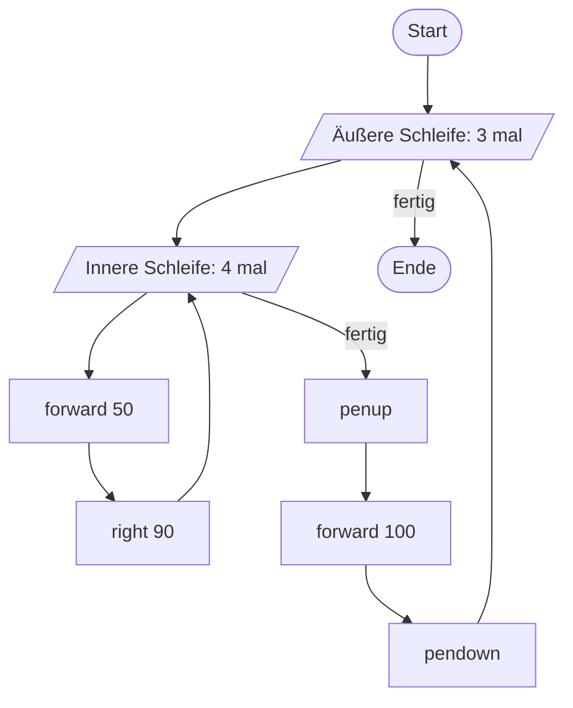
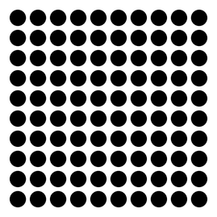
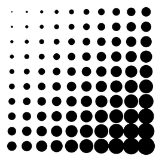
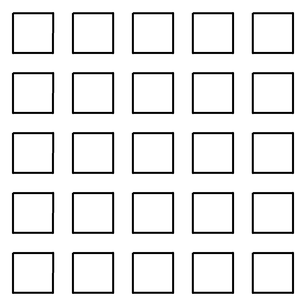

# Verschachtelte Schleifen

Eine Schleife darf im Rumpf einer anderen Schleife stehen. Man sagt dann, die Schleifen sind **verschachtelt**.

## Aufgabe 1: Ein Flussdiagramm analysieren

:::snippet{#aufgabe}
Gegeben ist das folgende Flussdiagramm.

a) Analysiere das Diagramm und beschreibe, welche Zeichnung entsteht.

b) Implementiere ein entsprechendes Programm.
:::



:::pyide{canvas}

```python
from turtle import *
shape("turtle")
screensize(500, 300)

# Dein Code hier
```

:::

::::collapsible{title="Tipp 1: Was macht die innere Schleife?"}

Viermal `forward(50)` und `right(90)` – das kennst du schon. Es entsteht ein **Quadrat** mit der Seitenlänge 50.

::::

::::collapsible{title="Tipp 2: Und die äußere?"}

Die äußere Schleife führt dreimal aus: „Zeichne ein Quadrat, dann gehe mit angehobenem Stift 100 Pixel weiter."

Es entstehen also **drei Quadrate nebeneinander**.

::::

::::collapsible{title="Tipp 3: Die Einrückung"}

Bei verschachtelten Schleifen wird zweimal eingerückt:

```python
for i in range(3):
    for j in range(4):
        forward(50)
        right(90)
    penup()
    forward(100)
    pendown()
```

Beachte: `penup()` ist nur **einfach** eingerückt. Es gehört zur äußeren, nicht zur inneren Schleife.

::::

:::snippet{#merken}
- Bei verschachtelten Schleifen brauchen innere und äußere Schleife **verschiedene Zählvariablen** (z. B. `i` und `j`).
- Die **innere** Schleife läuft bei jedem Durchlauf der äußeren komplett durch.
- Bei 3 äußeren und 4 inneren Durchläufen wird der innerste Block $3 \cdot 4 = 12$ mal ausgeführt.
- Die **Einrückungstiefe** entscheidet, was zu welcher Schleife gehört. Zähle im Zweifel die Leerzeichen.
:::

## Aufgabe 2: Das Punktefeld

:::snippet{#aufgabe}
Entwickle ein Programm, das eine Zeichnung wie unten abgebildet erzeugt: **10 mal 10 Punkte**.
:::



:::pyide{canvas}

```python
from turtle import *
shape("turtle")
screensize(400, 400)
speed(0)

penup()
goto(-125, 125)

# Dein Code hier
```

:::

::::collapsible{title="Tipp 1: Erst eine Zeile"}

Fang klein an: Schreibe zuerst nur eine Schleife, die **eine** Reihe aus zehn Punkten zeichnet. Das kennst du schon aus Lektion 3.

::::

::::collapsible{title="Tipp 2: Von Zeile zu Zeile"}

Nach einer Reihe muss die Turtle zurück an den linken Rand und eine Zeile nach unten. Das ist am einfachsten mit Koordinaten:

```python
x = xcor()          # merken, wo die Zeile begann
# ... Reihe zeichnen ...
goto(x, ycor() - 25)  # zurück nach links, 25 Pixel tiefer
```

::::

:::protect{password="turtle-2-6-1" description="Lösung. Erfrage das Passwort bei deiner Lehrkraft."}

```python
from turtle import *
shape("turtle")
screensize(400, 400)
speed(0)

penup()
goto(-125, 125)

for zeile in range(10):
    x = xcor()
    for punkt in range(10):
        dot(20)
        forward(25)
    goto(x, ycor() - 25)
```

:::

## Zusatzaufgabe 1: Punkte in verschiedenen Größen

:::snippet{#aufgabe}
Modifiziere dein Programm so, dass eine Zeichnung wie unten entsteht: Die Punkte werden nach rechts und nach unten hin größer.
:::



:::pyide{canvas}

```python
from turtle import *
shape("turtle")
screensize(400, 400)
speed(0)

penup()
goto(-125, 125)

# Dein Code hier
```

:::

::::collapsible{title="Tipp: Die Zählvariablen nutzen"}

Bisher hast du `zeile` und `punkt` nur als Zähler verwendet. Jetzt kannst du **mit ihnen rechnen**: Beide werden von links oben nach rechts unten größer.

Probiere etwas wie:

```python
dot(2 + (zeile + punkt) * 1.5)
```

::::

## Zusatzaufgabe 2: Ein Feld aus Quadraten

:::snippet{#aufgabe}
Entwickle ein Programm, in dem eine Zeichnung wie unten erstellt wird.
:::



:::pyide{canvas}

```python
from turtle import *
shape("turtle")
screensize(450, 450)
speed(0)

# Dein Code hier
```

:::

::::collapsible{title="Tipp: Drei Schleifen?"}

Ja – hier brauchst du tatsächlich drei ineinander verschachtelte Schleifen:

1. äußere Schleife: über die Zeilen,
2. mittlere Schleife: über die Spalten,
3. innere Schleife: die vier Seiten eines Quadrats.

Am einfachsten wird es, wenn du jedes Quadrat mit `goto` an seine Position setzt, statt die Turtle laufen zu lassen.

::::

:::protect{password="turtle-2-6-2" description="Lösung. Erfrage das Passwort bei deiner Lehrkraft."}

```python
from turtle import *
shape("turtle")
screensize(450, 450)
speed(0)

for zeile in range(5):
    for spalte in range(5):
        penup()
        goto(-150 + spalte * 60, 120 - zeile * 60)
        setheading(0)
        pendown()
        for seite in range(4):
            forward(40)
            right(90)
```

:::

---

## Selbsttest

::::multievent

**1. Wie oft wird der innerste Block ausgeführt? Die äußere Schleife läuft 5 mal, die innere 6 mal.**

{z{30}} mal

{h{Die innere Schleife läuft bei jedem Durchlauf der äußeren komplett durch.}}
{H{Richtig! 5 mal 6 ergibt 30 Durchläufe.}}

**2. Warum sollten innere und äußere Schleife verschiedene Zählvariablen verwenden?**

{r1{Python erlaubt gleiche Namen nicht}}

{r1{!Weil die innere Schleife sonst den Zähler der äußeren überschreibt}}

{r1{Aus reiner Gewohnheit}}

{h{Was passiert mit dem äußeren Zähler, wenn die innere Schleife ihn ständig neu setzt?}}
{H{Richtig! Der Zähler der äußeren Schleife käme durcheinander.}}

**3. Was entscheidet, ob eine Zeile zur inneren oder zur äußeren Schleife gehört?**

{r2{Die Reihenfolge im Programm}}

{r2{!Die Einrückungstiefe}}

{r2{Der Name der Zählvariablen}}

{h{In Python macht genau dieses eine Merkmal die Blockstruktur aus.}}
{H{Richtig! Je tiefer eingerückt, desto weiter innen liegt die Zeile.}}

**4. Beim Punktefeld: Wozu dient die Zeile x = xcor()?**

{r3{Sie zeichnet einen Punkt}}

{r3{!Sie merkt sich, wo die Zeile begonnen hat}}

{r3{Sie setzt die Turtle an den Rand}}

{h{Nach einer Reihe muss die Turtle wieder ganz nach links zurück – aber wohin genau?}}
{H{Richtig! Ohne diesen gemerkten Wert wüsste die Turtle nicht, wo die nächste Zeile beginnt.}}

**5. Welche Aussagen über verschachtelte Schleifen stimmen?** (Mehrfachauswahl)

{c1{!Eine Schleife darf im Rumpf einer anderen stehen}}

{c1{!Man kann auch mehr als zwei Schleifen verschachteln}}

{c1{Es dürfen nur for-Schleifen verschachtelt werden}}

{c1{Verschachtelte Schleifen brauchen immer gleich viele Durchläufe}}

{h{Erinnere dich an das Quadratfeld – dort waren es drei Schleifen.}}
{H{Richtig!}}

::::
