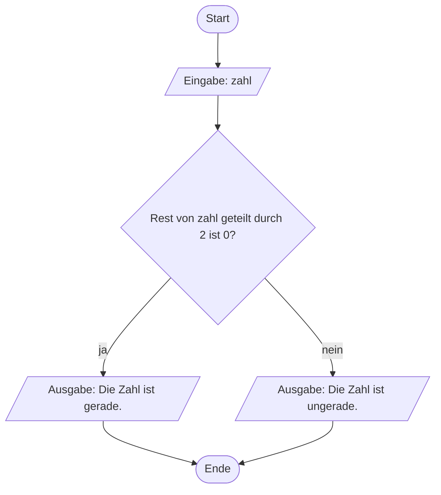
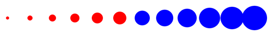
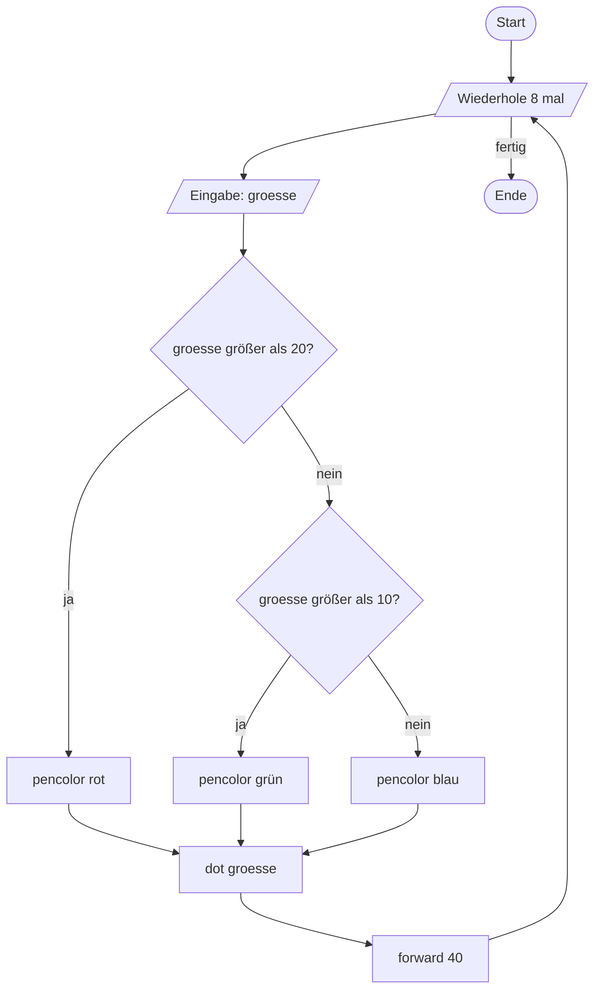

# Verzweigungen

Bei der `while`-Schleife hast du die **Raute** im Flussdiagramm kennengelernt. Jetzt nutzen wir sie, um ein Programm je nach Situation **unterschiedlich** reagieren zu lassen.

## Aufgabe 1: Ein Problem erkennen

:::snippet{#aufgabe}
Gegeben ist die folgende Zeichnung. Mithilfe einer Schleife soll ein solches Bild gezeichnet werden.

Entwickle mithilfe eines Flussdiagramms ein mögliches Vorgehen.

Erläutere anschließend, ob gewisse Elemente deines Flussdiagramms mit den bisher bekannten Python-Befehlen **noch nicht** umsetzbar sind.
:::


::textinput{placeholder="In meinem Flussdiagramm brauche ich ..."}

::::collapsible{title="Auflösung"}

Man braucht eine Entscheidung: *„Ist dieser Punkt ein gerader oder ein ungerader?"* Je nachdem wird die Farbe rot oder blau gesetzt.

Im Flussdiagramm ist das eine **Raute mit zwei abgehenden Pfeilen**, die sich danach wieder vereinigen. Genau dafür fehlt uns bisher der Python-Befehl.

::::

## Die `if`-Abfrage

:::snippet{#aufgabe}
Analysiere das Verhalten des folgenden Programms durch **systematisches Testen**: Gib nacheinander 4, 7, 0 und 13 ein.

Beschreibe aufgrund deiner Beobachtungen die Funktionsweise einer `if`-Abfrage.
:::

:::pyide

```python
zahl = int(input("Bitte eine Zahl eingeben: "))

if zahl % 2 == 0:
    print("Die Zahl ist gerade.")
else:
    print("Die Zahl ist ungerade.")
```

:::



:::snippet{#merken}
- `if bedingung:` führt den eingerückten Block **nur dann** aus, wenn die Bedingung wahr ist.
- `else:` gehört zur passenden `if`-Abfrage und wird ausgeführt, wenn die Bedingung **falsch** ist.
- Ein `else` ist optional. Ohne `else` passiert bei falscher Bedingung einfach nichts.
- Wie bei Schleifen gilt: Doppelpunkt am Ende, eingerückter Block darunter.

**Vorsicht bei der häufigsten Fehlerquelle:**

```python
if zahl = 5:      # FALSCH - das ist eine Zuweisung
if zahl == 5:     # RICHTIG - das ist ein Vergleich
```
:::

## Aufgabe 2: Die Punkte einfärben

:::snippet{#aufgabe}
a) Entwickle mithilfe einer `if`-Abfrage ein Programm, das die Zeichnung aus Aufgabe 1 liefert.

b) Erläutere, ob sich dein Programm von deinem Entwurf aus Aufgabe 1 unterscheidet.
:::


:::pyide{canvas}

```python
from turtle import *
shape("turtle")
screensize(600, 300)

penup()
goto(-120, 0)

# Dein Code hier
```

:::

::::collapsible{title="Tipp 1: Woran erkenne ich gerade Punkte?"}

Die Zählvariable deiner Schleife nimmt nacheinander die Werte 0, 1, 2, 3, … an. Bei geraden Werten ist der Rest der Division durch 2 gleich 0.

::::

::::collapsible{title="Tipp 2: Wo gehört die Abfrage hin?"}

Die Entscheidung fällt bei **jedem** Punkt neu. Die `if`-Abfrage steht also **innerhalb** der Schleife, direkt vor dem `dot`.

::::

:::protect{password="turtle-2-7-1" description="Lösung. Erfrage das Passwort bei deiner Lehrkraft."}

```python
from turtle import *
shape("turtle")
screensize(600, 300)

penup()
goto(-120, 0)

for i in range(10):
    if i % 2 == 0:
        pencolor("red")
    else:
        pencolor("blue")
    dot(20)
    forward(25)
```

:::

## Aufgabe 3: Das Konto

:::snippet{#aufgabe}
Das folgende kleine Programm soll erweitert werden:

Ist **genug Geld** auf dem Konto vorhanden, wird der gewünschte Betrag vom Guthaben abgezogen und der neue Kontostand angezeigt. Andernfalls wird angezeigt, dass nicht genug Geld vorhanden ist.

Implementiere ein geeignetes Programm.
:::

:::pyide

```python
konto = 0

einzahlung = int(input("Welchen Betrag zahlst du ein? "))

konto = konto + einzahlung

auszahlung = int(input("Welchen Betrag hebst du ab? "))

# Dein Code hier
```

:::

::::collapsible{title="Tipp: Wie lautet die Bedingung?"}

Genug Geld ist vorhanden, wenn der Kontostand **mindestens so groß** ist wie der gewünschte Betrag.

::::

:::protect{password="turtle-2-7-2" description="Lösung. Erfrage das Passwort bei deiner Lehrkraft."}

```python
konto = 0

einzahlung = int(input("Welchen Betrag zahlst du ein? "))

konto = konto + einzahlung

auszahlung = int(input("Welchen Betrag hebst du ab? "))

if konto >= auszahlung:
    konto = konto - auszahlung
    print("Neuer Kontostand:")
    print(konto)
else:
    print("Nicht genug Geld auf dem Konto!")
```

:::

## Aufgabe 4: Wachsende Punkte in zwei Farben

:::snippet{#aufgabe}
Mithilfe einer Schleife und einer Verzweigung kann man ein Bild wie unten erstellen: Die Punkte werden nach rechts größer, die erste Hälfte ist rot, die zweite blau.

Entwickle ein geeignetes Programm. Stelle deine Lösung zusätzlich als Flussdiagramm dar.
:::



:::pyide{canvas}

```python
from turtle import *
shape("turtle")
screensize(700, 300)
speed(0)

penup()
goto(-260, 0)

# Dein Code hier
```

:::

::::collapsible{title="Tipp 1: Zwei Dinge gleichzeitig"}

In dieser Aufgabe passieren zwei Dinge parallel:

1. Die Größe wächst bei jedem Durchlauf – wie bei der Spirale in Lektion 3.
2. Die Farbe hängt davon ab, in welcher Hälfte man ist – dafür ist die `if`-Abfrage da.

::::

::::collapsible{title="Tipp 2: Die Größe berechnen"}

Statt eine eigene Variable hochzuzählen, kannst du die Größe direkt aus der Zählvariablen berechnen:

```python
dot(6 + i * 4)
```

::::

:::protect{password="turtle-2-7-3" description="Lösung. Erfrage das Passwort bei deiner Lehrkraft."}

```python
from turtle import *
shape("turtle")
screensize(700, 300)
speed(0)

penup()
goto(-260, 0)

for i in range(12):
    if i < 6:
        pencolor("red")
    else:
        pencolor("blue")
    dot(6 + i * 4)
    forward(45)
```

:::

## Verschachtelte Verzweigungen

Genau wie Schleifen darf man auch Verzweigungen ineinander schachteln.

:::snippet{#aufgabe}
Das folgende Flussdiagramm stellt den Ablauf eines kurzen Turtle-Programms dar.

a) Analysiere zunächst das Diagramm. Erkläre genau, wie das beschriebene Programm abläuft.

b) Implementiere anschließend ein entsprechendes Programm.
:::



:::pyide{canvas}

```python
from turtle import *
shape("turtle")
screensize(600, 300)

penup()
goto(-250, 0)

# Dein Code hier
```

:::

::::collapsible{title="Tipp 1: Die zweite Raute"}

Die zweite Raute wird nur erreicht, wenn die erste mit „nein" beantwortet wurde. In Python steht sie deshalb **im `else`-Zweig** der ersten Abfrage.

::::

::::collapsible{title="Tipp 2: Es geht auch kürzer"}

Für „sonst, falls …" gibt es ein eigenes Schlüsselwort: `elif`.

```python
if groesse > 20:
    pencolor("red")
elif groesse > 10:
    pencolor("green")
else:
    pencolor("blue")
```

Das ist gleichbedeutend mit einer im `else` verschachtelten `if`-Abfrage, aber deutlich übersichtlicher.

::::

:::protect{password="turtle-2-7-4" description="Lösung. Erfrage das Passwort bei deiner Lehrkraft."}

```python
from turtle import *
shape("turtle")
screensize(600, 300)

penup()
goto(-250, 0)

for i in range(8):
    groesse = int(input("Wie groß soll der Punkt sein? "))

    if groesse > 20:
        pencolor("red")
    elif groesse > 10:
        pencolor("green")
    else:
        pencolor("blue")

    dot(groesse)
    forward(40)
```

:::

:::snippet{#merken}
`elif` steht für *else if* („sonst, falls").

- Python prüft die Bedingungen **von oben nach unten**.
- Sobald eine zutrifft, wird nur deren Block ausgeführt – alle weiteren werden übersprungen.
- Es darf beliebig viele `elif`-Zweige geben, aber höchstens ein `else` ganz am Schluss.

Deshalb ist die **Reihenfolge wichtig**: Prüfe immer erst die engste Bedingung.
:::

## Zusatzaufgabe: Rot, Grün und Blau

:::snippet{#aufgabe}
Entwickle **zunächst mit einem Flussdiagramm** ein Programm, in dem die Turtle mithilfe einer Schleife und verschachtelter Verzweigungen ein Bild wie unten zeichnet.

Implementiere es danach.
:::


:::pyide{canvas}

```python
from turtle import *
shape("turtle")
screensize(600, 300)

penup()
goto(-140, 0)

# Dein Code hier
```

:::

::::collapsible{title="Tipp: Drei statt zwei Fälle"}

Bei zwei Farben hast du mit `i % 2` gearbeitet. Bei drei Farben liegt es nahe, mit `i % 3` zu arbeiten – die möglichen Reste sind dann 0, 1 und 2.

::::

---

## Selbsttest

::::multievent

**1. Wann wird der Block nach else ausgeführt?**

{r1{Immer}}

{r1{!Nur wenn die Bedingung der if-Abfrage falsch ist}}

{r1{Nur wenn die Bedingung wahr ist}}

{r1{Nie}}

{h{else ist der Gegenpart zu if.}}
{H{Richtig!}}

**2. Welche Schreibweise vergleicht korrekt auf Gleichheit?**

{r2{if zahl = 5:}}

{r2{!if zahl == 5:}}

{r2{if zahl := 5:}}

{h{Ein einzelnes Gleichheitszeichen weist zu, statt zu vergleichen.}}
{H{Richtig! Zum Vergleichen braucht man das doppelte Gleichheitszeichen.}}

**3. Wofür steht elif?**

{r3{end if}}

{r3{!else if – also „sonst, falls"}}

{r3{elementary if}}

{h{Es kombiniert zwei englische Wörter.}}
{H{Richtig!}}

**4. Wie viele Zweige einer if-elif-else-Kette werden höchstens ausgeführt?**

{z{1}}

{h{Sobald eine Bedingung zutrifft, überspringt Python den Rest der Kette.}}
{H{Richtig! Es wird immer genau ein Zweig ausgeführt – oder gar keiner, wenn es kein else gibt.}}

**5. Welche Farbe erhält der Punkt bei groesse = 15?** Die Kette lautet: größer als 20 → rot, sonst größer als 10 → grün, sonst blau.

{r4{Rot}}

{r4{!Grün}}

{r4{Blau}}

{h{Prüfe die Bedingungen der Reihe nach: Ist 15 größer als 20? Ist 15 größer als 10?}}
{H{Richtig! Die erste Bedingung trifft nicht zu, die zweite schon.}}

**6. Was gehört im Flussdiagramm zu einer Verzweigung?** (Mehrfachauswahl)

{c1{!Eine Raute mit einer Bedingung}}

{c1{!Zwei abgehende Pfeile, beschriftet mit ja und nein}}

{c1{Ein Parallelogramm}}

{c1{Ein abgerundetes Rechteck}}

{h{Das Parallelogramm ist für Ein- und Ausgaben reserviert.}}
{H{Richtig!}}

::::
