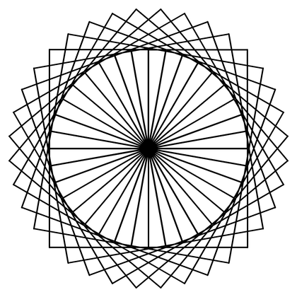
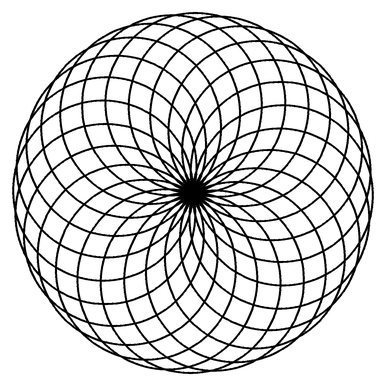
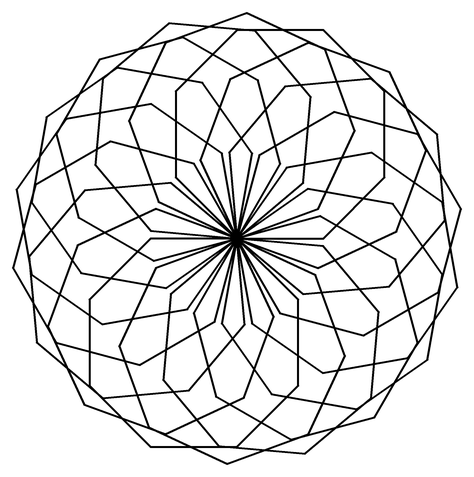
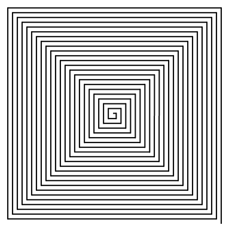
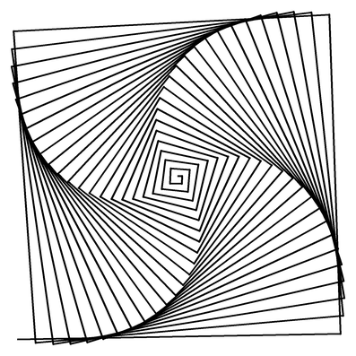
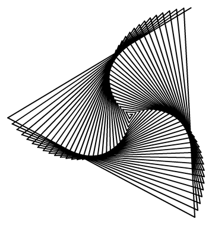
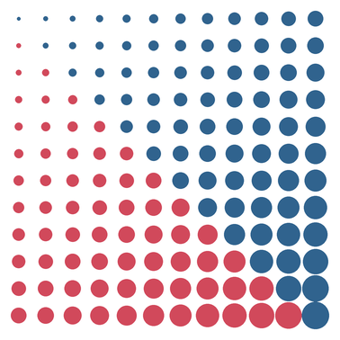
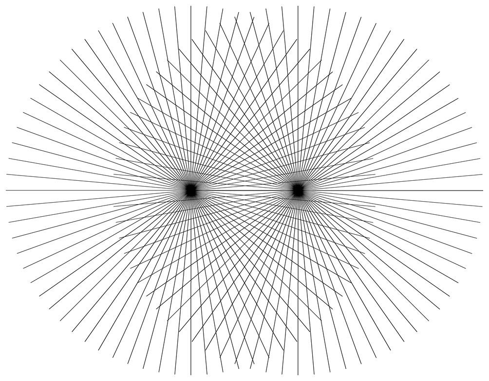

# Challenge: Muster aus Wiederholung

Variablen, Schleifen und Verzweigungen – mehr hast du bis hierher nicht gelernt. Und mehr brauchst du auch nicht, um Bilder entstehen zu lassen, die niemand mit der Hand zeichnen würde.

Diese Seite ist ein **Zusatzangebot**. Du brauchst sie nicht, um im Lernpfad weiterzukommen. Aber wenn du Lust hast, das Gelernte einmal ohne Zielvorgabe zu benutzen, bist du hier richtig.

## Was generative Kunst ist

:::snippet{#merken}
Bei **generativer Kunst** zeichnest du das Bild nicht selbst. Du schreibst eine **Regel** auf – und das Bild entsteht daraus von allein.

Die drei Zutaten kennst du längst:

- **Wiederholung** – die Schleife
- **Variation** – eine Variable, die sich bei jedem Durchlauf ändert
- **Regel** – eine Verzweigung, die entscheidet, was wann passiert

Das Erstaunliche daran: Aus sehr **einfachen** Regeln entstehen sehr **komplizierte** Bilder. Du siehst dem Ergebnis fast nie an, wie kurz das Programm dahinter ist.
:::

## So arbeitest du mit einer Challenge

:::snippet{#challenge}
Eine Challenge ist keine normale Aufgabe:

- Es gibt **kein Zielbild**, das du treffen musst. Die Bilder hier sind Beispiele, keine Vorlagen.
- Es gibt **keine Lösung** zum Nachschlagen. Es gibt nur deine eigenen Bilder.
- Dafür gibt es eine **Regel**, an die du dich halten sollst. Genau die Einschränkung macht es interessant.

Fertig bist du, wenn du ein Bild hast, das du jemandem zeigen willst.
:::

:::snippet{#merken}
**Mach dir Platz.** Deine Bilder sind größer als die schmale Vorschau neben dem Editor. Drei Handgriffe helfen:

- Zieh die **Trennlinie** zwischen der Zeichenfläche und dem Editor nach rechts – die Zeichenfläche wird breiter.
- Zieh ihre **untere Kante** nach unten – sie wird höher.
- Der **Vollbild-Knopf** unten rechts an der Editorleiste gibt dir den ganzen Bildschirm.

Bei einem Bild, das du wirklich anschauen willst, lohnt sich das.
:::

## Das Reglerprinzip

:::snippet{#brain}
Alle Programme auf dieser Seite beginnen mit einem Block wie diesem:

```python
ANZAHL = 36
WINKEL = 10
GROESSE = 140
```

Das sind ganz normale Variablen. Weil sie sich während des Programms nicht mehr ändern, schreibt man sie in **Großbuchstaben** – so erkennt jeder sofort: *Hier sind die Regler.*

**Forsche, statt zu raten.** Verändere immer nur **einen** Regler und schau, was passiert. Wer an dreien gleichzeitig dreht, weiß hinterher nicht, woran es lag.
:::

## Challenge 1: Die Rosette

Das Grundmuster ist simpel: Zeichne eine Figur, dreh dich ein Stück weiter, zeichne sie noch einmal – immer wieder um denselben Punkt herum.

| Quadrate | Kreise | Dreiecke |
| --- | --- | --- |
|  |  |  |
| `ANZAHL = 36`, `WINKEL = 10` | `ANZAHL = 24`, `WINKEL = 15` | `ANZAHL = 18`, `WINKEL = 20` |

:::snippet{#challenge}
**Die Regel:** genau eine äußere Schleife, und der Teil unter `# --- Die Regel ---` darf höchstens **8 Zeilen** lang sein.

a) Bring das Programm unten zum Laufen und schau dir an, was es zeichnet.

b) Finde heraus, welcher Zusammenhang zwischen `ANZAHL` und `WINKEL` bestehen muss, damit sich die Rosette sauber schließt.

c) Tausche die Figur aus: ein Dreieck, ein Sechseck, ein Kreis, eine Linie mit Punkt am Ende – irgendetwas.

d) Such dir **drei** Einstellungen, die dir gefallen, und notiere sie in der Tabelle unten.
:::

:::pyide{canvas height="650px"}

```python
from turtle import *

shape("turtle")
screensize(500, 500)
speed(0)
hideturtle()

# --- Die Regler ---
ANZAHL = 36
WINKEL = 10
GROESSE = 140

# --- Die Regel ---
for i in range(ANZAHL):
    for seite in range(4):
        forward(GROESSE)
        right(90)
    left(WINKEL)
```

:::

**Mein Forschungsheft**

| Nr. | ANZAHL | WINKEL | Figur | So sieht es aus |
| --- | --- | --- | --- | --- |
| 1 | | | | |
| 2 | | | | |
| 3 | | | | |

::::collapsible{title="Tipp 1: Wann schließt sich die Rosette?"}

Nach jedem Durchlauf dreht sich die Turtle um `WINKEL` Grad. Nach `ANZAHL` Durchläufen hat sie sich also um `ANZAHL * WINKEL` Grad gedreht.

Eine volle Umdrehung sind 360 Grad. Rechne nach, ob es aufgeht.

::::

::::collapsible{title="Tipp 2: Die Figur austauschen"}

Ersetze einfach den Teil, der das Quadrat zeichnet. Ein gleichseitiges Dreieck zum Beispiel:

```python
for seite in range(3):
    forward(GROESSE)
    right(120)
```

Noch kürzer geht es mit `circle`: `circle(GROESSE)` zeichnet einen Kreis, `circle(GROESSE, 3)` ein Dreieck, `circle(GROESSE, 6)` ein Sechseck.

::::

::::collapsible{title="Tipp 3: Es dauert ewig"}

Jeder Kreis besteht aus 120 winzigen Strichen. Bei `ANZAHL = 24` sind das schon fast 3000 Striche – das merkt der Browser.

Zwei Auswege: `ANZAHL` kleiner machen, oder dem Kreis weniger Ecken geben. `circle(90, 30)` sieht fast aus wie ein Kreis, ist aber viermal schneller.

::::

## Challenge 2: Die entgleiste Spirale

In [Lektion 3](./03-schleifen) hast du die quadratische Spirale gezeichnet: vorwärts, 90 Grad nach rechts, und jedes Mal ein Stück weiter.

Jetzt kommt die Frage, auf die es ankommt: **Was passiert, wenn du statt 90 einfach 91 nimmst?**

| `WINKEL = 90` | `WINKEL = 91` | `WINKEL = 121` |
| --- | --- | --- |
|  |  |  |

Alle drei Bilder stammen vom **selben** Programm. Verändert wurde nur eine einzige Zahl.

:::snippet{#challenge}
**Die Regel:** Du darfst nur die Regler verändern, nicht die Schleife.

a) Probiere die Winkel 89, 90, 91, 120 und 121 aus. Beschreibe mit eigenen Worten, warum ein einziges Grad so viel ausmacht.

b) Finde einen Winkel, der ein **fünfzackiges** Muster ergibt.

c) Dreh auch an `WACHSTUM` und `SCHRITTE`. Welcher der drei Regler verändert das Bild am stärksten?
:::

:::pyide{canvas height="650px"}

```python
from turtle import *

shape("turtle")
screensize(600, 600)
speed(0)
hideturtle()
pensize(2)

# --- Die Regler ---
WINKEL = 91
WACHSTUM = 4
SCHRITTE = 90

# --- Die Regel ---
laenge = 5
for i in range(SCHRITTE):
    forward(laenge)
    right(WINKEL)
    laenge = laenge + WACHSTUM
```

:::

::::collapsible{title="Tipp: Woher kommt die Drehung?"}

Bei 90 Grad landet die Turtle nach vier Strichen wieder in der alten Richtung – die Spirale bleibt gerade.

Bei 91 Grad fehlt nach vier Strichen genau **ein** Grad. Beim nächsten Umlauf fehlen zwei, dann drei … Die Abweichung sammelt sich an, und die ganze Spirale beginnt sich zu drehen.

Das ist ein Grundprinzip generativer Kunst: **Ein winziger Fehler, oft genug wiederholt, wird zum Muster.**

::::

## Challenge 3: Das lebendige Raster

Das Punktefeld aus [Lektion 6](./06-verschachtelte-schleifen) war noch langweilig: 100 gleiche Punkte. Sobald Größe und Farbe von `zeile` und `spalte` abhängen, wird daraus ein Bild.



:::snippet{#challenge}
**Die Regel:** Die äußere und die innere Schleife dürfen zusammen nur **eine** Verzweigung enthalten.

a) Lass die Punktgröße von `zeile` und `spalte` abhängen.

b) Erfinde eine Regel für die Farbe. Im Beispielbild ist es `spalte < zeile` – die Diagonale. Was ergibt `spalte + zeile < 12`? Was `spalte > 8`?

c) **Der Wettbewerb:** Finde eine Farbregel, auf die niemand sonst in der Klasse kommt.
:::

:::pyide{canvas height="650px"}

```python
from turtle import *

shape("turtle")
screensize(450, 450)
speed(0)
hideturtle()
penup()

# --- Die Regler ---
ANZAHL = 12
ABSTAND = 30
FARBE_A = "#d1495b"
FARBE_B = "#30638e"

# --- Die Regel ---
for zeile in range(ANZAHL):
    for spalte in range(ANZAHL):
        goto(-165 + spalte * ABSTAND, 165 - zeile * ABSTAND)

        if spalte < zeile:
            pencolor(FARBE_A)
        else:
            pencolor(FARBE_B)

        dot(4 + (zeile + spalte) * 1.2)
```

:::

::::collapsible{title="Tipp: Schöne Farben finden"}

Farben aus zwei Wörtern wie `"red"` und `"blue"` wirken schnell grell. Hexadezimalwerte geben dir viel feinere Abstufungen:

```python
FARBE_A = "#d1495b"   # gedämpftes Rot
FARBE_B = "#30638e"   # gedämpftes Blau
```

Auf [w3schools.com](https://www.w3schools.com/colors/colors_picker.asp) kannst du Farben aussuchen und den Wert abschreiben. Zwei Farben, die gut zusammenpassen, machen mehr aus als jede zusätzliche Programmzeile.

::::

## Die Kür: Der Moiré-Fächer

Zwei Strahlenfächer, deren Mittelpunkte nebeneinander liegen. Wo sich die Linien überlagern, sieht das Auge Muster, die gar nicht gezeichnet wurden – man nennt das **Moiré**.



:::snippet{#challenge}
Baue den Fächer nach. Du brauchst dafür nur `goto`, `setheading` und `forward` – alles aus diesem Kapitel.

Dann experimentiere: Was passiert, wenn die Mittelpunkte weiter auseinanderrücken? Wenn du **drei** Fächer zeichnest? Wenn der zweite Fächer einen minimal anderen Winkelabstand hat als der erste?
:::

:::pyide{canvas}
```python
import turtle

``` 
:::

::::collapsible{title="Tipp: Ein einzelner Fächer"}

Für jede Linie: Stift hoch, zurück zum Mittelpunkt, in die neue Richtung drehen, Stift runter, loslaufen.

```python
for i in range(72):
    penup()
    goto(-110, 0)
    setheading(i * 5)
    pendown()
    forward(380)
```

Für den zweiten Fächer wiederholst du das Ganze mit einem anderen Mittelpunkt.

::::

## Deine Serie

:::snippet{#challenge}
Zum Abschluss: Such dir **eine** der Challenges aus und mach daraus eine **Serie**.

1. Stelle die Regler so ein, dass **vier** deutlich verschiedene Bilder entstehen.
2. Notiere zu jedem Bild die Reglerwerte – sonst kannst du es nie wieder herstellen.
3. Gib jedem Bild einen **Titel**.
4. Hängt die Serien in der Klasse auf. Könnt ihr bei den Bildern der anderen erraten, welche Regel dahintersteckt?
:::

:::snippet{#brain}
Das Erraten ist der eigentlich spannende Teil. Denn genau das ist Informatik: **vom Ergebnis auf die Regel schließen.**

Und nebenbei hast du gemerkt, wozu Variablen wirklich gut sind. Nicht zum Speichern – zum **Verstellen**.
:::

---

Auf dieser Seite gibt es keinen Selbsttest. Es gibt nichts abzuhaken: Entweder du hast ein Bild, das dir gefällt, oder du drehst weiter an den Reglern.
