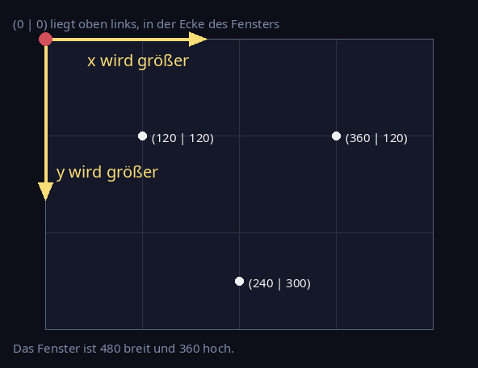
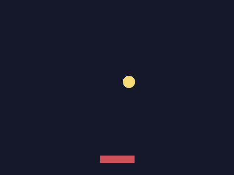
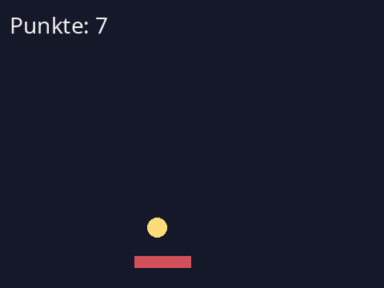

# Challenge: Spiele aus Wiederholung

Diese Seite ist die **Alternative** zu [Muster aus Wiederholung](./09-challenges-muster). Beide brauchen genau dasselbe: Variablen, Schleifen, Verzweigungen. Beide sind freiwillig. Such dir aus, was dich mehr reizt – oder mach beides.

Statt der Turtle benutzt du hier **pygame**, eine Bibliothek für Spiele.

## Ein Spiel ist eine Schleife

:::snippet{#merken}
Ein Spiel ist nichts anderes als eine Schleife, die sehr oft durchlaufen wird – **60 mal pro Sekunde**. In jedem Durchlauf passiert immer dasselbe:

1. **Nachsehen**, was gedrückt wird
2. **Werte ändern** – Positionen, Punkte
3. **Alles neu zeichnen**

Das ist dasselbe Prinzip wie bei der Spirale: ein winziger Schritt, oft genug wiederholt, ergibt etwas Großes. Nur bleibt hier keine Spur stehen – das Bild wird in jedem Durchlauf gelöscht und neu gemalt.

Ein Durchlauf heißt **Frame**. „60 FPS" bedeutet: 60 Frames pro Sekunde.
:::

## Drei Dinge sind anders als bei der Turtle

:::snippet{#brain}
**1. Die y-Achse zeigt nach unten.** Der Ursprung (0 | 0) liegt **oben links**, nicht in der Mitte. `y = y + 1` bewegt also nach **unten**. Das ist die Umstellung, die am häufigsten für Verwirrung sorgt – sieh dir das Bild unten genau an.

**2. Farben sind drei Zahlen.** Statt `"yellow"` schreibst du `(250, 220, 120)`: Rot, Grün, Blau, jeweils von 0 bis 255.

**3. Das Bild wird jedes Mal neu gezeichnet.** `screen.fill(...)` löscht die Fläche, danach wird alles neu gemalt. Wer das `fill` weglässt, bekommt eine Spur wie bei der Turtle – probier es ruhig einmal aus.
:::



## Der Rahmen

Alle Programme auf dieser Seite haben denselben Aufbau. Vier Zonen, jede mit einer Aufgabe:

:::snippet{#merken}
| Zone | Was dort steht |
| --- | --- |
| `# --- Der Rahmen ---` | Fenster, Uhr, Spielschleife. Den brauchst du nicht zu ändern. |
| `# --- Die Regler ---` | Konstanten in Großbuchstaben. Hier drehst du. |
| `# --- Der Startzustand ---` | Wo alles beginnt. |
| `# --- Deine Regeln ---` | Was in **jedem** Frame passiert. Hier arbeitest du. |

**Der erste Start dauert etwa 15 Sekunden**, weil pygame erst geladen werden muss. Nicht zweimal klicken – ab dem zweiten Mal geht es sofort.
:::

## Challenge 1: Der Ball, der nicht bleiben will

Starte das Programm unten. Der Ball läuft los – und verschwindet.

:::snippet{#challenge}
**Die Regel:** Du darfst nur Verzweigungen ergänzen. Keine zweite Schleife, keine neuen Befehle.

a) Führ das Programm aus und erkläre, **warum** der Ball nicht zurückkommt.

b) Sorg dafür, dass er an der **rechten** Wand abprallt.

c) Dann an allen **vier** Wänden.

d) Dreh an den Reglern. Was passiert bei `TEMPO_X = 17`? Erklär, was du siehst.
:::

:::pyide{canvas height="700px"}

```python
import pygame

# --- Der Rahmen ---
pygame.init()
BREITE = 480
HOEHE = 360
screen = pygame.display.set_mode((BREITE, HOEHE))
clock = pygame.time.Clock()

# --- Die Regler ---
TEMPO_X = 3
TEMPO_Y = 2
RADIUS = 12
HINTERGRUND = (20, 24, 40)
BALLFARBE = (250, 220, 120)

# --- Der Startzustand ---
x = 240
y = 60

laeuft = True
while laeuft:
    for event in pygame.event.get():
        if event.type == pygame.QUIT:
            laeuft = False

    # --- Deine Regeln ---
    x = x + TEMPO_X
    y = y + TEMPO_Y

    # --- Zeichnen ---
    screen.fill(HINTERGRUND)
    pygame.draw.circle(screen, BALLFARBE, (x, y), RADIUS)
    pygame.display.flip()
    clock.tick(60)
```

:::

::::collapsible{title="Tipp 1: Was heißt eigentlich abprallen?"}

Der Ball bewegt sich, weil in jedem Frame `TEMPO_X` auf `x` addiert wird. Solange `TEMPO_X` positiv ist, geht es nach rechts.

Abprallen heißt: **ab jetzt in die andere Richtung**. Und die andere Richtung bekommst du, indem du das Vorzeichen umdrehst:

```python
TEMPO_X = -TEMPO_X
```

Das ist keine Rechnung mit einem festen Wert, sondern eine, die den alten Wert benutzt – wie `punkte = punkte + 1`.

::::

::::collapsible{title="Tipp 2: Wann soll das passieren?"}

Wenn der Ball die rechte Wand erreicht. Die rechte Wand liegt bei `x = BREITE`. Weil der Ball aber einen Radius hat, ist er schon bei `BREITE - RADIUS` angekommen:

```python
if x > BREITE - RADIUS:
    TEMPO_X = -TEMPO_X
```

::::

::::collapsible{title="Tipp 3: Und die anderen drei Wände?"}

Nach demselben Muster. Denk daran: **oben** ist `y` klein, **unten** ist `y` groß.

Du brauchst vier Verzweigungen – oder zwei, wenn du `or` schon kennst.

::::

::::collapsible{title="Tipp 4: Der Ball zittert am Rand"}

Wenn du `TEMPO_X = -TEMPO_X` schreibst und der Ball trotzdem am Rand kleben bleibt und zittert, dann ist er zu weit in die Wand gelaufen: Die Bedingung ist im nächsten Frame immer noch wahr, das Vorzeichen kippt wieder zurück, und so fort.

Setz ihn zusätzlich zurück auf die erlaubte Position:

```python
if x > BREITE - RADIUS:
    x = BREITE - RADIUS
    TEMPO_X = -TEMPO_X
```

Bei kleinen Tempos merkt man das kaum. Bei `TEMPO_X = 17` sofort – das ist der eigentliche Grund für Teilaufgabe d).

::::

## Challenge 2: Etwas zu steuern

Ein Ball, der von allein herumspringt, ist noch kein Spiel. Es fehlt etwas, das **du** bewegst.



:::snippet{#challenge}
**Die Regel:** Der Schläger darf das Spielfeld nicht verlassen.

a) Bring den Schläger mit den Pfeiltasten zum Laufen.

b) Sorg dafür, dass er an den Rändern stehen bleibt, statt aus dem Bild zu fahren.

c) Bau deinen abprallenden Ball aus Challenge 1 wieder ein.

d) Denk dir eine zweite Steuerung aus: Soll der Schläger schneller werden, je länger man drückt? Soll er sich mit `K_UP` und `K_DOWN` auch hoch und runter bewegen?
:::

:::pyide{canvas height="700px"}

```python
import pygame

# --- Der Rahmen ---
pygame.init()
BREITE = 480
HOEHE = 360
screen = pygame.display.set_mode((BREITE, HOEHE))
clock = pygame.time.Clock()

# --- Die Regler ---
SCHLAEGER_B = 70
SCHLAEGER_H = 14
SCHLAEGER_TEMPO = 6
HINTERGRUND = (20, 24, 40)
SCHLAEGERFARBE = (210, 80, 90)

# --- Der Startzustand ---
schlaeger_x = 205
schlaeger_y = 320

laeuft = True
while laeuft:
    for event in pygame.event.get():
        if event.type == pygame.QUIT:
            laeuft = False

    tasten = pygame.key.get_pressed()

    # --- Deine Regeln ---
    if tasten[pygame.K_LEFT]:
        schlaeger_x = schlaeger_x - SCHLAEGER_TEMPO

    # --- Zeichnen ---
    screen.fill(HINTERGRUND)
    schlaeger = pygame.Rect(schlaeger_x, schlaeger_y, SCHLAEGER_B, SCHLAEGER_H)
    pygame.draw.rect(screen, SCHLAEGERFARBE, schlaeger)
    pygame.display.flip()
    clock.tick(60)
```

:::

::::collapsible{title="Tipp 1: Wie fragt man eine Taste ab?"}

`pygame.key.get_pressed()` liefert dir für **jede** Taste, ob sie gerade gedrückt ist. Die eckigen Klammern wählen aus, welche du meinst:

```python
if tasten[pygame.K_RIGHT]:
    schlaeger_x = schlaeger_x + SCHLAEGER_TEMPO
```

Wichtig ist der Unterschied zu einer Eingabe mit `input`: Hier wartet nichts. In jedem Frame wird einmal nachgesehen, und wenn die Taste gehalten wird, bewegt sich der Schläger eben in jedem Frame ein Stück.

::::

::::collapsible{title="Tipp 2: Am Rand stehen bleiben"}

Nicht abprallen, sondern **anhalten**. Das ist einfacher:

```python
if schlaeger_x < 0:
    schlaeger_x = 0
```

Für die rechte Seite musst du bedenken, dass `schlaeger_x` die **linke** Kante ist. Der Schläger ist erst draußen, wenn `schlaeger_x + SCHLAEGER_B` größer als `BREITE` ist.

::::

## Challenge 3: Treffer zählen

Jetzt wird es ein Spiel: Der Ball soll den Schläger treffen, und du sollst sehen, wie oft.



:::snippet{#challenge}
**Die Regel:** Es gibt genau eine Variable für die Punkte.

a) Lass die Punkte hochzählen, wenn der Ball den Schläger trifft.

b) Zeig die Punktzahl oben links an.

c) Was soll passieren, wenn der Ball unten durchrutscht? Verliert man einen Punkt? Fängt alles von vorn an? **Entscheide dich und begründe.**

d) **Der Wettbewerb:** Baue eine Regel ein, die dein Spiel schwerer macht, je besser man ist.
:::

:::pyide{canvas height="700px"}

```python
import pygame

# --- Der Rahmen ---
pygame.init()
BREITE = 480
HOEHE = 360
screen = pygame.display.set_mode((BREITE, HOEHE))
clock = pygame.time.Clock()
schrift = pygame.font.SysFont(None, 28)

# --- Die Regler ---
TEMPO_X = 3
TEMPO_Y = 3
RADIUS = 12
SCHLAEGER_B = 70
SCHLAEGER_H = 14
SCHLAEGER_TEMPO = 6
HINTERGRUND = (20, 24, 40)
BALLFARBE = (250, 220, 120)
SCHLAEGERFARBE = (210, 80, 90)
TEXTFARBE = (240, 240, 240)

# --- Der Startzustand ---
x = 240
y = 60
schlaeger_x = 205
schlaeger_y = 320
punkte = 0

laeuft = True
while laeuft:
    for event in pygame.event.get():
        if event.type == pygame.QUIT:
            laeuft = False

    tasten = pygame.key.get_pressed()
    if tasten[pygame.K_LEFT]:
        schlaeger_x = schlaeger_x - SCHLAEGER_TEMPO
    if tasten[pygame.K_RIGHT]:
        schlaeger_x = schlaeger_x + SCHLAEGER_TEMPO

    x = x + TEMPO_X
    y = y + TEMPO_Y

    # --- Deine Regeln ---
    # Hier fehlt noch alles: Abprallen, Treffer, Punkte.

    # --- Zeichnen ---
    screen.fill(HINTERGRUND)
    schlaeger = pygame.Rect(schlaeger_x, schlaeger_y, SCHLAEGER_B, SCHLAEGER_H)
    ball = pygame.Rect(x - RADIUS, y - RADIUS, 2 * RADIUS, 2 * RADIUS)
    pygame.draw.rect(screen, SCHLAEGERFARBE, schlaeger)
    pygame.draw.circle(screen, BALLFARBE, (x, y), RADIUS)
    screen.blit(schrift.render("Punkte: " + str(punkte), True, TEXTFARBE), (12, 12))
    pygame.display.flip()
    clock.tick(60)
```

:::

::::collapsible{title="Tipp 1: Wie erkennt man einen Treffer?"}

Im Zeichenteil stehen schon zwei **Rechtecke**: `schlaeger` und `ball`. Ein Rechteck weiß selbst, ob es ein anderes berührt:

```python
if ball.colliderect(schlaeger):
    TEMPO_Y = -TEMPO_Y
    punkte = punkte + 1
```

Die Rechtecke werden allerdings erst weiter unten gebaut. Zieh die beiden Zeilen mit `pygame.Rect(...)` nach oben in deinen Bereich, dann kannst du sie benutzen.

::::

::::collapsible{title="Tipp 2: Der Ball klebt am Schläger"}

Dasselbe Problem wie bei der Wand in Challenge 1: Solange der Ball den Schläger berührt, kippt das Vorzeichen in **jedem** Frame – und die Punkte schießen in die Höhe.

Prüf zusätzlich, dass der Ball sich gerade nach unten bewegt:

```python
if ball.colliderect(schlaeger) and TEMPO_Y > 0:
```

::::

::::collapsible{title="Tipp 3: Text anzeigen"}

Die Zeile dafür steht schon im Programm:

```python
screen.blit(schrift.render("Punkte: " + str(punkte), True, TEXTFARBE), (12, 12))
```

Von innen nach außen gelesen: `schrift.render(...)` malt den Text auf ein kleines Bild, `screen.blit(...)` klebt dieses Bild an die Stelle (12 | 12) – also oben links.

`str(punkte)` brauchst du, weil man eine Zahl nicht direkt an einen Text hängen kann. Das kennst du schon aus Lektion 4.

::::

## Die Kür: Schwerkraft

:::snippet{#challenge}
Bisher fliegt der Ball geradeaus. Echte Bälle fallen.

Schwerkraft ist eine einzige Zeile: In jedem Frame wird `TEMPO_Y` ein kleines bisschen größer.

```python
TEMPO_Y = TEMPO_Y + 0.3
```

Bau das ein und schau, was passiert. Dann:

- Warum wird der Ball nach jedem Abprall **niedriger**, wenn du beim Abprallen `TEMPO_Y = -TEMPO_Y * 0.9` schreibst?
- Was müsstest du tun, damit er ewig gleich hoch springt?
- Und was passiert bei `TEMPO_Y = -TEMPO_Y * 1.1`?
:::

::::collapsible{title="Tipp: Kommazahlen beim Zeichnen"}

Mit Schwerkraft wird `y` zur Kommazahl. Das stört pygame beim Rechnen nicht, aber gezeichnet wird auf ganzen Pixeln. Wenn dein Ball anfängt zu flackern, runde beim Zeichnen:

```python
pygame.draw.circle(screen, BALLFARBE, (int(x), int(y)), RADIUS)
```

::::

## Dein Spiel

:::snippet{#challenge}
Zum Abschluss: Bau aus einer der Challenges **dein eigenes** Spiel.

1. Schreib zuerst die **Regeln** auf, in ganzen Sätzen. Was steuert man? Wann gibt es Punkte? Wann ist es vorbei?
2. Dann programmiere sie.
3. Gib dein Spiel jemand anderem – **ohne** die Regeln dazuzusagen.
4. Kann die Person die Regeln allein herausfinden?
:::

:::snippet{#brain}
Schritt 4 ist der eigentliche Test. Wenn jemand die Regeln beim Spielen von selbst versteht, hast du sie klar gebaut. Versteht sie niemand, liegt es fast nie am Programm – sondern daran, dass die Regel selbst unklar war.

Genau das ist auf der [Musterseite](./09-challenges-muster) dieselbe Frage, nur andersherum: Dort errät man die Regel aus dem Bild, hier aus dem Spiel.
:::

---

Auch hier gibt es keinen Selbsttest. Fertig bist du, wenn jemand dein Spiel spielen will.
