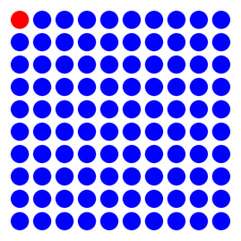
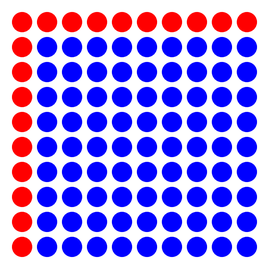
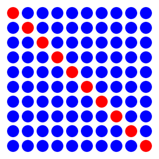
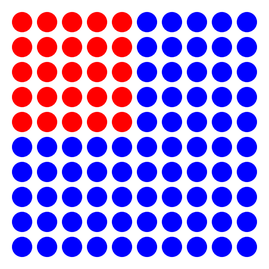
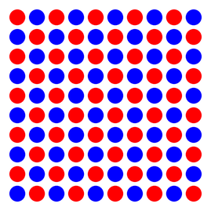

# Logische Verknüpfungen

## Aufgabe 1: Wahrheitswerte verknüpfen

:::snippet{#aufgabe}
Gib **zuerst ohne Rechner** an, welche Ergebnisse die folgenden Ausgaben liefern. Schreibe sie hinter die Kommentare.

Überprüfe dein Ergebnis danach am Rechner.
:::

:::pyide

```python
print(True and True)     # Ergebnis:
print(True and False)    # Ergebnis:
print(False and True)    # Ergebnis:
print(False and False)   # Ergebnis:

print(True or True)      # Ergebnis:
print(True or False)     # Ergebnis:
print(False or True)     # Ergebnis:
print(False or False)    # Ergebnis:

print(not True)          # Ergebnis:
print(not False)         # Ergebnis:
```

:::

:::snippet{#merken}
Python kennt drei logische Verknüpfungen:

| Verknüpfung | Bedeutung | Ergebnis ist wahr, wenn … |
| --- | --- | --- |
| `and` | und | **beide** Seiten wahr sind |
| `or` | oder | **mindestens eine** Seite wahr ist |
| `not` | nicht | die Seite **falsch** ist |

**Achtung beim `or`:** In der Umgangssprache meint „oder" oft „entweder … oder". In der Informatik ist `or` immer **einschließend**: `True or True` ergibt `True`.
:::

:::snippet{#brain}
Die vollständige Übersicht heißt **Wahrheitstafel**:

| A | B | `A and B` | `A or B` |
| --- | --- | --- | --- |
| `False` | `False` | `False` | `False` |
| `False` | `True` | `False` | `True` |
| `True` | `False` | `False` | `True` |
| `True` | `True` | `True` | `True` |

Beim `and` gibt es also nur **eine** Zeile mit dem Ergebnis wahr, beim `or` nur **eine** mit dem Ergebnis falsch.
:::

## Aufgabe 2: Ein Beispiel mit der Turtle

:::snippet{#aufgabe}
Skizziere **zuerst auf Papier**, welches Bild sich hier ergibt. Überprüfe dein Ergebnis danach am Rechner.
:::

:::pyide{canvas}

```python
from turtle import *
shape("turtle")
screensize(600, 300)

penup()
goto(-140, 0)

punkt = 0

while punkt < 10:
    forward(25)

    if punkt % 2 == 0 and punkt < 5:
        pencolor("red")
    else:
        pencolor("blue")

    dot(20)
    punkt = punkt + 1
```

:::

::::collapsible{title="Tipp: Gehe die Bedingung durch"}

Lege eine Tabelle an und prüfe für jeden Wert von `punkt` beide Teilbedingungen einzeln:

| punkt | gerade? | kleiner als 5? | beides? | Farbe |
| --- | --- | --- | --- | --- |
| 0 | ja | ja | ja | rot |
| 1 | nein | ja | nein | blau |
| 2 | ja | ja | ja | rot |
| … | | | | |

::::


:::protect{password="turtle-3-1-1" description="Auflösung. Erfrage das Passwort bei deiner Lehrkraft."}

Rot werden nur die Punkte 0, 2 und 4 – denn nur bei ihnen sind **beide** Bedingungen erfüllt.

Punkt 6 und 8 sind zwar gerade, aber nicht mehr kleiner als 5. Punkt 1 und 3 sind zwar kleiner als 5, aber nicht gerade.

:::

## Aufgabe 3: Ein Punktequadrat

:::snippet{#aufgabe}
a) Skizziere wieder zuerst, welches Bild sich hier ergibt. Überprüfe dein Ergebnis danach am Rechner.

b) Modifiziere das Programm anschließend so, dass sich die weiter unten abgebildeten Zeichnungen ergeben. **Ändere dabei nur die Bedingung!**
:::

:::pyide{canvas}

```python
from turtle import *
shape("turtle")
screensize(400, 400)
speed(0)

penup()
goto(-140, 125)

zeile = 0

while zeile < 10:
    x = xcor()
    punkt = 0

    while punkt < 10:
        forward(25)

        if punkt == 0 and zeile == 0:
            pencolor("red")
        else:
            pencolor("blue")

        dot(20)
        punkt = punkt + 1

    goto(x, ycor() - 25)
    zeile = zeile + 1
```

:::



### Variante A



::::collapsible{title="Tipp zu Variante A"}

Hier ist ein Punkt rot, wenn er in der ersten Spalte **oder** in der ersten Zeile liegt. Welche Verknüpfung brauchst du also?

::::

### Variante B



::::collapsible{title="Tipp zu Variante B"}

Auf der Diagonalen sind Zeilennummer und Spaltennummer **gleich**. Dafür brauchst du gar keine Verknüpfung – nur einen Vergleich der beiden Variablen miteinander.

::::

### Variante C



::::collapsible{title="Tipp zu Variante C"}

Rot ist ein Punkt, wenn er sowohl in einer der ersten fünf Zeilen **als auch** in einer der ersten fünf Spalten liegt.

::::

:::protect{password="turtle-3-1-2" description="Lösungen der drei Varianten. Erfrage das Passwort bei deiner Lehrkraft."}

Es muss jeweils nur die Bedingung ausgetauscht werden:

```python
# Variante A: erste Zeile oder erste Spalte
if punkt == 0 or zeile == 0:

# Variante B: die Diagonale
if punkt == zeile:

# Variante C: das obere linke Viertel
if punkt < 5 and zeile < 5:
```

:::

## Zusatzaufgabe: Das Schachbrett

:::snippet{#aufgabe}
Modifiziere dein Programm nun so, dass eine Zeichnung wie unten entsteht.
:::



::::collapsible{title="Tipp 1: Wann ist ein Feld rot?"}

Sieh dir eine einzelne Zeile an: Dort wechseln sich die Farben ab. In der nächsten Zeile ist es genau umgekehrt.

Die Farbe hängt also von **beiden** Zählern gemeinsam ab.

::::

::::collapsible{title="Tipp 2: Die entscheidende Idee"}

Betrachte die **Summe** aus Zeilennummer und Spaltennummer. Ist sie gerade oder ungerade?

::::

:::protect{password="turtle-3-1-3" description="Lösung. Erfrage das Passwort bei deiner Lehrkraft."}

```python
if (zeile + punkt) % 2 == 0:
    pencolor("red")
else:
    pencolor("blue")
```

:::

---

## Selbsttest

::::multievent

**1. Was ergibt True and False?**

{r1{True}}

{r1{!False}}

{h{Beim und müssen beide Seiten wahr sein.}}
{H{Richtig!}}

**2. Was ergibt False or True?**

{r2{!True}}

{r2{False}}

{h{Beim oder reicht es, wenn eine Seite wahr ist.}}
{H{Richtig!}}

**3. Für welche Zahl ist die Bedingung „zahl größer als 10 and zahl kleiner als 20" erfüllt?**

{r3{5}}

{r3{!15}}

{r3{25}}

{r3{10}}

{h{Die Zahl muss beide Bedingungen gleichzeitig erfüllen – sie liegt also echt zwischen 10 und 20.}}
{H{Richtig!}}

**4. In wie vielen der vier Kombinationen liefert das oder ein wahres Ergebnis?**

{z{3}} von 4

{h{Schau in die Wahrheitstafel: Nur eine einzige Zeile liefert falsch.}}
{H{Richtig! Nur falsch oder falsch ergibt falsch.}}

**5. Welche Verknüpfung brauchst du, um die erste Zeile UND die erste Spalte eines Feldes zu färben?**

{r4{and}}

{r4{!or}}

{r4{not}}

{h{Ein Punkt soll gefärbt werden, wenn eine der beiden Bedingungen zutrifft – nicht unbedingt beide.}}
{H{Richtig! Auch wenn man umgangssprachlich „und" sagt, ist logisch das oder gemeint.}}

**6. Was ergibt not (5 > 3)?**

{r5{True}}

{r5{!False}}

{h{Zuerst wird der Vergleich in der Klammer ausgewertet, dann umgekehrt.}}
{H{Richtig! 5 ist größer als 3, das Ergebnis wahr wird durch not zu falsch.}}

::::
