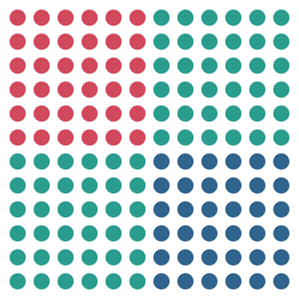
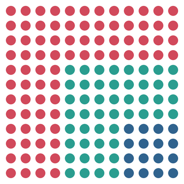
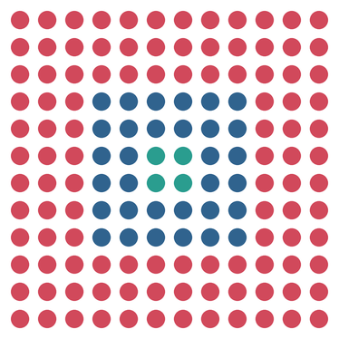
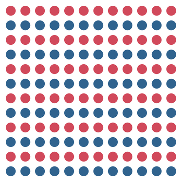
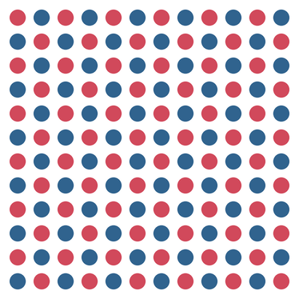
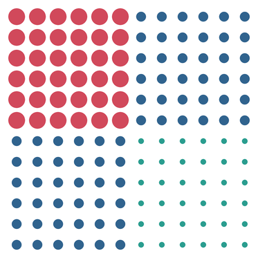
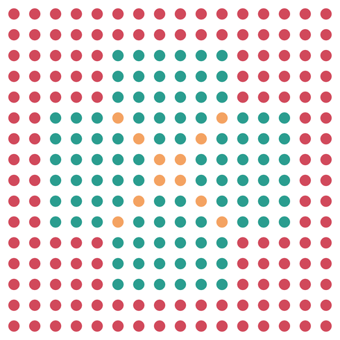

# Challenge: Bilder aus Bedingungen

Bisher hast du Bedingungen benutzt, um zwischen zwei Farben zu wählen: rot oder blau, Punkt oder kein Punkt. Mit `and`, `or` und `not` wird daraus etwas anderes: Du kannst das gesamte Feld in **Regionen** zerlegen – und aus Regionen werden Bilder.

Diese Seite ist ein **Zusatzangebot**. Du brauchst sie nicht, um im Lernpfad weiterzukommen. Aber wenn du Lust hast, das Gelernte einmal ohne Zielvorgabe zu benutzen, bist du hier richtig.

## Was generative Kunst mit Logik ist

:::snippet{#merken}
Bei **generativer Kunst** zeichnest du das Bild nicht selbst. Du schreibst eine **Regel** auf – und das Bild entsteht daraus von allein.

Im letzten Kapitel war die Regel eine Schleife mit einem Regler. Jetzt kommt eine neue Zutat hinzu:

- **Bedingung** – ein Vergleich, der wahr oder falsch ist
- **Verknüpfung** – `and`, `or` und `not` kombinieren Bedingungen zu einer Regel
- **Region** – alle Punkte, auf die die Regel zutrifft, bilden zusammen einen Teil des Bildes

Das Erstaunliche daran: Aus sehr **einfachen** Bedingungen entstehen sehr **komplizierte** Bilder. Eine einzige Zeile wie `zeile < 6 and spalte < 6` teilt das Feld in vier Teile – und du hast nur zwei Zahlen verglichen und ein `and` dazwischengesetzt.
:::

## So arbeitest du mit einer Challenge

:::snippet{#challenge}
Eine Challenge ist keine normale Aufgabe:

- Es gibt **kein Zielbild**, das du treffen musst. Die Bilder hier sind Beispiele, keine Vorlagen.
- Es gibt **keine Lösung** zum Nachschlagen. Es gibt nur deine eigenen Bilder.
- Dafür gibt es eine **Regel**, an die du dich halten solltest. Genau die Einschränkung macht es interessant.

Fertig bist du, wenn du ein Bild hast, das du jemandem zeigen willst.
:::

:::snippet{#merken}
**Mach dir Platz.** Deine Bilder sind größer als die schmale Vorschau neben dem Editor. Drei Handgriffe helfen:

- Zieh die **Trennlinie** zwischen der Zeichenfläche und dem Editor nach rechts – die Zeichenfläche wird breiter.
- Zieh ihre **untere Kante** nach unten – sie wird höher.
- Der **Vollbild-Knopf** unten rechts an der Editorleiste gibt dir den ganzen Bildschirm.

Bei einem Bild, das du wirklich anschauen willst, lohnt sich das.
:::

## Das Reglerprinzip

:::snippet{#brain}
Die Programme auf dieser Seite haben keine Regler wie im letzten Kapitel. Statt einer Zahl hast du hier eine **Bedingung** – und die ist dein Regler.

Verändere immer nur **eine** Bedingung und schau, was passiert. Wer an dreien gleichzeitig dreht, weiß hinterher nicht, woran es lag.

Drei Fragen helfen beim Suchen:

- *Welche Punkte erfasst die Bedingung?* Geh das Feld systematisch durch: Zeile 0, Spalte 0 – trifft es zu? Zeile 0, Spalte 1 – und so weiter.
- *Was ändert sich, wenn du `and` durch `or` ersetzt?* Aus „beide müssen wahr" wird „eine reicht".
- *Was macht das `not`?* Es dreht die Bedingung um: was rot war, wird blau – und umgekehrt.
:::

## Challenge 1: Drei Farben statt zwei

Das Schachbrett aus [Lektion 1](./01-logische-verknuepfungen) hatte zwei Farben. Mit `and`, `or` und `not` kannst du drei Regionen definieren – und die sehen ganz unterschiedlich aus, je nachdem, welche Bedingung du wählst.

| Quadranten | L-Form | Ring |
| --- | --- | --- |
|  |  |  |
| `zeile < 6 and spalte < 6` | `zeile < 4 or spalte < 4` | `zeile < 3 or zeile > 8 or spalte < 3 or spalte > 8` |

Alle drei Bilder stammen vom **selben** Programm. Verändert wurde nur die Bedingung.

:::snippet{#challenge}
**Die Regel:** Du darfst nur die Bedingung verändern, nicht die Schleife.

a) Bring das Programm unten zum Laufen und schau dir an, was es zeichnet.

b) Ersetze die Bedingung durch die drei Beispiele aus der Tabelle. Vergleiche jedes Mal das Ergebnis mit dem Bild oben.

c) Erfinde **eigene** Bedingungen. Was ergibt `zeile < 5 and spalte > 7`? Was passiert, wenn du ein `not` vor die gesamte Bedingung setzt?

d) Such dir **drei** Bedingungen, die dir gefallen, und notiere sie in der Tabelle unten.
:::

:::pyide{canvas height="650px"}

```python
from turtle import *

shape("turtle")
screensize(500, 500)
speed(0)
hideturtle()
penup()

# --- Die Regler ---
GRENZE = 6
FARBE_A = "#d1495b"
FARBE_B = "#30638e"
FARBE_C = "#2a9d8f"

# --- Die Regel ---
for zeile in range(12):
    for spalte in range(12):
        goto(-165 + spalte * 30, 165 - zeile * 30)
        if zeile < GRENZE and spalte < GRENZE:
            pencolor(FARBE_A)
        elif zeile >= GRENZE and spalte >= GRENZE:
            pencolor(FARBE_B)
        else:
            pencolor(FARBE_C)
        dot(20)
```

:::

**Mein Forschungsheft**

| Nr. | Bedingung für Farbe A | Bedingung für Farbe B | So sieht es aus |
| --- | --- | --- | --- |
| 1 | | | |
| 2 | | | |
| 3 | | | |

::::collapsible{title="Tipp 1: Welche Punkte erfasst die Bedingung?"}

Geh das Feld systematisch durch. Für `zeile < 4 or spalte < 4`:

| Zeile | Spalte | zeile < 4? | spalte < 4? | or? | Farbe |
| --- | --- | --- | --- | --- | --- |
| 0 | 0 | ja | ja | ja | A |
| 0 | 5 | ja | nein | ja | A |
| 5 | 0 | nein | ja | ja | A |
| 5 | 5 | nein | nein | nein | B oder C |

Die `or`-Bedingung erfasst alles, was in den ersten vier Zeilen **oder** den ersten vier Spalten liegt – das ist die L-Form oben links.

::::

::::collapsible{title="Tipp 2: Das `not` richtig eingesetzt"}

`not` dreht eine Bedingung um. `not (zeile < 4 or spalte < 4)` trifft auf alle Punkte zu, die **nicht** in der L-Form liegen – also auf alles ab Zeile 4 und ab Spalte 4.

Kombiniert mit einer weiteren Bedingung: `not (zeile < 4 or spalte < 4) and (zeile > 7 and spalte > 7)` erfasst die rechte untere Ecke – aber nur, weil das `not` die L-Form ausgeschlossen hat.

::::

::::collapsible{title="Tipp 3: Warum drei Farben und nicht zwei?"}

Mit zwei Farben gibt es nur einen Schnitt: die Bedingung teilt das Feld in „dazu" und „nicht dazu". Das Kapitel darüber hat genau das getan.

Mit drei Farben gibt es **zwei Schnitte**: eine Region für `and`, eine für den Gegenbereich und eine für den Rest. Der Rest ist es, der das Bild interessant macht – er ist der „Zwischenraum" zwischen deinen Bedingungen.

::::

## Challenge 2: Der Schalter im Raster

In [Lektion 2](./02-boolesche-werte) hast du den Schalter kennengelernt: `schalter = not schalter` dreht den Wert bei jedem Durchlauf um. Auf einer einzelnen Zeile ergibt das abwechselnde Punkte. Im Raster wird es interessant.

| Zeilenstreifen | Schachbrett |
| --- | --- |
|  |  |
| Ein Schalter, einmal pro Zeile umgedreht | Zwei Schalter: einer pro Zeile, einer pro Spalte |

:::snippet{#challenge}
**Die Regel:** Du darfst nur die Schalter und die Bedingungen verändern, nicht die Schleife.

a) Bring das Programm unten zum Laufen. Es zeichnet horizontale Streifen – der Schalter wird nur einmal pro Zeile umgedreht.

b) Füge einen zweiten Schalter `schalter_spalte` hinzu, der in jeder Zeile neu startet und nach jedem Punkt umgedreht wird. So entsteht das Schachbrett. Welcher Schalter muss am Anfang einer Zeile auf welchen Wert gesetzt werden?

c) Ersetze die Farbe durch die **Größe**: große Punkte, wo der Schalter wahr ist, kleine, wo er falsch ist. Was ergibt ein Schachbrett aus großen und kleinen Punkten?

d) Was passiert, wenn du die beiden Schalter mit `and` oder `or` verknüpfst, statt sie abwechseln zu lassen?
:::

:::pyide{canvas height="650px"}

```python
from turtle import *

shape("turtle")
screensize(500, 500)
speed(0)
hideturtle()
penup()

# --- Die Regler ---
FARBE_A = "#d1495b"
FARBE_B = "#30638e"

# --- Die Regel ---
schalter = True
for zeile in range(12):
    for spalte in range(12):
        goto(-165 + spalte * 30, 165 - zeile * 30)
        if schalter:
            pencolor(FARBE_A)
        else:
            pencolor(FARBE_B)
        dot(20)
    schalter = not schalter
```

:::

::::collapsible{title="Tipp 1: Der zweite Schalter"}

Für das Schachbrett brauchst du einen Schalter, der in der inneren Schleife umgedreht wird:

```python
schalter_zeile = True
for zeile in range(12):
    schalter_spalte = schalter_zeile
    for spalte in range(12):
        if schalter_spalte:
            pencolor(FARBE_A)
        else:
            pencolor(FARBE_B)
        dot(20)
        schalter_spalte = not schalter_spalte
    schalter_zeile = not schalter_zeile
```

Der Trick: `schalter_spalte` startet jede Zeile mit dem Wert von `schalter_zeile`. So verschiebt sich das Muster von Zeile zu Zeile um eins.

::::

::::collapsible{title="Tipp 2: Schalter mit `and` verknüpfen"}

Statt die Schalter abwechseln zu lassen, kannst du sie auch kombinieren:

```python
if schalter_zeile and schalter_spalte:
    pencolor(FARBE_A)
else:
    pencolor(FARBE_B)
```

Das ergibt ein ganz anderes Muster als das Schachbrett: nur noch jedes zweite Feld in jeder zweiten Zeile ist rot. Probiere es aus und vergleiche es mit dem `or`.

::::

## Challenge 3: Die bedingte Form

Bisher hat die Bedingung nur die **Farbe** bestimmt. Jetzt bestimmt sie auch die **Größe**. Drei Kombinationen – `and`, `or` und „keine von beiden" – ergeben drei Größen, und das Bild wirkt plötzlich dreidimensional.



:::snippet{#challenge}
**Die Regel:** Die Bedingungen dürfen nur `and`, `or` und `not` enthalten – keine andere Rechnung.

a) Bring das Programm zum Laufen und beschreibe, welches Bild entsteht.

b) Tausche `and` gegen `or` in der ersten Bedingung. Wie verändert sich das Bild? Erkläre mit eigenen Worten, warum.

c) **Der Wettbewerb:** Finde eine Kombination aus zwei Bedingungen, die ein Bild ergibt, auf das niemand sonst in der Klasse kommt.
:::

:::pyide{canvas height="650px"}

```python
from turtle import *

shape("turtle")
screensize(500, 500)
speed(0)
hideturtle()
penup()

# --- Die Regler ---
GRENZE = 6
FARBE_A = "#d1495b"
FARBE_B = "#30638e"
FARBE_C = "#2a9d8f"

# --- Die Regel ---
for zeile in range(12):
    for spalte in range(12):
        goto(-165 + spalte * 30, 165 - zeile * 30)
        bedingung_a = zeile < GRENZE
        bedingung_b = spalte < GRENZE
        if bedingung_a and bedingung_b:
            pencolor(FARBE_A)
            dot(24)
        elif bedingung_a or bedingung_b:
            pencolor(FARBE_B)
            dot(14)
        else:
            pencolor(FARBE_C)
            dot(8)
```

:::

::::collapsible{title="Tipp: Was macht jeder Zweig?"}

- `bedingung_a and bedingung_b` – **beide** Bedingungen wahr: der obere linke Bereich. Große Punkte.
- `bedingung_a or bedingung_b` – **mindestens eine** wahr: der obere rechte und der untere linke Bereich. Mittlere Punkte.
- Der `else`-Zweig – **keine** der beiden wahr: der untere rechte Bereich. Kleine Punkte.

Die drei Größen entstehen aus drei logischen Fällen. Ersetze `and` durch `or` in der ersten Zeile, und die große Punktregion wird plötzlich viel größer – denn `or` erfasst mehr Punkte als `and`.

::::

## Die Kür: Das boolesche Territorium

Statt 12x12 Punkte nimmst du 16x16 – und statt einer Bedingung kombinierst du **mehrere**. Mit `and`, `or` und `not` kannst du Territorien zeichnen: Grenzen, Diagonalen, Ecken. Das Bild entsteht ganz aus Bedingungen.



:::snippet{#challenge}
Baue ein eigenes Territorium. Du brauchst dafür nur verschachtelte Schleifen, `goto` und Bedingungen – alles aus diesem Kapitel.

Experimentiere: Was passiert, wenn du die Grenzen enger ziehst? Wenn du eine Diagonalbedingung hinzufügst? Wenn du drei Farben statt zwei verwendest?
:::

:::pyide{canvas}

```python
from turtle import *

shape("turtle")
screensize(500, 500)
speed(0)
hideturtle()
penup()

ANZAHL = 16
ABSTAND = 30

# --- Die Regler ---
FARBE_A = "#d1495b"
FARBE_B = "#30638e"
FARBE_C = "#2a9d8f"
FARBE_D = "#f4a261"

# --- Die Regel ---
for zeile in range(ANZAHL):
    for spalte in range(ANZAHL):
        goto(-225 + spalte * ABSTAND, 225 - zeile * ABSTAND)

        # Deine Bedingungen:
        rand = zeile < 2 or zeile > 13 or spalte < 2 or spalte > 13
        ecke = (zeile < 5 or zeile > 10) and (spalte < 5 or spalte > 10)
        diagonale = zeile == spalte or zeile + spalte == 15

        if rand or ecke:
            pencolor(FARBE_A)
        elif diagonale and not rand:
            pencolor(FARBE_D)
        else:
            pencolor(FARBE_C)
        dot(16)
```

:::

::::collapsible{title="Tipp 1: Wie das Territorium entsteht"}

Das Bild besteht aus drei Bedingungen, die kombiniert werden:

- `rand` – trifft auf die äußersten Punkte zu: eine **oder**-Bedingung aus vier Vergleichen.
- `ecke` – trifft auf die vier Eckbereiche zu: zwei **oder**-Bedingungen, mit `and` verknüpft.
- `diagonale` – die beiden Diagonalen, ebenfalls mit `or` verknüpft.

Die `if`-`elif`-Kaskade sorgt dafür, dass jeder Punkt nur in **eine** Region fällt: zuerst der Rand, dann die Diagonalen, dann der Rest.

::::

::::collapsible{title="Tipp 2: Eigene Regionen definieren"}

Jede Region ist eine Bedingung, die wahr oder falsch ist. Ein paar Bausteine:

```python
# Ein horizontaler Streifen in der Mitte
mitte_zeile = zeile >= 6 and zeile <= 9

# Ein vertikaler Streifen
mitte_spalte = spalte >= 6 and spalte <= 9

# Beides zusammen: ein Kreuz
kreuz = mitte_zeile or mitte_spalte

# Alles außer dem Kreuz
nicht_kreuz = not kreuz
```

Je mehr Bedingungen du kombinierst, desto feiner wird das Territorium. Aber denk an die Vorfahrtsregeln: `not` geht vor `and`, `and` geht vor `or`. Wo du dir unsicher bist, setze Klammern.

::::

## Deine Serie

:::snippet{#challenge}
Zum Abschluss: Such dir **eine** der Challenges aus und mach daraus eine **Serie**.

1. Stelle die Bedingungen so ein, dass **vier** deutlich verschiedene Bilder entstehen.
2. Notiere zu jedem Bild die Bedingungen – sonst kannst du es nie wieder herstellen.
3. Gib jedem Bild einen **Titel**.
4. Hängt die Serien in der Klasse auf. Könnt ihr bei den Bildern der anderen erraten, welche Bedingung dahintersteckt?
:::

:::pyide{canvas}
```python
from turtle import *

```
:::

:::snippet{#brain}
Das Erraten ist der eigentlich spannende Teil. Denn genau das ist Informatik: **vom Ergebnis auf die Regel schließen.**

Und nebenbei hast du gemerkt, wozu Logik wirklich gut ist. Nicht für Wahrheitstafeln – sondern dafür, aus einfachen Entscheidungen **Bilder** zu machen.
:::

---

Auf dieser Seite gibt es keinen Selbsttest. Es gibt nichts abzuhaken: Entweder du hast ein Bild, das dir gefällt, oder du drehst weiter an den Bedingungen.
