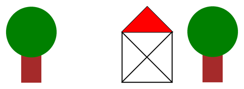

# Funktionen ohne Parameter

## Aufgabe 1: Ein Dorf entsteht

Das folgende Beispiel liefert das darunter abgebildete Bild.



:::snippet{#aufgabe}
a) Analysiere zunächst das Beispiel, um zu verstehen, wie es aufgebaut ist. Notiere Fragen, wenn etwas unklar bleibt.

b) Modifiziere das Beispiel so, dass noch ein **zweites Haus** gezeichnet wird.

c) Modifiziere es nun so, dass die Baumkronen dunkler gefärbt sind (`darkgreen`).

d) Erläutere Vorteile, die dir bei der Verwendung von Funktionen auffallen.
:::

:::pyide{canvas height="600px"}

```python
from turtle import *
shape("turtle")
screensize(800, 400)
speed(0)


# Funktion für den Baum
def baum():
    pensize(40)
    pencolor("brown")
    pendown()
    forward(100)
    pencolor("green")
    dot(100)
    penup()
    backward(100)


# Funktion für das Haus
def haus():
    pensize(2)
    pencolor("black")
    pendown()
    forward(100)
    right(90)
    fillcolor("red")
    begin_fill()
    forward(100)
    left(135)
    forward(71)
    left(90)
    forward(71)
    end_fill()
    left(90)
    forward(141)
    left(135)
    forward(100)
    left(135)
    forward(141)
    left(135)
    forward(100)
    penup()
    backward(100)
    left(90)


# Funktion für den Abstand
def abstand():
    right(90)
    forward(180)
    left(90)


# Hauptprogramm
penup()
goto(-320, -150)
left(90)

baum()
abstand()
haus()
abstand()
baum()
```

:::

:::snippet{#merken}
- Mit `def name():` **definierst** du eine Funktion. Das ist wie ein Eintrag im Wörterbuch: Du legst fest, was der Name bedeutet.
- Der Rumpf der Funktion ist wieder **eingerückt** – genau wie bei Schleifen und Verzweigungen.
- Beim Definieren passiert noch **gar nichts**. Erst der **Aufruf** `name()` führt den Rumpf aus.
- Funktionen müssen **vor** dem Hauptprogramm definiert werden.
- Der Klammern-Paar `()` gehört immer dazu – sowohl bei der Definition als auch beim Aufruf.
:::

::::collapsible{title="Tipp zu b): Wo muss ich etwas ändern?"}

Du musst die Funktion `haus` **nicht** anfassen. Es genügt, im Hauptprogramm unten weitere Aufrufe zu ergänzen – zum Beispiel:

```python
baum()
abstand()
haus()
abstand()
haus()
abstand()
baum()
```

Vergrößere gegebenenfalls die Zeichenfläche mit `screensize`.

::::

::::collapsible{title="Tipp zu c): Nur eine Zeile"}

Die Baumkrone wird in der Funktion `baum` gezeichnet. Ändere dort `pencolor("green")` zu `pencolor("darkgreen")`.

Beachte: Du änderst **eine** Zeile – und **beide** Bäume werden dunkler. Genau darum geht es bei Funktionen.

::::

## Warum Funktionen?

:::snippet{#brain}
Drei Gründe sprechen für Funktionen:

1. **Weniger Wiederholung.** Der Code für den Baum steht nur einmal da, wird aber zweimal verwendet.
2. **Änderungen an einer Stelle.** Wird die Krone dunkler, gilt das automatisch für alle Bäume.
3. **Lesbarkeit.** Das Hauptprogramm liest sich fast wie ein Text: Baum, Abstand, Haus, Abstand, Baum. Man muss nicht wissen, *wie* ein Haus gezeichnet wird, um zu verstehen, *was* passiert.

Diesen dritten Punkt nennt man **Abstraktion**. Er ist einer der wichtigsten Gedanken der ganzen Informatik.
:::

## Aufgabe 2: Eine eigene Funktion

:::snippet{#aufgabe}
Entwickle eine weitere Funktion zum Zeichnen einer **Wolke** und verwende sie im Hauptprogramm.

Beachte dabei die Regel: Funktionen werden vor dem Hauptprogramm festgelegt.
:::

:::pyide{canvas height="600px"}

```python
from turtle import *
shape("turtle")
screensize(800, 400)
speed(0)


def wolke():
    # Dein Code hier
    pass


# Hauptprogramm
penup()
goto(-200, 100)

wolke()
```

:::

::::collapsible{title="Tipp 1: Woraus besteht eine Wolke?"}

Am einfachsten ist eine Wolke aus mehreren überlappenden weißen oder grauen Punkten unterschiedlicher Größe.

::::

::::collapsible{title="Tipp 2: Wichtige Regel für Funktionen"}

Achte darauf, dass die Turtle am **Ende** deiner Funktion wieder dort steht, wo sie am Anfang war – und in dieselbe Richtung schaut.

Sonst verschiebt jeder Aufruf alles Nachfolgende. Sieh dir an, wie die Funktion `baum` das mit `backward(100)` löst.

::::

::::collapsible{title="Tipp 3: Was bedeutet pass?"}

`pass` heißt „hier passiert nichts". Python verlangt nach einem Doppelpunkt immer mindestens eine eingerückte Zeile – `pass` ist ein Platzhalter dafür.

Sobald du eigenen Code einfügst, kannst du `pass` löschen.

::::

## Aufgabe 3: Ein ganzes Bild

:::snippet{#aufgabe}
Baue nun ein eigenes Bild aus mindestens **vier verschiedenen Funktionen** zusammen.

Ideen: Sonne, Blume, Zaun, Auto, Straße, Berg, Vogel, Teich …

Achte darauf, dass sich alle Funktionen an die Regel aus Tipp 2 halten.
:::

:::pyide{canvas height="600px"}

```python
from turtle import *
shape("turtle")
screensize(800, 500)
speed(0)


# Deine Funktionen hier


# Hauptprogramm
penup()
goto(-350, -200)
```

:::

---

## Selbsttest

::::multievent

**1. Mit welchem Schlüsselwort definiert man eine Funktion?**

{r1{!def}}

{r1{function}}

{r1{define}}

{r1{func}}

{h{Es ist die Abkürzung des englischen Wortes für „definieren".}}
{H{Richtig!}}

**2. Was passiert, wenn eine Funktion nur definiert, aber nie aufgerufen wird?**

{r2{Sie wird trotzdem einmal ausgeführt}}

{r2{!Es passiert gar nichts}}

{r2{Python meldet einen Fehler}}

{h{Die Definition legt nur fest, was der Name bedeutet.}}
{H{Richtig! Erst der Aufruf führt den Rumpf aus.}}

**3. Wie ruft man eine Funktion namens baum auf?**

{r3{call baum}}

{r3{!baum()}}

{r3{def baum()}}

{r3{run baum}}

{h{Die Klammern gehören immer dazu.}}
{H{Richtig!}}

**4. Welche Vorteile haben Funktionen?** (Mehrfachauswahl)

{c1{!Wiederholungen im Code werden vermieden}}

{c1{!Änderungen müssen nur an einer Stelle gemacht werden}}

{c1{!Das Hauptprogramm wird lesbarer}}

{c1{Das Programm rechnet genauer}}

{h{Drei der vier Aussagen hast du in dieser Lektion selbst erlebt.}}
{H{Richtig!}}

**5. Warum sollte die Turtle am Ende einer Zeichenfunktion wieder am Ausgangspunkt stehen?**

{r4{Weil Python das verlangt}}

{r4{!Damit sich die Aufrufe nicht gegenseitig verschieben}}

{r4{Damit die Zeichnung schneller wird}}

{h{Überlege, was passiert, wenn du die Funktion zweimal hintereinander aufrufst.}}
{H{Richtig! Nur so kann man Funktionen beliebig kombinieren.}}

**6. Wo müssen Funktionsdefinitionen stehen?**

{r5{Am Ende des Programms}}

{r5{!Vor dem Hauptprogramm}}

{r5{Das ist völlig egal}}

{h{Python liest das Programm von oben nach unten.}}
{H{Richtig! Beim Aufruf muss der Name schon bekannt sein.}}

::::
