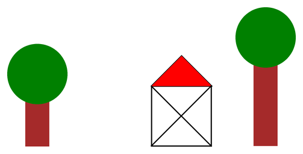

# Funktionen mit Parametern

Deine Funktion `baum` zeichnet bisher immer **genau denselben** Baum. Schöner wäre es, wenn man beim Aufruf sagen könnte, wie hoch er sein soll.

Genau das leisten **Parameter**.

## Aufgabe 1: Der Baum bekommt eine Höhe

:::snippet{#aufgabe}
a) Analysiere zunächst das folgende Beispiel und erläutere die Neuerungen gegenüber der letzten Lektion.

b) Modifiziere das Beispiel so, dass auch die anderen Funktionen – einschließlich deiner eigenen – jeweils einen Parameter verwenden.
:::



:::pyide{canvas height="600px"}

```python
from turtle import *
shape("turtle")
screensize(860, 500)
speed(0)


# Funktion für den Baum - jetzt mit Parameter
def baum(hoehe):
    pensize(40)
    pencolor("brown")
    pendown()
    forward(hoehe)
    pencolor("green")
    dot(100)
    penup()
    backward(hoehe)


def haus():
    pensize(2)
    pencolor("black")
    pendown()
    forward(100)
    right(90)
    fillcolor("red")
    begin_fill()
    forward(100)
    left(135)
    forward(71)
    left(90)
    forward(71)
    end_fill()
    left(90)
    forward(141)
    left(135)
    forward(100)
    left(135)
    forward(141)
    left(135)
    forward(100)
    penup()
    backward(100)
    left(90)


def abstand():
    right(90)
    forward(190)
    left(90)


# Hauptprogramm
penup()
goto(-350, -200)
left(90)

baum(120)
abstand()
haus()
abstand()
baum(180)
```

:::

:::snippet{#merken}
- Ein **Parameter** ist eine Variable, die beim Aufruf einen Wert bekommt: `def baum(hoehe):`
- Der Wert, den du beim Aufruf einsetzt, heißt **Argument**: `baum(120)`
- Innerhalb der Funktion verwendest du den Parameter wie jede andere Variable.
- Eine Funktion kann **mehrere** Parameter haben. Sie werden durch Kommas getrennt: `def baum(hoehe, farbe):`
- Beim Aufruf zählt die **Reihenfolge**: Das erste Argument landet im ersten Parameter.
:::

::::collapsible{title="Tipp zu b): Was bietet sich an?"}

Sinnvolle Parameter wären:

- `haus(breite)` – ein Haus in wählbarer Größe,
- `abstand(weite)` – ein wählbarer Abstand,
- `wolke(groesse)` – eine wählbare Wolkengröße.

Achte bei `haus` darauf, dass die schrägen Strecken mitwachsen müssen. Für die Diagonale gilt etwa `breite * 1.41`, für die Dachschenkel `breite * 0.71`.

::::

## Aufgabe 2: Mehrere Parameter

:::snippet{#aufgabe}
Erweitere die Funktion `baum` so, dass man **zwei** Dinge angeben kann: die Höhe des Stamms und die Farbe der Krone.

Zeichne damit eine Baumreihe aus mindestens fünf verschiedenen Bäumen.
:::

:::pyide{canvas height="600px"}

```python
from turtle import *
shape("turtle")
screensize(800, 400)
speed(0)


def baum(hoehe, kronenfarbe):
    # Dein Code hier
    pass


# Hauptprogramm
penup()
goto(-330, -150)
left(90)

baum(100, "green")
```

:::

:::protect{password="turtle-4-2-1" description="Lösung. Erfrage das Passwort bei deiner Lehrkraft."}

```python
from turtle import *
shape("turtle")
screensize(800, 400)
speed(0)


def baum(hoehe, kronenfarbe):
    pensize(30)
    pencolor("brown")
    pendown()
    forward(hoehe)
    pencolor(kronenfarbe)
    dot(70)
    penup()
    backward(hoehe)


def abstand(weite):
    right(90)
    forward(weite)
    left(90)


# Hauptprogramm
penup()
goto(-330, -150)
left(90)

baum(60, "green")
abstand(130)
baum(120, "darkgreen")
abstand(130)
baum(90, "orange")
abstand(130)
baum(140, "green")
abstand(130)
baum(70, "red")
```

:::

## Aufgabe 3: Bekannte Funktionen einordnen

:::snippet{#aufgabe}
Ohne die Fachbegriffe zu verwenden, hast du längst Funktionen **mit** und **ohne** Parameter benutzt.

Nenne für beides jeweils mindestens drei Beispiele aus den bisherigen Lektionen.
:::

::textinput{placeholder="Mit Parameter: ... / Ohne Parameter: ..."}

::::collapsible{title="Auflösung"}

**Mit Parameter:** `forward(100)`, `right(90)`, `dot(20)`, `pencolor("red")`, `pensize(10)`, `goto(0, 0)`, `print(x)`, `range(4)`

**Ohne Parameter:** `penup()`, `pendown()`, `begin_fill()`, `end_fill()`, `home()`, `hideturtle()`

Bei `goto(0, 0)` sind es sogar zwei Parameter, bei `screensize(400, 300)` ebenfalls.

::::

## Aufgabe 4: Ein Vieleck als Funktion

:::snippet{#aufgabe}
Schreibe eine Funktion `vieleck(ecken, seite)`, die ein regelmäßiges Vieleck mit der angegebenen Eckenzahl und Seitenlänge zeichnet.

Zeichne damit anschließend ein Dreieck, ein Sechseck und ein Zwölfeck an verschiedenen Stellen.
:::

:::pyide{canvas height="600px"}

```python
from turtle import *
shape("turtle")
screensize(600, 400)
speed(0)


def vieleck(ecken, seite):
    # Dein Code hier
    pass


# Hauptprogramm
penup()
goto(-200, 0)
pendown()
vieleck(3, 60)
```

:::

::::collapsible{title="Tipp"}

Den Kern kennst du schon aus Kapitel 1 – jetzt stehen statt fester Zahlen die Parameter darin:

```python
def vieleck(ecken, seite):
    winkel = 360 / ecken
    for i in range(ecken):
        forward(seite)
        left(winkel)
```

::::

:::protect{password="turtle-4-2-2" description="Lösung. Erfrage das Passwort bei deiner Lehrkraft."}

```python
from turtle import *
shape("turtle")
screensize(600, 400)
speed(0)


def vieleck(ecken, seite):
    winkel = 360 / ecken
    for i in range(ecken):
        forward(seite)
        left(winkel)


# Hauptprogramm
penup()
goto(-220, -50)
pendown()
vieleck(3, 60)

penup()
goto(-40, -50)
pendown()
vieleck(6, 50)

penup()
goto(140, -50)
pendown()
vieleck(12, 30)
```

:::

---

## Selbsttest

::::multievent

**1. Wie heißt die Variable in der Klammer der Funktionsdefinition?**

{r1{Argument}}

{r1{!Parameter}}

{r1{Rückgabewert}}

{h{Der andere Begriff bezeichnet den Wert, den man beim Aufruf einsetzt.}}
{H{Richtig! In der Definition steht der Parameter, beim Aufruf das Argument.}}

**2. Wie viele Parameter hat die Funktion aus der Definition def baum(hoehe, farbe):?**

{z{2}}

{h{Zähle die durch Komma getrennten Namen in der Klammer.}}
{H{Richtig!}}

**3. Was passiert bei baum(120)? Die Definition lautet def baum(hoehe):**

{r2{Es wird eine Variable namens 120 angelegt}}

{r2{!Der Parameter hoehe erhält den Wert 120}}

{r2{Die Funktion wird 120 mal ausgeführt}}

{h{Das Argument wird in den Parameter hineingegeben.}}
{H{Richtig!}}

**4. Was gilt beim Aufruf einer Funktion mit mehreren Parametern?**

{r3{Die Reihenfolge der Argumente ist egal}}

{r3{!Das erste Argument landet im ersten Parameter}}

{r3{Es dürfen höchstens zwei Argumente sein}}

{h{Woher soll Python sonst wissen, welcher Wert wohin gehört?}}
{H{Richtig! Die Reihenfolge entscheidet.}}

**5. Welche der bekannten Funktionen haben Parameter?** (Mehrfachauswahl)

{c1{!forward}}

{c1{!dot}}

{c1{penup}}

{c1{!pencolor}}

{c1{begin_fill}}

{h{Bei welchen musst du beim Aufruf einen Wert in die Klammern schreiben?}}
{H{Richtig!}}

::::
