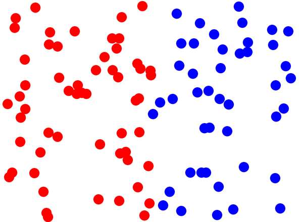
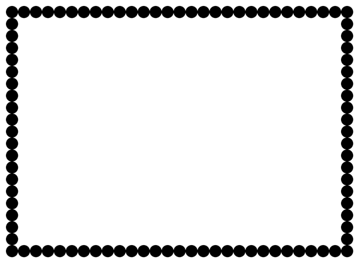

# Funktionen mit Rückgabewert

Bisher haben deine Funktionen etwas **getan**: gezeichnet, ausgegeben, die Turtle bewegt.

Es gibt aber auch Funktionen, die etwas **zurückliefern** – ein Ergebnis, mit dem du weiterarbeiten kannst.

## Funktionen der Turtle, die etwas zurückgeben

:::snippet{#merken}
| Funktion | liefert zurück |
| --- | --- |
| `xcor()` | die aktuelle x-Koordinate der Turtle |
| `ycor()` | die aktuelle y-Koordinate der Turtle |
| `heading()` | die aktuelle Blickrichtung in Grad |
| `position()` | beide Koordinaten als Paar |
| `towards(x, y)` | den Winkel von der Turtle zum Punkt (x \| y) |

Diese Werte kannst du in Variablen speichern, ausgeben oder in Bedingungen verwenden.
:::

## Aufgabe 1: Die Position abfragen

:::snippet{#aufgabe}
a) Analysiere das folgende Beispiel und erläutere die Neuerungen.

b) Erweitere es schrittweise so, dass die Punkte in der oberen und in der unteren Bildschirmhälfte unterschiedliche **Größen** bekommen. Verwende dazu `ycor()`.
:::

:::pyide{canvas}

```python
from turtle import *
shape("turtle")
screensize(600, 300)

penup()
goto(-100, 0)

for i in range(10):
    if xcor() < 0:
        pencolor("red")
    else:
        pencolor("blue")

    dot(20)
    forward(20)
```

:::


::::collapsible{title="Tipp: Was ist hier neu?"}

Neu ist, dass die Bedingung nicht mehr von der Zählvariablen abhängt, sondern von der **tatsächlichen Position** der Turtle.

Das ist ein wichtiger Unterschied: Das Programm funktioniert auch dann noch richtig, wenn du den Startpunkt oder die Schrittweite änderst. Probiere es aus!

::::

## Aufgabe 2: Zufällige Sprünge

Für die nächsten Aufgaben brauchst du Zufallszahlen:

:::snippet{#merken}
```python
from random import randint

zahl = randint(1, 100)   # eine zufällige ganze Zahl von 1 bis 100
```

- Die Zeile `from random import randint` gehört an den Anfang des Programms – so wie `from turtle import *`.
- `randint(a, b)` liefert eine zufällige ganze Zahl zwischen `a` und `b`. **Beide Grenzen sind eingeschlossen.**
:::

:::snippet{#aufgabe}
Die Turtle soll **100 mal** an eine zufällige Position springen. Befindet sie sich in der linken Hälfte des Fensters, soll sie einen roten Punkt zeichnen, sonst einen blauen.

Entwickle ein geeignetes Programm.
:::



:::pyide{canvas height="600px"}

```python
from turtle import *
from random import randint

shape("turtle")
screensize(600, 440)
speed(0)
penup()

# Dein Code hier
```

:::

::::collapsible{title="Tipp 1: Wie springt die Turtle zufällig?"}

Erzeuge zwei Zufallszahlen und gehe damit zu einem Punkt:

```python
goto(randint(-290, 290), randint(-210, 210))
```

Die Grenzen ergeben sich aus der Größe der Zeichenfläche: Bei `screensize(600, 440)` reicht sie von -300 bis 300 und von -220 bis 220.

::::

::::collapsible{title="Tipp 2: Welche Hälfte?"}

Da der Ursprung in der Mitte liegt, gilt: Alles mit `xcor() < 0` liegt in der linken Hälfte.

::::

:::protect{password="turtle-4-3-1" description="Lösung. Erfrage das Passwort bei deiner Lehrkraft."}

```python
from turtle import *
from random import randint

shape("turtle")
screensize(600, 440)
speed(0)
penup()

for i in range(100):
    goto(randint(-290, 290), randint(-210, 210))

    if xcor() < 0:
        pencolor("red")
    else:
        pencolor("blue")

    dot(20)
```

:::

## Aufgabe 3: Den Rand schmücken

:::snippet{#aufgabe}
Die Turtle soll den **Rand des Fensters** mit Punkten schmücken, wie unten zu sehen.

Entwickle ein geeignetes Programm. Nutze dabei `xcor()` und `ycor()` in den Schleifenbedingungen.
:::



:::pyide{canvas height="600px"}

```python
from turtle import *
shape("turtle")
screensize(600, 440)
speed(0)

penup()
goto(-280, -200)

# Dein Code hier
```

:::

::::collapsible{title="Tipp 1: Vier Seiten, vier Schleifen"}

Für jede Seite des Rahmens brauchst du eine eigene `while`-Schleife. Die untere Kante zum Beispiel:

```python
while xcor() < 280:
    dot(20)
    forward(20)
```

Danach dreht sich die Turtle mit `left(90)` und die nächste Schleife beginnt.

::::

::::collapsible{title="Tipp 2: Achte auf die Vergleichsrichtung"}

Läuft die Turtle nach **rechts**, wird `xcor()` größer – die Bedingung lautet `< 280`.

Läuft sie nach **links**, wird `xcor()` kleiner – dann brauchst du `> -280`.

::::

:::protect{password="turtle-4-3-2" description="Lösung. Erfrage das Passwort bei deiner Lehrkraft."}

```python
from turtle import *
shape("turtle")
screensize(600, 440)
speed(0)

penup()
goto(-280, -200)

while xcor() < 280:
    dot(20)
    forward(20)

left(90)
while ycor() < 200:
    dot(20)
    forward(20)

left(90)
while xcor() > -280:
    dot(20)
    forward(20)

left(90)
while ycor() > -200:
    dot(20)
    forward(20)
```

:::

## Eigene Funktionen mit Rückgabewert

Jetzt schreiben wir selbst eine Funktion, die ein Ergebnis zurückgibt.

:::snippet{#aufgabe}
Analysiere das folgende Beispiel. Notiere Fragen, wenn etwas unklar bleibt.
:::

:::pyide

```python
def fakultaet(zahl):
    zaehler = 1
    ergebnis = 1
    while zaehler <= zahl:
        ergebnis = ergebnis * zaehler
        zaehler = zaehler + 1
    return ergebnis


erstes_ergebnis = fakultaet(5)
print(erstes_ergebnis)

print(fakultaet(4))
```

:::

:::snippet{#merken}
- `return wert` beendet die Funktion **sofort** und gibt `wert` zurück.
- Der Aufruf `fakultaet(5)` steht dann für das Ergebnis – du kannst ihn speichern, ausgeben oder weiterverwenden.
- Eine Funktion ohne `return` gibt automatisch `None` zurück („nichts").
- Verwechsle nicht `return` und `print`: `print` zeigt etwas **an**, `return` gibt etwas **weiter**. Nur mit `return` kann man mit dem Ergebnis weiterrechnen.
:::

## Aufgabe 4: Die Summe

:::snippet{#aufgabe}
Entwickle eine Funktion `summe(zahl)`, die die Summe der natürlichen Zahlen von 1 bis `zahl` berechnet und als Rückgabewert zurückgibt.

Zur Kontrolle: `summe(10)` soll das Ergebnis 55 liefern.

**Tipp:** Klicke auf den Testen-Knopf, um deine Lösung automatisch überprüfen zu lassen.
:::

:::pyide

```python
def summe(zahl):
    # Dein Code hier
    return 0
```

```python test
#SCRIPT#
if summe(10) == 55:
    print("Bestanden: summe(10) ist 55")
else:
    print("Nicht bestanden: summe(10) ergibt", summe(10), "statt 55")
```

```python test
#SCRIPT#
if summe(1) == 1:
    print("Bestanden: summe(1) ist 1")
else:
    print("Nicht bestanden: summe(1) ergibt", summe(1), "statt 1")
```

```python test
#SCRIPT#
if summe(100) == 5050:
    print("Bestanden: summe(100) ist 5050")
else:
    print("Nicht bestanden: summe(100) ergibt", summe(100), "statt 5050")
```

:::

::::collapsible{title="Tipp 1: Der Aufbau"}

Die Funktion `fakultaet` ist fast dieselbe Aufgabe – nur wird dort multipliziert statt addiert.

Überlege außerdem: Womit muss das Ergebnis am Anfang belegt sein, wenn addiert wird? Bei der Multiplikation war es die 1.

::::

::::collapsible{title="Tipp 2: Mit einer for-Schleife"}

Statt einer `while`-Schleife geht es auch kürzer. Beachte, dass `range(1, zahl + 1)` die Zahlen von 1 bis `zahl` liefert:

```python
for i in range(1, zahl + 1):
    ergebnis = ergebnis + i
```

::::

:::protect{password="turtle-4-3-3" description="Lösung. Erfrage das Passwort bei deiner Lehrkraft."}

```python
def summe(zahl):
    ergebnis = 0
    for i in range(1, zahl + 1):
        ergebnis = ergebnis + i
    return ergebnis
```

:::

## Aufgabe 5: Gerade oder ungerade?

:::snippet{#aufgabe}
Entwickle eine Funktion `ist_gerade(zahl)`, die `True` zurückgibt, falls `zahl` gerade ist, und andernfalls `False`.

Lass deine Lösung wieder automatisch testen.
:::

:::pyide

```python
def ist_gerade(zahl):
    # Dein Code hier
    return False
```

```python test
#SCRIPT#
if ist_gerade(4) == True:
    print("Bestanden: 4 ist gerade")
else:
    print("Nicht bestanden: 4 sollte als gerade erkannt werden")
```

```python test
#SCRIPT#
if ist_gerade(7) == False:
    print("Bestanden: 7 ist ungerade")
else:
    print("Nicht bestanden: 7 sollte als ungerade erkannt werden")
```

```python test
#SCRIPT#
if ist_gerade(0) == True:
    print("Bestanden: 0 ist gerade")
else:
    print("Nicht bestanden: 0 sollte als gerade erkannt werden")
```

:::

::::collapsible{title="Tipp 1: Woran erkennt man gerade Zahlen?"}

Das kennst du schon aus der Lektion über Verzweigungen: Eine Zahl ist gerade, wenn der Rest bei der Division durch 2 gleich 0 ist.

::::

::::collapsible{title="Tipp 2: Es geht auch ohne if"}

Ein Vergleich liefert selbst schon `True` oder `False`. Du kannst ihn also direkt zurückgeben:

```python
return zahl % 2 == 0
```

::::

:::protect{password="turtle-4-3-4" description="Lösung. Erfrage das Passwort bei deiner Lehrkraft."}

```python
def ist_gerade(zahl):
    return zahl % 2 == 0
```

Ausführlicher, aber gleichwertig:

```python
def ist_gerade(zahl):
    if zahl % 2 == 0:
        return True
    else:
        return False
```

:::

## Zusatzaufgabe

:::snippet{#aufgabe}
Entwickle analog zu Aufgabe 2 weitere Muster, die durch zufällige Sprünge langsam entstehen.

Zum Beispiel:

- ein gefülltes Rechteck in der Mitte des Bildschirms,
- ein Kreis (das ist besonders anspruchsvoll),
- ein Muster deiner Wahl.
:::

:::pyide{canvas height="600px"}

```python
from turtle import *
from random import randint

shape("turtle")
screensize(600, 440)
speed(0)
penup()

# Dein Code hier
```

:::

::::collapsible{title="Tipp für den Kreis"}

Ein Punkt (x | y) liegt genau dann innerhalb eines Kreises um den Ursprung mit Radius `r`, wenn gilt:

$$x^2 + y^2 < r^2$$

In Python:

```python
if xcor() ** 2 + ycor() ** 2 < 150 ** 2:
    pencolor("red")
else:
    pencolor("lightgray")
```

::::

---

## Selbsttest

::::multievent

**1. Was bewirkt return?**

{r1{Es gibt einen Wert auf dem Bildschirm aus}}

{r1{!Es beendet die Funktion und gibt einen Wert zurück}}

{r1{Es springt an den Anfang der Funktion}}

{h{Vergleiche es mit print – was ist der Unterschied?}}
{H{Richtig! print zeigt an, return gibt weiter.}}

**2. Was liefert xcor() zurück?**

{r2{Die Blickrichtung der Turtle}}

{r2{!Die x-Koordinate der Turtle}}

{r2{Die Breite der Zeichenfläche}}

{h{Das cor steht für coordinate.}}
{H{Richtig!}}

**3. Wie viele verschiedene Werte kann randint(1, 6) liefern?**

{z{6}}

{h{Achtung: Beide Grenzen sind eingeschlossen.}}
{H{Richtig! Die Zahlen 1, 2, 3, 4, 5 und 6 – wie bei einem Würfel.}}

**4. Was gibt eine Funktion ohne return zurück?**

{r3{Eine Null}}

{r3{!None, also nichts}}

{r3{Den letzten berechneten Wert}}

{h{Python hat dafür einen eigenen Wert.}}
{H{Richtig!}}

**5. Welche Zeile ist eine korrekte, kurze Lösung für „ist die Zahl gerade?"**

{r4{return zahl % 2}}

{r4{!return zahl % 2 == 0}}

{r4{return zahl / 2 == 0}}

{h{Das Ergebnis soll ein Wahrheitswert sein – es muss also ein Vergleich darin vorkommen.}}
{H{Richtig! Der Vergleich liefert direkt True oder False.}}

**6. Warum ist die Bedingung xcor() kleiner als 0 robuster als eine Bedingung mit der Zählvariablen?**

{r5{Weil sie kürzer ist}}

{r5{!Weil sie auch bei anderem Startpunkt oder anderer Schrittweite noch stimmt}}

{r5{Weil Zählvariablen in Python verboten sind}}

{h{Was passiert, wenn du den Startpunkt der Turtle veränderst?}}
{H{Genau! Die Abfrage der echten Position passt sich automatisch an.}}

::::
