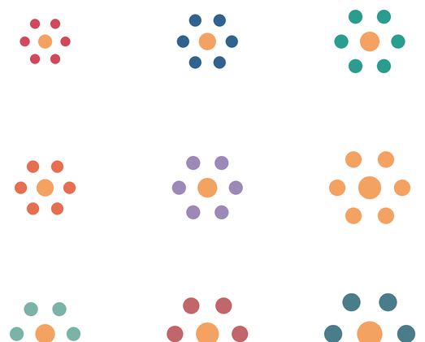
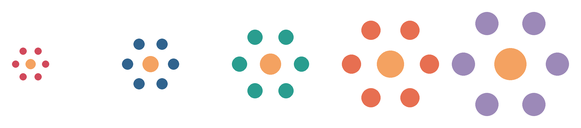
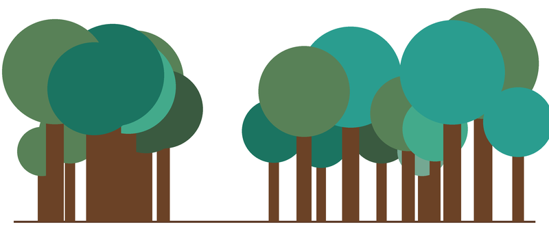
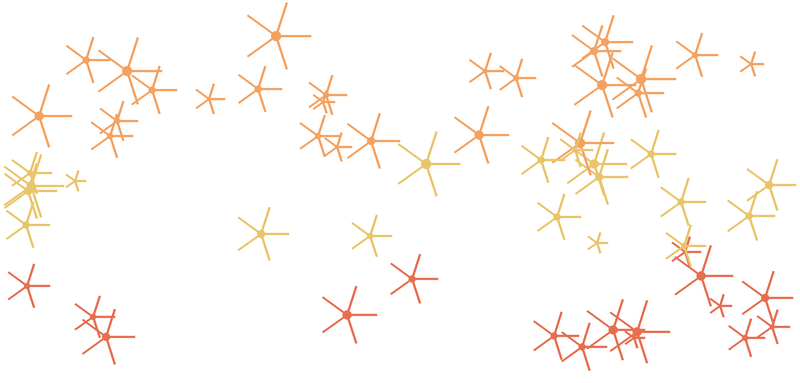
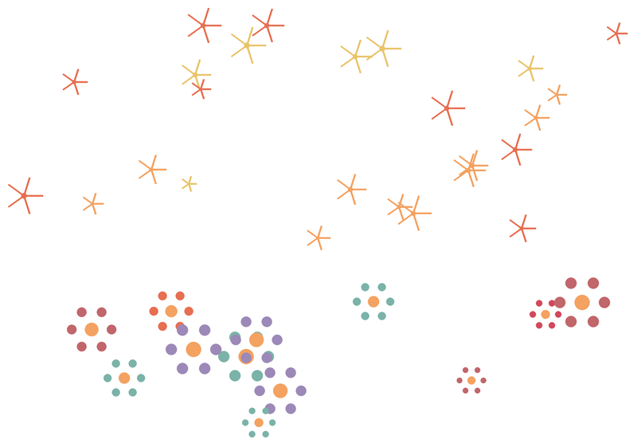

# Challenge: Kunst aus Funktionen

In den bisherigen Challenges war das Bild ein Raster aus Punkten. Jetzt kommt ein neues Werkzeug dazu: die **Funktion**. Du definierst ein **Motiv** -- eine Blume, einen Stern, einen Baum -- und stempelst es beliebig oft, mit beliebigen Parametern, an beliebige Orte.

Diese Seite ist ein **Zusatzangebot**. Du brauchst sie nicht, um im Lernpfad weiterzukommen. Aber wenn du Lust hast, das Gelernte einmal ohne Zielvorgabe zu benutzen, bist du hier richtig.

## Was generative Kunst mit Funktionen ist

:::snippet{#merken}
Bei **generativer Kunst** zeichnest du das Bild nicht selbst. Du schreibst eine **Regel** auf – und das Bild entsteht daraus von allein.

Die drei Zutaten aus den vorigen Kapiteln kennst du: Schleifen, Bedingungen, Variablen. Jetzt kommt eine vierte dazu:

- **Motiv** – eine Funktion, die etwas zeichnet: `blume(groesse, farbe)`
- **Variation** – beim Aufruf steckst du jedes Mal andere Parameter hinein: `blume(20, "red")`, `blume(35, "blue")` – dieselbe Funktion, ein anderes Bild
- **Zufall** – `randint` liefert unvorhersehbare Werte, und das Bild wirkt plötzlich organisch

Das Erstaunliche daran: Du schreibst die Funktion **einmal** – und benutzt sie hundertmal. Was herauskommt, sieht nie so aus, als wäre es von einem einzigen Programm gezeichnet worden.
:::

## So arbeitest du mit einer Challenge

:::snippet{#challenge}
Eine Challenge ist keine normale Aufgabe:

- Es gibt **kein Zielbild**, das du treffen musst. Die Bilder hier sind Beispiele, keine Vorlagen.
- Es gibt **keine Lösung** zum Nachschlagen. Es gibt nur deine eigenen Bilder.
- Dafür gibt es eine **Regel**, an die du dich halten solltest. Genau die Einschränkung macht es interessant.

Fertig bist du, wenn du ein Bild hast, das du jemandem zeigen willst.
:::

:::snippet{#merken}
**Mach dir Platz.** Deine Bilder sind größer als die schmale Vorschau neben dem Editor. Drei Handgriffe helfen:

- Zieh die **Trennlinie** zwischen der Zeichenfläche und dem Editor nach rechts – die Zeichenfläche wird breiter.
- Zieh ihre **untere Kante** nach unten – sie wird höher.
- Der **Vollbild-Knopf** unten rechts an der Editorleiste gibt dir den ganzen Bildschirm.

Bei einem Bild, das du wirklich anschauen willst, lohnt sich das.
:::

## Das Prinzip: Motiv, Parameter, Zufall

:::snippet{#brain}
Drei Hebel hast du, und sie wirken ganz unterschiedlich:

**Der Parameter.** Er ist dein direktester Regler. `blume(20, "red")` zeichnet eine kleine rote Blume, `blume(40, "blue")` eine große blaue. Verändere immer nur **einen** Parameter und schau, was passiert.

**Der Zufall.** `randint(a, b)` liefert bei jedem Aufruf eine andere Zahl. Statt selbst zu entscheiden, wo jeder Baum steht und wie hoch er wird, überlässt du es dem Zufall – und das Ergebnis wirkt lebendiger als jedes von Hand arrangierte Bild.

**Die Position.** Mit `xcor()` und `ycor()` kann deine Funktion auf ihre eigene Position reagieren: Sterne oben werden gelb, unten werden sie rot. So entsteht ein Bild, das nicht zufällig aussieht, sondern **gewachsen**.
:::

## Challenge 1: Der parametrisierte Stempel

Eine Funktion ist wie ein Stempel: Du schnitzt ihn einmal und stempelst ihn so oft du willst. Die Blume unten besteht aus sieben Zeilen Code – ein Mittelpunkt und sechs Blütenblätter. Mit zwei Parametern steuerst du Größe und Farbe.

| Blumenwiese | In einer Reihe |
| --- | --- |
|  |  |
| `groesse` und `farbe` variiert | Nur `groesse` variiert |

Alle Blumen stammen von **derselben** Funktion. Verändert wurden nur die Argumente beim Aufruf.

:::snippet{#challenge}
**Die Regel:** Du darfst die Funktion verändern und neue Aufrufe hinzufügen, aber es darf **eine** Funktion bleiben, die gestempelt wird.

a) Bring das Programm zum Laufen und schau dir an, was es zeichnet.

b) Verändere die Blumengröße: Was passiert, wenn du `groesse` in jedem Aufruf verdoppelst? Was, wenn du es halbierst?

c) Erfinde ein **eigenes Motiv**: ein Sechseck, eine Spirale, ein Dreieck mit Punkt – irgendetwas, das sich aus einer Funktion heraus zeichnen lässt. Tausche den Rumpf von `blume` aus und benutze deine Funktion mit verschiedenen Parametern.

d) Stemple das Motiv nicht in ein Raster, sondern in einer **Reihe**, einer **Diagonale** oder an **zufälligen** Positionen.
:::

:::pyide{canvas height="650px"}

```python
from turtle import *

shape("turtle")
screensize(700, 500)
speed(0)
hideturtle()
penup()

# --- Die Funktion ---
def blume(groesse, farbe):
    penup()
    pencolor(farbe)
    for i in range(6):
        setheading(i * 60)
        forward(groesse)
        dot(groesse * 0.5)
        backward(groesse)
    pencolor("gold")
    dot(groesse * 0.7)

# --- Die Regler ---
ANZAHL = 3
ABSTAND = 200

# --- Die Regel ---
farben = ["#d1495b", "#30638e", "#2a9d8f",
          "#e76f51", "#9c89b8", "#f4a261",
          "#7bb3a8", "#c1666b", "#4a7c8a"]

for zeile in range(ANZAHL):
    for spalte in range(ANZAHL):
        goto(-200 + spalte * ABSTAND, 120 - zeile * ABSTAND)
        blume(25 + (zeile + spalte) * 5, farben[zeile * ANZAHL + spalte])
```

:::

**Mein Forschungsheft**

| Nr. | Motiv | Parameter | So sieht es aus |
| --- | --- | --- | --- |
| 1 | | | |
| 2 | | | |
| 3 | | | |

::::collapsible{title="Tipp 1: Wie funktioniert die Blume?"}

Die Blume besteht aus zwei Teilen:

1. **Sechs Blütenblätter:** Die Turtle dreht sich in 60-Grad-Schritten (`setheading(i * 60)`), läuft nach vorne, zeichnet einen Punkt und läuft zurück. Weil der Stift oben ist, entsteht keine Linie -- nur Punkte.
2. **Ein Mittelpunkt:** Ein goldener Punkt in der Mitte, nachdem alle Blütenblätter gezeichnet sind.

`groesse` steuert, wie weit die Blütenblätter vom Zentrum entfernt sind -- und damit die gesamte Größe der Blume.
::::

::::collapsible{title="Tipp 2: Ein eigenes Motiv zeichnen"}

Alles, was sich mit `forward`, `dot`, `circle` und `setheading` zeichnen lässt, ist ein Motiv. Ein paar Ideen:

```python
def sechseck(groesse, farbe):
    pencolor(farbe)
    pendown()
    for i in range(6):
        forward(groesse)
        left(60)
    penup()

def spirale(groesse, farbe):
    pencolor(farbe)
    pendown()
    laenge = 5
    for i in range(10):
        forward(laenge)
        right(60)
        laenge = laenge + groesse / 5
    penup()
```

Wichtig: Die Turtle sollte am Ende der Funktion wieder dort stehen, wo sie am Anfang war -- und in dieselbe Richtung schauen. Sonst verschiebt sich jeder Stempelabdruck.
::::

::::collapsible{title="Tipp 3: Stempeln an zufälligen Positionen"}

Statt eines Rasters kannst du `randint` benutzen, um Positionen zu wählen:

```python
from random import randint

for i in range(10):
    x = randint(-300, 300)
    y = randint(-200, 200)
    goto(x, y)
    blume(randint(15, 35), farben[i % len(farben)])
```

Jeder Aufruf von `randint` liefert eine andere Zahl -- das Bild sieht jedes Mal anders aus.
::::

## Challenge 2: Der Zufallswald

Ein Wald entsteht nicht durch ein Raster. Jeder Baum ist anders: ein anderer Standort, eine andere Höhe, eine andere Farbe. Mit `randint` überlässt du all das dem Zufall -- und brauchst trotzdem nur **eine** Funktion.



:::snippet{#challenge}
**Die Regel:** Die Baumfunktion darf nicht verändert werden -- nur die Regler und die Schleife.

a) Bring das Programm zum Laufen und beschreibe, was du siehst.

b) Verändere die Grenzen von `randint` für die Höhe: Was passiert, wenn alle Bäume ähnlich hoch sind? Was, wenn die Unterschiede sehr groß sind?

c) Verändere die `ANZAHL` der Bäume. Ab wann wirkt der Wald dicht? Ab wann wirkt er überfüllt?

d) Füge eine **zweite Motivfunktion** hinzu: einen Busch, einen Pilz, einen Stein. Streue sie zwischen die Bäume.
:::

:::pyide{canvas height="650px"}

```python
from turtle import *
from random import randint

shape("turtle")
screensize(800, 500)
speed(0)
hideturtle()
penup()

# --- Die Funktion ---
def baum(hoehe, farbe):
    penup()
    pensize(int(hoehe / 12))
    pencolor("#6b4226")
    pendown()
    forward(hoehe)
    pencolor(farbe)
    dot(hoehe * 0.7)
    penup()
    backward(hoehe)

# --- Die Regler ---
ANZAHL = 18
KRONENFARBEN = ["#2a9d8f", "#1b7461", "#43aa8b", "#588157", "#3a5a40"]

# --- Die Regel ---
for i in range(ANZAHL):
    x = randint(-360, 360)
    hoehe = randint(100, 240)
    farbe = KRONENFARBEN[randint(0, len(KRONENFARBEN) - 1)]
    goto(x, -220)
    setheading(90)
    baum(hoehe, farbe)
```

:::

::::collapsible{title="Tipp 1: Warum wirken zufällige Bäume wie ein Wald?"}

Wenn du alle Bäume gleich hoch machst und in gleichen Abständen platzierst, sieht es aus wie eine **Allee**. Wenn du Höhe und Position dem Zufall überlässt, entsteht **Abwechslung** – und das Auge liest das als „natürlich".

Genau das macht `randint`: Es sorgt dafür, dass kein Baum dem anderen gleicht, ohne dass du jede Position einzeln planen musst.

::::

::::collapsible{title="Tipp 2: Eine zweite Funktion hinzufügen"}

Definiere zum Beispiel einen Busch als weitere Funktion:

```python
def busch(groesse, farbe):
    penup()
    pencolor(farbe)
    dot(groesse)
    forward(groesse * 0.3)
    dot(groesse * 0.7)
    backward(groesse * 0.3)
```

Rufe sie in derselben Schleife auf, aber nur manchmal:

```python
for i in range(ANZAHL):
    x = randint(-360, 360)
    goto(x, -220)
    if randint(0, 2) == 0:
        setheading(90)
        busch(randint(20, 40), "#588157")
    else:
        setheading(90)
        baum(randint(100, 240), KRONENFARBEN[randint(0, 4)])
```

`randint(0, 2) == 0` ist in etwa einem Drittel der Fälle wahr -- so stehen zwischen den Bäumen gelegentlich Büsche.
::::

::::collapsible{title="Tipp 3: Die Bodenlinie zeichnen"}

Die Bodenlinie im Beispielbild entsteht mit `forward`, nicht mit `goto`:

```python
pensize(3)
pencolor("#5a3825")
goto(-380, -220)
pendown()
setheading(0)
forward(760)
penup()
```

Warum nicht `goto`? Weil `goto` mit abgesenktem Stift eine Linie quer durchs Bild zieht, wenn die Turtle nicht schon dort steht. `forward` ist der sichere Weg.
::::

## Challenge 3: Sternenfeld

Sterne sind ein anderes Motiv -- fünf Strahlen von einem Punkt aus. Wenn du sie mit `randint` an zufällige Positionen setzt und die Farbe von der Position abhängig machst, entsteht ein Himmel, der nicht zufällig aussieht, sondern **gestaffelt**.



:::snippet{#challenge}
**Die Regel:** Die Sternfunktion darf nicht verändert werden -- nur die Regler, die Schleife und die Farbedingung.

a) Bring das Programm zum Laufen. Beschreibe die drei Farbzonen.

b) Ersetze die Farbedingung durch `xcor()`: Sterne links werden rot, Sterne rechts werden blau. Wie sieht das Bild jetzt aus?

c) Verändere die Anzahl der Sterne: Was passiert bei 20 Sternen? Was bei 200?

d) **Der Wettbewerb:** Findet eine Farbedingung, die ein Sternenfeld ergibt, das niemand sonst in der Klasse hat.
:::

:::pyide{canvas height="650px"}

```python
from turtle import *
from random import randint

shape("turtle")
screensize(800, 500)
speed(0)
hideturtle()
penup()

# --- Die Funktion ---
def stern(groesse, farbe):
    pensize(2)
    pencolor(farbe)
    pendown()
    for i in range(5):
        setheading(i * 72)
        forward(groesse)
        backward(groesse)
    penup()
    dot(groesse * 0.3)

# --- Die Regler ---
ANZAHL = 60

# --- Die Regel ---
for i in range(ANZAHL):
    x = randint(-380, 380)
    y = randint(-100, 220)
    groesse = randint(10, 35)
    goto(x, y)

    if y > 100:
        farbe = "#f4a261"
    elif y > 0:
        farbe = "#e9c46a"
    else:
        farbe = "#e76f51"

    stern(groesse, farbe)
```

:::

::::collapsible{title="Tipp 1: Wie der Stern funktioniert"}

Fünf Strahlen, die von der Mitte aus nach außen gehen: Die Turtle dreht sich in 72-Grad-Schritten (`360 / 5 = 72`), läuft mit `forward` nach außen und mit `backward` wieder zurück. Weil der Stift unten ist, entsteht eine Linie -- kein Punkt.

Am Schluss kommt ein kleiner Punkt in die Mitte, damit der Stern auch ohne Linie erkennbar ist.

::::

::::collapsible{title="Tipp 2: Die Farbe von der Position abhängig machen"}

`ycor()` liefert die y-Koordinate der Turtle – also wie hoch oder tief sie gerade steht. Mit einer `if`-`elif`-`else`-Verzweigung legst du fest:

```python
if ycor() > 100:
    farbe = "#f4a261"
elif ycor() > 0:
    farbe = "#e9c46a"
else:
    farbe = "#e76f51"
```

Der Vorteil gegenüber `y > 100`: Die Abfrage funktioniert auch dann, wenn du die Grenzen von `randint` veränderst. Die Farbe folgt der **tatsächlichen** Position, nicht der Zufallszahl.

::::

::::collapsible{title="Tipp 3: Sterne und Blumen kombinieren"}

Du kannst zwei Motivfunktionen in einem Programm benutzen. Definiere `stern` und `blume` (aus Challenge 1) und rufe beide auf -- zum Beispiel Sterne oben, Blumen unten:

```python
for i in range(40):
    x = randint(-380, 380)
    y = randint(0, 220)
    goto(x, y)
    stern(randint(10, 25), "#f4a261")

for i in range(10):
    x = randint(-360, 360)
    y = randint(-220, -50)
    goto(x, y)
    blume(randint(20, 35), "#d1495b")
```

So entsteht ein Bild aus **zwei** Funktionen – und genau das ist der Übergang zur Kür.
::::

## Die Kür: Komposition

Ein Bild aus **einem** Motiv ist eine Übung. Ein Bild aus **mehreren** Motiven ist eine Komposition. Du hast jetzt zwei Funktionen -- `blume` und `stern` -- und alles, was du sonst noch erfinden willst. Setz sie zusammen.



:::snippet{#challenge}
Baue eine eigene Komposition. Du brauchst dafür nur Funktionen, `randint`, `goto` und Bedingungen – alles aus diesem Kapitel.

Experimentiere: Was passiert, wenn du **drei** Motive verwendest? Wenn die Motive sich überlappen? Wenn du ein Motiv groß und selten machst, ein anderes klein und häufig?
:::

:::pyide{canvas}

```python
from turtle import *
from random import randint

shape("turtle")
screensize(800, 600)
speed(0)
hideturtle()
penup()

# --- Funktionen ---
def blume(groesse, farbe):
    penup()
    pencolor(farbe)
    for i in range(6):
        setheading(i * 60)
        forward(groesse)
        dot(groesse * 0.5)
        backward(groesse)
    pencolor("gold")
    dot(groesse * 0.7)

def stern(groesse, farbe):
    pensize(2)
    pencolor(farbe)
    pendown()
    for i in range(5):
        setheading(i * 72)
        forward(groesse)
        backward(groesse)
    penup()
    dot(groesse * 0.3)

# --- Regler ---
BLUMENFARBEN = ["#d1495b", "#e76f51", "#9c89b8", "#7bb3a8"]
STERNFARBEN = ["#f4a261", "#e9c46a", "#e76f51"]

# --- Regel ---
# Blumen unten
for i in range(12):
    x = randint(-360, 360)
    y = randint(-250, -50)
    groesse = randint(15, 30)
    farbe = BLUMENFARBEN[randint(0, len(BLUMENFARBEN) - 1)]
    goto(x, y)
    blume(groesse, farbe)

# Sterne oben
for i in range(25):
    x = randint(-380, 380)
    y = randint(0, 270)
    groesse = randint(8, 25)
    farbe = STERNFARBEN[randint(0, len(STERNFARBEN) - 1)]
    goto(x, y)
    stern(groesse, farbe)
```

:::

::::collapsible{title="Tipp 1: Wie eine Komposition entsteht"}

Eine Komposition ist mehr als „viele Motive irgendwo". Sie hat eine **Struktur**:

- **Zonen:** Sterne oben, Blumen unten – getrennt durch die y-Grenze.
- **Dichte:** Wenige große Motive als Akzente, viele kleine als Füllung.
- **Farbfamilie:** Sterne in warmen Tönen (gelb, orange), Blumen in kühlen (rot, blau, grün).

Überlege dir vor dem Programmieren, welche **Rolle** jedes Motiv spielen soll. Dann setzt du die Regler entsprechend.
::::

::::collapsible{title="Tipp 2: Ein drittes Motiv erfinden"}

Ein Kreis ist das einfachste dritte Motiv:

```python
def mond(groesse, farbe):
    pencolor(farbe)
    pendown()
    circle(groesse)
    penup()
```

Oder ein Dreieck, das als Berg funktioniert:

```python
def berg(groesse, farbe):
    pencolor(farbe)
    pensize(2)
    pendown()
    for i in range(3):
        forward(groesse)
        left(120)
    penup()
```

Setze es an eine feste Position – ein Mond oben rechts, eine Bergkette am Horizont – und das Bild bekommt einen **Anker**, um den herum sich Sterne und Blumen verteilen.
::::

::::collapsible{title="Tipp 3: Überlappungen"}

Wenn zwei Motive an derselben Stelle landen, zeichnet das spätere über das frühere. Das ist kein Fehler – es ist ein **Mittel**.

Sterne hinter Blumen sehen aus wie Blütenblätter im Vordergrund. Ein Mond hinter Sternen wirkt weiter entfernt. Reihenfolge und Überlappung sind zwei weitere Regler, die du ohne eine Zeile Code verändern kannst – nur durch die Reihenfolge der Schleifen.
::::

## Deine Serie

:::snippet{#challenge}
Zum Abschluss: Such dir **eine** der Challenges aus und mach daraus eine **Serie**.

1. Stelle die Parameter und Regler so ein, dass **vier** deutlich verschiedene Bilder entstehen.
2. Notiere zu jedem Bild die Parameter und Funktionen – sonst kannst du es nie wieder herstellen.
3. Gib jedem Bild einen **Titel**.
4. Hängt die Serien in der Klasse auf. Könnt ihr bei den Bildern der anderen erraten, welche Funktion dahintersteckt?
:::

:::pyide{canvas}
```python
from turtle import *
from random import randint

```
:::

:::snippet{#brain}
Das Erraten ist der eigentlich spannende Teil. Denn genau das ist Informatik: **vom Ergebnis auf die Regel schließen.**

Und nebenbei hast du gemerkt, wozu Funktionen wirklich gut sind. Nicht zum Einsparen – zum **Kombinieren**. Ein Motiv, oft gestempelt, mit Parametern variiert, vom Zufall verteilt: das ist ein Bild, das ohne Funktionen nicht entsteht.
:::

---

Auf dieser Seite gibt es keinen Selbsttest. Es gibt nichts abzuhaken: Entweder du hast ein Bild, das dir gefällt, oder du drehst weiter an den Parametern.
