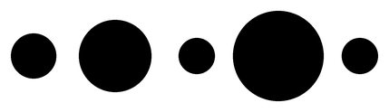
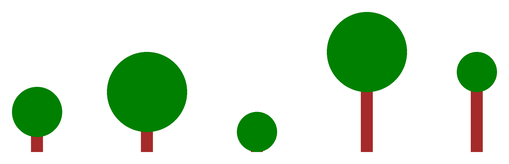
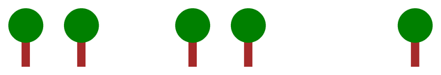

# Einführung in Listen

## Aufgabe 1: Zwei Wege zum selben Bild

:::snippet{#aufgabe}
a) Analysiere die beiden folgenden Beispiele nacheinander. Beide erzeugen dasselbe Bild.

b) Formuliere Vermutungen über die neuen Aspekte im zweiten Beispiel: Was ist neu? Was wird damit gemacht? Was bewirken die neuen Schreibweisen?

c) Begründe, warum das zweite Beispiel besser umgesetzt ist.
:::


**Erstes Beispiel – mit einzelnen Variablen**

:::pyide{canvas}

```python
from turtle import *
shape("turtle")
screensize(400, 300)
speed(0)

pensize(20)
penup()
goto(-60, -80)
left(90)
pendown()

hoehe0 = 40
hoehe1 = 60
hoehe2 = 20
hoehe3 = 100
hoehe4 = 80

forward(hoehe0)
backward(hoehe0)
penup()
right(90)
forward(20)
left(90)
pendown()

forward(hoehe1)
backward(hoehe1)
penup()
right(90)
forward(20)
left(90)
pendown()

forward(hoehe2)
backward(hoehe2)
penup()
right(90)
forward(20)
left(90)
pendown()

forward(hoehe3)
backward(hoehe3)
penup()
right(90)
forward(20)
left(90)
pendown()

forward(hoehe4)
backward(hoehe4)
```

:::

**Zweites Beispiel – mit einer Liste**

:::pyide{canvas}

```python
from turtle import *
shape("turtle")
screensize(400, 300)
speed(0)

pensize(20)
penup()
goto(-60, -80)
left(90)
pendown()

hoehen = [40, 60, 20, 100, 80]
zaehler = 0

while zaehler < len(hoehen):
    forward(hoehen[zaehler])
    backward(hoehen[zaehler])
    penup()
    right(90)
    forward(20)
    left(90)
    pendown()
    zaehler = zaehler + 1
```

:::

:::snippet{#merken}
- Eine **Liste** speichert mehrere Werte unter **einem** Namen: `hoehen = [40, 60, 20, 100, 80]`
- Die einzelnen Werte heißen **Elemente**. Auf sie greifst du über ihre Position zu: `hoehen[0]`, `hoehen[1]`, …
- **Gezählt wird ab 0!** Das erste Element ist `hoehen[0]`, das fünfte `hoehen[4]`.
- `len(hoehen)` liefert die **Länge** der Liste, hier also 5.
- Der letzte gültige Index ist deshalb immer `len(liste) - 1`.
:::

:::snippet{#brain}
Warum wird ab 0 gezählt? Das wirkt zunächst unlogisch, hat aber einen historischen Grund: Der Index gibt eigentlich an, **wie weit** ein Element vom Listenanfang entfernt ist. Das erste Element steht direkt am Anfang – der Abstand ist also 0.

Fast alle Programmiersprachen machen es so. Gewöhne dich früh daran, dann ersparst du dir viele Fehler.
:::

::::collapsible{title="Auflösung zu c)"}

Das zweite Beispiel ist aus mehreren Gründen besser:

1. **Es ist viel kürzer.** Der Zeichenvorgang steht nur einmal da statt fünfmal.
2. **Es ist leichter zu ändern.** Willst du eine sechste Säule, ergänzt du eine Zahl in der Liste – mehr nicht.
3. **Es ist weniger fehleranfällig.** Beim Kopieren des Blocks im ersten Beispiel vergisst man leicht, `hoehe1` in `hoehe2` zu ändern.
4. **Die Anzahl ist flexibel.** Durch `len(hoehen)` passt sich die Schleife automatisch an.

::::

## Aufgabe 2: Punkte aus einer Liste

:::snippet{#aufgabe}
In einem Programm wird diese Liste vorgegeben:

```python
durchmesser = [50, 80, 40, 100, 40]
```

Zeichne mithilfe einer Schleife Punkte mit den entsprechenden Durchmessern nebeneinander.
:::



:::pyide{canvas}

```python
from turtle import *
shape("turtle")
screensize(600, 260)

durchmesser = [50, 80, 40, 100, 40]

penup()
goto(-180, 0)

# Dein Code hier
```

:::

::::collapsible{title="Tipp: Der Aufbau der Schleife"}

Übernimm den Aufbau aus dem Säulen-Beispiel:

```python
zaehler = 0
while zaehler < len(durchmesser):
    dot(durchmesser[zaehler])
    forward(90)
    zaehler = zaehler + 1
```

::::

:::protect{password="turtle-5-1-1" description="Lösung. Erfrage das Passwort bei deiner Lehrkraft."}

```python
from turtle import *
shape("turtle")
screensize(600, 260)

durchmesser = [50, 80, 40, 100, 40]

penup()
goto(-180, 0)

zaehler = 0
while zaehler < len(durchmesser):
    dot(durchmesser[zaehler])
    forward(90)
    zaehler = zaehler + 1
```

:::

## Aufgabe 3: Zwei Listen gleichzeitig

:::snippet{#aufgabe}
Nun werden gleich **zwei** Listen vorgegeben:

```python
durchmesser = [50, 80, 40, 80, 40]
hoehen = [40, 60, 20, 100, 80]
```

Zeichne damit Bäume wie unten abgebildet. Der erste Baum hat also eine Krone mit Durchmesser 50 auf einem 40 Pixel hohen Stamm.
:::



:::pyide{canvas height="600px"}

```python
from turtle import *
shape("turtle")
screensize(700, 340)
speed(0)

durchmesser = [50, 80, 40, 80, 40]
hoehen = [40, 60, 20, 100, 80]

penup()
goto(-240, -120)

# Dein Code hier
```

:::

::::collapsible{title="Tipp: Ein Zähler für beide Listen"}

Beide Listen sind gleich lang und gehören zusammen: Der Baum Nummer `zaehler` hat die Krone `durchmesser[zaehler]` und den Stamm `hoehen[zaehler]`.

Du brauchst also nur **einen** Zähler für beide Listen.

::::

:::protect{password="turtle-5-1-2" description="Lösung. Erfrage das Passwort bei deiner Lehrkraft."}

```python
from turtle import *
shape("turtle")
screensize(700, 340)
speed(0)

durchmesser = [50, 80, 40, 80, 40]
hoehen = [40, 60, 20, 100, 80]

penup()
goto(-240, -120)

zaehler = 0
while zaehler < len(hoehen):
    setheading(90)
    pensize(12)
    pencolor("brown")
    pendown()
    forward(hoehen[zaehler])
    pencolor("green")
    dot(durchmesser[zaehler])
    penup()
    backward(hoehen[zaehler])
    setheading(0)
    forward(110)
    zaehler = zaehler + 1
```

:::

## Aufgabe 4: Mit Listen arbeiten

:::snippet{#aufgabe}
Beschreibe, wie man die folgenden Punkte in einem Programm jeweils umsetzen kann. Teste es im Zweifel am Rechner.

- Die **Länge** einer Liste soll angezeigt werden.
- Die **komplette** Liste soll angezeigt werden.
- Der **allererste** Eintrag soll als einziger angezeigt werden.
- Ein Eintrag soll einen **neuen Wert** erhalten.
:::

:::pyide

```python
zahlen = [40, 60, 20, 100, 80]

# Probiere hier aus
```

:::

:::protect{password="turtle-5-1-3" description="Lösung. Erfrage das Passwort bei deiner Lehrkraft."}

```python
zahlen = [40, 60, 20, 100, 80]

print(len(zahlen))    # Länge: 5
print(zahlen)         # die ganze Liste
print(zahlen[0])      # nur der erste Eintrag: 40

zahlen[2] = 999       # der dritte Eintrag bekommt einen neuen Wert
print(zahlen)
```

:::

## Aufgabe 5: Texte in Listen

:::snippet{#aufgabe}
Man kann auch Texte in Listen speichern:

```python
farben = ["red", "green", "red", "blue", "magenta"]
```

Zeichne mithilfe dieser Liste verschiedenfarbige Punkte wie unten abgebildet.
:::


:::pyide{canvas}

```python
from turtle import *
shape("turtle")
screensize(600, 220)

farben = ["red", "green", "red", "blue", "magenta"]

penup()
goto(-160, 0)

# Dein Code hier
```

:::

## Aufgabe 6: Wahrheitswerte in Listen

:::snippet{#aufgabe}
In dieser Aufgabe wird eine Liste mit Wahrheitswerten vorgegeben:

```python
baum = [True, True, False, True, True, False, False, True]
```

Damit soll eine Reihe von Bäumen gezeichnet werden. `True` steht für einen Baum, `False` für eine **Lücke** in der Reihe.

Entwickle ein geeignetes Programm.
:::



:::pyide{canvas height="600px"}

```python
from turtle import *
shape("turtle")
screensize(760, 300)
speed(0)

baum = [True, True, False, True, True, False, False, True]

penup()
goto(-300, -100)

# Dein Code hier
```

:::

::::collapsible{title="Tipp 1: Zwei Konzepte kombinieren"}

Hier kommen Listen und Verzweigungen zusammen: In der Schleife fragst du ab, ob an dieser Stelle ein Baum stehen soll.

```python
if baum[zaehler]:
    # Baum zeichnen
```

::::

::::collapsible{title="Tipp 2: Die Lücke nicht vergessen"}

Wichtig: Die Turtle muss **immer** weiterrücken – auch dann, wenn kein Baum gezeichnet wurde. Sonst rutschen die folgenden Bäume zusammen.

Das Weiterrücken gehört also **außerhalb** der `if`-Abfrage, aber innerhalb der Schleife.

::::

## Aufgabe 7: Das Maximum finden

:::snippet{#aufgabe}
Gegeben ist die folgende Vorlage. Ergänze den fehlenden Programmtext so, dass am Ende in der Variablen `maximum` immer die **größte** Zahl der Liste steht.

Teste deine Lösung mit verschiedenen Werten in der Liste.
:::

:::pyide

```python
def maximum(zahlen):
    groesstes = 0
    zaehler = 0
    while zaehler < len(zahlen):
        # Hier fehlt etwas!
        zaehler = zaehler + 1
    return groesstes


print(maximum([40, 60, 20, 100, 80]))
```

```python test
#SCRIPT#
if maximum([40, 60, 20, 100, 80]) == 100:
    print("Bestanden: Das Maximum ist 100")
else:
    print("Nicht bestanden: erwartet 100, erhalten", maximum([40, 60, 20, 100, 80]))
```

```python test
#SCRIPT#
if maximum([7]) == 7:
    print("Bestanden: Bei einer einelementigen Liste ist das Maximum das Element selbst")
else:
    print("Nicht bestanden: erwartet 7, erhalten", maximum([7]))
```

```python test
#SCRIPT#
if maximum([5, 5, 5]) == 5:
    print("Bestanden: Auch bei gleichen Werten stimmt das Ergebnis")
else:
    print("Nicht bestanden: erwartet 5, erhalten", maximum([5, 5, 5]))
```

:::

::::collapsible{title="Tipp 1: Die Idee"}

Stell dir vor, du gehst mit einem Zettel an einer Reihe von Personen entlang und willst die größte finden.

Auf dem Zettel steht immer die bisher größte Körpergröße. Bei jeder neuen Person vergleichst du – und schreibst nur dann etwas Neues auf, wenn sie größer ist.

::::

::::collapsible{title="Tipp 2: Als Code"}

```python
if zahlen[zaehler] > groesstes:
    groesstes = zahlen[zaehler]
```

::::

:::protect{password="turtle-5-1-4" description="Lösung. Erfrage das Passwort bei deiner Lehrkraft."}

```python
def maximum(zahlen):
    groesstes = 0
    zaehler = 0
    while zaehler < len(zahlen):
        if zahlen[zaehler] > groesstes:
            groesstes = zahlen[zaehler]
        zaehler = zaehler + 1
    return groesstes
```

:::

## Zusatzaufgabe: Ein Problem mit negativen Zahlen

:::snippet{#aufgabe}
Das Programm aus Aufgabe 7 liefert möglicherweise **falsche Werte**, wenn die Liste ausschließlich negative Zahlen enthält.

a) Probiere es aus: Was liefert deine Lösung für `[-5, -20, -3]`? Was wäre richtig?

b) Erkläre, woran das liegt.

c) Modifiziere das Programm so, dass es auch dann das korrekte Ergebnis liefert.
:::

::::collapsible{title="Tipp zu b)"}

Die Startbelegung `groesstes = 0` behauptet im Grunde: „Ich habe schon eine Zahl gesehen, nämlich die 0." Das ist aber gar nicht wahr – und die 0 ist größer als jede negative Zahl.

::::

::::collapsible{title="Tipp zu c)"}

Belege `groesstes` nicht mit 0, sondern mit dem **ersten Element der Liste**. Das ist garantiert eine Zahl, die wirklich vorkommt.

```python
groesstes = zahlen[0]
```

::::

---

## Selbsttest

::::multievent

**1. Welchen Wert liefert zahlen[1]? Die Liste lautet: 40, 60, 20, 100, 80**

{z{60}}

{h{Achtung: Gezählt wird ab 0.}}
{H{Richtig! Der Index 1 bezeichnet das zweite Element.}}

**2. Was liefert len() bei dieser Liste zurück?**

{z{5}}

{h{len liefert die Anzahl der Elemente.}}
{H{Richtig!}}

**3. Was ist der größte gültige Index bei einer Liste mit 5 Elementen?**

{z{4}}

{h{Der erste Index ist 0, nicht 1.}}
{H{Richtig! Der letzte Index ist immer die Länge minus eins.}}

**4. Welche Vorteile hat eine Liste gegenüber vielen Einzelvariablen?** (Mehrfachauswahl)

{c1{!Man kann mit einer Schleife über alle Werte gehen}}

{c1{!Man kann problemlos Werte ergänzen}}

{c1{!Die Anzahl lässt sich mit len abfragen}}

{c1{Die Werte werden automatisch sortiert}}

{h{Eine der Aussagen stimmt nicht – Listen sortieren nichts von allein.}}
{H{Richtig!}}

**5. Was passiert bei zahlen[2] = 999?**

{r1{Es wird ein neues Element angehängt}}

{r1{!Das dritte Element bekommt den Wert 999}}

{r1{Die ganze Liste wird auf 999 gesetzt}}

{h{Denke daran, ab wo gezählt wird.}}
{H{Richtig!}}

**6. Warum ist groesstes = 0 als Startwert beim Maximum problematisch?**

{r2{Weil 0 keine Zahl ist}}

{r2{!Weil 0 größer ist als alle negativen Zahlen der Liste}}

{r2{Weil die Liste leer sein könnte}}

{h{Was passiert bei einer Liste, die nur negative Zahlen enthält?}}
{H{Richtig! Dann bliebe fälschlicherweise die 0 als Ergebnis stehen.}}

::::
