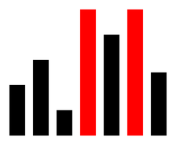

# `for-in`-Schleifen

Bisher hast du Listen immer mit einem Zähler durchlaufen:

```python
zaehler = 0
while zaehler < len(hoehen):
    forward(hoehen[zaehler])
    zaehler = zaehler + 1
```

Das funktioniert – ist aber umständlich. Für den häufigsten Fall gibt es eine kürzere Schreibweise.

## Aufgabe 1: Eine neue Art von Schleife

:::snippet{#aufgabe}
Wir betrachten eine Modifikation des Beispiels aus der letzten Lektion.

Analysiere, wie die hier neu eingeführte Art von Schleife funktioniert. Vergleiche sie Zeile für Zeile mit der Version mit Zähler.
:::

:::pyide{canvas}

```python
from turtle import *
shape("turtle")
screensize(400, 300)
speed(0)

pensize(20)
penup()
goto(-60, -80)
left(90)
pendown()

hoehen = [40, 60, 20, 100, 80]

for zahl in hoehen:
    forward(zahl)
    backward(zahl)
    penup()
    right(90)
    forward(20)
    left(90)
    pendown()
```

:::

:::snippet{#merken}
- `for zahl in hoehen:` bedeutet: **„Nimm nacheinander jedes Element der Liste und nenne es `zahl`."**
- Die Schleifenvariable enthält direkt den **Wert**, nicht den Index. Du brauchst also kein `hoehen[...]` mehr.
- Der Zähler entfällt vollständig: kein `zaehler = 0`, kein `len(...)`, kein `zaehler = zaehler + 1`.
- Diese Schleifenform heißt **for-each-Schleife** („für jedes Element").

Die dir bekannte Form `for i in range(10):` ist übrigens dasselbe Prinzip: `range(10)` erzeugt die Zahlen 0 bis 9, und die Schleife geht sie der Reihe nach durch.
:::

## Aufgabe 2: Wann passt welche Schleife?

:::snippet{#aufgabe}
Beurteile, ob sich die Aufgaben aus der letzten Lektion ebenfalls mit der neuen Schleifenform umsetzen lassen:

a) die **Punkte** aus der Liste `durchmesser`,

b) die **Bäume** aus den beiden Listen `durchmesser` und `hoehen`.

Modifiziere die Programme oder erkläre, warum es nicht sinnvoll wäre.
:::

::textinput{placeholder="Bei a) ... / Bei b) ..."}

::::collapsible{title="Auflösung"}

**a) Ja, problemlos.** Es gibt nur eine Liste, und wir brauchen nur die Werte:

```python
for d in durchmesser:
    dot(d)
    forward(90)
```

**b) Nein, hier nicht sinnvoll.** Wir brauchen bei jedem Schritt Werte aus **zwei** Listen, die zusammengehören. Die `for-in`-Schleife läuft aber immer nur über **eine** Liste – der Index zur Nummer des Baums fehlt dann.

**Faustregel:**

- Brauchst du nur die Werte einer Liste → `for-in`
- Brauchst du die Position, oder greifst du auf mehrere Listen gleichzeitig zu → Schleife mit Zähler

::::

## Aufgabe 3: Das Maximum – noch einmal

:::snippet{#aufgabe}
Modifiziere die Maximum-Funktion aus der letzten Lektion so, dass sie die neue Schleifenform verwendet.

Denke daran, das Problem mit den negativen Zahlen gleich mit zu lösen.
:::

:::pyide

```python
def maximum(zahlen):
    # Dein Code hier
    return 0


print(maximum([40, 60, 20, 100, 80]))
```

```python test
#SCRIPT#
if maximum([40, 60, 20, 100, 80]) == 100:
    print("Bestanden: Das Maximum ist 100")
else:
    print("Nicht bestanden: erwartet 100, erhalten", maximum([40, 60, 20, 100, 80]))
```

```python test
#SCRIPT#
if maximum([-5, -20, -3]) == -3:
    print("Bestanden: Auch bei negativen Zahlen stimmt das Ergebnis")
else:
    print("Nicht bestanden: erwartet -3, erhalten", maximum([-5, -20, -3]))
```

```python test
#SCRIPT#
if maximum([7]) == 7:
    print("Bestanden: Einelementige Liste")
else:
    print("Nicht bestanden: erwartet 7, erhalten", maximum([7]))
```

:::

:::protect{password="turtle-5-2-1" description="Lösung. Erfrage das Passwort bei deiner Lehrkraft."}

```python
def maximum(zahlen):
    groesstes = zahlen[0]
    for zahl in zahlen:
        if zahl > groesstes:
            groesstes = zahl
    return groesstes
```

:::

## Aufgabe 4: Das Minimum

:::snippet{#aufgabe}
Entwickle eine Funktion `minimum(zahlen)`, die die **kleinste** Zahl einer Liste bestimmt.
:::

:::pyide

```python
def minimum(zahlen):
    # Dein Code hier
    return 0


print(minimum([40, 60, 20, 100, 80]))
```

```python test
#SCRIPT#
if minimum([40, 60, 20, 100, 80]) == 20:
    print("Bestanden: Das Minimum ist 20")
else:
    print("Nicht bestanden: erwartet 20, erhalten", minimum([40, 60, 20, 100, 80]))
```

```python test
#SCRIPT#
if minimum([-5, -20, -3]) == -20:
    print("Bestanden: Auch bei negativen Zahlen stimmt das Ergebnis")
else:
    print("Nicht bestanden: erwartet -20, erhalten", minimum([-5, -20, -3]))
```

:::

::::collapsible{title="Tipp"}

Du musst am Maximum nur zwei Kleinigkeiten ändern: den Namen der Variablen und die Richtung des Vergleichs.

::::

## Aufgabe 5: Der Mittelwert

:::snippet{#aufgabe}
Entwickle eine Funktion `mittelwert(zahlen)`, die den Mittelwert der Zahlen einer Liste berechnet.

**Hinweis:** Sind in der Liste zum Beispiel die Zahlen 10, 20 und 60 gespeichert, ist das Ergebnis 30.
:::

:::pyide

```python
def mittelwert(zahlen):
    # Dein Code hier
    return 0


print(mittelwert([10, 20, 60]))
```

```python test
#SCRIPT#
if mittelwert([10, 20, 60]) == 30:
    print("Bestanden: Der Mittelwert ist 30")
else:
    print("Nicht bestanden: erwartet 30, erhalten", mittelwert([10, 20, 60]))
```

```python test
#SCRIPT#
if mittelwert([5, 5, 5, 5]) == 5:
    print("Bestanden: Bei gleichen Werten ist der Mittelwert dieser Wert")
else:
    print("Nicht bestanden: erwartet 5, erhalten", mittelwert([5, 5, 5, 5]))
```

```python test
#SCRIPT#
if mittelwert([1, 2]) == 1.5:
    print("Bestanden: Auch Kommaergebnisse stimmen")
else:
    print("Nicht bestanden: erwartet 1.5, erhalten", mittelwert([1, 2]))
```

:::

::::collapsible{title="Tipp 1: Zwei Schritte"}

Der Mittelwert ist die Summe aller Zahlen geteilt durch ihre Anzahl.

Die Summe bildest du mit einer `for-in`-Schleife, die Anzahl liefert `len(zahlen)`.

::::

::::collapsible{title="Tipp 2: Welche Division?"}

Achte darauf, die **normale** Division mit dem einfachen Schrägstrich zu verwenden. Mit der Ganzzahldivision würde bei `[1, 2]` fälschlicherweise 1 statt 1.5 herauskommen.

::::

:::protect{password="turtle-5-2-2" description="Lösung. Erfrage das Passwort bei deiner Lehrkraft."}

```python
def mittelwert(zahlen):
    summe = 0
    for zahl in zahlen:
        summe = summe + zahl
    return summe / len(zahlen)
```

:::

## Zusatzaufgabe 1: Das Maximum hervorheben

:::snippet{#aufgabe}
Entwickelt werden soll ein Programm, das Folgendes leistet:

In einer Liste sind positive Werte vorgegeben. Die Turtle zeichnet dazu ein Säulendiagramm. Der **größte** dieser Werte wird dabei farblich hervorgehoben. Kommt der maximale Wert mehrfach vor, wird er auch mehrfach markiert.
:::



:::pyide{canvas height="600px"}

```python
from turtle import *
shape("turtle")
screensize(560, 360)
speed(0)

werte = [40, 60, 20, 100, 80, 100, 50]

# Dein Code hier
```

:::

::::collapsible{title="Tipp 1: Zwei Durchgänge"}

Du brauchst zwei Schleifen nacheinander:

1. Zuerst das Maximum bestimmen – dafür kannst du deine Funktion aus Aufgabe 3 verwenden.
2. Dann zeichnen und bei jedem Wert prüfen, ob er dem Maximum entspricht.

::::

::::collapsible{title="Tipp 2: Warum zwei Durchgänge nötig sind"}

Beim Zeichnen der ersten Säule weißt du noch gar nicht, ob später eine höhere kommt. Das Maximum muss also **vorher** feststehen.

::::

:::protect{password="turtle-5-2-3" description="Lösung. Erfrage das Passwort bei deiner Lehrkraft."}

```python
from turtle import *
shape("turtle")
screensize(560, 360)
speed(0)


def maximum(zahlen):
    groesstes = zahlen[0]
    for zahl in zahlen:
        if zahl > groesstes:
            groesstes = zahl
    return groesstes


werte = [40, 60, 20, 100, 80, 100, 50]
groesstes = maximum(werte)

pensize(20)
penup()
goto(-180, -120)
setheading(90)

for wert in werte:
    if wert == groesstes:
        pencolor("red")
    else:
        pencolor("black")
    pendown()
    forward(wert * 1.6)
    penup()
    backward(wert * 1.6)
    right(90)
    forward(30)
    left(90)
```

:::

## Zusatzaufgabe 2: Noch mehr Markierungen

:::snippet{#aufgabe}
Erweitere das Programm aus Zusatzaufgabe 1 so, dass auch das **Minimum** und der **Mittelwert** in geeigneter Weise markiert werden.

Überlege dir selbst, wie du den Mittelwert sinnvoll darstellst – er entspricht ja meist keiner der Säulen.
:::

::::collapsible{title="Tipp: Der Mittelwert als Linie"}

Zeichne den Mittelwert als **waagerechte Linie** quer über das Diagramm. Dafür musst du nur die Turtle auf die passende Höhe setzen und einmal quer laufen lassen.

::::

---

## Selbsttest

::::multievent

**1. Was enthält die Variable zahl während des Durchlaufs? Die Schleife lautet: for zahl in hoehen:**

{r1{Den Index des Elements}}

{r1{!Den Wert des Elements}}

{r1{Die Länge der Liste}}

{h{Genau darin unterscheidet sich diese Schleife von der Variante mit Zähler.}}
{H{Richtig! Deshalb braucht man keine eckigen Klammern mehr.}}

**2. Wann ist eine Schleife mit Zähler besser geeignet?** (Mehrfachauswahl)

{c1{!Wenn man die Position eines Elements braucht}}

{c1{!Wenn man auf zwei Listen gleichzeitig zugreift}}

{c1{Wenn die Liste sehr lang ist}}

{c1{Wenn die Liste Texte enthält}}

{h{Denke an die Baum-Aufgabe mit zwei Listen.}}
{H{Richtig!}}

**3. Wie viele Durchläufe macht for x in werte: bei einer Liste mit 7 Elementen?**

{z{7}}

{h{Einmal pro Element.}}
{H{Richtig!}}

**4. Womit sollte man die Variable für das Maximum sinnvoll vorbelegen?**

{r2{Mit 0}}

{r2{!Mit dem ersten Element der Liste}}

{r2{Mit der Länge der Liste}}

{h{Was passierte bei einer Liste mit ausschließlich negativen Zahlen?}}
{H{Richtig! Das erste Element kommt garantiert in der Liste vor.}}

**5. Welche Division brauchst du für den Mittelwert?**

{r3{Die Ganzzahldivision}}

{r3{!Die normale Division}}

{r3{Den Modulo-Operator}}

{h{Der Mittelwert von 1 und 2 ist 1.5 – das darf nicht abgeschnitten werden.}}
{H{Richtig!}}

**6. Warum muss man beim markierten Säulendiagramm zweimal durch die Liste gehen?**

{r4{Weil Schleifen immer doppelt laufen}}

{r4{!Weil das Maximum feststehen muss, bevor gezeichnet wird}}

{r4{Weil man Listen nur einmal durchlaufen darf}}

{h{Was weiß man beim Zeichnen der ersten Säule über die späteren?}}
{H{Genau! Erst nach dem ersten Durchgang ist bekannt, welcher Wert der größte ist.}}

::::
