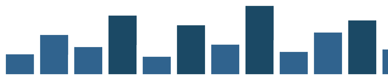
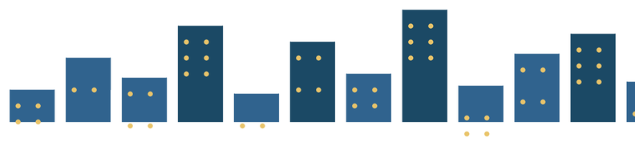
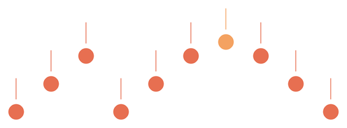
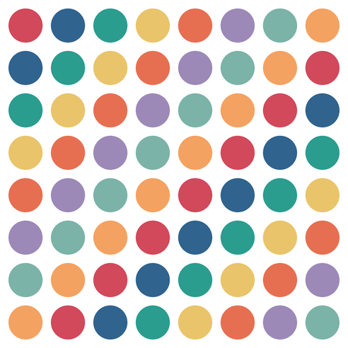
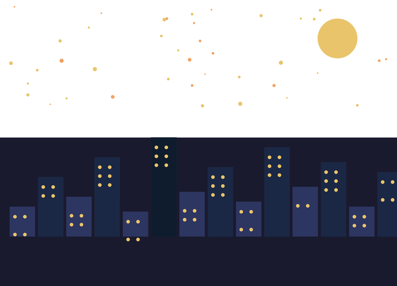

# Challenge: Kunst aus Listen

Bisher hast du Listen benutzt, um **Werte** zu speichern: Höhen, Durchmesser, Farben. Jetzt benutzt du Listen, um Bilder zu **komponieren**: Eine Liste aus Gebäudehöhen wird zur Skyline, eine Liste aus Notennamen zur Partitur, eine Liste aus Farben zum Kartenmuster.

Diese Seite ist ein **Zusatzangebot**. Du brauchst sie nicht, um im Lernpfad weiterzukommen. Aber wenn du Lust hast, das Gelernte einmal ohne Zielvorgabe zu benutzen, bist du hier richtig.

## Was generative Kunst mit Listen ist

:::snippet{#merken}
Bei **generativer Kunst** zeichnest du das Bild nicht selbst. Du schreibst eine **Regel** auf – und das Bild entsteht daraus von allein.

Mit Listen kommt eine neue Dimension dazu: Du schreibst die **Daten** auf, und die Schleife macht daraus das Bild.

- **Liste** – eine Reihe von Werten: Höhen, Farben, Noten, Wahrheitswerte
- **Schleife** – läuft über die Liste und zeichnet für jedes Element
- **Zusammenspiel** – zwei Listen gleichzeitig: eine für die Höhe, eine für die Farbe

Der Unterschied zu den vorigen Challenges: Das Bild steht in der **Liste**, nicht in der Schleife. Änderst du die Liste, ändert sich das Bild – ohne eine einzige Zeile Code am Programm.
:::

## So arbeitest du mit einer Challenge

:::snippet{#challenge}
Eine Challenge ist keine normale Aufgabe:

- Es gibt **kein Zielbild**, das du treffen musst. Die Bilder hier sind Beispiele, keine Vorlagen.
- Es gibt **keine Lösung** zum Nachschlagen. Es gibt nur deine eigenen Bilder.
- Dafür gibt es eine **Regel**, an die du dich halten solltest. Genau die Einschränkung macht es interessant.

Fertig bist du, wenn du ein Bild hast, das du jemandem zeigen willst.
:::

:::snippet{#merken}
**Mach dir Platz.** Deine Bilder sind größer als die schmale Vorschau neben dem Editor. Drei Handgriffe helfen:

- Zieh die **Trennlinie** zwischen der Zeichenfläche und dem Editor nach rechts – die Zeichenfläche wird breiter.
- Zieh ihre **untere Kante** nach unten – sie wird höher.
- Der **Vollbild-Knopf** unten rechts an der Editorleiste gibt dir den ganzen Bildschirm.

Bei einem Bild, das du wirklich anschauen willst, lohnt sich das.
:::

## Das Prinzip: Daten treiben das Bild

:::snippet{#brain}
Drei Hebel hast du, und sie wirken ganz unterschiedlich:

**Die Liste.** Sie ist dein direktester Regler. `[40, 80, 55, 120]` zeichnet vier Häuser, `[40, 200, 35, 180]` zeichnet vier ganz andere. Verändere immer nur **einen** Wert und schau, was passiert.

**Die Schleife.** `for hoehe in hoehen:` läuft über jede Höhe. Ob 4 oder 40 Elemente – die Schleife bleibt gleich. Nur die Liste ändert sich.

**Mehrere Listen.** Brauchst du Höhe **und** Farbe, nimmst du zwei Listen und greifst mit dem Index auf beide zu: `hoehen[i]` und `farben[i]`. Das ist genau das Muster aus [Lektion 1](./01-einfuehrung) – jetzt mit eigenen Daten.
:::

## Challenge 1: Die Stadtsilhouette

Eine Liste aus Gebäudehöhen wird zu einer Skyline. Jedes Element ist ein Haus, die Schleife zeichnet sie nebeneinander. Mit einer zweiten Liste für die Farbe wird es interessanter.

| Silhouette | Mit Fenstern |
| --- | --- |
|  |  |
| Eine Liste: Höhen | Zwei Listen: Höhen und Fenster |

:::snippet{#challenge}
**Die Regel:** Du darfst nur die Listen verändern, nicht die Schleife.

a) Bring das Programm zum Laufen und schau dir an, was es zeichnet.

b) Verändere die Höhen: Was passiert, wenn alle Häuser gleich hoch sind? Was, wenn sie abwechselnd hoch und niedrig sind?

c) Füge eine zweite Liste `farben` hinzu und bestimme damit die Farbe jedes Hauses. Benutze dafür den Index, nicht `for-in`.

d) Füge eine dritte Liste `fenster` mit Wahrheitswerten hinzu: `True` bedeutet, das Haus bekommt Fenster, `False` bedeutet, es hat keine. Wie zeichnest du die Fenster?
:::

:::pyide{canvas height="650px"}

```python
from turtle import *

shape("turtle")
screensize(800, 400)
speed(0)
hideturtle()
penup()

# --- Die Regler ---
hoehen = [40, 80, 55, 120, 35, 100, 60, 140, 45, 85, 110, 50]
BREITE = 55
ABSTAND = 15

# --- Die Regel ---
goto(-380, -130)

for i in range(len(hoehen)):
    fillcolor("#30638e")
    begin_fill()
    left(90)
    forward(hoehen[i])
    right(90)
    forward(BREITE)
    right(90)
    forward(hoehen[i])
    end_fill()
    penup()
    setheading(0)
    forward(ABSTAND)
```

:::

**Mein Forschungsheft**

| Nr. | Höhenliste | So sieht es aus |
| --- | --- | --- |
| 1 | | |
| 2 | | |
| 3 | | |

::::collapsible{title="Tipp 1: Zwei Listen gleichzeitig"}

Wenn du Höhe **und** Farbe brauchst, brauchst du den Index. Die `for-in`-Schleife liefert nur den Wert, nicht die Position – aber du brauchst beide Listen am selben Index:

```python
farben = ["#30638e", "#1b4965", "#30638e", "#1b4965", ...]

for i in range(len(hoehen)):
    fillcolor(farben[i])
    # Haus zeichnen mit hoehen[i]
```

Genau das Muster aus der [Baum-Aufgabe](./01-einfuehrung) in Lektion 1 – nur mit Häusern statt Bäumen.
::::

::::collapsible{title="Tipp 2: Fenster zeichnen"}

Eine dritte Liste mit Wahrheitswerten entscheidet, ob ein Haus Fenster bekommt:

```python
fenster = [True, True, False, True, False, True, ...]

for i in range(len(hoehen)):
    # Haus zeichnen ...
    if fenster[i]:
        # Fenster zeichnen: gelbe Punkte in das Haus
        goto(-380 + i * 70 + 10, -130 + hoehen[i] - 20)
        pencolor("#e9c46a")
        dot(6)
```

Die Position der Fenster berechnet sich aus der Position des Hauses (`i * 70`) und der Höhe (`hoehen[i]`).
::::

::::collapsible{title="Tipp 3: Die Liste ist das Bild"}

Verdopple die Höhenliste: `[40, 80, 55, 120, 40, 80, 55, 120, ...]`. Die Skyline wiederholt sich – aber das Programm bleibt dasselbe. Das ist der Kern der Idee: Die Liste steuert das Bild, die Schleife führt nur aus.
::::

## Challenge 2: Die Bachpartitur

Eine Liste aus Notennamen wird zu einer Partitur: Jede Note ist ein Punkt auf einer Tonhöhe, und die Liste bestimmt, welche Töne erklingen. Die y-Position berechnet sich aus dem Notennamen – und so entsteht eine Melodie, die du **sehen** kannst.



:::snippet{#challenge}
**Die Regel:** Du darfst nur die Liste und das Wörterbuch `tonhoehe` verändern, nicht die Schleife.

a) Bring das Programm zum Laufen und beschreibe, was du siehst.

b) Verändere die Notenliste: Was passiert, wenn alle Noten gleich sind? Was, wenn sie aufsteigend sind?

c) Füge eine zweite Liste `farben` hinzu, so dass jede Note ihre eigene Farbe bekommt.

d) Erfinde eine eigene Melodie und schreib sie als Liste auf. Was siehst du, wenn du sie zeichnest?
:::

:::pyide{canvas height="650px"}

```python
from turtle import *

shape("turtle")
screensize(800, 400)
speed(0)
hideturtle()
penup()

# --- Die Regler ---
noten = ["C", "E", "G", "C", "E", "G", "A", "G", "E", "C"]
tonhoehe = {"C": 20, "D": 40, "E": 60, "F": 80, "G": 100, "A": 120, "H": 140}
ABSTAND = 50

# --- Die Regel ---
x = -220
for name in noten:
    y = tonhoehe[name]
    goto(x, y)
    pencolor("#e76f51")
    dot(22)
    setheading(90)
    forward(18)
    pendown()
    forward(30)
    penup()
    x = x + ABSTAND
```

:::

::::collapsible{title="Tipp 1: Wie die Partitur entsteht"}

Jede Note besteht aus drei Teilen:

1. **Ein Punkt** (`dot(22)`) an der y-Position, die der Tonhöhe entspricht.
2. **Ein Notenhals** – eine Linie nach oben (`forward(30)`).
3. **Der Abstand** – `x = x + ABSTAND` rückt zur nächsten Note.

Das Wörterbuch `tonhoehe` übersetzt den Notennamen in eine y-Koordinate: "C" wird zu 20, "A" zu 120. So entsteht die Tonhöhe aus dem Namen.
::::

::::collapsible{title="Tipp 2: Eine zweite Liste für die Farbe"}

Brauchst du Note und Farbe gleichzeitig, brauchst du wieder den Index:

```python
farben = ["#e76f51", "#30638e", "#2a9d8f", "#e76f51", ...]

for i in range(len(noten)):
    name = noten[i]
    y = tonhoehe[name]
    pencolor(farben[i])
    # ...
```

So wird jede Note in einer anderen Farbe gezeichnet – und die Melodie wird auch optisch sichtbar.
::::

::::collapsible{title="Tipp 3: Die Notenhälse nach unten"}

Statt des Notenhalses nach oben kannst du auch nach unten zeichnen:

```python
setheading(270)   # statt 90
forward(18)
pendown()
forward(30)
```

In der Musiknotation bedeutet das: Die Note ist tief. Probier aus, wie das Bild anders wirkt.
::::

## Challenge 3: Das Kartenmuster

Eine Liste aus Farben und eine verschachtelte Schleife werden zu einem Kartenmuster. Der Trick: Die Farbe jedes Punktes hängt von `(zeile + spalte) % len(farben)` ab – und so entsteht ein sich wiederholendes Muster, das nie langweilig wird.



:::snippet{#challenge}
**Die Regel:** Du darfst nur die Liste `farben` und die `ANZAHL` verändern, nicht die Schleife.

a) Bring das Programm zum Laufen und beschreibe das Muster.

b) Verändere die Farbenliste: Was passiert bei drei Farben? Was bei zwei? Was bei sechzehn?

c) Ersetze `(zeile + spalte) % len(farben)` durch `zeile % len(farben)`. Wie verändert sich das Muster?

d) **Der Wettbewerb:** Findet eine Berechnung für den Farbindex, die ein Muster ergibt, das niemand sonst in der Klasse hat.
:::

:::pyide{canvas height="650px"}

```python
from turtle import *

shape("turtle")
screensize(600, 600)
speed(0)
hideturtle()
penup()

# --- Die Regler ---
farben = ["#d1495b", "#30638e", "#2a9d8f", "#e9c46a",
          "#e76f51", "#9c89b8", "#7bb3a8", "#f4a261"]
ANZAHL = 8
ABSTAND = 60
PUNKT = 48

# --- Die Regel ---
for zeile in range(ANZAHL):
    for spalte in range(ANZAHL):
        goto(-210 + spalte * ABSTAND, 210 - zeile * ABSTAND)
        pencolor(farben[(zeile + spalte) % len(farben)])
        dot(PUNKT)
```

:::

::::collapsible{title="Tipp 1: Wie das Muster entsteht"}

Der Farbindex ist `(zeile + spalte) % len(farben)`. In der ersten Zeile (`zeile = 0`) ist das `spalte % 8` – die Farben wandern von links nach rechts. In der zweiten Zeile (`zeile = 1`) ist es `(1 + spalte) % 8` – das Muster ist um eins verschoben.

So entsteht die diagonale Streifenstruktur: Jede Zeile ist die vorherige, um eine Farbe verschoben.
::::

::::collapsible{title="Tipp 2: Andere Berechnungen für den Farbindex"}

Statt `(zeile + spalte)` kannst du auch andere Berechnungen versuchen:

```python
farben[zeile % len(farben)]        # horizontale Streifen
farben[spalte % len(farben)]       # vertikale Streifen
farben[(zeile * spalte) % len(farben)]  # hyperbolisches Muster
farben[(zeile - spalte) % len(farben)]  # diagonale Streifen (andere Richtung)
```

Jede Berechnung erzeugt ein anderes Muster – aber die Liste `farben` bleibt gleich. Du änderst nur eine Zeile, und das Bild wird ein ganz anderes.
::::

::::collapsible{title="Tipp 3: Die Länge der Liste"}

`% len(farben)` sorgt dafür, dass der Index immer gültig bleibt – egal wie lang die Liste ist. Hast du drei Farben, ist `% 3`, und das Muster wiederholt sich alle drei Schritte. Hast du acht Farben, wiederholt es sich alle acht Schritte.

Kürzere Listen erzeugen **stärkere** Muster, längere **feinere**. Probier aus, was dir gefällt.
::::

## Die Kür: Stadt bei Nacht

Drei Listen – Höhen, Farben, Fenster – werden zu einer Stadt bei Nacht. Dazu ein Mond und Sterne, und das Bild wirkt plötzlich wie eine Szene, nicht wie ein Diagramm.



:::snippet{#challenge}
Baue deine eigene Stadt bei Nacht. Du brauchst dafür nur Listen, Schleifen, `goto` und Bedingungen – alles aus diesem Kapitel.

Experimentiere: Was passiert, wenn du mehr Sterne zeichnest? Wenn die Fenster ein Muster bilden? Wenn du einen zweiten Mond hinzufügst?
:::

:::pyide{canvas}

```python
from turtle import *
from random import randint, seed

shape("turtle")
screensize(800, 600)
speed(0)
hideturtle()
penup()

# --- Regler ---
hoehen = [60, 120, 80, 160, 50, 200, 90, 140, 70, 180, 100, 150, 60, 130]
farben = ["#2d3561", "#1b2845", "#2d3561", "#1b2845",
          "#2d3561", "#0f1c2e", "#2d3561", "#1b2845",
          "#2d3561", "#1b2845", "#2d3561", "#1b2845",
          "#2d3561", "#1b2845"]
fenster = [True, True, False, True, True, True,
           False, True, True, True, False, True, True, False]

# --- Himmel ---
pencolor("#1a1a2e")
pensize(600)
goto(-400, -300)
pendown()
setheading(0)
forward(800)
penup()
pensize(1)

# --- Mond ---
goto(280, 200)
pencolor("#e9c46a")
dot(80)

# --- Sterne ---
seed(42)
for i in range(40):
    goto(randint(-380, 380), randint(50, 270))
    pencolor("#e9c46a" if randint(0, 3) > 0 else "#f4a261")
    dot(randint(3, 8))

# --- Häuser ---
goto(-380, -200)
for i in range(len(hoehen)):
    setheading(0)
    fillcolor(farben[i])
    begin_fill()
    left(90)
    forward(hoehen[i])
    right(90)
    forward(50)
    right(90)
    forward(hoehen[i])
    end_fill()
    penup()

    if fenster[i]:
        for zeile in range(3):
            y = -200 + hoehen[i] - 20 - zeile * 18
            goto(-380 + i * 57 + 10, y)
            pencolor("#e9c46a")
            dot(7)
            goto(-380 + i * 57 + 30, y)
            dot(7)

    setheading(0)
    goto(-380 + (i + 1) * 57, -200)
```

:::

::::collapsible{title="Tipp 1: Wie die Stadt entsteht"}

Die Stadt besteht aus drei Listen, die zusammenarbeiten:

- `hoehen` – die Höhe jedes Hauses.
- `farben` – die Farbe jedes Hauses (verschiedene Blautöne für die Tiefe).
- `fenster` – ob das Haus beleuchtete Fenster bekommt.

Die Schleife läuft über `range(len(hoehen))` und greift auf alle drei Listen mit demselben Index `i` zu. So gehören die Listen zusammen: Das Haus an Position 3 hat Höhe `hoehen[3]`, Farbe `farben[3]` und Fenster `fenster[3]`.
::::

::::collapsible{title="Tipp 2: Der Himmel als Hintergrund"}

Der Himmel ist ein breiter Strich quer durchs Bild:

```python
pencolor("#1a1a2e")
pensize(600)
goto(-400, -300)
pendown()
setheading(0)
forward(800)
penup()
pensize(1)
```

`pensize(600)` macht den Strich so dick, dass er das ganze Bild füllt. Danach wird die Stiftbreite wieder auf 1 gesetzt – sonst wären die Häuser auch so dick.
::::

::::collapsible{title="Tipp 3: Sterne und Mond"}

Sterne sind zufällig verteilte Punkte:

```python
for i in range(40):
    goto(randint(-380, 380), randint(50, 270))
    pencolor("#e9c46a")
    dot(randint(3, 8))
```

`seed(42)` sorgt dafür, dass die Sterne jedes Mal an derselben Stelle stehen – sonst würde das Bild bei jedem Ausführen anders aussehen. Ändere die Zahl, und die Sterne stehen woanders.

Der Mond ist ein einzelner großer Punkt: `goto(280, 200)` und `dot(80)`.
::::

## Deine Serie

:::snippet{#challenge}
Zum Abschluss: Such dir **eine** der Challenges aus und mach daraus eine **Serie**.

1. Stelle die Listen so ein, dass **vier** deutlich verschiedene Bilder entstehen.
2. Notiere zu jedem Bild die Listen – sonst kannst du es nie wieder herstellen.
3. Gib jedem Bild einen **Titel**.
4. Hängt die Serien in der Klasse auf. Könnt ihr bei den Bildern der anderen erraten, welche Liste dahintersteckt?
:::

:::pyide{canvas}
```python
from turtle import *
from random import randint

```
:::

:::snippet{#brain}
Das Erraten ist der eigentlich spannende Teil. Denn genau das ist Informatik: **vom Ergebnis auf die Regel schließen.**

Und nebenbei hast du gemerkt, wozu Listen wirklich gut sind. Nicht zum Speichern – zum **Gestalten**. Eine Liste aus Höhen wird zur Skyline, eine Liste aus Noten zur Partitur. Das Bild steht in der Liste, nicht im Code.
:::

---

Auf dieser Seite gibt es keinen Selbsttest. Es gibt nichts abzuhaken: Entweder du hast ein Bild, das dir gefällt, oder du drehst weiter an den Listen.
