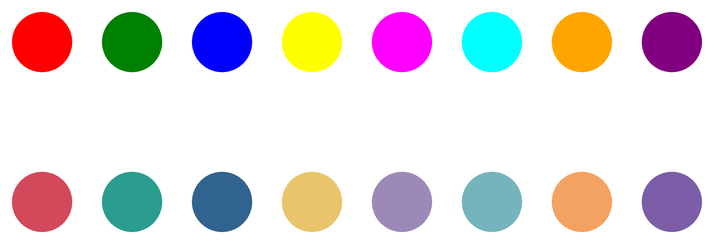
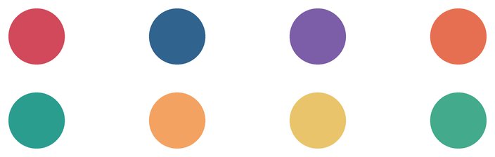
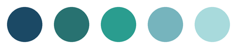
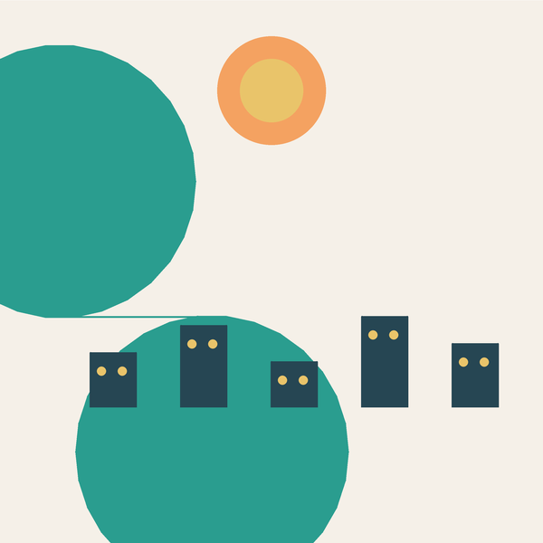

# Farben mischen und kombinieren

Du kennst `pencolor("red")` und `pencolor("blue")` – einfache Farbnamen, die Python kennt. Es gibt davon etwa hundert. Aber was, wenn du ein gedämpftes Rot willst, kein Feuerwehrrot? Oder ein helles, warmes Blau, kein knalliges Königsblau?

Dafür brauchst du **Hexadezimalwerte**.

## Von Farbnamen zu Hexadezimalwerten

:::snippet{#merken}
Es gibt drei Möglichkeiten, eine Farbe in Python anzugeben:

```python
pencolor("red")           # Farbname – einfach, aber begrenzt
pencolor("#d1495b")       # Hexadezimalwert – jede beliebige Farbe
colormode(255)            # einmal umschalten, danach:
pencolor(209, 73, 91)     # RGB-Werte – drei Zahlen von 0 bis 255
```

Im Lernpfad benutzen wir meistens **Farbnamen** und **Hexadezimalwerte**. Die RGB-Schreibweise brauchst du nur, wenn du Farben aus Zahlen **berechnen** willst – etwa für einen Farbverlauf.
:::

### Was ist ein Hexadezimalwert?

:::snippet{#merken}
Ein Hexadezimalwert wie `"#d1495b"` beschreibt eine Farbe durch drei Zahlen – für Rot, Grün und Blau:

```
#  d1  49  5b
   rot grn blu
```

Jede der drei Zahlen reicht von `00` (gar nicht) bis `ff` (voll). Je mehr von einer Farbe, desto heller wird der Anteil. Aus `#ff0000` wird reines Rot, aus `#00ff00` reines Grün, aus `#0000ff` reines Blau. `#ffffff` ist Weiß, `#000000` ist Schwarz.

Die Zeichen `0` bis `9` und `a` bis `f` sind das **Hexadezimalsystem** – es zählt bis 16 statt bis 10. `a` steht für 10, `f` für 15. `ff` ist 255 – der höchste Wert, den eine Komponente annehmen kann.
:::

:::snippet{#brain}
Du musst Hexadezimalwerte nicht auswendig können. Was du verstehen sollst:

- `#` sagt: „Das ist eine Farbe, kein Text."
- Die ersten beiden Zeichen sind der **Rotanteil**.
- Die mittleren beiden sind der **Grünanteil**.
- Die letzten beiden sind der **Blauanteil**.
- Je höher die Zahlen, desto **heller** die Farbe.

`#ff0000` ist reines Rot, `#990000` ist ein dunkles Rot, `#ffaaaa` ist ein helles Rosa. Die Struktur ist immer dieselbe – nur die Zahlen ändern sich.
:::

### Grelle vs. gedämpfte Farben

Die Standardfarbnamen sind oft sehr grell. Hexadezimalwerte geben dir viel feinere Abstufungen:



| Farbname | Hexadezimalwert | Wirkung |
| --- | --- | --- |
| `"red"` | `"#d1495b"` | gedämpftes Rot statt Feuerwehrrot |
| `"green"` | `"#2a9d8f"` | tiefes Türkis statt Knallgrün |
| `"blue"` | `"#30638e"` | gedecktes Blau statt Königsblau |
| `"yellow"` | `"#e9c46a"` | warmes Senfgelb statt Neon-Gelb |
| `"purple"` | `"#7b5ea7"` | gedämpftes Violett statt Grell-Lila |

:::snippet{#brain}
Grelle Farben wirken auf dem Bildschirm schnell wie ein Kinderspielzeug. Gedämpfte Farben wirken **reifer** – wie in einem gut gestalteten Buch oder einem Plakat.

Der Unterschied liegt nicht in der Farbfamilie, sondern in der **Helligkeit** und **Sättigung**. Statt `#ff0000` (volles Rot) nimmst du `#d1495b` (etwas Rot, etwas Grün, etwas Blau – dann wird es gedämpfter).
:::

## Farben ausgeben und vergleichen

:::pyide{canvas}

```python
from turtle import *

shape("turtle")
screensize(600, 300)
speed(0)
hideturtle()
penup()

farben = ["red", "#d1495b", "blue", "#30638e", "green", "#2a9d8f"]

for i in range(len(farben)):
    goto(-250 + i * 100, 0)
    pencolor(farben[i])
    dot(50)
```

:::

:::snippet{#aufgabe}
a) Vergleiche die Farben paarweise: Wie unterscheiden sich `"red"` und `"#d1495b"`? Wie `"green"` und `"#2a9d8f"`?

b) Verändere die Hexadezimalwerte: Was passiert, wenn du aus `#d1495b` das `#ff0000` machst? Was wird aus `#000000`? Was aus `#ffffff`?

c) Probiere eigene Werte aus. Tipp: Auf [coolors.co](https://coolors.co/) kannst du Farben anklicken und den Hexadezimalwert abschreiben.
:::

## Gute Farbkombinationen finden

:::snippet{#merken}
Eine gute Palette besteht aus zwei bis fünf Farben, die zusammenpassen. Drei klassische Arten:

- **Komplementär:** zwei Farben, die im Farbkreis **gegenüberliegen**. Starker Kontrast.
- **Analog:** drei bis fünf Farben, die im Farbkreis **nebeneinanderliegen**. Harmonisch.
- **Triade:** drei Farben, die im Farbkreis ein **gleichseitiges Dreieck** bilden. Lebendig, aber ausgewogen.
:::

### Komplementärfarben

Zwei Farben, die sich im Farbkreis gegenüberstehen, erzeugen den stärksten Kontrast. Rot und Grün, Blau und Orange, Violett und Gelb.



| Paar | Wirkung |
| --- | --- |
| Rot `#d1495b` und Grün `#2a9d8f` | klassisch, kräftig |
| Blau `#30638e` und Orange `#f4a261` | warm-kalt-Kontrast |
| Violett `#7b5ea7` und Gelb `#e9c46a` | edel, leicht retro |

### Analoge Farben

Farben, die nebeneinander im Farbkreis liegen, wirken harmonisch – wie eine Farbfamilie, die von dunkel nach hell läuft.



```python
palette = ["#1b4965", "#287271", "#2a9d8f", "#76b4bd", "#a8dadc"]
```

Diese Palette eignet sich für Bilder, die **ruhig** wirken sollen: ein Himmel, eine Seenlandschaft, ein Muster ohne harten Kontrast.

## Eine Palette bauen

:::snippet{#merken}
Eine **Palette** ist eine kleine Liste von Farben, die zusammenpassen und das ganze Bild bestimmen. So legst du sie als Variablen an:

```python
FARBE_HINTERGRUND = "#f5f0e8"
FARBE_HIMMEL = "#76b4bd"
FARBE_HAUS = "#264653"
FARBE_DACH = "#e76f51"
FARBE_FENSTER = "#e9c46a"
```

Die Großbuchstaben zeigen: *Diese Werte sind die Regler des Bildes.* Willst du eine andere Stimmung, änderst du nur die Variablen – der Code bleibt gleich.
:::

### Eine fertige Palette


Diese Palette stammt von [coolors.co](https://coolors.co/) – einer Seite, auf der du Farben zusammenklicken kannst. Du drückst die Leertaste und bekommst eine neue Palette, bis dir eine gefällt. Den Hexadezimalwert jeder Farbe kopierst du ab.

```python
palette = ["#264653", "#287271", "#2a9d8f", "#8ab17d",
           "#babb74", "#e9c46a", "#efb366", "#f4a261",
           "#e76f51", "#d1495b", "#9c89b8", "#43505f"]
```

:::snippet{#aufgabe}
a) Gehe auf [coolors.co](https://coolors.co/) und erstelle eine eigene Palette mit fünf Farben.

b) Schreibe die fünf Hexadezimalwerte als Variablen in ein Programm und zeichne fünf Punkte damit.

c) Zeichne ein einfaches Bild: ein Haus mit Dach, Fenster und Hintergrund – alle Farben aus deiner Palette.
:::

## Ein Bild mit Palette

Hier ist ein Beispiel, wie eine Palette ein ganzes Bild bestimmt. Fünf Farben, ein Haus, eine Sonne, ein Hügel – alles aus demselben Sortiment.



:::pyide{canvas height="650px"}

```python
from turtle import *

shape("turtle")
screensize(600, 600)
speed(0)
hideturtle()
penup()

# --- Die Palette ---
FARBE_HINTERGRUND = "#f5f0e8"
FARBE_SONNE = "#f4a261"
FARBE_SONNE_INNEN = "#e9c46a"
FARBE_HUEGEL = "#2a9d8f"
FARBE_HAUS = "#264653"
FARBE_FENSTER = "#e9c46a"

# --- Hintergrund ---
pencolor(FARBE_HINTERGRUND)
pensize(600)
goto(-300, 0)
pendown()
setheading(0)
forward(600)
penup()
pensize(1)

# --- Sonne ---
goto(0, 200)
pencolor(FARBE_SONNE)
dot(120)
pencolor(FARBE_SONNE_INNEN)
dot(70)

# --- Häuser ---
hoehen = [60, 90, 50, 100, 70]
for h in hoehen:
    goto(-200 + hoehen.index(h) * 100, -150)
    fillcolor(FARBE_HAUS)
    begin_fill()
    left(90)
    forward(h)
    right(90)
    forward(50)
    right(90)
    forward(h)
    end_fill()
    penup()
    setheading(0)
    # Fenster
    goto(-200 + hoehen.index(h) * 100 + 12, -150 + h - 20)
    pencolor(FARBE_FENSTER)
    dot(10)
    goto(-200 + hoehen.index(h) * 100 + 35, -150 + h - 20)
    dot(10)
```

:::

::::collapsible{title="Tipp: Warum eine Palette das Bild besser macht"}

Ohne Palette zeichnest du jedes Element in einer anderen Farbe: rotes Haus, grüner Baum, blauer Himmel, gelbe Sonne. Das wirkt wie ein Bastelbogen.

Mit Palette hast du fünf Farben, die zusammenpassen. Jedes Element benutzt eine davon. Das Bild wirkt wie aus **einem Guss** – so wie ein gut gestaltetes Plakat oder ein Buchcover.

Die Faustregel: **Drei bis fünf Farben reichen.** Mehr ist nicht besser – es ist nur bunter.
::::

## Farben in Listen

Besonders praktisch wird es, wenn du Farben in einer **Liste** speicherst. Dann kann die Schleife jede Farbe nacheinander verwenden:

```python
farben = ["#d1495b", "#30638e", "#2a9d8f", "#e9c46a", "#f4a261"]

for farbe in farben:
    pencolor(farbe)
    dot(50)
    forward(80)
```

So wird die Liste zur Palette – und das Bild entsteht daraus von allein. Genau das hast du in den [Challenges](../03-logik/05-challenges-bedingungen) schon gesehen, jetzt weißt du, woher die Farben kommen.

:::pyide{canvas}

```python
from turtle import *

shape("turtle")
screensize(600, 200)
speed(0)
hideturtle()
penup()

farben = ["#d1495b", "#30638e", "#2a9d8f", "#e9c46a", "#f4a261"]

for farbe in farben:
    pencolor(farbe)
    dot(50)
    forward(80)
```

:::

## Farbverläufe

:::snippet{#brain}
Wenn du von einer Farbe zur anderen **fließend** übergehen willst, brauchst du die RGB-Schreibweise. Du berechnest für jeden Punkt eine Mischung aus Start- und Zielfarbe:

```python
colormode(255)

start = (209, 73, 91)    # #d1495b
ende = (48, 157, 143)    # #2a9d8f

for i in range(20):
    anteil = i / 19
    r = round(start[0] + (ende[0] - start[0]) * anteil)
    g = round(start[1] + (ende[1] - start[1]) * anteil)
    b = round(start[2] + (ende[2] - start[2]) * anteil)
    pencolor(r, g, b)
    dot(34)
    forward(38)
```

`anteil` geht von 0 (nur Startfarbe) bis 1 (nur Zielfarbe). Dazwischen wird gemischt. So entsteht ein **Farbverlauf** – ohne eine einzige Hexadezimalzahl von Hand zu schreiben.
:::


:::pyide{canvas}

```python
from turtle import *

shape("turtle")
screensize(800, 200)
speed(0)
hideturtle()
penup()

colormode(255)

start = (209, 73, 91)    # #d1495b
ende = (48, 157, 143)    # #2a9d8f

for i in range(20):
    anteil = i / 19
    r = round(start[0] + (ende[0] - start[0]) * anteil)
    g = round(start[1] + (ende[1] - start[1]) * anteil)
    b = round(start[2] + (ende[2] - start[2]) * anteil)
    pencolor(r, g, b)
    dot(34)
    forward(38)
```

:::

## Wo du Farben findest

:::snippet{#merken}
Drei Quellen, alle kostenlos:

- [coolors.co](https://coolors.co/) – klicke Farben zusammen und kopiere die Hexadezimalwerte. Die einfachste Seite für Paletten.
- [w3schools.com/colors/colors_picker.asp](https://www.w3schools.com/colors/colors_picker.asp) – wähle eine Farbe und sieh alle Schattierungen. Gut für analoge Farben.
- [w3schools.com/colors/colors_x11.asp](https://www.w3schools.com/colors/colors_x11.asp) – alle Farbnamen, die Python kennt. Gut zum Ausprobieren ohne Hexadezimalwerte.
:::

---

## Selbsttest

::::multievent

**1. Wofür steht das Rautezeichen vor einem Hexadezimalwert?**

{r1{Es ist ein Kommentar}}
{r1{!Es zeigt an, dass ein Farbwert folgt}}
{r1{Es ist ein Tippfehler}}
{r1{Es steht für Schwarz}}
{h{In Python wäre es ein Kommentar – aber bei Farben hat es eine andere Bedeutung.}}
{H{Richtig! Es sagt: „Das ist eine Farbe, kein Text."}}

**2. Wie viele Zahlen stecken in einem Hexadezimalwert?**

{r2{Eine}}
{r2{!Drei}}
{r2{Sechs}}
{r2{Zwölf}}
{h{Denk an Rot, Grün und Blau.}}
{H{Richtig! Drei Zahlen, je zwei Zeichen lang.}}

**3. Was ist der Unterschied zwischen dem Farbnamen red und dem Hexadezimalwert #d1495b?**

{r3{Es gibt keinen}}
{r3{red ist heller}}
{r3{!#d1495b ist gedämpfter}}
{r3{red ist keine gültige Farbe}}
{h{Vergleiche die beiden Farben am Bildschirm.}}
{H{Richtig! Der Hexadezimalwert erlaubt feinere Abstufungen.}}

**4. Was ist eine Komplementärfarbe?**

{r4{Eine Farbe, die daneben liegt}}
{r4{!Eine Farbe, die im Farbkreis gegenüberliegt}}
{r4{Die gleiche Farbe, nur heller}}
{r4{Eine Farbe ohne Rotanteil}}
{h{Der stärkste Kontrast entsteht zwischen zwei Farben, die sich gegenüberstehen.}}
{H{Richtig! Rot und Grün, Blau und Orange.}}

**5. Was ist eine Palette?**

{r5{Eine Liste aller Farben, die Python kennt}}
{r5{!Eine kleine Auswahl von Farben, die zusammenpassen}}
{r5{Ein Werkzeug zum Zeichnen}}
{r5{Ein Programm}}
{h{Es ist die Auswahl, die ein ganzes Bild bestimmt.}}
{H{Richtig! Drei bis fünf Farben reichen meistens.}}

**6. Wofür braucht man colormode(255)?**

{r6{Um Hexadezimalwerte zu verwenden}}
{r6{!Um RGB-Werte wie pencolor(209, 73, 91) zu verwenden}}
{r6{Um Farbnamen zu verwenden}}
{r6{Um die Zeichenfläche zu vergrößern}}
{h{Ohne colormode(255) versteht Python die drei Zahlen nicht.}}
{H{Richtig! Danach kann man Farben aus Zahlen berechnen – etwa für einen Farbverlauf.}}

::::
