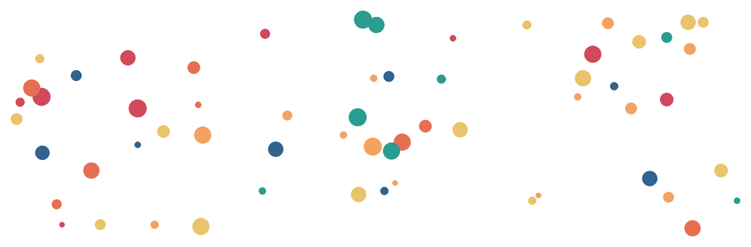

# Zufall und seed

Du hast `randint` schon in [Kapitel 4](../04-funktionen/03-funktionen-mit-rueckgabewert) kennengelernt: Es liefert eine zufällige Zahl. In den Challenges hast du es benutzt, um Bäume, Sterne und Blumen an zufälligen Positionen zu verteilen.

Jetzt kommt die Frage, die in den Challenges übergangen wurde: **Was, wenn du ein Bild genau so noch einmal zeichnen willst?**

## randint erinnert sich nicht

:::snippet{#merken}
`randint(a, b)` liefert bei jedem Aufruf eine **andere** Zahl. Das ist der Punkt – es ist zufällig.

```python
from random import randint

print(randint(1, 100))   # z.B. 73
print(randint(1, 100))   # z.B. 41
print(randint(1, 100))   # z.B. 88
```

Führst du das Programm noch einmal aus, kommen **andere** Zahlen. Das ist meistens richtig – aber nicht immer.
:::

:::pyide

```python
from random import randint

for i in range(5):
    print(randint(1, 100))
```

:::

:::snippet{#aufgabe}
Führe das Programm dreimal aus. Kommen jedes Mal dieselben Zahlen? Warum nicht?
:::

### Das Problem mit der Reproduzierbarkeit

:::snippet{#brain}
Stell dir vor, du hast einen Zufallswald gezeichnet – 22 Bäume, alle an zufälligen Positionen. Das Bild sieht toll aus, und du willst es **genau so** noch einmal haben.

Ohne `seed` geht das nicht. Beim nächsten Ausführen stehen die Bäume woanders. Du kannst die Positionen nicht notieren, weil du sie nicht kennst – der Zufall hat sie erzeugt, und er erinnert sich nicht daran.

Genau dafür gibt es `seed`.
:::

## seed: Der Zufall mit Gedächtnis

:::snippet{#merken}
`seed(zahl)` legt den Startpunkt des Zufallsgenerators fest. Danach liefert `randint` **dieselbe Folge** von Zahlen – jedes Mal, wenn du das Programm ausführst.

```python
from random import randint, seed

seed(42)
print(randint(1, 100))   # immer 82
print(randint(1, 100))   # immer 15
print(randint(1, 100))   # immer 4
```

Ändere die Zahl in `seed(42)`, und die Zahlen ändern sich – aber wieder **reproduzierbar**. `seed(7)` liefert eine andere Folge als `seed(42)`, aber jedes Mal dieselbe.
:::

:::pyide

```python
from random import randint, seed

seed(42)
for i in range(5):
    print(randint(1, 100))
```

:::

:::snippet{#aufgabe}
a) Führe das Programm dreimal aus. Kommen jetzt jedes Mal **dieselben** Zahlen?

b) Ändere `seed(42)` zu `seed(7)`. Welche Zahlen kommen jetzt? Sind sie anders als bei `seed(42)`?

c) Was passiert, wenn du `seed` ganz weglässt?
:::

## Drei Bilder, drei seeds

Jeder `seed` erzeugt ein anderes Bild – aber **dasselbe** Bild, wenn man das Programm noch einmal ausführt. So entsteht eine Serie aus demselben Programm:



Alle drei Bilder stammen vom **exakt gleichen** Programm. Nur die Zahl in `seed(...)` wurde geändert.

:::pyide{canvas height="650px"}

```python
from turtle import *
from random import randint, seed

shape("turtle")
screensize(400, 300)
speed(0)
hideturtle()
penup()

# --- Die Regler ---
SEED = 1
ANZAHL = 30

# --- Die Regel ---
seed(SEED)
farben = ["#d1495b", "#30638e", "#2a9d8f", "#e9c46a", "#f4a261"]

for i in range(ANZAHL):
    goto(randint(-180, 180), randint(-130, 130))
    pencolor(farben[randint(0, len(farben) - 1)])
    dot(randint(8, 24))
```

:::

:::snippet{#aufgabe}
a) Ändere `SEED` auf 2, dann auf 3. Jedes Mal entsteht ein anderes Bild – aber wenn du denselben Seed noch einmal eingibst, kommt **dasselbe** Bild zurück.

b) Probiere `SEED = 0` aus. Was passiert?

c) Welcher Seed gefällt dir am besten? Notiere ihn – damit kannst du das Bild jederzeit wieder herstellen.
:::

::::collapsible{title="Tipp: Was passiert bei seed(0)?"}

`seed(0)` funktioniert genauso wie jeder andere Seed. Es ist kein Sonderfall – es ist einfach ein anderer Startpunkt. Die Zahlenfolge, die herauskommt, ist genauso reproduzierbar wie bei `seed(42)`.

Es gibt keine "bessere" oder "schlechtere" Seed-Zahl. Jede Zahl erzeugt eine andere, aber feste Folge.
::::

## Wann brauchst du seed – und wann nicht?

:::snippet{#merken}
Zwei Fälle, zwei Antworten:

**Ohne seed** – wenn das Bild bei jedem Ausführen **anders** aussehen soll. Das ist der Normalfall bei Spielen: Beim Zahlenraten soll jedes Mal eine andere Geheimzahl kommen. Beim Memory sollen die Karten jedes Mal neu gemischt werden.

**Mit seed** – wenn du ein Bild **reproduzieren** willst. Das ist der Fall bei generativer Kunst: Du hast ein Bild gefunden, das dir gefällt, und willst es genau so wieder herstellen können.
:::

| Ohne seed | Mit seed |
| --- | --- |
| Spiele (Zahlenraten, Memory) | Generative Kunst (Serien) |
| Jedes Mal anders – gewollt | Jedes Mal gleich – gewollt |
| `randint(1, 100)` | `seed(42)` dann `randint(1, 100)` |
| Nicht reproduzierbar | Reproduzierbar |

## Wo muss seed stehen?

:::snippet{#brain}
`seed` muss **vor** dem ersten `randint`-Aufruf stehen. Am besten ganz am Anfang des Programms, nach den Imports:

```python
from turtle import *
from random import randint, seed

seed(42)

# jetzt erst die Schleife mit randint
for i in range(20):
    goto(randint(-200, 200), randint(-150, 150))
    dot(randint(10, 30))
```

Würdest du `seed` **in** die Schleife schreiben, würde der Zufall bei jedem Durchlauf zurückgesetzt – und alle Punkte wären gleich. Das ist fast nie das, was man will.
:::

:::pyide{canvas}

```python
from turtle import *
from random import randint, seed

shape("turtle")
screensize(600, 300)
speed(0)
hideturtle()
penup()

# seed VOR der Schleife:
seed(42)

for i in range(20):
    goto(randint(-280, 280), randint(-130, 130))
    pencolor("#2a9d8f")
    dot(randint(10, 30))
```

:::

:::snippet{#aufgabe}
a) Verschiebe `seed(42)` **in** die Schleife (direkt vor `goto`). Was passiert? Warum?

b) Setze `seed` wieder an den Anfang, aber ändere die Zahl. Wie verändert sich das Bild?
:::

::::collapsible{title="Erklärung: seed in der Schleife"}

Wenn `seed` in der Schleife steht, wird der Zufallsgenerator bei jedem Durchlauf zurückgesetzt. Das bedeutet: Der erste `randint`-Aufruf liefert **jedes Mal** dieselbe Zahl. Alle Punkte landen an derselben Stelle und haben dieselbe Größe – es entsteht nur ein einziger Punkt.

Das ist der Unterschied: `seed` einmal vor der Schleife setzt den Startpunkt **einmal**. `seed` in der Schleife setzt ihn **jedes Mal** zurück – und der Zufall hat keine Chance, eine Folge zu erzeugen.
::::

## Mehrere Zufallszahlen pro Schleifendurchlauf

:::snippet{#brain}
Jeder `randint`-Aufruf verbraucht eine Zahl aus der Folge. Wenn du pro Punkt drei Aufrufe hast – x, y, Größe – dann braucht jeder Punkt drei Zahlen. Bei 20 Punkten sind das 60 Zahlen.

`seed` legt den Startpunkt fest. Danach gibt Python Zahl für Zahl heraus, bis die Folge erschöpft ist. Du musst dich nicht darum kümmern – aber es erklärt, warum ein anderer `seed` ein **völlig anderes** Bild erzeugt: Jede Zahl landet an einer anderen Stelle in einer anderen Reihenfolge.
:::

## seed und randint in den Challenges

In den Challenges der Kapitel 3, 4 und 5 hast du `seed` schon gesehen, ohne dass es erklärt wurde. Jetzt weißt du, was es macht:

- [Kapitel 4, Challenge "Zufallswald"](../04-funktionen/05-challenges-funktionen) – ohne `seed`, jeder Wald ist anders
- [Kapitel 4, Challenge "Komposition"](../04-funktionen/05-challenges-funktionen) – ohne `seed`, jedes Bild ist einmalig
- [Kapitel 5, Challenge "Stadt bei Nacht"](../05-listen/04-challenges-listen) – mit `seed(42)`, die Sterne stehen reproduzierbar

Wenn du jetzt eigene Serien machst, weißt du: **Ohne** seed ist jedes Bild ein Unikat. **Mit** seed ist es reproduzierbar – und eine andere Seed-Zahl gibt dir das nächste Bild der Serie.

---

## Selbsttest

::::multievent

**1. Was liefert randint(1, 100)?**

{r1{Immer dieselbe Zahl}}
{r1{!Jedes Mal eine andere Zahl zwischen 1 und 100}}
{r1{Eine Zahl über 100}}
{r1{Einen Text}}
{h{Der Name sagt es: rand für random, int für integer.}}
{H{Richtig! Beide Grenzen sind eingeschlossen.}}

**2. Was bewirkt seed(42)?**

{r2{Es liefert die Zahl 42}}
{r2{!Es legt den Startpunkt des Zufallsgenerators fest}}
{r2{Es erzeugt 42 Zufallszahlen}}
{r2{Es verhindert Zufall}}
{h{Danach kommt eine feste Folge von Zahlen – reproduzierbar.}}
{H{Richtig! Dieselbe seed-Zahl liefert dieselbe Folge.}}

**3. Was passiert ohne seed?**

{r3{Es gibt keine Zufallszahlen}}
{r3{!Bei jedem Ausführen kommen andere Zahlen}}
{r3{Es kommt immer 0 heraus}}
{r3{Python meldet einen Fehler}}
{h{Das ist der Normalfall bei Spielen.}}
{H{Richtig! Ohne seed ist alles zufällig und nicht reproduzierbar.}}

**4. Wo muss seed stehen?**

{r4{Am Ende des Programms}}
{r4{!Vor dem ersten randint-Aufruf}}
{r4{In der Schleife, vor jedem randint}}
{r4{Nach dem ersten randint}}
{h{Es legt den Startpunkt fest – also muss es vor den Würfen kommen.}}
{H{Richtig! Am besten gleich nach den Imports.}}

**5. Was passiert, wenn seed in der Schleife steht?**

{r5{Jeder Punkt ist anders}}
{r5{!Alle Punkte sind gleich, weil der Zufall zurückgesetzt wird}}
{r5{Es gibt einen Fehler}}
{r5{Nichts, es ist egal}}
{h{Der Startpunkt wird jedes Mal zurückgesetzt – also kommt immer dieselbe erste Zahl.}}
{H{Richtig! seed gehört vor die Schleife, nicht hinein.}}

**6. Wann brauchst du seed, wann nicht?**

{r6{Immer, es ist Pflicht}}
{r6{!Bei generativer Kunst ja, bei Spielen nein}}
{r6{Nie, es ist unnötig}}
{r6{Nur bei randint(1, 100)}}
{h{Spiele sollen jedes Mal anders sein. Bilder willst du reproduzieren.}}
{H{Richtig! seed ist ein Werkzeug, keine Pflicht.}}

::::
