# Random Noise

`randint` liefert zufällige Zahlen – das kennst du aus [Lektion 2](./02-zufall-und-seed). Aber Zufall ist mehr als nur zufällige Positionen. Wenn du Zufall auf **Farbe**, **Größe** und **Dichte** gleichzeitig anwendest, entsteht etwas Neues: **Rauschen**.

Rauschen – auf Englisch **Noise** – ist das Grundmaterial der generativen Kunst. Es sieht aus wie Zufall, aber es hat Struktur: ein Muster, das organisch wirkt, wie Sand auf einer Fläche oder Sterne am Himmel.

## Was ist Noise?

:::snippet{#merken}
**Noise** ist Zufall, der nicht mehr zufällig *aussieht*. Jeder einzelne Punkt ist zufällig gesetzt – aber zusammen ergeben sie eine Textur, ein Muster, eine Dichte.

Drei Arten von Noise, die du mit der Turtle erzeugen kannst:

- **Punkte-Noise** – viele Punkte an zufälligen Positionen, zufälliger Größe
- **Farb-Noise** – jeder Punkt bekommt eine zufällige Farbe aus einer Palette
- **Verlauf-Noise** – ein glatter Farbverlauf, der durch Zufall gestört wird
:::

:::snippet{#brain}
Der Unterschied zwischen "Zufall" und "Noise" ist subtil, aber wichtig:

- **Zufall** ist ein einzelner Wurf: `randint(1, 100)` liefert eine Zahl.
- **Noise** ist viele Würfe, die zusammen ein Bild ergeben: 400 Punkte, jeder an einer zufälligen Position, in zufälliger Größe – das Bild wirkt wie eine Textur, nicht wie eine Anordnung.

In der Musik entspricht das dem Unterschied zwischen einem einzelnen Ton und einem Rauschen: Ein Ton ist eine Frequenz, Rauschen sind alle Frequenzen gleichzeitig. Genau so ist Noise in der Bildkunst: alle Werte gleichzeitig.
:::

## Noise-Level 1: Pure Zufallspunkte

Die einfachste Form von Noise: viele Punkte an zufälligen Positionen. Nichts reguliert den Zufall – und trotzdem entsteht ein Muster, das nicht zufällig *wirkt*, sondern organisch.

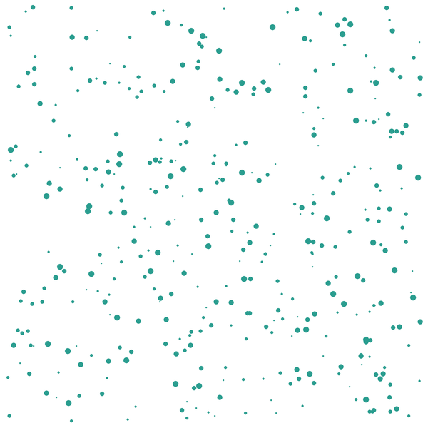

:::pyide{canvas height="650px"}

```python
from turtle import *
from random import randint, seed

shape("turtle")
screensize(600, 600)
speed(0)
hideturtle()
penup()

# --- Die Regler ---
SEED = 20240920
ANZAHL = 400
FARBE = "#2a9d8f"

# --- Die Regel ---
seed(SEED)

for i in range(ANZAHL):
    x = randint(-290, 290)
    y = randint(-290, 290)
    goto(x, y)
    pencolor(FARBE)
    dot(randint(2, 8))
```

:::

:::snippet{#aufgabe}
a) Verändere `ANZAHL` auf 100, dann auf 1000. Wann wirkt das Bild wie ein durchgehender Fleck, wann wie einzelne Sterne?

b) Verändere die Größe der Punkte: Was passiert bei `randint(1, 3)`? Was bei `randint(5, 20)`?

c) Probiere verschiedene `SEED`-Werte aus. Jeder Seed erzeugt eine andere Verteilung – aber alle wirken ähnlich organisch. Warum?
:::

::::collapsible{title="Tipp: Warum wirkt Zufall organisch?"}

Das menschliche Auge sucht in jedem Bild nach **Mustern**. Wenn es keine findet – wie bei reinem Zufall – liest es das als "natürlich": Sandkörner, Sternenhimmel, Blätter im Wind.

Paradox: Ein **regelmäßiges** Raster wirkt künstlich, ein **zufälliges** wirkt natürlich. Das ist der Grund, warum generative Kunst mit Noise so oft wie von Hand gemacht aussieht.
::::

## Noise-Level 2: Dichte-Variation

Wenn du nicht nur die Position, sondern auch die **Dichte** per Zufall steuerst, entstehen Regionen, die dichter oder spärlicher wirken. So entsteht ein Gefühl von Tiefe – ohne dass du eine einzige Linie zeichnest.

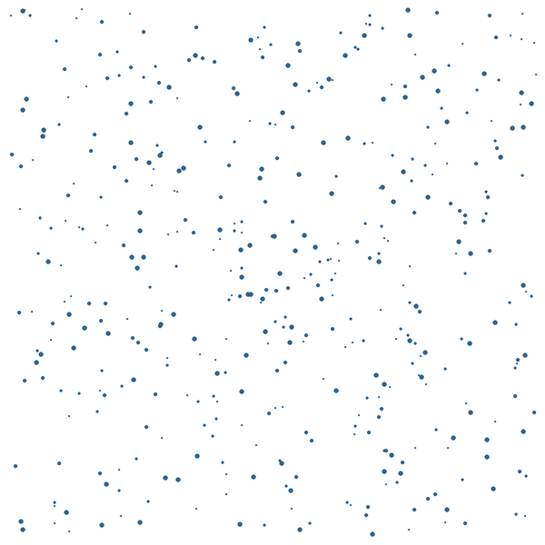

:::pyide{canvas height="650px"}

```python
from turtle import *
from random import randint, random, seed
import math

shape("turtle")
screensize(600, 600)
speed(0)
hideturtle()
penup()

# --- Die Regler ---
SEED = 20240921
ANZAHL = 800
FARBE = "#30638e"
ZENTRUM_X = 0
ZENTRUM_Y = 0
DICHTE_RADIUS = 80

# --- Die Regel ---
seed(SEED)

for i in range(ANZAHL):
    x = randint(-290, 290)
    y = randint(-290, 290)
    abstand = math.sqrt((x - ZENTRUM_X) ** 2 + (y - ZENTRUM_Y) ** 2)

    if abstand < DICHTE_RADIUS or random() > 0.5:
        goto(x, y)
        pencolor(FARBE)
        dot(randint(2, 5))
```

:::

:::snippet{#aufgabe}
a) Verändere `ZENTRUM_X` und `ZENTRUM_Y`. Wie verschiebt sich die dichte Region?

b) Erhöhe `DICHTE_RADIUS` auf 150. Wie verändert sich das Bild?

c) Füge ein **zweites Zentrum** hinzu: Setze eine weitere Bedingung für einen anderen Punkt. Wie wirken zwei dichte Regionen nebeneinander?
:::

::::collapsible{title="Tipp: Was macht random()?"}

`random()` (ohne Argumente) liefert eine Kommazahl zwischen 0.0 und 1.0 – also einen Zufallswert, der nicht ganzzahlig ist.

```python
from random import random

wurf = random()   # z.B. 0.73
```

`random() > 0.5` ist in etwa der Hälfte der Fälle wahr. `random() > 0.8` seltener. So steuerst du die **Wahrscheinlichkeit**, mit der ein Punkt gezeichnet wird – und damit die Dichte.

::::

## Noise-Level 3: Farb-Rauschen

Jeder Punkt bekommt eine zufällige Farbe aus einer Palette. Wenn die Palette zusammenpasst, wirkt das Rauschen wie eine zusammenhängende Fläche – ein Wandteppich aus Farben.

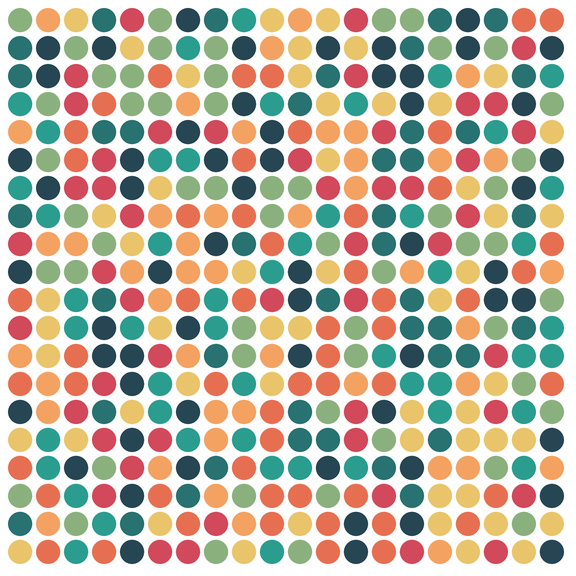

:::pyide{canvas height="650px"}

```python
from turtle import *
from random import randint, random, seed

shape("turtle")
screensize(600, 600)
speed(0)
hideturtle()
penup()

# --- Die Regler ---
SEED = 20240922
ANZAHL = 20
palette = ["#264653", "#287271", "#2a9d8f", "#8ab17d",
           "#e9c46a", "#f4a261", "#e76f51", "#d1495b"]

# --- Die Regel ---
seed(SEED)

for zeile in range(ANZAHL):
    for spalte in range(ANZAHL):
        x = -280 + spalte * 28
        y = 280 - zeile * 28
        goto(x, y)
        idx = randint(0, len(palette) - 1)
        if random() > 0.7:
            idx = (idx + randint(0, 2)) % len(palette)
        pencolor(palette[idx])
        dot(24)
```

:::

:::snippet{#aufgabe}
a) Ersetze die Palette durch nur drei Farben. Wie verändert sich das Bild?

b) Verändere die Wahrscheinlichkeit `0.7` auf `0.3` oder `0.9`. Wie wirkt sich das auf die "Benachbartheit" der Farben aus?

c) Probier aus, was passiert, wenn du die `if`-Bedingung ganz weglässt. Warum wirkt das Bild dann anders – flacher?
:::

::::collapsible{title="Tipp: Was macht die if-Bedingung?"}

Ohne die `if`-Bedingung ist jede Zelle völlig unabhängig von ihrer Nachbarin – das Bild wird lauter, gleichmäßiger.

Mit der `if`-Bedingung wird in 30% der Fälle (bei `random() > 0.7`) der Farbindex um 0 bis 2 Stellen verschoben. Das bedeutet: benachbarte Zellen bekommen **ähnliche** Farben – das Bild wirkt ruhiger, wie ein gewebter Teppich statt wie ein Pixel-Salat.

::::

## Noise-Level 4: Verlauf mit Rauschen

Ein glatter Farbverlauf ist schön – aber ein bisschen langweilig. Wenn du den Verlauf mit zufälligem Rauschen störst, entsteht etwas, das wie eine alte Wand oder ein vergilbtes Papier wirkt: eine Struktur, die nicht maschinell aussieht.

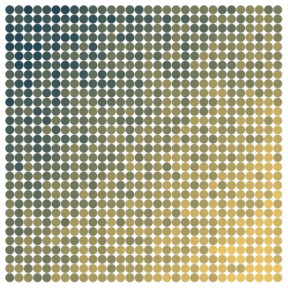

:::pyide{canvas height="650px"}

```python
from turtle import *
from random import uniform, seed

shape("turtle")
screensize(600, 600)
speed(0)
hideturtle()
penup()

# --- Die Regler ---
SEED = 20240923
ANZAHL = 30
RAUSCHEN = 0.15
start_farbe = (38, 70, 83)      # #264653
ende_farbe = (233, 196, 106)    # #e9c46a

# --- Die Regel ---
seed(SEED)
colormode(255)

for zeile in range(ANZAHL):
    for spalte in range(ANZAHL):
        x = -280 + spalte * 19
        y = 280 - zeile * 19
        goto(x, y)

        anteil = (zeile + spalte) / (ANZAHL * 2 - 2)
        noise = uniform(-RAUSCHEN, RAUSCHEN)
        anteil = max(0, min(1, anteil + noise))

        r = round(start_farbe[0] + (ende_farbe[0] - start_farbe[0]) * anteil)
        g = round(start_farbe[1] + (ende_farbe[1] - start_farbe[1]) * anteil)
        b = round(start_farbe[2] + (ende_farbe[2] - start_farbe[2]) * anteil)
        pencolor(r, g, b)
        dot(18)
```

:::

:::snippet{#aufgabe}
a) Setze `RAUSCHEN` auf `0`. Was passiert? Das Bild wird zu einem glatten Verlauf – ohne Noise.

b) Erhöhe `RAUSCHEN` auf `0.3`, dann `0.5`. Wie verändert sich die Textur? Ab wann wirkt das Bild chaotisch statt organisch?

c) Verändere `start_farbe` und `ende_farbe` auf zwei andere Farben aus einer Palette, die du auf [coolors.co](https://coolors.co/) gefunden hast.
:::

::::collapsible{title="Tipp: Was macht uniform()?"}

`uniform(a, b)` liefert eine zufällige Kommazahl zwischen `a` und `b` – also nicht ganzzahlig wie `randint`, sondern mit Nachkommastellen.

```python
from random import uniform

wurf = uniform(-0.15, 0.15)   # z.B. 0.073 oder -0.142
```

Für Noise brauchst du oft **feine** Abstufungen, nicht ganze Zahlen. `uniform` ist dafür das richtige Werkzeug: Es liefert einen Wert aus einem kontinuierlichen Bereich.

`RAUSCHEN = 0.15` bedeutet: der Verlauf wird um bis zu 15% seiner Länge pro Punkt gestört. Kleinere Werte erzeugen ein feineres Rauschen, größere ein gröberes.
::::

## Noise-Level 5: Perlin Noise

Alle bisherigen Noise-Arten haben einen Nachteil: benachbarte Punkte haben **nichts miteinander zu tun**. Jeder Punkt ist unabhängig vom Nachbar. Das Bild wirkt organisch – aber manchmal wie Salzgestreue, nicht wie eine zusammenhängende Textur.

**Perlin Noise** löst genau dieses Problem. Es wurde 1985 von Ken Perlin erfunden, um natürliche Texturen für Filme zu erzeugen. Der Unterschied zu purem Zufall: benachbarte Werte sind **korreliert** – ein hoher Wert neben einem anderen hohen, ein niedriger neben einem niedrigen. So entstehen glatte Übergänge statt harter Sprünge.

:::snippet{#merken}
**Perlin Noise** ist ein Algorithmus, der **zusammenhängendes** Rauschen erzeugt. Statt jedes Punktes unabhängig zu würfeln, berechnet Perlin Noise für jeden Punkt einen Wert, der zu seinen Nachbarn **passt**.

Das Ergebnis sieht aus wie:
- Höhenkarten (Berge, Täler, Hügel)
- Wolkentexturen (wie von einem Foto)
- Wasseroberflächen (mit Wellen und Strömung)

Mit `randint` und `random()` kannst du das **nicht** nachbauen – die Korrelation zwischen Nachbarn ist mathematisch aufwendig. Deshalb gibt es ein fertiges Paket.
:::

### Das Paket perlin-noise

:::snippet{#merken}
Das Paket `perlin-noise` ist eine Python-Bibliothek, die den Perlin-Noise-Algorithmus implementiert. Du benutzt es so:

```python
from perlin_noise import PerlinNoise

noise = PerlinNoise(octaves=3, seed=42)

# Einen einzelnen Noise-Wert an einer Position abfragen
wert = noise([0.5, 0.3])
```

- `PerlinNoise(octaves=..., seed=...)` erzeugt einen Noise-Generator.
- `noise([x, y])` liefert einen Wert zwischen etwa -0.5 und 0.5 für die Position (x, y).
- `octaves` steuert die Detailstufe: 1 ist sehr grob, 10 sehr fein.
- `seed` funktioniert wie bei `randint`: gleicher Seed = gleiches Bild.
:::

:::snippet{#brain}
**Was sind Oktaven?**

Perlin Noise arbeitet in Schichten, die man **Oktaven** nennt – wie bei der Musik. Jede Oktave fügt kleinere Details hinzu:

- 1 Oktave: nur große Hügel und Täler – sehr glatt
- 3 Oktaven: Hügel mit mittleren Details – natürlich
- 6 Oktaven: feine Textur mit vielen Details – wie Wolken oder Stein

Die Formel ist immer dieselbe – nur die Anzahl der Schichten ändert sich. Weniger Oktaven = glatter, mehr = detaillierter.
:::

### Perlin Noise vs. reiner Zufall

Der Vergleich zeigt den Unterschied sofort: Links reiner Zufall (`random()`), rechts Perlin Noise. Beide haben dieselbe Anzahl Punkte – aber die rechte Seite hat Struktur.

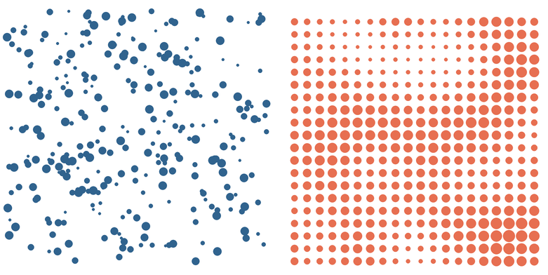

:::pyide{canvas height="650px" packages="perlin-noise"}

```python
from turtle import *
from random import randint, seed
from perlin_noise import PerlinNoise

shape("turtle")
screensize(800, 400)
speed(0)
hideturtle()
penup()

# --- Die Regler ---
SEED = 42
OKTAVEN = 3

# --- Links: reiner Zufall ---
seed(SEED)
for i in range(300):
    goto(randint(-390, -20), randint(-180, 180))
    pencolor("#30638e")
    dot(randint(4, 12))

# --- Rechts: Perlin Noise ---
noise = PerlinNoise(octaves=OKTAVEN, seed=SEED)
for zeile in range(20):
    for spalte in range(20):
        x = 20 + spalte * 18
        y = -180 + zeile * 18
        n = noise([zeile / 20, spalte / 20])
        groesse = 4 + (n + 0.5) * 14
        goto(x, y)
        pencolor("#e76f51")
        dot(int(groesse))
```

:::

:::snippet{#aufgabe}
a) Verändere `OKTAVEN` auf 1, dann auf 6. Wie verändert sich die rechte Seite? Bei 1 Oktave wirkt sie glatt, bei 6 detailliert.

b) Vergleiche linke und rechte Seite: Auf der rechten Seite haben benachbarte Punkte ähnliche Größen – auf der linken nicht. Warum?

c) Setze `SEED` auf 7. Beide Seiten verändern sich – aber nur die rechte bleibt strukturiert.
:::

### Perlin Noise als Höhenkarte: Berglandschaft

Wenn du Perlin Noise als Höhe interpretierst, entsteht eine Berglandschaft – mit Tälern und Gipfeln, die organisch wirken, weil die Höhen korreliert sind.

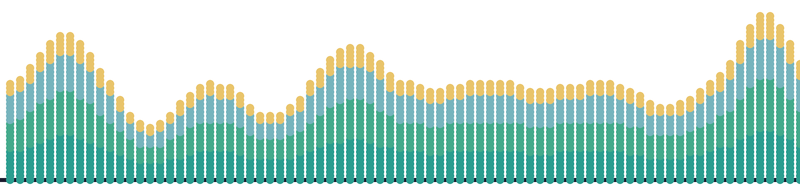

:::pyide{canvas height="650px" packages="perlin-noise"}

```python
from turtle import *
from perlin_noise import PerlinNoise

shape("turtle")
screensize(800, 500)
speed(0)
hideturtle()
penup()

# --- Die Regler ---
SEED = 7
OKTAVEN = 4
ANZAHL = 80

# --- Die Regel ---
noise = PerlinNoise(octaves=OKTAVEN, seed=SEED)

# Bodenlinie
goto(-400, -200)
pencolor("#1a1a2e")
pensize(4)
pendown()
setheading(0)
forward(800)
penup()
pensize(1)

# Berge
for x_idx in range(ANZAHL):
    x = -390 + x_idx * 10
    n = noise([x_idx / (ANZAHL / 2), 0.5])
    hoehe = int((n + 0.4) * 250)
    if hoehe > 0:
        for schicht in range(hoehe // 4):
            y = -200 + schicht * 4
            anteil = schicht / max(1, hoehe // 4)
            if anteil < 0.3:
                farbe = "#2a9d8f"
            elif anteil < 0.6:
                farbe = "#43aa8b"
            elif anteil < 0.85:
                farbe = "#76b4bd"
            else:
                farbe = "#e9c46a"
            goto(x, y)
            pencolor(farbe)
            dot(8)
```

:::

:::snippet{#aufgabe}
a) Verändere `SEED` auf 1, 2, 3. Jeder Seed erzeugt eine andere Landschaft – aber alle wirken wie echte Berge.

b) Erhöhe `OKTAVEN` auf 8. Die Landschaft wird **detailreicher** – mit mehr kleinen Gipfeln und Rillen. Warum?

c) Verändere die Farbpalette: Was passiert, wenn du die Farben umdrehst (Gipfel grün, Tal gelb)?
:::

::::collapsible{title="Tipp: Wie die Höhe aus Noise wird"}

Der Noise-Wert liegt zwischen -0.5 und 0.5. Die Zeile:

```python
hoehe = int((n + 0.4) * 250)
```

verschiebt den Wert so, dass er überwiegend positiv wird (0.4 als Verschiebung) und skaliert ihn auf Pixel (* 250). So wird ein Noise-Wert von 0.0 zu einer Höhe von 100 Pixeln – und ein Wert von 0.5 zu 225 Pixeln.

Durch die Korrelation der Perlin Noise entstehen **zusammenhängende** Höhenverläufe statt zufälliger Sprünge – deshalb wirkt es wie eine Bergkette.
::::

### Perlin Noise als Farbtextur

Wenn du Perlin Noise auf eine Farbpalette abbildest, entsteht eine glatte Textur – wie ein Marmor oder ein Wasserfarben-Hintergrund. Jede Zelle bekommt eine Farbe aus der Palette, und der Noise-Wert bestimmt, **welche** Farbe.

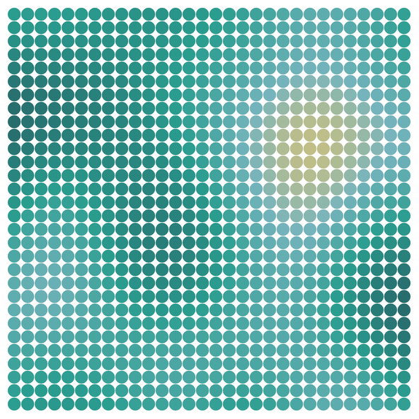

:::pyide{canvas height="650px" packages="perlin-noise"}

```python
from turtle import *
from perlin_noise import PerlinNoise

shape("turtle")
screensize(600, 600)
speed(0)
hideturtle()
penup()

# --- Die Regler ---
SEED = 3
OKTAVEN = 2
ANZAHL = 30
palette = [
    (38, 70, 83),     # #264653
    (40, 114, 113),   # #287271
    (42, 157, 143),   # #2a9d8f
    (118, 180, 189),  # #76b4bd
    (233, 196, 106),  # #e9c46a
]

# --- Die Regel ---
noise = PerlinNoise(octaves=OKTAVEN, seed=SEED)
colormode(255)

for zeile in range(ANZAHL):
    for spalte in range(ANZAHL):
        x = -280 + spalte * 19
        y = 280 - zeile * 19
        goto(x, y)

        n = noise([zeile / ANZAHL, spalte / ANZAHL])
        idx_f = (n + 0.5) * (len(palette) - 1)
        idx1 = int(idx_f)
        idx2 = min(idx1 + 1, len(palette) - 1)
        anteil = idx_f - idx1

        r = round(palette[idx1][0] + (palette[idx2][0] - palette[idx1][0]) * anteil)
        g = round(palette[idx1][1] + (palette[idx2][1] - palette[idx1][1]) * anteil)
        b = round(palette[idx1][2] + (palette[idx2][2] - palette[idx1][2]) * anteil)
        pencolor(r, g, b)
        dot(18)
```

:::

:::snippet{#aufgabe}
a) Erhöhe `OKTAVEN` auf 5. Die Textur wird unruhiger – mit mehr kleinen Farbwechseln.

b) Verändere die `palette` auf nur zwei Farben. Wie wirkt das Bild? Es sieht aus wie ein glatter Farbverlauf – aber mit Noise gestört.

c) Vergleiche dieses Bild mit dem Verlauf-Noise aus Level 4. Worin unterscheiden sich die beiden? Perlin Noise ist **glatter** – die Übergänge fließen, statt wie Salat gestreut zu sein.
:::

### Perlin Noise als Wolken

Mit vielen Oktaven wird Perlin Noise zu einer Wolkentextur: helle und dunkle Bereiche, die wie echte Wolken aussehen.

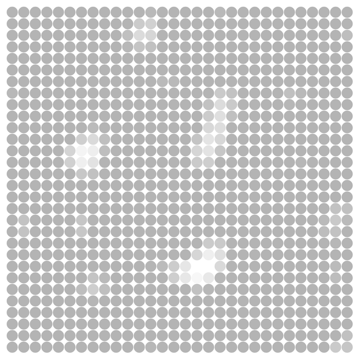

:::pyide{canvas height="650px" packages="perlin-noise"}

```python
from turtle import *
from perlin_noise import PerlinNoise

shape("turtle")
screensize(600, 600)
speed(0)
hideturtle()
penup()

# --- Die Regler ---
SEED = 11
OKTAVEN = 6
ANZAHL = 30

# --- Die Regel ---
noise = PerlinNoise(octaves=OKTAVEN, seed=SEED)
colormode(255)

for zeile in range(ANZAHL):
    for spalte in range(ANZAHL):
        x = -280 + spalte * 19
        y = 280 - zeile * 19
        goto(x, y)

        n = noise([zeile / ANZAHL, spalte / ANZAHL])
        helligkeit = (n + 0.5) * 255
        helligkeit = max(180, min(255, int(helligkeit)))
        pencolor(helligkeit, helligkeit, helligkeit)
        dot(18)
```

:::

::::collapsible{title="Wie die Wolken entstehen"}

Der Noise-Wert wird auf eine Graustufe zwischen 180 (dunkelgrau) und 255 (weiß) abgebildet:

```python
helligkeit = (n + 0.5) * 255
helligkeit = max(180, min(255, int(helligkeit)))
```

`max(180, ...)` sorgt dafür, dass es nie ganz schwarz wird – es bleibt eine Wolke, kein Nachthimmel. `min(255, ...)` verhindert, dass es über Weiß hinausgeht.

Sechs Oktaven (`octaves=6`) erzeugen die feine Textur, die Wolken von Sand unterscheidet: große Wolken mit kleinen Verästelungen darin.
::::

## Drei generative Kunstwerke mit Noise

### Kunstwerk 1: Nebel

Mehrere Zentren, um die herum Punktewolken entstehen. Jede Wolke hat ihre eigene Farbe aus einer analogen Palette – und das Bild wirkt wie ein Nebel, der aus verschiedenen Richtungen kommt.

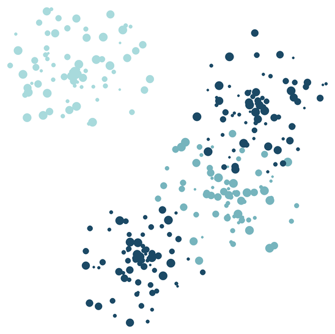

:::pyide{canvas height="650px"}

```python
from turtle import *
from random import randint, uniform, choice, seed
import math

shape("turtle")
screensize(600, 600)
speed(0)
hideturtle()
penup()

# --- Die Regler ---
SEED = 20240924
PUNKTE_PRO_ZENTRUM = 80
RADIUS = 120
palette = ["#1b4965", "#287271", "#2a9d8f", "#76b4bd", "#a8dadc"]
zentren = [(-150, 150), (100, -50), (-50, -150), (150, 100)]

# --- Die Regel ---
seed(SEED)

for cx, cy in zentren:
    farbe = choice(palette)
    for i in range(PUNKTE_PRO_ZENTRUM):
        winkel = uniform(0, 2 * math.pi)
        abstand = uniform(0, RADIUS)
        x = cx + abstand * math.cos(winkel)
        y = cy + abstand * math.sin(winkel)
        goto(x, y)
        pencolor(farbe)
        dot(randint(4, 14))
```

:::

::::collapsible{title="Wie der Nebel entsteht"}

Jedes Zentrum erzeugt eine **Punktwolke**: 80 Punkte, die in einem Kreis mit Radius 120 um das Zentrum gestreut werden. Die Position jedes Punkts wird durch einen zufälligen **Winkel** und einen zufälligen **Abstand** bestimmt:

```python
winkel = uniform(0, 2 * math.pi)   # voller Kreis
abstand = uniform(0, RADIUS)       # 0 bis RADIUS
x = cx + abstand * math.cos(winkel)
y = cy + abstand * math.sin(winkel)
```

`math.cos(winkel)` und `math.sin(winkel)` wandeln den Winkel in eine x- und y-Richtung um. So entsteht eine kreisförmige Verteilung statt eines quadratischen Rasters.

::::

### Kunstwerk 2: Landschaft

Geschichtete Horizonte, jeder mit Noise erzeugt. Die unteren Schichten sind heller, die oberen dunkler – und das Bild wirkt wie eine Berglandschaft im Morgennebel.

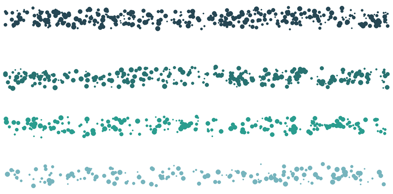

:::pyide{canvas height="650px"}

```python
from turtle import *
from random import randint, uniform, seed

shape("turtle")
screensize(800, 500)
speed(0)
hideturtle()
penup()

# --- Die Regler ---
SEED = 20240925
schichten = [
    (-200, "#76b4bd", 60),
    (-100, "#2a9d8f", 80),
    (0, "#287271", 100),
    (120, "#264653", 120),
]

# --- Die Regel ---
seed(SEED)

for basis_y, farbe, breite in schichten:
    for i in range(breite * 3):
        x = randint(-390, 390)
        y = basis_y + randint(-15, 15) + uniform(-8, 8)
        goto(x, y)
        pencolor(farbe)
        dot(randint(3, 10))
```

:::

::::collapsible{title="Wie die Landschaft entsteht"}

Jede Schicht hat einen Basis-y-Wert, eine Farbe und eine "Breite" (die Anzahl der Punkte). Die Punkte werden horizontal über die ganze Breite des Bildes gestreut, vertikal nur in einem schmalen Band um den Basis-Wert:

```python
y = basis_y + randint(-15, 15) + uniform(-8, 8)
```

Zwei Zufallsquellen addiert: `randint(-15, 15)` für die grobe Position und `uniform(-8, 8)` für die Feinverteilung. So entsteht ein Horizont, der nicht wie eine Linie aussieht, sondern wie ein unregelmäßiges Band – genau wie ein echter Bergkamm im Nebel.

::::

### Kunstwerk 3: Inselwelt

Perlin Noise bestimmt, wo Land entsteht und wo Wasser bleibt. Tiefe Noise-Werte werden zu dunklem Wasser, hohe zu Bergen – und dazwischen entstehen Küsten, Strände und Hügel. So entsteht eine Karte, die wie von Hand gezeichnet wirkt.

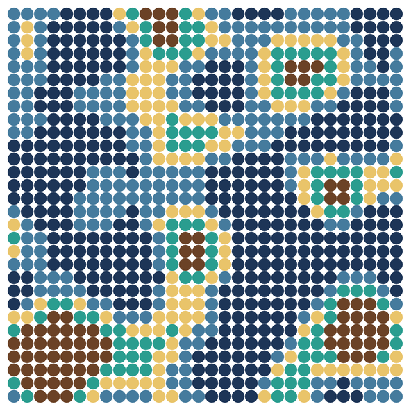

:::pyide{canvas height="650px" packages="perlin-noise"}

```python
from turtle import *
from perlin_noise import PerlinNoise

shape("turtle")
screensize(600, 600)
speed(0)
hideturtle()
penup()

# --- Die Regler ---
SEED = 5
OKTAVEN = 4
ANZAHL = 30

# --- Die Regel ---
noise = PerlinNoise(octaves=OKTAVEN, seed=SEED)

for zeile in range(ANZAHL):
    for spalte in range(ANZAHL):
        x = -280 + spalte * 19
        y = 280 - zeile * 19
        goto(x, y)

        n = noise([zeile / ANZAHL, spalte / ANZAHL])
        if n < -0.05:
            pencolor("#1d3557")   # tiefes Wasser
        elif n < 0.05:
            pencolor("#457b9d")   # flaches Wasser
        elif n < 0.12:
            pencolor("#e9c46a")   # Sand
        elif n < 0.22:
            pencolor("#2a9d8f")   # Land
        else:
            pencolor("#6b4226")   # Berge
        dot(18)
```

:::

::::collapsible{title="Wie die Inselwelt entsteht"}

Das Programm kombiniert vier Dinge aus verschiedenen Kapiteln:

1. **Raster** (Kapitel 2) – eine verschachtelte Schleife über Zeilen und Spalten.
2. **Verzweigung** (Kapitel 2) – `if`/`elif`/`else` ordnet jedem Noise-Wert eine Farbe zu.
3. **Perlin Noise** (diese Lektion) – der Noise-Wert bestimmt, **welche** Region entsteht.
4. **Palette** (Lektion 1) – fünf Farben, die von Wasser über Land zu Bergen laufen.

Die Schwellwerte sind entscheidend: `n < -0.05` ist tiefes Wasser, `n < 0.05` flaches Wasser, und so weiter. Weil Perlin Noise **korrelierte** Werte liefert, entstehen zusammenhängende Regionen statt vereinzelter Punkte – eine echte Insel statt eines Salatstreusels.
::::

## Welche random-Funktionen gibt es?

:::snippet{#merken}
Das Modul `random` bietet mehrere Funktionen, die in der generativen Kunst nützlich sind:

| Funktion | liefert | Beispiel |
| --- | --- | --- |
| `randint(a, b)` | ganze Zahl von `a` bis `b` (beide eingeschlossen) | `randint(1, 100)` → z.B. 42 |
| `random()` | Kommazahl von 0.0 bis 1.0 | `random()` → z.B. 0.73 |
| `uniform(a, b)` | Kommazahl von `a` bis `b` | `uniform(-0.15, 0.15)` → z.B. -0.07 |
| `choice(liste)` | ein zufälliges Element aus der Liste | `choice(["#d1495b", "#30638e"])` → z.B. "#30638e" |
| `seed(zahl)` | legt den Startpunkt fest | `seed(42)` – danach reproduzierbar |
| `PerlinNoise(octaves, seed)` | Noise-Generator mit korrelierten Werten | `noise([0.5, 0.3])` → z.B. -0.12 |

Alle außer `seed` verbrauchen eine Zahl aus der Zufallsfolge. `seed` setzt den Startpunkt und wird nur einmal am Anfang aufgerufen.
:::

:::snippet{#brain}
**Import:** Du kannst die Funktionen einzeln oder zusammen importieren:

```python
from random import randint, random, uniform, choice, seed
```

Oder alles auf einmal:

```python
from random import *
```

Dann stehen `randint`, `random`, `uniform`, `choice` und `seed` direkt zur Verfügung – ohne `random.` davor.
:::

## Noise und seed

:::snippet{#merken}
Noise-Bilder sind **reproduzierbar**, wenn du `seed` benutzt. Das kennst du schon aus [Lektion 2](./02-zufall-und-seed) – aber bei Noise ist es besonders wichtig:

Jeder `random()`-, `uniform()`- und `choice()`-Aufruf verbraucht eine Zahl aus der Folge. Bei 400 Punkten sind das hunderte Zahlen. Ohne `seed` ist das Bild bei jedem Ausführen anders – und du kannst es nie wieder herstellen.

Mit `seed` ist es genau umgekehrt: Jeder Seed erzeugt eine andere Textur, aber dieselbe Textur bei jedem Ausführen. So entsteht eine **Serie von Noise-Bildern** – einer der elegantesten Anwendungen von `seed`.
:::

## Deine Noise-Serie

:::pyide{canvas}

```python
from turtle import *
from random import randint, uniform, choice, random, seed
import math

shape("turtle")
screensize(600, 600)
speed(0)
hideturtle()
penup()

# Dein Noise-Programm hier
```

:::

:::snippet{#challenge}
Erstelle eine Serie aus **drei** Noise-Bildern:

1. Wähle eine der vier Noise-Arten (Punkte, Dichte, Farbe oder Verlauf) aus – oder kombiniere zwei.
2. Setze `SEED` auf drei verschiedene Werte und notiere sie.
3. Gib jedem Bild einen **Titel**, der die Stimmung beschreibt: "Nebel", "Sandsturm", "Morgenlicht" – was immer dir einfällt.
4. Vergleiche die drei Bilder: Was ist gleich (die Struktur), was ist verschieden (die konkrete Verteilung)?
:::

:::snippet{#brain}
Was du hier gemacht hast, ist genau das, was Künstlerinnen und Künstler der generativen Kunst seit den 1960er Jahren tun: Sie nutzen Zufall als **Material**, nicht als Zufall.

Der Künstler Frieder Nake hat 1965 ein Bild aus zufällig verteilten Polygonen programmiert. Das Programm war kurz – aber das Bild wirkte, als hätte jemand tagelang daran gearbeitet. Der Zufall war nicht das Gegenteil von Gestaltung, sondern ihr **Werkzeug**.
:::

---

## Selbsttest

::::multievent

**1. Was ist der Unterschied zwischen Zufall und Noise?**

{r1{Es gibt keinen}}
{r1{!Noise ist viele Zufallswerte, die zusammen ein Bild ergeben}}
{r1{Noise ist lauter als Zufall}}
{r1{Noise braucht kein Programm}}
{h{Denk an den Vergleich: ein Ton vs. Rauschen.}}
{H{Richtig! Ein einzelner Wurf ist Zufall, viele Würfe zusammen werden zu Noise.}}

**2. Welche random-Funktion liefert eine Kommazahl zwischen 0 und 1?**

{r2{randint(0, 1)}}
{r2{!random()}}
{r2{uniform(0, 1)}}
{r2{choice(0, 1)}}
{h{Es ist die Funktion ohne Argumente.}}
{H{Richtig! random() liefert z.B. 0.73.}}

**3. Wofür benutzt man uniform(-0.15, 0.15)?}

{r3{Für eine zufällige ganze Zahl}}
{r3{!Für ein feines Rauschen um einen glatten Verlauf}}
{r3{Um die Zeichenfläche zu vergrößern}}
{r3{Um eine Farbe zu wählen}}
{h{uniform liefert Kommazahlen, keine ganzen Zahlen.}}
{H{Richtig! So wird der Verlauf pro Punkt leicht gestört.}}

**4. Was macht choice(liste)?**

{r4{Es sortiert die Liste}}
{r4{!Es wählt ein zufälliges Element aus der Liste}}
{r4{Es löscht ein Element}}
{r4{Es liefert die Länge der Liste}}
{h{Der Name sagt es schon.}}
{H{Richtig! choice(["#d1495b", "#30638e"]) liefert eine der beiden Farben.}}

**5. Warum wirkt ein zufälliges Punktfeld oft organischer als ein regelmäßiges Raster?}

{r5{Weil es bunter ist}}
{r5{!Weil das Auge in einem regelmäßigen Raster das Muster erkennt, bei Zufall aber eine Textur sieht}}
{r5{Weil Zufall immer schöner ist}}
{r5{Weil regelmäßige Raster verboten sind}}
{h{Das Auge sucht nach Mustern. Findet es welche, liest es "künstlich". Findet es keine, liest es "natürlich".}}
{H{Richtig! Genau deshalb wirkt Noise so organisch.}}

**6. Warum braucht man seed bei Noise besonders dringend?**

{r6{Weil es sonst einen Fehler gibt}}
{r6{!Weil hunderte Zufallswerte nicht reproduzierbar sind ohne seed}}
{r6{Weil seed die Bilder schöner macht}}
{r6{Weil seed die Geschwindigkeit erhöht}}
{h{Bei 400 Punkten sind das 400+ Zufallswerte – ohne seed jedes Mal anders.}}
{H{Richtig! Mit seed ist jedes Noise-Bild reproduzierbar.}}

**7. Was ist der Hauptunterschied zwischen Perlin Noise und purem Zufall?**

{r7{Perlin Noise ist schneller}}
{r7{!Bei Perlin Noise sind benachbarte Werte korreliert – es entstehen glatte Übergänge}}
{r7{Perlin Noise braucht kein seed}}
{r7{Es gibt keinen Unterschied}}
{h{Bei purem Zufall hat jeder Punkt nichts mit dem Nachbar zu tun. Bei Perlin Noise schon.}}
{H{Richtig! Deshalb wirkt Perlin Noise wie eine Landschaft, nicht wie Salz.}}

**8. Was steuert der Parameter octaves bei PerlinNoise?**

{r8{Die Größe der Zeichenfläche}}
{r8{!Die Detailstufe – mehr Oktaven bedeutet mehr kleine Details}}
{r8{Die Anzahl der Punkte}}
{r8{Die Farbe}}
{h{Denk an die Musik: jede Oktave fügt eine kleinere Schicht hinzu.}}
{H{Richtig! 1 Oktave ist glatt, 6 ist detailliert.}}

::::
