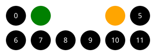

# Projekt: Memory

Im unten dargestellten Programm wird ein einfaches **Memory-Spiel** simuliert. Allerdings kann es noch deutlich verbessert werden – genau das ist Inhalt dieses Projekts.



## Das Spiel

:::pyide{canvas height="700px"}

```python
from random import randint
from turtle import *


def gehe_zu_karte(nummer):
    goto(-125 + (nummer % 6) * 50, 50 - (nummer // 6) * 50)


def zeichne_karte(nummer):
    gehe_zu_karte(nummer)

    if karten[nummer] == 1:
        pencolor("red")
    elif karten[nummer] == 2:
        pencolor("blue")
    elif karten[nummer] == 3:
        pencolor("green")
    elif karten[nummer] == 4:
        pencolor("yellow")
    elif karten[nummer] == 5:
        pencolor("orange")
    elif karten[nummer] == 6:
        pencolor("purple")

    dot(40)


def verdecke_karte(nummer):
    gehe_zu_karte(nummer)
    pencolor("black")
    dot(40)
    pencolor("white")
    goto(xcor(), ycor() - 5)
    # Mit str(...) wird die Zahl in Text umgewandelt.
    write(str(nummer), align="center")


def verdecke_karten():
    clear()
    i = 0
    while i < len(karten):
        if karten[i] != 0:
            verdecke_karte(i)
        i = i + 1


def spielrunde():
    erste = int(input("1. Karte? "))
    while karten[erste] == 0:
        erste = int(input("Bitte als 1. Karte eine noch vorhandene wählen! "))
    zeichne_karte(erste)

    zweite = int(input("2. Karte? "))
    while karten[zweite] == 0:
        zweite = int(input("Bitte als 2. Karte eine noch vorhandene wählen! "))
    zeichne_karte(zweite)

    if karten[erste] == karten[zweite]:
        karten[erste] = 0
        karten[zweite] = 0

    input("Weiter mit Enter ")


def summe():
    ergebnis = 0
    for zahl in karten:
        ergebnis = ergebnis + zahl
    return ergebnis


def mische():
    i = 0
    while i < len(karten) - 1:
        # randint(0, 1) liefert 0 oder 1 als Zufallszahl.
        if randint(0, 1) == 1:
            tmp = karten[i]
            karten[i] = karten[i + 1]
            karten[i + 1] = tmp
        i = i + 1


# Hauptprogramm

# Vorbereitungen
shape("turtle")
screensize(500, 300)
speed(0)
hideturtle()
penup()

karten = [1, 1, 2, 2, 3, 3, 4, 4, 5, 5, 6, 6]
mische()

# Spielschleife
while summe() > 0:
    verdecke_karten()
    spielrunde()

clear()
print("Alle Paare gefunden!")
```

:::

## Ablauf des Projekts

:::snippet{#merken}
**Phase 1 – Analysieren.** Analysiert zunächst den gegebenen Programmtext **gründlich**. Ihr könnt das Programm dabei parallel schon testen.

**Phase 2 – Ist-Zustand beschreiben.** Beschreibt, wie das Spiel momentan abläuft. Notiert alles, was euch auffällt – auch das, was euch stört.

**Phase 3 – Ideen sammeln.** Sammelt Ideen für Verbesserungen. Diese werden später im Plenum zusammengetragen.

**Phase 4 – Umsetzen.** Wählt eine der vorgeschlagenen Verbesserungen aus und setzt sie um. Ist das gelungen, wählt die nächste – und so fort.

**Phase 5 – Austauschen.** In der letzten Phase tauscht ihr die fertigen Spiele untereinander aus und gebt euch gegenseitig Feedback.
:::

## Hilfen für Phase 1

::::collapsible{title="Wie ist das Programm aufgebaut?"}

Das Programm besteht aus zwei Teilen:

1. **Sieben Funktionen**, die jeweils eine klar abgegrenzte Teilaufgabe erledigen.
2. Ein kurzes **Hauptprogramm** ganz unten, das alles zusammensetzt.

Geht die Funktionen einzeln durch und beantwortet für jede: *Was macht sie? Was bekommt sie? Was gibt sie zurück?*

::::

::::collapsible{title="Was bedeuten die Zahlen in der Liste karten?"}

Die Liste `karten` enthält für jede der zwölf Positionen eine Zahl von 1 bis 6 – das ist das **Motiv** der Karte. Jedes Motiv kommt genau zweimal vor.

Eine **0** hat eine besondere Bedeutung: Sie steht für „diese Karte ist bereits gefunden und liegt nicht mehr auf dem Tisch".

::::

::::collapsible{title="Wie funktioniert gehe_zu_karte?"}

Die zwölf Karten liegen in **zwei Reihen zu je sechs** Karten. Aus der Kartennummer wird die Position berechnet:

- `nummer % 6` liefert die **Spalte** (0 bis 5),
- `nummer // 6` liefert die **Zeile** (0 oder 1).

Das sind genau die beiden Divisionsoperatoren aus Kapitel 1 – hier bei einer echten Anwendung.

::::

::::collapsible{title="Warum funktioniert die Abbruchbedingung mit summe?"}

Wird ein Paar gefunden, werden beide Einträge auf 0 gesetzt. Sind alle Paare gefunden, enthält die Liste nur noch Nullen – die Summe ist dann 0.

Solange also noch irgendwo eine Zahl ungleich 0 steht, ist die Summe größer als 0 und die Schleife läuft weiter.

::::

## Hilfen für Phase 3

::::collapsible{title="Woran könnte man arbeiten?"}

Falls euch nichts einfällt: Achtet beim Spielen besonders auf diese Punkte.

**Fairness und Regeln**

- Was passiert, wenn man **zweimal dieselbe Karte** wählt?
- Was passiert bei einer Eingabe außerhalb von 0 bis 11? Und bei einer Eingabe, die gar keine Zahl ist?
- Werden die Karten wirklich **gut** gemischt? Lasst euch die Liste nach dem Mischen einmal ausgeben und beobachtet, wie weit sich eine Karte höchstens bewegen kann.

**Spielerlebnis**

- Man erfährt nicht, **ob** man ein Paar gefunden hat.
- Die **Anzahl der Versuche** wird nicht gezählt.
- Am Ende gibt es keine richtige Auswertung.
- Zwei Spielerinnen oder Spieler könnten abwechselnd dran sein.

**Darstellung**

- Die Karten könnten **quadratisch** statt rund sein.
- Es könnte mehr als sechs Motive und mehr als zwei Reihen geben.
- Die Größe des Spielfelds könnte sich automatisch an die Kartenzahl anpassen.

::::

## Arbeitsbereich

Kopiert euch das Programm von oben hierher und entwickelt es weiter.

:::pyide{canvas height="700px"}

```python
from random import randint
from turtle import *

# Euer verbessertes Memory hier
```

:::

## Reflexion

:::snippet{#aufgabe}
Haltet am Ende schriftlich fest:

- Welche Verbesserung war am **schwierigsten** umzusetzen? Warum?
- An welcher Stelle habt ihr das gegebene Programm **verstehen** müssen, bevor ihr es ändern konntet?
- Hat euch die Aufteilung in Funktionen beim Ändern geholfen oder eher gestört?
:::

::textinput{placeholder="Unsere Reflexion ..."}

:::snippet{#brain}
Fremden Code lesen und verändern zu müssen ist in der Softwareentwicklung der **Normalfall** – deutlich häufiger, als etwas ganz neu zu schreiben.

Deshalb ist gut lesbarer Code so wertvoll: sprechende Namen, kleine Funktionen mit einer klaren Aufgabe und Kommentare an den Stellen, die nicht selbsterklärend sind.
:::
