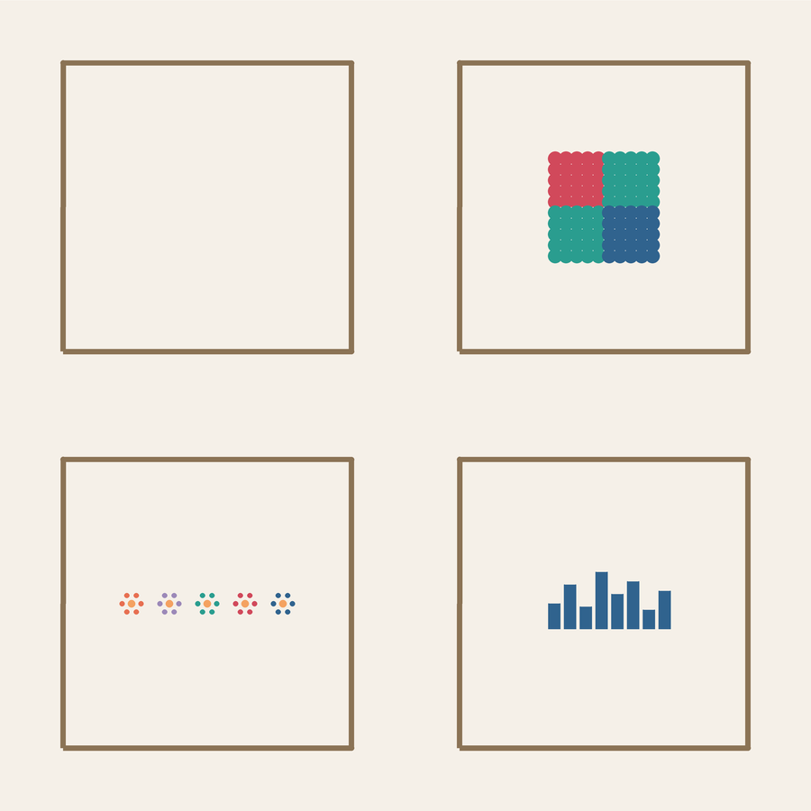

# Projekt: Generative Galerie

In den Challenges der Kapitel 2 bis 5 hast du viermal generative Kunst erzeugt: Muster aus Schleifen, Bilder aus Bedingungen, Kunst aus Funktionen und Kompositionen aus Listen. In diesem Projekt bringst du alles zusammen.

Das Ziel ist eine **Ausstellung**: Jede Gruppe entwickelt eine Serie von Bildern und stellt sie der Klasse vor.



## Das Ziel

:::snippet{#merken}
Jede Gruppe produziert eine **Serie** aus mindestens vier Bildern, die alle nach demselben **Prinzip** entstehen, aber einzeln betrachtet unterschiedlich wirken.

Die Serie wird am Ende **ausgestellt**. Zu jedem Bild gehört ein **Titel** und ein **Kommentar**, der erklärt, welche Regel dahintersteht – so wie in einer echten Galerie.
:::

## Welches Prinzip wählst du?

:::snippet{#brain}
Du darfst **eines** der vier Challenge-Prinzipien wählen oder mehrere kombinieren:

| Prinzip | Kapitel | Werkzeug |
| --- | --- | --- |
| Muster aus Wiederholung | 2 | Schleifen, Variablen, Regler |
| Bilder aus Bedingungen | 3 | `and`, `or`, `not`, Regionen |
| Kunst aus Funktionen | 4 | Motiv-Funktionen, Parameter, `randint` |
| Kunst aus Listen | 5 | Listen, Index, `for-in` |

**Kombinieren** ist ausdrücklich erlaubt: Eine Skyline aus Listen, deren Fenster durch eine boolesche Liste gesteuert werden und die Farben durch eine Funktion bestimmt werden – das nutzt drei Kapitel gleichzeitig.
:::

## Ablauf des Projekts

:::snippet{#merken}
**Phase 1 – Prinzip wählen.** Jede Gruppe entscheidet sich für ein Prinzip (oder eine Kombination). Probiert in den Challenge-Seiten der entsprechenden Kapitel herum, bis ihr wisst, was ihr machen wollt.

**Phase 2 – Serie entwickeln.** Verändert die Regler, Listen oder Parameter so, dass **vier deutlich verschiedene** Bilder entstehen. Notiert zu jedem Bild die Einstellungen – sonst ist das Bild nicht reproduzierbar.

**Phase 3 – Titel und Kommentar.** Gebt jedem Bild einen Titel und schreibt einen kurzen Kommentar, der die Regel erklärt. Der Kommentar soll so sein, dass jemand, der das Programm nicht kennt, die Idee versteht.

**Phase 4 – Ausstellung.** Die Serien werden in der Klasse ausgestellt. Jede Gruppe stellt ihre Bilder vor und erklärt ihr Prinzip. Die anderen erraten, welche Regel dahintersteckt.

**Phase 5 – Reflexion.** Wir reflektieren, welche Prinzipien welche Bilder erzeugen und was gut funktioniert hat.
:::

## Die vier Prinzipien im Überblick

### Muster aus Wiederholung (Kapitel 2)

:::snippet{#aufgabe}
Das Prinzip: Eine Schleife zeichnet eine Figur immer wieder, ein Regler verändert sie bei jedem Durchlauf.

Beispiele: Rosetten, Spiralen, Raster mit wachsenden Punkten.

Eure Serie könnte aus vier Rosetten bestehen, die sich durch `ANZAHL`, `WINKEL` und die Figur unterscheiden. Oder aus vier Spiralen mit verschiedenen Winkeln.
:::

::::collapsible{title="Erinnerung: Die Regler"}

```python
ANZAHL = 36
WINKEL = 10
GROESSE = 140

for i in range(ANZAHL):
    # Figur zeichnen
    left(WINKEL)
```

Verändert nur einen Regler pro Bild – sonst wisst ihr hinterher nicht, was den Unterschied gemacht hat.
::::

### Bilder aus Bedingungen (Kapitel 3)

:::snippet{#aufgabe}
Das Prinzip: Ein Raster aus Punkten, und die Bedingung entscheidet, welche Region welche Farbe bekommt.

Beispiele: Drei-Farben-Quadranten, Ringe, L-Formen, Schachbretter.

Eure Serie könnte aus vier Rastern bestehen, die jeweils eine andere `and`/`or`-Bedingung verwenden.
:::

::::collapsible{title="Erinnerung: Die Bedingung"}

```python
if zeile < 6 and spalte < 6:
    pencolor(FARBE_A)
elif zeile >= 6 and spalte >= 6:
    pencolor(FARBE_B)
else:
    pencolor(FARBE_C)
```

Jede Bedingung teilt das Feld anders – und das Bild sieht ganz anders aus, obwohl nur eine Zeile verändert wurde.
::::

### Kunst aus Funktionen (Kapitel 4)

:::snippet{#aufgabe}
Das Prinzip: Eine Funktion zeichnet ein Motiv, und du stempelst es mit verschiedenen Parametern an verschiedene Orte – auch zufällige.

Beispiele: Blumenwiesen, Sternenfelder, Zufallswälder.

Eure Serie könnte aus demselben Motiv bestehen, das mit verschiedenen Parametern, Dichten und Farbfamilien gestempelt wird.
:::

::::collapsible{title="Erinnerung: Die Funktion"}

```python
def blume(groesse, farbe):
    for i in range(6):
        setheading(i * 60)
        forward(groesse)
        dot(groesse * 0.5)
        backward(groesse)
    pencolor("gold")
    dot(groesse * 0.7)
```

`randint` sorgt dafür, dass kein Bild dem anderen gleicht – aber die Serie bleibt erkennbar.
::::

### Kunst aus Listen (Kapitel 5)

:::snippet{#aufgabe}
Das Prinzip: Eine Liste enthält die Daten – Höhen, Farben, Noten – und die Schleife macht daraus das Bild. Ändert sich die Liste, ändert sich das Bild.

Beispiele: Skylines, Partituren, Kartenmuster, Städte bei Nacht.

Eure Serie könnte aus derselben Schleife mit vier verschiedenen Listen bestehen. Das Programm bleibt identisch – nur die Daten ändern sich.
:::

::::collapsible{title="Erinnerung: Die Liste"}

```python
hoehen = [40, 80, 55, 120, 35, 100, 60, 140]

for i in range(len(hoehen)):
    fillcolor("#30638e")
    begin_fill()
    left(90)
    forward(hoehen[i])
    right(90)
    forward(55)
    right(90)
    forward(hoehen[i])
    end_fill()
    penup()
    setheading(0)
    forward(15)
```

Vier verschiedene Listen – vier verschiedene Städte. Das ist die Idee: Das Bild steht in der Liste.
::::

## Arbeitsbereich

Entwickelt hier eure Serie. Kopiert den Code aus der Challenge, die ihr gewählt habt, und variiert ihn.

:::pyide{canvas height="700px" packages="perlin-noise"}

```python
from turtle import *
from random import randint, seed

shape("turtle")
screensize(800, 600)
speed(0)
hideturtle()
penup()

# Euer Code hier
```

:::

## Was eine gute Serie ausmacht

:::snippet{#brain}
Eine Serie ist mehr als vier beliebige Bilder. Drei Dinge machen sie stark:

**Einheitlichkeit.** Alle Bilder folgen demselben Prinzip – man sieht sofort, dass sie zusammengehören. Rosetten mit verschiedenen Figuren sind eine Serie; eine Rosette, eine Skyline, ein Schachbrett und ein Blumenfeld sind vier Einzelbilder.

**Kontrast.** Trotz der Einheitlichkeit sind die Bilder deutlich verschieden. Vier Rosetten, die fast gleich aussehen, sind langweilig. Der Kontrast kann in der Größe, der Farbe, der Dichte oder der Form liegen.

**Reproduzierbarkeit.** Jedes Bild ist durch seine Einstellungen eindeutig bestimmt. Notiert die Werte – sonst könnt ihr das Bild nie wieder herstellen.
:::

## Ideen für Kombinationen

::::collapsible{title="Logik + Listen: Das bedingte Raster aus Listen"}

Zwei Listen steuern ein Raster: eine Liste von Farben und eine Liste von Wahrheitswerten. Die Bedingung kombiniert beide:

```python
farben = ["#d1495b", "#30638e", "#2a9d8f"]
aktiv = [True, False, True, True, False, ...]

for i in range(len(aktiv)):
    if aktiv[i]:
        pencolor(farben[i % len(farben)])
    else:
        pencolor("lightgray")
    dot(20)
    forward(30)
```

::::

::::collapsible{title="Funktionen + Listen: Die parametrisierte Stadt"}

Eine Funktion zeichnet ein Haus mit Parametern, eine Liste steuert die Höhen, eine weitere die Farben:

```python
def haus(hoehe, farbe):
    fillcolor(farbe)
    begin_fill()
    left(90)
    forward(hoehe)
    right(90)
    forward(50)
    right(90)
    forward(hoehe)
    end_fill()
    penup()
    setheading(0)

hoehen = [60, 120, 80, 160, 50]
farben = ["#30638e", "#1b4965", "#2a9d8f", "#1b4965", "#30638e"]

for i in range(len(hoehen)):
    haus(hoehen[i], farben[i])
    forward(60)
```

::::

::::collapsible{title="Funktionen + Zufall + Logik: Der Zufallsgarten"}

Eine Funktion zeichnet eine Blume, `randint` bestimmt die Position, und die Bedingung entscheidet die Farbe nach der Position:

```python
def blume(groesse, farbe):
    for i in range(6):
        setheading(i * 60)
        forward(groesse)
        dot(groesse * 0.5)
        backward(groesse)
    pencolor("gold")
    dot(groesse * 0.7)

seed(42)
for _ in range(20):
    x = randint(-350, 350)
    y = randint(-250, 250)
    goto(x, y)
    if y > 0:
        blume(randint(15, 25), "#e76f51")
    else:
        blume(randint(20, 35), "#2a9d8f")
```

::::

## Reflexion

:::snippet{#aufgabe}
Haltet am Ende schriftlich fest:

- Welches der vier Prinzipien war am **schwersten** zu variieren? Warum?
- Welche Bilder haben die Klasse am **meisten** überrascht – und woran lag das?
- Welches Prinzip hätte man noch nehmen können, wenn man noch ein fünftes Bild machen müsste?
:::

::textinput{placeholder="Unsere Reflexion ..."}

:::snippet{#brain}
Was ihr hier erlebt habt, ist genau das, was Künstlerinnen und Künstler der generativen Kunst tun: Sie wählen ein **Prinzip**, variieren es systematisch und stellen die Ergebnisse als **Serie** aus.

Der Künstler Georg Nees hat 1965 eines der ersten Computerbilder ausgestellt. Es bestand aus einem Programm, das Linien zufällig verteilte. Das Prinzip war simpler als alles, was ihr in diesem Kapitel geschrieben habt – aber die Idee war dieselbe: die Regel ist das Kunstwerk, das Bild ist ihr Ergebnis.
:::
