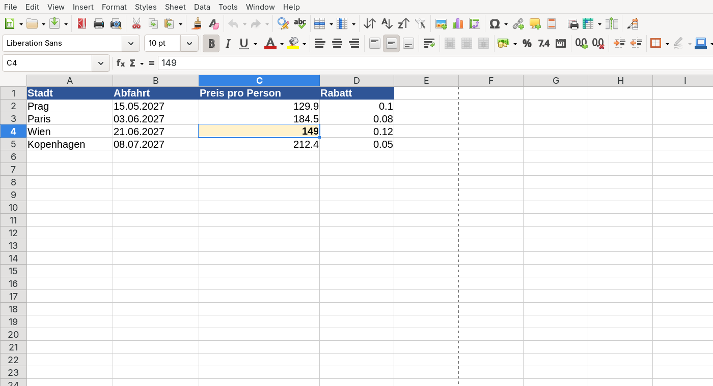

# Zellen und Datentypen

In einer Tabelle sieht zunächst alles wie Text in Kästchen aus. Für Calc macht es aber einen großen Unterschied, ob `12,5` eine Zahl, Text oder ein Datum ist.

## Die Oberfläche erkunden

Ordne in der LearningApp die Bezeichnungen den Bereichen der Tabellenkalkulation zu. Lass LibreOffice Calc gleichzeitig geöffnet und zeige jedes gefundene Element auch im echten Programm.

::embed{src="https://learningapps.org/show.php?id=pba4uq12524" height="620px"}

:::snippet{#aufgabe}
Finde nach der LearningApp ohne Hilfe **Namensfeld**, **Eingabezeile**, **Spaltenköpfe**, **Zeilenköpfe**, **Tabellenblatt** und **Statusleiste**. Erkläre deiner Partnerin oder deinem Partner zu drei Elementen, wofür du sie brauchst.
:::

## Orientierung in Calc

Spalten tragen Buchstaben, Zeilen Zahlen. Ihr Schnittpunkt ist eine :t[Zelle]{#zelle}; `C4` bezeichnet also genau eine Position. Die aktive Zelle erkennst du am Rahmen, ihre Adresse steht links neben der Eingabezeile.

:::snippet{#merken}
Eine Zelladresse besteht aus **Spaltenbuchstabe und Zeilennummer**. Ein rechteckiger Bereich wird mit Doppelpunkt geschrieben: `B2:D6`.
:::

## Derselbe Inhalt, anderer Datentyp

Lege die Überschriften `Stadt`, `Abfahrt`, `Preis pro Person` und `Rabatt` an. Gib darunter `Prag`, `15.05.2027`, `129,90` und `10 %` ein.

Calc speichert einen **Wert** und zeigt ihn in einem **Format**. Ein Datum ist intern eine Zahl; `10 %` ist der Wert `0,1`. Das Format ändert die Darstellung, nicht den Wert.

:::snippet{#aufgabe}
1. Formatiere die vier Zellen passend als Text, Datum, Währung und Prozent.
2. Ändere nur das Format von `129,90 €` auf Prozent. Sage vorher voraus, was angezeigt wird.
3. Mache die Änderung rückgängig und erkläre: Wurde dabei der gespeicherte Wert verändert?
:::

::::collapsible{title="Tipp: Format statt Inhalt"}

Öffne **Format → Zellen** oder nutze die Symbole für Währung und Prozent. Beobachte dabei die Eingabezeile.

::::

:::protect{password="calc-1-1-1" description="Lösung. Erfrage das Passwort bei deiner Lehrkraft."}

[Calc-Lösung herunterladen](./loesung-calc-1-1-1.ods)

Als Prozent wird etwa `12990 %` angezeigt, weil 129,9 dem 129,9-Fachen und damit 12 990 Prozent entspricht. Nur die Darstellung ändert sich; der gespeicherte Wert bleibt 129,9.

:::

## Daten sauber erfassen

:::snippet{#aufgabe}
Lege fünf Reiseziele in Europa mit Preis, Reisedatum und Teilnehmerzahl an.

- eine Zeile pro Reiseziel
- eine Eigenschaft pro Spalte
- keine leeren Zeilen mitten in der Liste
- Einheiten nur über das Zahlenformat, nicht als Text wie `129 Euro`

Sortiere anschließend nach dem Preis. Was würde bei als Text gespeicherten Preisen schiefgehen?
:::

:::snippet{#merken}
Eine gut aufgebaute Tabelle hat **eine Überschriftenzeile**, **eine Bedeutung pro Spalte** und **einen Datensatz pro Zeile**. Zahlen bleiben Zahlen; Einheiten gehören ins Format oder in die Überschrift.
:::

---

## Selbsttest

::::multievent

**1. Welche Adresse hat die Zelle in Spalte D und Zeile 7?**

{r1{D7}}
{r1{7D}}
{r1{D:7}}

{h{Zuerst kommt die Spalte.}}
{H{Richtig: D7.}}

**2. Welcher Eintrag bleibt für Berechnungen eine Zahl?**

{r2{!129,90 mit Währungsformat}}
{r2{129 Euro}}
{r2{ca. 130}}

{h{Einheiten werden nicht in die Zelle getippt.}}
{H{Richtig. Das Währungsformat ändert nur die Anzeige.}}

**3. Wie wird ein rechteckiger Bereich von B2 bis D6 notiert? {t{B2:D6}}**

{h{Zwischen Anfang und Ende steht ein Doppelpunkt.}}
{H{Genau.}}

**4. Was speichert Calc bei 25 Prozent als Zahlenwert?**

{r4{25}}
{r4{2,5}}
{r4{!0,25}}

{h{Prozent bedeutet Hundertstel.}}
{H{Richtig: 25 von 100 sind 0,25.}}

**5. Was gehört in eine Zeile einer sauberen Datentabelle?**

{r5{!genau ein Datensatz}}
{r5{genau ein Datentyp}}
{r5{alle Überschriften}}

{h{Denk an ein Reiseziel mit mehreren Eigenschaften.}}
{H{Richtig. Eine Zeile beschreibt einen Datensatz.}}

::::
