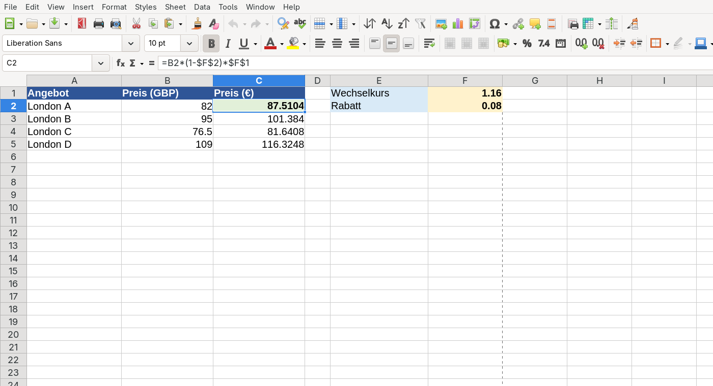

# Relative und absolute Bezüge

Sechs Preise sollen mit demselben Wechselkurs umgerechnet werden. Muss dafür wirklich sechsmal fast dieselbe Formel entstehen?

## Kopieren mit Plan

Trage Preise in `B2:B7` und den Wechselkurs in `F1` ein. Die Formel in `C2` lautet zunächst `=B2*F1`. Ziehst du sie am kleinen Quadrat des Zellrahmens nach unten, wird daraus in `C3` die Formel `=B3*F2` – beides ist gewandert.

:::snippet{#definition}
- Ein **relativer Bezug** wie `B2` passt sich beim Kopieren an.
- Ein **absoluter Bezug** wie `$F$1` bleibt beim Kopieren vollständig fest.
- In einem **gemischten Bezug** wie `$F1` oder `F$1` ist nur Spalte oder Zeile fest.
:::

Die richtige Formel lautet hier `=B2*$F$1`: Der Preis soll zeilenweise wandern, der Wechselkurs nicht.

:::snippet{#aufgabe}
Sage für jede Formel voraus, wie sie nach dem Kopieren von `C2` nach `D4` aussieht. Prüfe erst danach in Calc.

1. `=B2`
2. `=$B$2`
3. `=$B2`
4. `=B$2`
:::

:::protect{password="calc-2-1-1" description="Lösung. Erfrage das Passwort bei deiner Lehrkraft."}

[Calc-Lösung herunterladen](./loesung-calc-2-1-1.ods)

Die Kopie liegt eine Spalte weiter rechts und zwei Zeilen tiefer: 1. `=C4`, 2. `=$B$2`, 3. `=$B4`, 4. `=C$2`.

:::

## Parameter gehören nach oben

Ein Wechselkurs, Rabatt oder Wachstumsfaktor ist ein **Parameter**: Du möchtest ihn an genau einer Stelle ändern und sofort alle Folgen sehen.

:::snippet{#aufgabe}
Berechne die sechs Preise zusätzlich mit 8 % Rabatt. Lege Rabatt und Wechselkurs jeweils in einer beschrifteten Parameterzelle ab. Verwende in der Ergebnisspalte eine einzige kopierbare Formel.
:::

::::collapsible{title="Tipp: Reihenfolge"}

Erst Rabatt abziehen, dann umrechnen: `Preis * (1 - Rabatt) * Wechselkurs`. Welche Bezüge müssen fest bleiben?

::::

:::protect{password="calc-2-1-2" description="Lösung. Erfrage das Passwort bei deiner Lehrkraft."}

[Calc-Lösung herunterladen](./loesung-calc-2-1-2.ods)

Wenn Wechselkurs in `F1` und Rabatt in `F2` stehen, lautet die Formel etwa `=B2*(1-$F$2)*$F$1`. Beim Kopieren wandert nur `B2`.

:::

---

## Selbsttest

::::multievent

**1. Was passiert mit einem relativen Bezug beim Kopieren?**
{r1{!Er passt sich an die neue Position an.}}
{r1{Er bleibt immer unverändert.}}
{H{Richtig.}}

**2. Welcher Bezug hält F1 vollständig fest?**
{r2{F1}}
{r2{!Dollar F Dollar 1}}
{r2{F Dollar 1}}
{H{Richtig. Vor Spalte und Zeile steht ein Dollarzeichen.}}

**3. Was wird aus B2 beim Kopieren eine Zeile nach unten? {t{B3}}**
{H{Genau.}}

**4. In welchem Bezug bleibt nur die Zeile 2 fest?**
{r4{Dollar B 2}}
{r4{!B Dollar 2}}
{r4{Dollar B Dollar 2}}
{H{Richtig.}}

**5. Warum steht ein Wechselkurs sinnvoll in einer eigenen Zelle?**
{r5{!Er lässt sich zentral ändern und prüfen.}}
{r5{Dann braucht man keine Formel.}}
{H{Richtig.}}

::::
