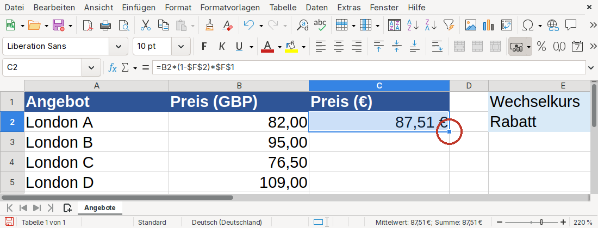
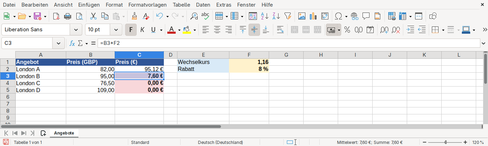
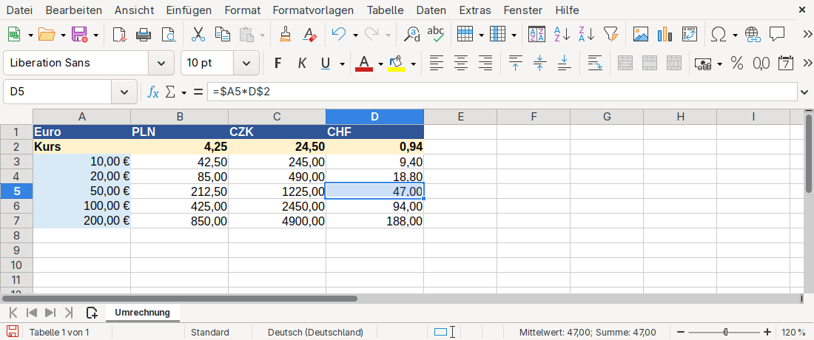
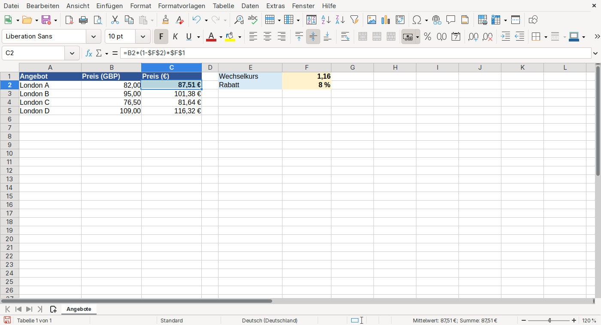

# Relative und absolute Bezüge

In dieser Lektion lernst du, wie du eine Formel in LibreOffice Calc mit dem **Ausfüllkästchen** auf viele Zeilen kopierst – und wie du mit Dollarzeichen steuerst, welche Zellbezüge dabei mitwandern und welche stehen bleiben.

Eine Formel kann für viele Zeilen kopiert werden. Dabei muss Calc wissen: **Welche Zelladresse soll mitwandern und welche soll gleich bleiben?**

## Formeln kopieren mit dem Ausfüllkästchen

Wenn du eine Zelle anklickst, erscheint unten rechts an ihrem Rahmen ein kleines Quadrat: das **Ausfüllkästchen** (im Bild rot eingekreist). Ziehst du es mit gedrückter Maustaste nach unten, kopiert Calc die Formel in alle Zellen, über die du ziehst.



1. Klicke die Zelle mit der Formel an, hier `C2`.
2. Zeige mit der Maus auf das Ausfüllkästchen. Der Mauszeiger wird zu einem dünnen Kreuz.
3. Ziehe nach unten bis zur letzten Zeile und lass los.

Du kannst eine Formel auch mit **Strg + C** kopieren und mit **Strg + V** in andere Zellen einfügen. Calc passt die Bezüge dabei genauso an.

## Was ist ein Zellbezug?

Ein :t[Zellbezug]{#zellbezug} ist die Adresse einer Zelle. `B2` bedeutet: Spalte B, Zeile 2.

Angenommen, in Spalte B stehen Preise und in `F1` steht ein Wechselkurs. In `C2` soll der erste Preis umgerechnet werden:

```text
=B2*$F$1
```

Kopierst du die Formel eine Zeile nach unten, passiert Folgendes:

| Formel in C2 | Formel in C3 | Warum? |
| --- | --- | --- |
| `=B2*$F$1` | `=B3*$F$1` | Der Preis wandert von B2 zu B3. Der Wechselkurs bleibt in F1. |


:::snippet{#definition}
- Ein **relativer Bezug** wie `B2` wandert beim Kopieren mit.
- Ein **absoluter Bezug** wie `$F$1` bleibt immer bei derselben Zelle.
:::

:::alert{info}
Das Dollarzeichen hat hier **nichts mit einer Währung** zu tun. Es ist ein Feststeller: `$F` hält die Spalte F fest, `$1` hält die Zeile 1 fest.
:::

## Warum reicht `=B2*F1` nicht?

Calc verschiebt beim Kopieren jeden relativen Bezug um denselben Weg wie die Formel. Aus `=B2*F1` in C2 wird deshalb eine Zeile tiefer `=B3*F2`.

Der Bezug auf den nächsten Preis ist richtig. Der Wechselkurs steht aber weiterhin in F1 und darf nicht zu F2 wandern. So sieht das Ergebnis aus, wenn man `=B2*F1` trotzdem nach unten kopiert:



Nur die erste Zeile stimmt. In `C3` rechnet Calc mit dem Rabatt aus `F2`, in `C4` und `C5` mit leeren Zellen. Calc zeigt dabei **keine Fehlermeldung** – das falsche Ergebnis fällt nur auf, wenn du es prüfst. Richtig ist `=B2*$F$1`.

:::snippet{#merken}
Frage dich vor dem Kopieren bei jedem Zellbezug:

- Soll die Formel in der nächsten Zeile den **nächsten Wert** verwenden? Dann ohne $.
- Soll sie immer **dieselbe Zelle** verwenden? Dann Spalte und Zeile mit $ festhalten.
:::

## Zwei Feststeller – vier Möglichkeiten

Kopierst du eine Formel von C2 nach D4, liegt die Kopie eine Spalte weiter rechts und zwei Zeilen tiefer.

| Bezug in C2 | Bezug in D4 | Was ist fest? |
| --- | --- | --- |
| `B2` | `C4` | nichts |
| `$B$2` | `$B$2` | Spalte und Zeile |
| `$B2` | `$B4` | nur Spalte B |
| `B$2` | `C$2` | nur Zeile 2 |

Die letzten beiden heißen **gemischte Bezüge**. Du brauchst sie vor allem, wenn du Formeln nicht nur nach unten, sondern auch nach rechts kopierst.

:::snippet{#beispiel}
Eine Umrechnungstabelle soll Euro-Beträge in drei Währungen umrechnen. Die Beträge stehen in **Spalte A**, die Kurse in **Zeile 2**. Eine einzige Formel in `B3` wird in den ganzen Bereich `B3:D7` kopiert:

```text
=$A3*B$2
```

- `$A3`: Der Betrag steht immer in Spalte A. Die **Spalte** wird festgehalten, die Zeile wandert mit.
- `B$2`: Der Kurs steht immer in Zeile 2. Die **Zeile** wird festgehalten, die Spalte wandert mit.

In `D5` ist daraus `=$A5*D$2` geworden: 50 € in Schweizer Franken.


:::

:::snippet{#aufgabe}
1. Bearbeite das Quiz „Wohin wandern die Bezüge?“. Sage darin vorher, was beim Kopieren entsteht.
2. Schreibe anschließend die vier Bezüge aus der Tabelle in Calc, kopiere sie von `C2` nach `D4` und vergleiche mit deinen Vorhersagen.
:::

::bitflow{id="calc-bezuege-vorhersagen" src="bezuege-vorhersagen.bitflow" height="auto" maxHeight="85vh"}

:::protect{password="calc-2-1-1" description="Lösung. Erfrage das Passwort bei deiner Lehrkraft."}

[Calc-Lösung herunterladen](./loesung-calc-2-1-1.ods)

Die Ergebnisse sind `C4`, `$B$2`, `$B4` und `C$2`. Die Dollarzeichen bleiben immer direkt vor dem Teil, den sie festhalten.

:::

## Ein Beispiel mit zwei festen Werten

In `F1` steht der Wechselkurs und in `F2` ein Rabatt. Beide Werte gelten für alle Angebote. Nur der Preis in Spalte B soll beim Kopieren wandern.

```text
=B2*(1-$F$2)*$F$1
```

Lies die Formel von links nach rechts: **Preis aus dieser Zeile · Anteil nach Rabatt · fester Wechselkurs**.



:::snippet{#aufgabe}
1. Trage sechs Preise in `B2:B7`, den Wechselkurs in `F1` und den Rabatt in `F2` ein.
2. Schreibe die Formel nur in `C2`. Sage voraus, wie die Formel in `C7` lauten wird, und begründe, welche Bezüge wandern.

::textinput{id="calc-bezuege-vorhersage-c7" placeholder="In C7 wird stehen: = … Es wandert nur …, weil …" height="100px"}

3. Ziehe die Formel mit dem Ausfüllkästchen nach unten. Klicke anschließend `C7` an und vergleiche die Formel in der Eingabezeile mit deiner Vorhersage.
4. Ändere den Rabatt. Alle Endpreise müssen sich ändern.
:::

:::protect{password="calc-2-1-2" description="Lösung. Erfrage das Passwort bei deiner Lehrkraft."}

[Calc-Lösung herunterladen](./loesung-calc-2-1-2.ods)

In Zeile 2 lautet die Formel etwa `=B2*(1-$F$2)*$F$1`. In Zeile 7 muss daraus `=B7*(1-$F$2)*$F$1` geworden sein. Nur der Preisbezug wandert.

:::

---

## Selbsttest

::::multievent

**1. Was passiert mit einem relativen Bezug beim Kopieren?**
{r1{!Er passt sich an die neue Position an.}}
{r1{Er bleibt immer unverändert.}}
{H{Richtig.}}

**2. Welcher Bezug hält F1 vollständig fest?**
{r2{F1}}
{r2{!Dollar F Dollar 1}}
{r2{F Dollar 1}}
{H{Richtig. Vor Spalte und Zeile steht ein Dollarzeichen.}}

**3. Was wird aus B2 beim Kopieren eine Zeile nach unten? {t{B3}}**
{H{Genau.}}

**4. In welchem Bezug bleibt nur die Zeile 2 fest?**
{r4{Dollar B 2}}
{r4{!B Dollar 2}}
{r4{Dollar B Dollar 2}}
{H{Richtig.}}

**5. Die Formel `=B2*$F$1` wird eine Zeile nach unten kopiert. Welche Formel entsteht?**
{r5{!gleich B3 * $F$1}}
{r5{gleich B2 * $F$1}}
{r5{gleich B3 * $F$2}}
{H{Richtig. B2 wandert zu B3; F1 bleibt fest.}}

::::
