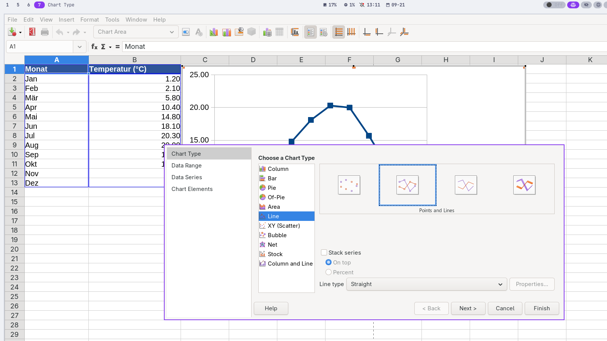

# Diagramme erstellen

Zwölf Temperaturwerte lassen sich lesen. In einem guten Diagramm erkennt man dagegen sofort Jahresgang, Minimum und Maximum.

## Eine Frage bestimmt den Diagrammtyp

| Frage | geeigneter Typ |
| --- | --- |
| Wie verändert sich eine Größe über die Zeit? | Linie |
| Wie unterscheiden sich wenige Kategorien? | Säulen oder Balken |
| Wie setzt sich ein Ganzes zusammen? | Kreis, nur bei wenigen Anteilen |
| Hängen zwei Zahlenmerkmale zusammen? | XY-Punktdiagramm |

:::snippet{#aufgabe}
Ordne den Fragen einen Diagrammtyp zu und begründe:

1. Monatsmitteltemperatur in Berlin über ein Jahr
2. Jahresniederschlag von fünf Hauptstädten
3. Zusammenhang zwischen Entfernung und Fahrtdauer
4. Anteile verschiedener Verkehrsmittel an allen Fahrten
:::

## Mit dem Diagrammassistenten

Markiere Monatsnamen und Temperaturwerte. Wähle **Einfügen → Diagramm**. Prüfe nacheinander Diagrammtyp, Datenbereich, Datenreihen sowie Titel.

:::snippet{#merken}
Ein Diagramm braucht eine **Aussage**, nicht nur Dekoration. Mindestens Titel, verständliche Achsenbezeichnungen samt Einheit und eine gut erkennbare Datenreihe müssen stimmen.
:::

:::snippet{#aufgabe}
Erstelle aus zwölf Monatswerten ein Liniendiagramm. Formuliere den Titel als Aussage, zum Beispiel nicht nur „Temperatur“, sondern „Berlin: Wärmste Monate sind Juli und August“.

Ändere anschließend einen auffälligen Tabellenwert. Beschreibe, wie du am Diagramm erkennst, dass es mit den Daten verbunden ist.
:::

::::collapsible{title="Tipp: Falsche Achse?"}

Im Diagrammassistenten kannst du festlegen, ob die erste Zeile beziehungsweise erste Spalte als Beschriftung dient und ob Datenreihen in Zeilen oder Spalten stehen.

::::

:::protect{password="calc-3-1-1" description="Lösung. Erfrage das Passwort bei deiner Lehrkraft."}

[Calc-Lösung herunterladen](./loesung-calc-3-1-1.ods)

Für Monatswerte ist ein Liniendiagramm passend, weil die zeitliche Reihenfolge wichtig ist. Die x-Achse zeigt die Monate, die y-Achse `Temperatur in °C`. Nach einer Änderung des Tabellenwerts muss sich der zugehörige Punkt automatisch verschieben.

:::

---

## Selbsttest

::::multievent

**1. Welcher Diagrammtyp zeigt einen Verlauf über die Zeit?**
{r1{!Liniendiagramm}}
{r1{Kreisdiagramm}}
{H{Richtig.}}

**2. Was gehört an eine Zahlenachse?**
{r2{!Größe und Einheit}}
{r2{nur eine Farbe}}
{H{Richtig.}}

**3. Wofür eignet sich ein Säulendiagramm?**
{r3{!Vergleich weniger Kategorien}}
{r3{genaue Zellberechnungen}}
{H{Richtig.}}

**4. Warum ist ein aussagekräftiger Titel hilfreich?**
{r4{!Er nennt den betrachteten Zusammenhang.}}
{r4{Er ersetzt die Datenquelle.}}
{H{Richtig.}}

**5. Was passiert bei einer verknüpften Datenänderung?**
{r5{!Das Diagramm aktualisiert sich.}}
{r5{Das Diagramm wird zum Bild ohne Bezug.}}
{H{Richtig.}}

::::
