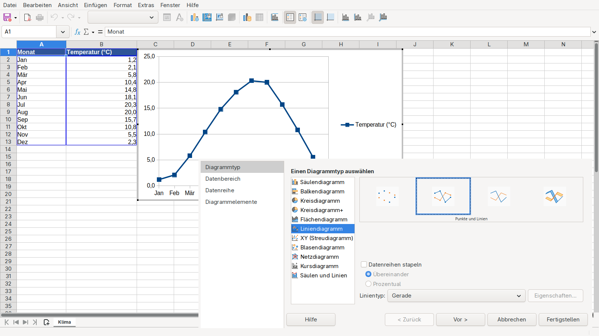

# Diagramme erstellen

In dieser Lektion lernst du, wie du in **LibreOffice Calc** aus einer Tabelle ein Diagramm erstellst: Du wählst den passenden Diagrammtyp, fügst das Diagramm mit dem Diagrammassistenten ein und beschriftest es so, dass es eine klare Aussage macht.

Zwölf Temperaturwerte lassen sich lesen. In einem guten Diagramm erkennt man dagegen sofort Jahresgang, Minimum und Maximum.

## Eine Frage bestimmt den Diagrammtyp

| Frage | geeigneter Typ | Beispiel |
| --- | --- | --- |
| Wie verändert sich eine Größe über die Zeit? | Linie |  |
| Wie unterscheiden sich wenige Kategorien? | Säulen oder Balken |  |
| Wie setzt sich ein Ganzes zusammen? | Kreis, nur bei wenigen Anteilen |  |
| Hängen zwei Zahlenmerkmale zusammen? | XY-Punktdiagramm |  |

:::snippet{#aufgabe}
Bearbeite das Quiz „Welcher Diagrammtyp passt?“.
:::

::bitflow{id="calc-diagrammtyp-waehlen" src="diagrammtyp.bitflow" height="auto" maxHeight="85vh"}

## Mit dem Diagrammassistenten

:::snippet{#aufgabe}
**Übertrage** die Monatsmitteltemperaturen von Berlin auf das Blatt `Klima`: die Monate in Spalte A, die Temperaturen in Spalte B.

| Monat | Temperatur in °C |
| --- | ---: |
| Jan | 1 |
| Feb | 2 |
| Mär | 6 |
| Apr | 11 |
| Mai | 16 |
| Jun | 19 |
| Jul | 21 |
| Aug | 20 |
| Sep | 16 |
| Okt | 11 |
| Nov | 6 |
| Dez | 2 |

**Erstelle** aus diesen zwölf Monatswerten ein Liniendiagramm. 

**Formuliere** den Titel als Aussage, zum Beispiel nicht nur „Temperatur“, sondern „Berlin: Wärmste Monate sind Juli und August“.

**Ändere** anschließend einen auffälligen Tabellenwert. **Beschreibe**, wie du am Diagramm erkennst, dass es mit den Daten verbunden ist.

::texinput{id="diagramme-beschreiben-aenderung"}
:::

:::snippet{#aufgabe}
**Markiere** Monatsnamen und Temperaturwerte. Wähle **Einfügen → Diagramm**. Prüfe nacheinander Diagrammtyp, Datenbereich, Datenreihen sowie Titel.
:::

::::collapsible{title="Tipp: Falsche Achse?"}

Im Diagrammassistenten kannst du festlegen, ob die erste Zeile beziehungsweise erste Spalte als Beschriftung dient und ob Datenreihen in Zeilen oder Spalten stehen.

::::

:::protect{password="calc-3-1-1" description="Lösung. Erfrage das Passwort bei deiner Lehrkraft."}

[Calc-Lösung herunterladen](./loesung-calc-3-1-1.ods)

Für Monatswerte ist ein Liniendiagramm passend, weil die zeitliche Reihenfolge wichtig ist. Die x-Achse zeigt die Monate, die y-Achse `Temperatur in °C`. Nach einer Änderung des Tabellenwerts muss sich der zugehörige Punkt automatisch verschieben.

:::

:::snippet{#merken}
Ein Diagramm braucht eine **Aussage**, nicht nur Dekoration. Mindestens Titel, verständliche Achsenbezeichnungen samt Einheit und eine gut erkennbare Datenreihe müssen stimmen.
:::

---

## Selbsttest

::::multievent

**1. Welcher Diagrammtyp zeigt einen Verlauf über die Zeit?**
{r1{!Liniendiagramm}}
{r1{Kreisdiagramm}}
{H{Richtig.}}

**2. Was gehört an eine Zahlenachse?**
{r2{!Größe und Einheit}}
{r2{nur eine Farbe}}
{H{Richtig.}}

**3. Wofür eignet sich ein Säulendiagramm?**
{r3{!Vergleich weniger Kategorien}}
{r3{genaue Zellberechnungen}}
{H{Richtig.}}

**4. Warum ist ein aussagekräftiger Titel hilfreich?**
{r4{!Er nennt den betrachteten Zusammenhang.}}
{r4{Er ersetzt die Datenquelle.}}
{H{Richtig.}}

**5. Was passiert bei einer verknüpften Datenänderung?**
{r5{!Das Diagramm aktualisiert sich.}}
{r5{Das Diagramm wird zum Bild ohne Bezug.}}
{H{Richtig.}}

::::
