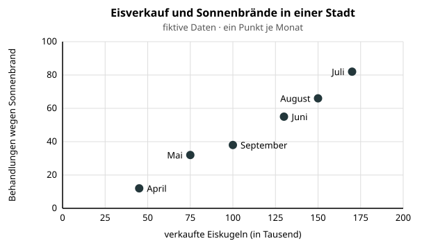
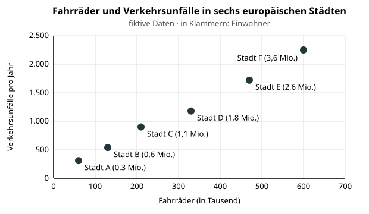

# Diagramme beurteilen

Zwei Diagramme können dieselben Daten zeigen und trotzdem völlig verschieden wirken. Darstellung ist immer auch eine Entscheidung.

## Die abgeschnittene Achse

Die Werte 78, 80 und 82 unterscheiden sich wenig. Beginnt die y-Achse bei 77, wirkt der Unterschied riesig; beginnt sie bei 0, wirkt er klein.

:::snippet{#aufgabe}
Erstelle aus denselben drei Werten zwei Säulendiagramme: eines mit y-Achse ab 0 und eines ab 77. Welche Aussage unterstützt jeweils die Darstellung? Welches ist für Säulen fairer?
:::

:::snippet{#merken}
Prüfe ein Diagramm auf **Quelle, Zeitraum, Achsenanfang, Skalierung, Einheit, ausgelassene Daten und passende Vergleichsgröße**. Ein rechnerisch korrektes Diagramm kann trotzdem irreführend sein.
:::

## Korrelation ist keine Ursache

Zwei Größen können gemeinsam steigen und fallen, ohne dass die eine die andere verursacht. Wie man ein solches Diagramm vorsichtig liest, zeigt das folgende Beispiel.

:::snippet{#beispiel}
Das Diagramm zeigt für die Monate April bis September, wie viel Eis in einer Stadt verkauft wurde und wie viele Menschen wegen eines Sonnenbrands behandelt wurden.

1. **Beobachtung, die das Diagramm trägt:** In Monaten, in denen viel Eis verkauft wird, werden auch viele Sonnenbrände behandelt. Beide Größen steigen bis zum Juli und fallen danach wieder – im Juli sind es rund 170 000 Kugeln und 82 Behandlungen, im April 45 000 Kugeln und 12 Behandlungen.
2. **Vorschnelle Ursache-Wirkungs-Behauptung:** „Eisessen verursacht Sonnenbrand.“ Oder umgekehrt: „Wer weniger Eis isst, bekommt keinen Sonnenbrand.“ Das Diagramm zeigt nur, dass beide Größen gemeinsam auftreten – nicht, dass die eine die andere auslöst.
3. **Größen, die geprüft werden müssten:** die **Temperatur** bzw. die Zahl der Sonnenstunden und die **Zahl der Menschen, die sich im Freien aufhalten** (etwa Freibadbesuche). Warmes, sonniges Wetter treibt beide Werte in die Höhe. Eine solche dritte Größe, die zwei andere gemeinsam beeinflusst, erklärt den Zusammenhang.
:::

:::snippet{#aufgabe}
Jetzt bist du an der Reihe. Die Grafik zeigt: In größeren europäischen Städten gibt es mehr Fahrräder und mehr Verkehrsunfälle.

1. Formuliere eine Beobachtung, die das Diagramm wirklich trägt.

::textinput{id="calc-korrelation-beobachtung" placeholder="In den betrachteten Städten …" height="100px"}

2. Formuliere eine vorschnelle Ursache-Wirkungs-Behauptung.

::textinput{id="calc-korrelation-behauptung" placeholder="„…“ – das Diagramm zeigt aber nur, dass …" height="100px"}

3. Nenne zwei weitere Größen, die geprüft werden müssten.

::textinput{id="calc-korrelation-groessen" placeholder="Prüfen müsste man … und …, weil …" height="100px"}
:::

:::protect{password="calc-3-2-1" description="Lösung. Erfrage das Passwort bei deiner Lehrkraft."}

[Calc-Lösung herunterladen](./loesung-calc-3-2-1.ods)

Tragfähig ist nur: In den betrachteten Daten treten höhere Fahrradzahl und höhere absolute Unfallzahl gemeinsam auf. Nicht belegt ist: Fahrräder verursachen mehr Unfälle. Zu prüfen wären etwa Einwohnerzahl, Zahl der Wege, Länge des Radnetzes oder Unfälle pro 100 000 Fahrten.

:::

## Verantwortlich visualisieren

:::snippet{#aufgabe}
Suche in einer Zeitung, Werbung oder öffentlichen Statistik ein Diagramm. Dokumentiere Quelle und Datum. Beurteile es anhand der Prüfliste und gestalte in Calc eine fairere Version, falls nötig.
:::

:::snippet{#brain}
Absolute Zahlen beantworten andere Fragen als relative. „Die meisten Unfälle“ kann schlicht bedeuten: Dort leben die meisten Menschen. Eine Bezugsgröße wie pro Einwohner oder pro Fahrt ermöglicht oft erst einen fairen Vergleich.
:::

---

## Selbsttest

::::multievent

**1. Was kann eine abgeschnittene Achse bewirken?**
{r1{!Kleine Unterschiede wirken sehr groß.}}
{r1{Die Quelldaten ändern sich.}}
{H{Richtig.}}

**2. Beweist ein gemeinsamer Verlauf eine Ursache?**
{r2{ja}}
{r2{!nein}}
{H{Richtig. Korrelation ist keine Kausalität.}}

**3. Welche Angabe ermöglicht Nachprüfbarkeit?**
{r3{!die Datenquelle}}
{r3{eine auffällige Farbe}}
{H{Richtig.}}

**4. Warum sind Werte pro Einwohner oft sinnvoll?**
{r4{!Sie machen unterschiedlich große Städte vergleichbarer.}}
{r4{Sie sind immer größer als absolute Werte.}}
{H{Richtig.}}

**5. Ist jedes rechnerisch korrekte Diagramm fair?**
{r5{ja}}
{r5{!nein}}
{H{Richtig. Auswahl und Skalierung können irreführen.}}

::::
