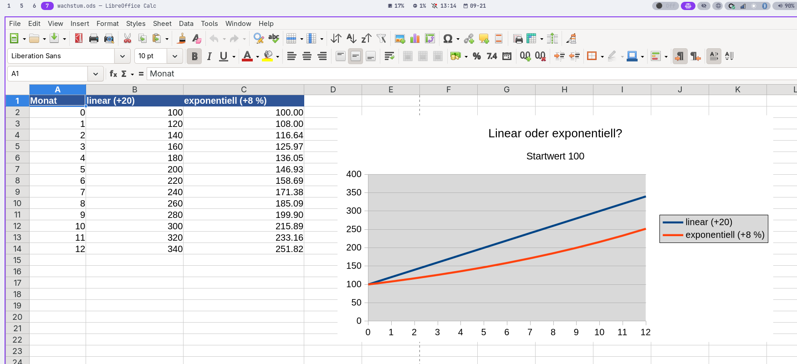

# Wachstumsmodelle

Eine Fahrradverleihstation gewinnt jeden Monat 20 Kundinnen und Kunden. Eine andere wächst jeden Monat um 8 %. Nach wenigen Monaten erzählen beide Regeln ganz verschiedene Geschichten.

## Linear: gleicher Zuwachs

Beim linearen Modell kommt pro Schritt derselbe Betrag hinzu:

```text
neuer Wert = alter Wert + Zuwachs
```

Steht der Startwert in `B2` und der feste Zuwachs in `$F$1`, lautet der nächste Wert in `B3`: `=B2+$F$1`.

## Exponentiell: gleicher Faktor

Bei prozentualem Wachstum wird in jedem Schritt mit demselben :t[Wachstumsfaktor]{#wachstumsfaktor} multipliziert:

```text
Wachstumsfaktor = 1 + Wachstumsrate
neuer Wert = alter Wert * Wachstumsfaktor
```

Bei 8 % Wachstum ist der Faktor `1,08`. Mit der Rate in `$F$2` kann in `C3` stehen: `=C2*(1+$F$2)`.

:::snippet{#aufgabe}
Starte beide Modelle bei 100. Berechne 24 Monate mit 20 Personen Zuwachs beziehungsweise 8 % Wachstum. Sage voraus, welches Modell zunächst und welches später größer ist. Erstelle ein gemeinsames Liniendiagramm.
:::



:::snippet{#merken}
**Linear** bedeutet gleicher absoluter Zuwachs. **Exponentiell** bedeutet gleicher prozentualer Zuwachs beziehungsweise gleicher Faktor. Das Diagramm allein genügt nicht: Prüfe immer auch die Modellregel.
:::

## Quadratisch: veränderlicher Zuwachs

Eine einfache quadratische Folge entsteht, wenn die Zuwächse selbst gleichmäßig wachsen, etwa `+3, +5, +7, +9 …`. Die zweiten Differenzen sind dann konstant.

:::snippet{#aufgabe}
Erzeuge die Werte `1, 4, 9, 16, 25 …`, indem du die jeweils nächste ungerade Zahl addierst. Vergleiche Tabelle und Diagramm mit den beiden anderen Modellen. Woran erkennst du quadratisches Wachstum in den Differenzen?
:::

:::protect{password="calc-4-1-1" description="Lösung. Erfrage das Passwort bei deiner Lehrkraft."}

[Calc-Lösung herunterladen](./loesung-calc-4-1-1.ods)

Die ersten Differenzen lauten 3, 5, 7, 9 und wachsen jeweils um 2. Deshalb sind die zweiten Differenzen konstant 2. Linear wären bereits die ersten Differenzen konstant; exponentiell wäre der Quotient aufeinanderfolgender Werte konstant.

:::

---

## Selbsttest

::::multievent

**1. Was bleibt bei linearem Wachstum gleich?**
{r1{!der absolute Zuwachs}}
{r1{der prozentuale Zuwachs}}
{H{Richtig.}}

**2. Welcher Faktor gehört zu sechs Prozent Wachstum?**
{r2{0,06}}
{r2{!1,06}}
{r2{6}}
{H{Richtig.}}

**3. Was bleibt bei exponentiellem Wachstum gleich?**
{r3{!der Faktor}}
{r3{die Differenz}}
{H{Richtig.}}

**4. Woran erkennt man eine quadratische Folge?**
{r4{!konstante zweite Differenzen}}
{r4{konstante Quotienten}}
{H{Richtig.}}

**5. Warum wird die Wachstumsrate absolut adressiert?**
{r5{!Sie soll beim Kopieren für alle Zeitschritte gleich bleiben.}}
{r5{Sie soll in jeder Zeile nach unten wandern.}}
{H{Richtig.}}

::::
