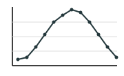
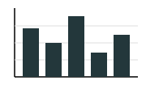
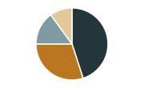
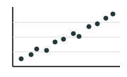

# Referenz

Zum Nachschlagen, nicht zum Durcharbeiten: alle Schreibweisen des Lernpfads auf einen Blick. Alles hier funktioniert in LibreOffice Calc mit deutscher Oberfläche. Wo du ein Thema ausführlich nachlesen kannst, steht jeweils darunter.

## Adressen

| Schreibweise | bedeutet |
| --- | --- |
| `C4` | Zelle in Spalte C, Zeile 4 |
| `B2:D6` | Bereich von B2 bis D6 |

Nachlesen: [1.1 Zellen und Datentypen](../01-daten-und-formeln/01-zellen-und-datentypen)

## Rechenzeichen

Jede Formel beginnt mit `=`.

| Zeichen | Rechnung |
| --- | --- |
| `+` | plus |
| `-` | minus |
| `*` | mal |
| `/` | geteilt durch |
| `( )` | Klammern – es gilt Punkt vor Strich |

Nachlesen: [1.2 Formeln und Funktionen](../01-daten-und-formeln/02-formeln-und-funktionen)

## Funktionen

| Schreibweise | liefert |
| --- | --- |
| `SUMME(Bereich)` | die Summe der Zahlen |
| `MITTELWERT(Bereich)` | den Durchschnitt |
| `MIN(Bereich)` | den kleinsten Wert |
| `MAX(Bereich)` | den größten Wert |
| `ANZAHL(Bereich)` | die Anzahl der Zahlen |

Nachlesen: [1.2 Formeln und Funktionen](../01-daten-und-formeln/02-formeln-und-funktionen)

## Bezüge

| Schreibweise | Art |
| --- | --- |
| `B2` | relativer Bezug |
| `$B$2` | absoluter Bezug |
| `$B2` | gemischter Bezug, Spalte B festgehalten |
| `B$2` | gemischter Bezug, Zeile 2 festgehalten |

Nachlesen: [2.1 Relative und absolute Bezüge](../02-bezuege/01-relative-und-absolute-bezuege)

## Diagrammtypen

| Typ | zeigt | Beispiel |
| --- | --- | --- |
| Linie | Veränderung über die Zeit |  |
| Säulen / Balken | Vergleich weniger Kategorien |  |
| Kreis | Anteile an einem Ganzen |  |
| XY-Punkte | Zusammenhang zweier Zahlenmerkmale |  |

Nachlesen: [3.1 Diagramme erstellen](../03-diagramme/01-diagramme-erstellen)

## Entscheidungen

| Schreibweise | bedeutet |
| --- | --- |
| `WENN(Bedingung; Wert_wenn_wahr; Wert_wenn_falsch)` | liefert je nach Bedingung einen von zwei Werten |
| `UND(Bedingung1; Bedingung2)` | wahr, wenn alle Bedingungen wahr sind |
| `ODER(Bedingung1; Bedingung2)` | wahr, wenn mindestens eine Bedingung wahr ist |

| Vergleich | bedeutet |
| --- | --- |
| `=` | gleich |
| `<>` | ungleich |
| `<` `>` | kleiner, größer |
| `<=` `>=` | kleiner oder gleich, größer oder gleich |

Die Argumente trennt ein Semikolon, Text steht in Anführungszeichen: `"im Budget"`.

Nachlesen: [5.1 Die WENN-Funktion](../05-wenn/01-die-wenn-funktion), [5.2 Bedingungen verknüpfen](../05-wenn/02-bedingungen-verknuepfen)

## Fehlermeldungen

| Meldung | bedeutet |
| --- | --- |
| `#WERT!` | falscher Datentyp, meist Text statt Zahl |
| `Err:509` | Operator fehlt |
| `#DIV/0!` | Division durch 0 oder durch eine leere Zelle |

## Für Profis

Diese Funktionen brauchst du im [Mini-Projekt Klimabericht Düsseldorf](../03-diagramme/04-mini-projekt-klimabericht).

| Schreibweise | liefert |
| --- | --- |
| `MONAT(Datum)` | die Monatsnummer 1 bis 12 |
| `ZÄHLENWENN(Bereich; Kriterium)` | wie viele Zellen das Kriterium erfüllen, z. B. `">=25"` |
| `SUMMEWENNS(Summenbereich; Bereich; Kriterium)` | die Summe der Zeilen, die das Kriterium erfüllen |
| `MITTELWERTWENNS(Mittelwertbereich; Bereich; Kriterium)` | den Durchschnitt dieser Zeilen |
| `MAXWENNS(…)`, `MINWENNS(…)` | den größten bzw. kleinsten Wert dieser Zeilen |
