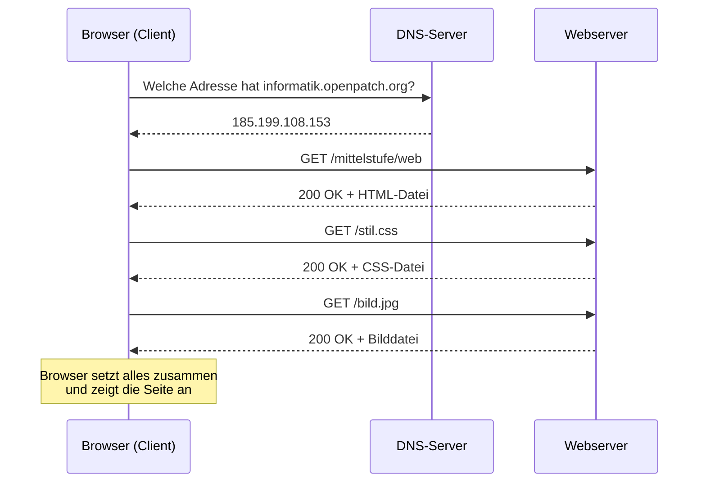

# Vom Klick zur Seite

Du tippst eine Adresse ein und drückst Enter. Nach einem Sekundenbruchteil steht die Seite da. Dazwischen passiert eine ganze Menge.

## Die zwei Beteiligten

:::snippet{#definition}
Beim Aufruf einer Webseite arbeiten zwei Rechner zusammen:

- Der **Client** ist dein Gerät, genauer: dein **Browser**. Er stellt die Anfrage und zeigt das Ergebnis an.
- Der **Server** ist ein Rechner, der irgendwo im Netz steht und rund um die Uhr läuft. Er wartet auf Anfragen und schickt Dateien zurück.

Dieses Zusammenspiel heißt **Client-Server-Prinzip**. Es steckt nicht nur hinter Webseiten, sondern auch hinter E-Mail, Messengern und Online-Spielen.
:::

## Der Ablauf



:::snippet{#merken}
Drei Dinge sind daran wichtig:

1. **Der Name muss erst übersetzt werden.** Rechner im Netz finden sich über **IP-Adressen** wie `185.199.108.153`, nicht über Namen. Das Übersetzen von Namen in Adressen übernimmt das **DNS** – eine Art Telefonbuch des Internets.
2. **Eine Seite ist nicht eine Datei.** Der Browser holt zuerst die :t[HTML]{#html}-Datei, liest darin, welche weiteren Dateien er braucht, und fordert diese einzeln nach. Für eine gewöhnliche Seite sind das schnell 30 bis 100 Anfragen.
3. **Der Browser setzt zusammen.** Der Server schickt nur Dateien. Wie daraus eine Seite wird, entscheidet allein der Browser.
:::

:::snippet{#aufgabe}
a) Erkläre in eigenen Worten, warum die erste Anfrage an den DNS-Server geht und nicht direkt an den Webserver.

b) Im Diagramm holt der Browser das Bild erst **nach** der HTML-Datei. Warum kann er es nicht gleichzeitig anfordern?

c) Was passiert wohl, wenn eine der drei Dateien fehlt? Überlege für jede der drei einzeln.
:::

::::collapsible{title="Auflösung"}

a) Der Browser kennt nur den Namen, den du eingetippt hast. Um überhaupt eine Verbindung aufzubauen, braucht er die Zahlenadresse des Servers. Der DNS-Server liefert sie. Erst danach kann er die eigentliche Anfrage stellen.

b) Weil er noch nicht **weiß**, dass es das Bild gibt. Die Information „auf dieser Seite ist ein Bild namens `bild.jpg`" steht in der HTML-Datei. Der Browser muss sie erst gelesen haben.

c)

- Fehlt die **HTML-Datei**, gibt es gar keine Seite. Der Browser zeigt eine Fehlerseite, meist mit der Nummer 404.
- Fehlt die **:t[CSS]{#css}-Datei**, erscheint der Inhalt trotzdem – nur ungestaltet. Alles steht untereinander in Standardschrift.
- Fehlt das **Bild**, bleibt an seiner Stelle ein Platzhalter oder der Alternativtext.

Das ist ein wichtiges Prinzip: Eine Webseite fällt nicht komplett aus, wenn ein Teil fehlt. Man nennt das **abgestufte Verschlechterung**.

::::

## Die Adresse

Eine Webadresse heißt **:t[URL]{#url}**. Sie ist nicht einfach ein Name, sondern hat feste Bestandteile:

```
https://informatik.openpatch.org/mittelstufe/web/index.html?suche=css#kapitel2
└─┬─┘   └───────────┬───────────┘└──────────┬────────────┘└────┬────┘└───┬───┘
Protokoll        Servername                Pfad            Abfrage    Sprungziel
```

:::snippet{#merken}
| Teil | Bedeutung |
| --- | --- |
| **Protokoll** | Die Sprache, in der Client und Server reden. `https` ist `http` mit Verschlüsselung. |
| **Servername** | Welcher Rechner gemeint ist. Wird per DNS in eine IP-Adresse übersetzt. |
| **Pfad** | Welche Datei auf diesem Server gemeint ist. |
| **Abfrage** | Zusatzangaben nach einem `?`, zum Beispiel ein Suchbegriff. |
| **Sprungziel** | Nach einem `#`: die Stelle **innerhalb** der Seite, zu der gesprungen wird. Dieser Teil wird gar nicht an den Server geschickt. |
:::

:::snippet{#aufgabe}
Zerlege diese Adressen in ihre Bestandteile. Nicht jede hat alle.

a) `https://de.wikipedia.org/wiki/Hypertext`

b) `http://192.168.0.1/status`

c) `https://www.openstreetmap.org/search?query=Essen#map=12/51.45/7.01`
:::

::::collapsible{title="Tipp: An welchen Zeichen trenne ich?"}

Die Bestandteile sind an festen Trennzeichen zu erkennen. Geh sie in dieser Reihenfolge durch:

1. `://` – davor steht das Protokoll.
2. Der **erste** einzelne `/` danach – davor steht der Servername.
3. `?` – ab hier beginnt die Abfrage.
4. `#` – ab hier beginnt das Sprungziel.

Alles zwischen 2. und 3. ist der Pfad. Fehlt ein Trennzeichen, fehlt eben dieser Teil.

::::

:::protect{password="web-1-1-1" description="Lösung. Erfrage das Passwort bei deiner Lehrkraft."}

a) Protokoll `https`, Servername `de.wikipedia.org`, Pfad `/wiki/Hypertext`. Keine Abfrage, kein Sprungziel.

b) Protokoll `http` – also **unverschlüsselt**. Statt eines Namens steht direkt eine IP-Adresse; hier wird kein DNS gebraucht. Pfad `/status`. Die Adresse `192.168.0.1` ist eine private Adresse, gemeint ist also ein Gerät im eigenen Heimnetz, oft der Router.

c) Protokoll `https`, Servername `www.openstreetmap.org`, Pfad `/search`, Abfrage `query=Essen`, Sprungziel `map=12/51.45/7.01`.

:::

## Anfrage und Antwort

Was Browser und Server sich schicken, ist Text. So sieht eine Anfrage aus:

```http
GET /mittelstufe/web/index.html HTTP/1.1
Host: informatik.openpatch.org
Accept-Language: de
```

Und so die Antwort:

```http
HTTP/1.1 200 OK
Content-Type: text/html; charset=utf-8
Content-Length: 4213

<!DOCTYPE html>
<html lang="de">
...
```

:::snippet{#merken}
Die Zahl in der ersten Antwortzeile ist der **Statuscode**. Ein paar solltest du kennen:

| Code | Bedeutung |
| --- | --- |
| **200** | Alles in Ordnung, hier ist die Datei. |
| **301** / **302** | Umgezogen, frag an dieser anderen Adresse nach. |
| **403** | Verboten – die Datei gibt es, aber du darfst sie nicht sehen. |
| **404** | Nicht gefunden. |
| **500** | Der Server hat einen Fehler.

Die erste Ziffer verrät schon die Richtung: 2 heißt Erfolg, 3 Umleitung, 4 Fehler beim Client, 5 Fehler beim Server.
:::

:::snippet{#brain}
Sieh dir die Zeile `Content-Type: text/html; charset=utf-8` an. Der Server sagt dem Browser damit zwei Dinge: **was** für eine Datei das ist und **wie die Zeichen codiert** sind.

Warum reicht die Dateiendung `.html` dafür nicht? Weil der Browser die Datei über das Netz bekommt und die Endung im Pfad nur ein Name ist. Es gibt Server, die unter `/bild` eine HTML-Seite und unter `/seite.html` ein Bild ausliefern. Verbindlich ist immer der `Content-Type`.
:::

<!--
UV 10.2, Inhaltsfeld Informatiksysteme: Aufbau und Funktionsweise einfacher
Informatiksysteme. Übergeordnet DI: beschreiben anhand vorgegebener einfacher
textueller und visueller Darstellungen die abgebildeten informatischen
Sachverhalte (Ablaufdiagramm der Anfrage).
-->

---

## Selbsttest

::::multievent

**1. Wer stellt beim Aufruf einer Webseite die Anfrage?**

{r1{der Server}}

{r1{!der Client, also dein Browser}}

{r1{der DNS-Server}}

{r1{das Betriebssystem}}

{h{Der Server wartet nur – er fragt nie von sich aus bei dir an.}}
{H{Richtig. Der Client fragt, der Server antwortet.}}

**2. Wozu dient das DNS?**

{r2{Es verschlüsselt die Verbindung.}}

{r2{!Es übersetzt Servernamen in IP-Adressen.}}

{r2{Es speichert Webseiten zwischen.}}

{r2{Es prüft, ob eine Seite erreichbar ist.}}

{h{Rechner im Netz finden sich über Zahlen, nicht über Namen.}}
{H{Richtig – eine Art Telefonbuch des Internets.}}

**3. Warum holt der Browser Bilder erst nach der HTML-Datei?**

{r3{Weil Bilder größer sind.}}

{r3{!Weil erst in der HTML-Datei steht, welche Bilder es gibt.}}

{r3{Weil der Server nur eine Datei auf einmal schicken kann.}}

{r3{Weil Bilder unwichtiger sind.}}

{h{Woher soll der Browser wissen, dass es das Bild überhaupt gibt?}}
{H{Richtig. Deshalb entstehen aus einem Seitenaufruf viele Anfragen.}}

**4. Welcher Teil einer URL wird gar nicht an den Server geschickt?**

{r4{der Pfad}}

{r4{die Abfrage nach dem Fragezeichen}}

{r4{!das Sprungziel nach der Raute}}

{r4{der Servername}}

{h{Es geht um eine Stelle innerhalb der schon geladenen Seite.}}
{H{Richtig. Das Springen erledigt der Browser allein.}}

**5. Was bedeutet der Statuscode 404?**

{r5{Der Server hat einen Fehler.}}

{r5{Die Seite ist umgezogen.}}

{r5{!Die angeforderte Datei wurde nicht gefunden.}}

{r5{Der Zugriff ist verboten.}}

{h{Die erste Ziffer 4 zeigt an, dass der Fehler auf der Seite des Clients liegt – hier: eine Adresse, die es nicht gibt.}}
{H{Richtig.}}

**6. Die CSS-Datei einer Seite fehlt. Was passiert?**

{r6{Die Seite wird gar nicht angezeigt.}}

{r6{!Der Inhalt erscheint, aber ungestaltet.}}

{r6{Der Browser lädt eine Ersatzdatei.}}

{r6{Es erscheint der Statuscode 500.}}

{h{HTML trägt den Inhalt, CSS nur das Aussehen.}}
{H{Richtig. Das nennt man abgestufte Verschlechterung.}}

::::
