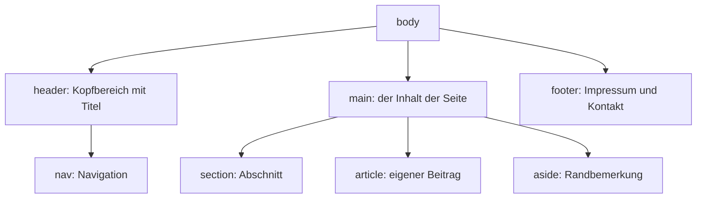

# Struktur und Bedeutung

Bis hierher hast du einzelne Textstücke ausgezeichnet. Jetzt gliederst du die **ganze Seite** – in Bereiche, die alle Webseiten haben: einen Kopf, eine Navigation, den eigentlichen Inhalt, einen Fuß.

## Der Bauplan einer Seite



:::webide{id="web-2-5-struktur" height="640px"}

```html
<header>
  <h1>Waffelblog</h1>
  <nav>
    <ul>
      <li><a href="#rezepte">Rezepte</a></li>
      <li><a href="#ueber">Über mich</a></li>
    </ul>
  </nav>
</header>

<main>
  <section id="rezepte">
    <h2>Rezepte</h2>

    <article>
      <h3>Klassische Waffeln</h3>
      <p>Mehl, Eier, Milch – mehr braucht es nicht.</p>
    </article>

    <article>
      <h3>Schokowaffeln</h3>
      <p>Wie oben, plus zwei Esslöffel Kakao.</p>
    </article>
  </section>

  <aside>
    <h2>Wusstest du?</h2>
    <p>Das Wort „Waffel" kommt vom niederländischen „wafel".</p>
  </aside>
</main>

<footer>
  <p><a href="impressum.html">Impressum</a></p>
</footer>
```

```css
body {
  font-family: system-ui, sans-serif;
  line-height: 1.6;
}
header, main, footer, aside, article {
  outline: 2px dashed;
  padding: 0.5rem;
  margin-block: 0.5rem;
}
header { outline-color: hsl(210 70% 50%); }
main   { outline-color: hsl(140 60% 40%); }
aside  { outline-color: hsl(35 80% 45%); }
footer { outline-color: hsl(0 60% 50%); }
nav ul { display: flex; gap: 1rem; list-style: none; padding: 0; }
```

:::

:::snippet{#definition}
| Element | Wofür |
| --- | --- |
| `<header>` | Kopfbereich: Titel, Logo, Navigation |
| `<nav>` | eine Sammlung von Links zur Orientierung |
| `<main>` | der Hauptinhalt. Kommt **genau einmal** je Seite vor |
| `<section>` | ein thematischer Abschnitt, meist mit eigener Überschrift |
| `<article>` | ein Inhalt, der für sich allein Sinn ergibt – ein Beitrag, ein Rezept, eine Nachricht |
| `<aside>` | etwas am Rande, das nicht zum Hauptstrang gehört |
| `<footer>` | Fußbereich: Impressum, Kontakt, Urheberrechtshinweis |

Solche Elemente nennt man **semantisch**: Sie sagen etwas über die **Bedeutung** ihres Inhalts aus.
:::

:::snippet{#aufgabe}
a) Schalte die farbigen Rahmen aus, indem du die :t[CSS]{#css}-Regel mit `outline` löschst. Ändert sich die **Anordnung** der Bereiche?

b) Ersetze alle sechs Elementnamen im :t[HTML]{#html} durch `<div>` – also `<header>` durch `<div>` und so weiter. Was ändert sich in der Vorschau?

c) Was geht dabei trotzdem verloren?
:::

::::collapsible{title="Tipp zu c)"}

Frage dich: Woran würde ein Programm, das die Seite nicht sehen kann, noch erkennen, wo die Navigation aufhört und der Inhalt anfängt?

::::

:::protect{password="web-2-5-1" description="Lösung. Erfrage das Passwort bei deiner Lehrkraft."}

a) Nein. Die Rahmen waren nur zum Sichtbarmachen da.

b) In der Vorschau ändert sich **nichts**. `<div>` sieht standardmäßig genauso aus wie `<header>` oder `<section>`.

c) Die **Bedeutung**. Für den Browser sind sechs `<div>` sechs namenlose Kisten. Konkret geht verloren:

- Vorleseprogramme bieten „springe zum Hauptinhalt" an – das braucht ein `<main>`.
- Die Lesezeichenfunktion mancher Browser und Vorlesehilfen listet alle `<nav>`-Bereiche auf.
- Suchmaschinen erkennen, welcher Teil der Seite der eigentliche Inhalt ist und welcher auf jeder Seite gleich ist.
- Und wer den Quelltext später liest – auch du selbst –, sieht auf einen Blick, was wozu gehört.

**Die Regel:** Nimm `<div>` erst, wenn es **kein** passendes semantisches Element gibt. `<div>` ist die Kiste ohne Beschriftung – manchmal braucht man sie, aber sie ist nie die erste Wahl.

:::

## div und span

:::webide{id="web-2-5-div-span" height="310px"}

```html
<div class="hinweiskasten">
  <h2>Achtung</h2>
  <p>Das Waffeleisen wird sehr <span class="warnung">heiß</span>.</p>
</div>
```

```css
.hinweiskasten {
  border: 2px solid hsl(35 80% 45%);
  border-radius: 0.5rem;
  padding: 1rem;
  background: hsl(35 90% 96%);
}
.warnung {
  font-weight: bold;
  color: hsl(0 70% 40%);
}
```

:::

:::snippet{#merken}
`<div>` und `<span>` sind die **bedeutungslosen** Elemente. Sie sind dafür da, etwas zusammenzufassen, das man gestalten will, wenn es kein passendes semantisches Element gibt.

- `<div>` fasst **Blöcke** zusammen und steht in einer eigenen Zeile.
- `<span>` fasst etwas **im laufenden Text** zusammen und bleibt in der Zeile.

Beide bekommen fast immer ein `class`-Attribut – daran greift CSS sie später. Mehr dazu in [Kapitel 4](../04-css-gestalten/02-selektoren-und-kaskade).
:::

:::snippet{#brain}
Woher weiß man, ob ein Element in einer eigenen Zeile steht oder nicht?

Jedes Element hat eine voreingestellte **Anzeigeart**:

- **Block** – nimmt die ganze verfügbare Breite ein und beginnt in einer neuen Zeile: `div`, `p`, `h1` bis `h6`, `ul`, `li`, `section`, `header`, `main`, `footer`
- **Inline** – nimmt nur so viel Platz wie nötig und bleibt in der Zeile: `span`, `a`, `strong`, `em`, `code`, `img`

Diese Voreinstellung ist **nur eine Voreinstellung**. Mit CSS lässt sie sich ändern – ein `<li>` kann nebeneinander stehen, ein `<a>` kann ein ganzer Kasten werden. In Kapitel 4 machst du genau das.
:::

## Aufgabe: eine Seite gliedern

:::snippet{#aufgabe}
Der Übungsbereich enthält eine Seite ohne jede Gliederung – alles hängt direkt im `body`.

Gliedere sie mit `<header>`, `<nav>`, `<main>`, `<article>`, `<aside>` und `<footer>`. Am Text selbst änderst du nichts.
:::

:::webide{id="web-2-5-uebung" height="460px"}

```html
<h1>Der Schulgarten</h1>

<ul>
  <li><a href="#pflanzen">Pflanzen</a></li>
  <li><a href="#termine">Termine</a></li>
</ul>

<h2 id="pflanzen">Was bei uns wächst</h2>
<p>Im Hochbeet stehen Tomaten, Basilikum und Erdbeeren.</p>

<h2 id="termine">Nächste Termine</h2>
<p>Jeden Dienstag in der Mittagspause treffen wir uns am Beet.</p>

<h2>Übrigens</h2>
<p>Die Bienen im Nachbargarten gehören dem Hausmeister.</p>

<p>Verantwortlich: Garten-AG · <a href="impressum.html">Impressum</a></p>
```

:::

::::collapsible{title="Tipp 1: Wo fange ich an?"}

Gehe die Seite von oben nach unten durch und frage bei jedem Stück: Ist das Kopf, Navigation, Hauptinhalt, Randbemerkung oder Fuß?

::::

::::collapsible{title="Tipp 2: Gerüst"}

```html
<header>
  … Titel und Navigation …
</header>
<main>
  … die beiden inhaltlichen Abschnitte …
  <aside> … </aside>
</main>
<footer>
  … Verantwortlich und Impressum …
</footer>
```

::::

:::protect{password="web-2-5-2" description="Lösung. Erfrage das Passwort bei deiner Lehrkraft."}

```html
<header>
  <h1>Der Schulgarten</h1>
  <nav>
    <ul>
      <li><a href="#pflanzen">Pflanzen</a></li>
      <li><a href="#termine">Termine</a></li>
    </ul>
  </nav>
</header>

<main>
  <article id="pflanzen">
    <h2>Was bei uns wächst</h2>
    <p>Im Hochbeet stehen Tomaten, Basilikum und Erdbeeren.</p>
  </article>

  <article id="termine">
    <h2>Nächste Termine</h2>
    <p>Jeden Dienstag in der Mittagspause treffen wir uns am Beet.</p>
  </article>

  <aside>
    <h2>Übrigens</h2>
    <p>Die Bienen im Nachbargarten gehören dem Hausmeister.</p>
  </aside>
</main>

<footer>
  <p>Verantwortlich: Garten-AG · <a href="impressum.html">Impressum</a></p>
</footer>
```

Zwei Dinge sind bemerkenswert:

- Die `id`-Attribute mussten von den Überschriften auf die `<article>`-Elemente wandern. Sonst springt der Link zwar zur Überschrift, aber der Abschnitt darunter ist nicht mit gemeint.
- Der Bienen-Absatz gehört ins `<aside>`, weil er mit dem Thema der Seite nur am Rande zu tun hat. Man könnte auch anders entscheiden – dann sollte man es begründen können.

`<section>` statt `<article>` wäre hier ebenfalls vertretbar. Faustregel: `<article>`, wenn der Inhalt auch für sich allein Sinn ergäbe.

:::

<!--
UV 10.2, Inhaltsfeld Formale Sprachen: Erstellung von Quelltexten.
Übergeordnet MI: strukturieren und zerlegen. Die Unterscheidung zwischen
Bedeutung (HTML) und Darstellung (CSS) ist der Kern dieser Lektion und wird
in Kapitel 3 zur Analysekompetenz ausgebaut.
-->

---

## Selbsttest

::::multievent

**1. Wie oft darf main auf einer Seite vorkommen?**

{z{1}}

{h{Es bezeichnet den Hauptinhalt der Seite.}}
{H{Richtig. header, section und article dürfen dagegen mehrfach vorkommen.}}

**2. Was ändert sich in der Anzeige, wenn man header durch div ersetzt?**

{r1{Die Seite bricht zusammen.}}

{r1{!Nichts.}}

{r1{Der Kopfbereich verschwindet.}}

{r1{Die Schrift wird kleiner.}}

{h{Du hast es ausprobiert.}}
{H{Richtig – und genau deshalb ist der Unterschied so leicht zu übersehen.}}

**3. Was geht dabei trotzdem verloren?**

{r2{die Möglichkeit, das Element mit CSS zu gestalten}}

{r2{!die Bedeutung des Bereichs für Programme, die die Seite nicht sehen}}

{r2{die Einrückung}}

{r2{die Gültigkeit des HTML}}

{h{Denk an Vorleseprogramme und Suchmaschinen.}}
{H{Richtig. Ein div ist eine Kiste ohne Beschriftung.}}

**4. Wann nimmt man ein div?**

{r3{immer, es ist am einfachsten}}

{r3{!wenn es kein passendes semantisches Element gibt}}

{r3{nur für Bilder}}

{r3{nie}}

{h{Es ist die letzte Wahl, nicht die erste.}}
{H{Richtig.}}

**5. Welche Elemente stehen standardmäßig in einer eigenen Zeile?** (Mehrfachauswahl)

{c1{!p}}

{c1{!section}}

{c1{!ul}}

{c1{span}}

{h{Die Anzeigeart Inline bedeutet: bleibt in der Zeile.}}
{H{Richtig – und mit CSS lässt sich diese Voreinstellung ändern.}}

**6. Welches Element passt für einen Beitrag, der auch für sich allein Sinn ergibt?**

{r4{div}}

{r4{aside}}

{r4{!article}}

{r4{footer}}

{h{Denk an ein einzelnes Rezept oder eine Nachricht.}}
{H{Richtig.}}

::::
