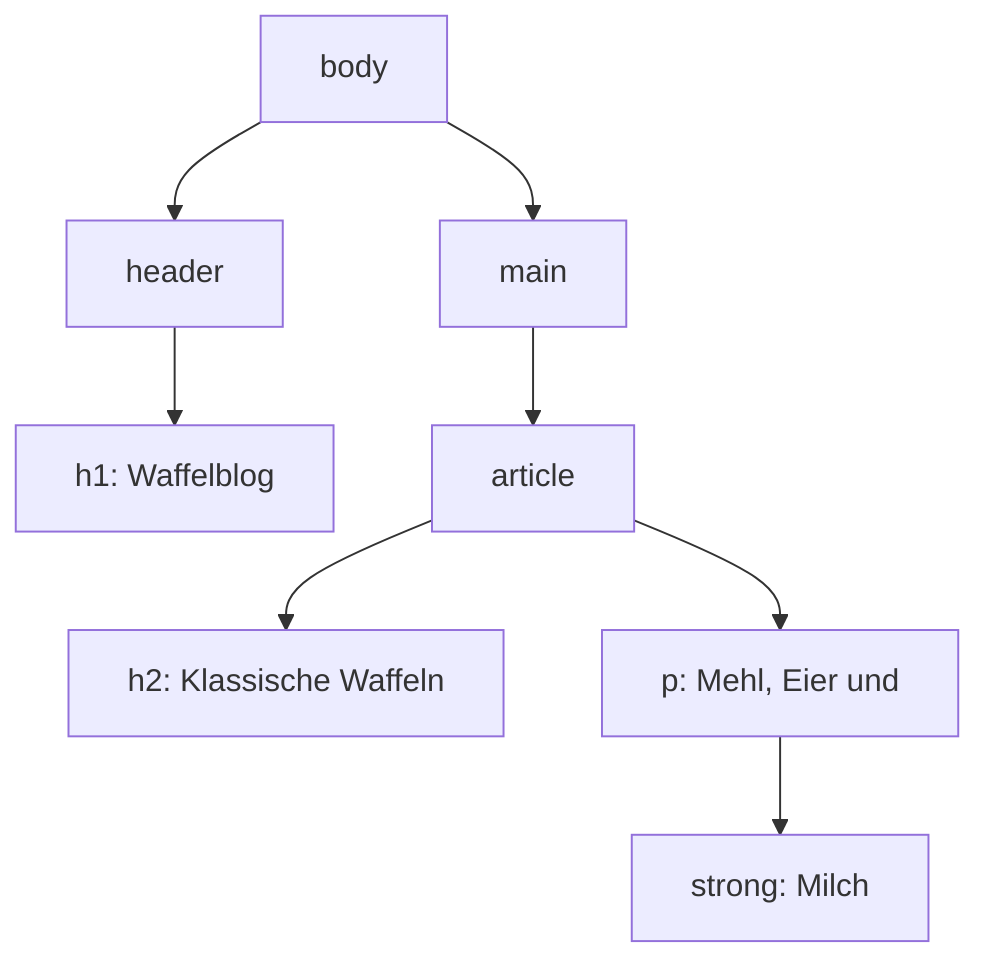
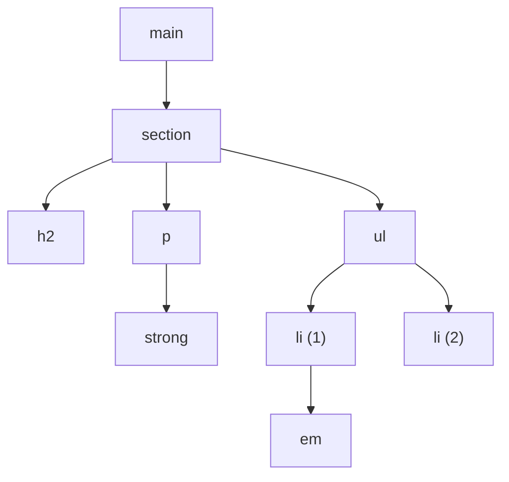

# Der Baum hinter der Seite

Ein :t[HTML]{#html}-Quelltext sieht aus wie eine Liste von Zeilen. Der Browser macht daraus etwas anderes: einen **Baum**.

## Vom Text zum Baum

```html
<body>
  <header>
    <h1>Waffelblog</h1>
  </header>
  <main>
    <article>
      <h2>Klassische Waffeln</h2>
      <p>Mehl, Eier und <strong>Milch</strong>.</p>
    </article>
  </main>
</body>
```

Derselbe Quelltext als Baum:



:::snippet{#definition}
Die Baumdarstellung einer Seite heißt **:t[DOM]{#dom}** (*Document Object Model*). Für die Verwandtschaft gibt es feste Begriffe:

- `header` und `main` sind **Kinder** von `body`.
- `body` ist ihr **Elternelement**.
- `header` und `main` sind **Geschwister**.
- `h1`, `h2`, `p` und `strong` sind alle **Nachfahren** von `body`.

Die Einrückung im Quelltext bildet genau diese Tiefe ab: Jede Ebene im Baum ist eine Einrückung mehr.
:::

:::snippet{#merken}
Der Baum ist keine Theorie – du siehst ihn direkt. Öffne die Entwicklerwerkzeuge (**F12**) und wechsle in den Reiter **Elemente**. Genau das ist der Baum, mit Dreiecken zum Auf- und Zuklappen.

Wenn du dort auf ein Element klickst, wird es in der Seite hervorgehoben. Umgekehrt findest du über das Auswahlwerkzeug (das Symbol mit dem Mauszeiger im Rechteck) zu jeder Stelle der Seite das zugehörige Element.
:::

## Den Baum lesen

:::webide{id="web-3-1-baum" height="310px"}

```html
<main>
  <section>
    <h2>Über uns</h2>
    <p>Wir sind die <strong>Garten-AG</strong> der Schule.</p>
    <ul>
      <li>Wir treffen uns <em>dienstags</em>.</li>
      <li>Alle dürfen mitmachen.</li>
    </ul>
  </section>
</main>
```

```css
* { outline: 1px solid hsl(210 50% 70%); }
```

:::

:::snippet{#aufgabe}
a) Zeichne den Baum zu diesem Quelltext auf Papier.

b) Wie viele Kinder hat `<section>`?

c) Wer ist das Elternelement von `<em>`?

d) Ist `<strong>` ein Nachfahre von `<main>`? Ist es ein **Kind** von `<main>`?

e) Die :t[CSS]{#css}-Regel im Übungsbereich zeichnet um **jedes** Element einen Rahmen. Zähle die Rahmen und vergleiche mit deinem Baum.
:::

:::protect{password="web-3-1-1" description="Lösung. Erfrage das Passwort bei deiner Lehrkraft."}

a)



b) **Drei**: `h2`, `p` und `ul`. Das `strong` ist zwar in `section` enthalten, aber kein Kind – es ist ein Kind von `p`.

c) Das erste `<li>`.

d) `<strong>` ist ein **Nachfahre** von `<main>`, aber **kein Kind**. Kind heißt: direkt darunter. Zwischen `main` und `strong` liegen noch `section` und `p`.

e) Neun Elemente, also neun Rahmen: `main`, `section`, `h2`, `p`, `strong`, `ul`, zwei `li` und `em`.

Der Unterschied zwischen *Kind* und *Nachfahre* wird in [Kapitel 4](../04-css-gestalten/02-selektoren-und-kaskade) wichtig – dort greifst du Elemente über genau diese Beziehungen an.

:::

## Warum der Baum wichtig ist

:::snippet{#brain}
Drei Dinge folgen aus der Baumstruktur, die du sonst nur auswendig lernen müsstest:

1. **Elemente müssen sich sauber schachteln.** `<p><strong>Text</p></strong>` ergibt keinen Baum – die beiden Elemente überlappen sich. Ein Baum kennt nur „ganz drin" oder „ganz draußen".
2. **CSS vererbt sich nach unten.** Setzt du am `body` eine Schriftart, gilt sie für alle Nachfahren. Der Baum ist der Weg, den die Vererbung nimmt.
3. **Ein Klick trifft mehrere Elemente.** Klickst du auf das Wort *Milch*, hast du zugleich in `strong`, in `p`, in `article`, in `main` und in `body` geklickt. Jedes umschließende Element ist mitgemeint.
:::

:::snippet{#aufgabe}
Prüfe Punkt 2 aus dem Kasten selbst nach.

a) Sag voraus: Welche der drei Texte werden grün, wenn du die Regel `section { color: green; }` anwendest?

b) Probiere es aus.

c) Ergänze `h2 { color: black; }` und erkläre das Ergebnis.
:::

:::webide{id="web-3-1-vererbung" height="300px"}

```html
<h1>Nicht in der section</h1>
<section>
  <h2>In der section</h2>
  <p>Auch in der section, mit <em>Betonung</em>.</p>
</section>
```

```css
section {
  color: green;
}
```

:::

:::protect{password="web-3-1-2" description="Lösung. Erfrage das Passwort bei deiner Lehrkraft."}

a) und b) Grün werden `h2`, `p` **und** `em` – alle Nachfahren der `section`. Die `h1` bleibt schwarz, weil sie außerhalb steht.

c) Mit `h2 { color: black; }` wird die Überschrift wieder schwarz, `p` und `em` bleiben grün. Eine Regel, die ein Element direkt anspricht, ist stärker als ein geerbter Wert.

**Das ist der Grundgedanke:** Farben, Schriftarten und Schriftgrößen wandern im Baum nach unten, bis eine eigene Regel sie ersetzt. Wie das genau geregelt ist, klärt [Kapitel 4](../04-css-gestalten/02-selektoren-und-kaskade).

:::

<!--
UV 10.2, Konkretisierte Kompetenzerwartung: analysieren HTML-Quelltexte (A/DI).
Übergeordnet DI: beschreiben anhand vorgegebener einfacher textueller und
visueller Darstellungen die abgebildeten informatischen Sachverhalte - hier
der Wechsel zwischen Quelltext und Baumdarstellung in beide Richtungen.
-->

---

## Selbsttest

::::multievent

**1. Wie heißt die Baumdarstellung einer Webseite?**

{r1{HTML}}

{r1{!DOM}}

{r1{CSS}}

{r1{URL}}

{h{Die Abkürzung steht für Document Object Model.}}
{H{Richtig – und du siehst ihn im Reiter Elemente.}}

**2. Was ist der Unterschied zwischen Kind und Nachfahre?**

{r2{Es gibt keinen.}}

{r2{!Ein Kind steht direkt darunter, ein Nachfahre irgendwo darunter.}}

{r2{Ein Nachfahre steht direkt darunter, ein Kind irgendwo darunter.}}

{r2{Kinder sind Textelemente, Nachfahren sind Tags.}}

{h{Zwischen main und strong lagen noch zwei Elemente.}}
{H{Richtig. Jedes Kind ist ein Nachfahre, aber nicht umgekehrt.}}

**3. Warum ist p strong Text /p /strong falsch?**

{r3{Weil strong nicht in p stehen darf.}}

{r3{!Weil sich die beiden Elemente überlappen und das keinen Baum ergibt.}}

{r3{Weil die Reihenfolge der Endtags egal ist.}}

{r3{Es ist gar nicht falsch.}}

{h{Ein Baum kennt nur ganz drin oder ganz draußen.}}
{H{Richtig.}}

**4. Du setzt am body eine Schriftart. Für welche Elemente gilt sie?**

{r4{nur für das body-Element selbst}}

{r4{!für alle Nachfahren, solange keine eigene Regel sie ersetzt}}

{r4{für alle Elemente der Seite, ohne Ausnahme}}

{r4{für gar keines}}

{h{Die Vererbung nimmt den Weg des Baums nach unten.}}
{H{Richtig.}}

**5. In welchem Reiter der Entwicklerwerkzeuge siehst du den Baum?**

{r5{Netzwerk}}

{r5{!Elemente}}

{r5{Konsole}}

{r5{Speicher}}

{h{Dort lassen sich die Ebenen auf- und zuklappen.}}
{H{Richtig.}}

**6. Ein section-Element enthält h2, p und ul. Das p enthält ein strong. Wie viele Kinder hat die section?**

{z{3}}

{h{Kind heißt: direkt darunter.}}
{H{Richtig – das strong ist ein Kind des p, nicht der section.}}

::::
