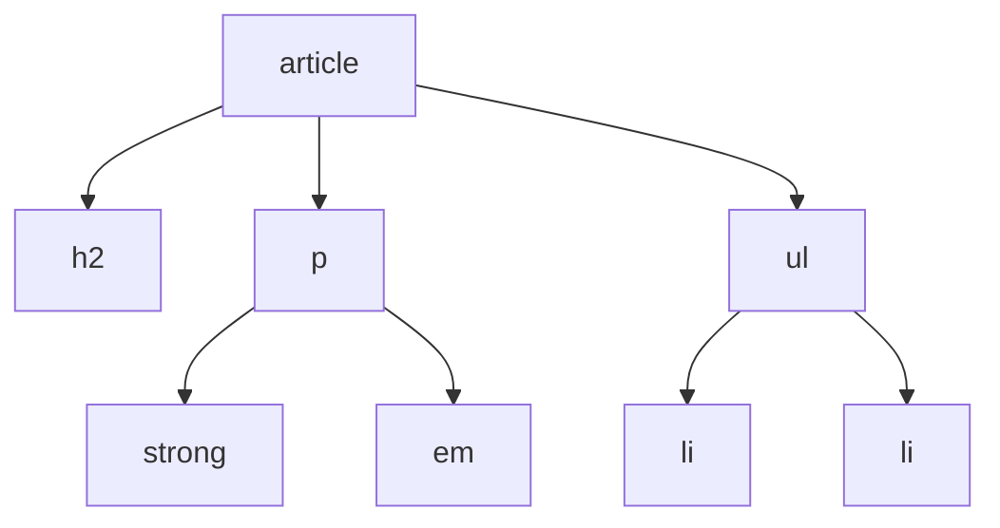
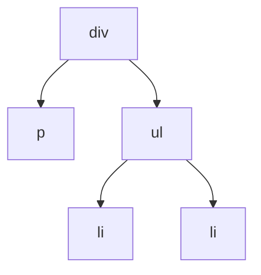

# Rückblick

Dieses Kapitel hat die Blickrichtung umgedreht: Statt selbst zu schreiben, hast du **fremde** Quelltexte gelesen und beurteilt. Das ist die Fähigkeit, die am längsten hält – Elemente kann man nachschlagen, ein geschultes Auge nicht.

## Das kann ich jetzt

- [ ] Ich kann zu einem Quelltext den **Baum** zeichnen, den der Browser daraus baut. ([3.1](./01-der-baum-hinter-der-seite))
- [ ] Ich kann die Begriffe **Elternelement**, **Kind** und **Nachfahre** an einem Baum zeigen. ([3.1](./01-der-baum-hinter-der-seite))
- [ ] Ich kann erklären, warum sich Elemente sauber schachteln müssen. ([3.1](./01-der-baum-hinter-der-seite))
- [ ] Ich kann vorhersagen, was der Browser aus fehlerhaftem HTML macht. ([3.2](./02-fehler-finden-und-beurteilen))
- [ ] Ich kann begründen, warum ein mehrdeutiger Quelltext auch dann fehlerhaft ist, wenn die Seite gut aussieht. ([3.2](./02-fehler-finden-und-beurteilen))
- [ ] Ich weiß, was ein **Validator** findet – und was er grundsätzlich nicht finden kann. ([3.2](./02-fehler-finden-und-beurteilen))
- [ ] Ich kann zwei Auszeichnungen desselben Inhalts vergleichen und begründet sagen, welche besser ist. ([3.2](./02-fehler-finden-und-beurteilen))

## Gemischte Aufgaben

:::snippet{#aufgabe}
**Aufgabe 1: Vom Text zum Baum und zurück**

```html
<article>
  <h2>Regenwurm</h2>
  <p>Er lockert den <strong>Boden</strong> und frisst <em>totes Laub</em>.</p>
  <ul>
    <li>bis zu 30 cm lang</li>
    <li>lebt im Dunkeln</li>
  </ul>
</article>
```

a) Zeichne den Baum auf Papier. Textknoten darfst du weglassen.

b) Wie viele **Kinder** hat das `article`?

c) Nenne alle **Nachfahren** des `p`.

d) Du klickst im Browser auf das Wort *Boden*. In welchen Elementen hast du damit zugleich geklickt?

e) Am `article` gilt die Regel `color: green`. Welche Texte werden grün?
:::

::::collapsible{title="Tipp zu b) und c)"}

**Kinder** sind nur die Elemente eine Ebene tiefer. **Nachfahren** sind alle, die irgendwo darunter hängen – Kinder, deren Kinder und so weiter.

::::

:::protect{password="web-3-3-1" description="Lösung. Erfrage das Passwort bei deiner Lehrkraft."}

a) So sieht der Baum aus:



b) **Drei**: `h2`, `p` und `ul`.

c) `strong` und `em`. Beide sind Kinder des `p` und damit auch Nachfahren.

d) In `strong`, `p`, `article` – und darüber in `body` und `html`. Jedes umschließende Element ist mitgemeint. Genau darauf beruht später, dass ein Klick auf einen Knopf auch das ganze Formular „bemerkt".

e) **Alle.** `color` vererbt sich an alle Nachfahren, und alle Texte hängen unter dem `article`.

:::

:::snippet{#aufgabe}
**Aufgabe 2: Was macht der Browser daraus?**

```html
<div>
  <p>Erster Absatz
  <ul>
    <li>Punkt eins</li>
    <li>Punkt zwei
  </ul>
</div>
```

a) Nenne die beiden Stellen, an denen ein Endtag fehlt.

b) Sag **vorher** voraus, wie der Baum aussieht, den der Browser baut.

c) Prüfe deine Vorhersage: Öffne die Entwicklerwerkzeuge, Reiter *Elemente*.

d) Diese Seite sieht am Ende richtig aus. Nenne trotzdem zwei Gründe, warum der Quelltext ein Problem ist.
:::

:::webide{id="web-3-3-repariert" height="330px"}

```html
<!-- Dieser Quelltext ist absichtlich fehlerhaft. -->
<div>
  <p>Erster Absatz
  <ul>
    <li>Punkt eins</li>
    <li>Punkt zwei
  </ul>
</div>
```

```css
* { outline: 1px solid hsl(210 50% 70%); }
```

:::

::::collapsible{title="Tipp zu b)"}

Ein `<p>` darf keine Liste enthalten. Was bleibt dem Browser also übrig, wenn nach dem offenen Absatz ein `<ul>` kommt?

::::

:::protect{password="web-3-3-2" description="Lösung. Erfrage das Passwort bei deiner Lehrkraft."}

a) Nach `Erster Absatz` fehlt `</p>`, nach `Punkt zwei` fehlt `</li>`.

b) und c) Der Browser schließt den Absatz von sich aus, **bevor** die Liste beginnt, weil ein `<p>` keine Liste enthalten darf. Der letzte Listeneintrag wird am `</ul>` geschlossen. Der Baum sieht deshalb so aus:



Die Liste ist also **kein** Kind des Absatzes, sondern seine Schwester – obwohl die Einrückung im Quelltext etwas anderes nahelegt.

d) Zum Beispiel:

- **Die Einrückung lügt.** Wer den Quelltext liest, erwartet die Liste im Absatz. Der Baum sieht anders aus. Beim nächsten Bearbeiten führt das in die Irre.
- **Die Reparatur ist nicht garantiert.** Sie ist zwar standardisiert, aber andere Werkzeuge – Vorleseprogramme, Übersetzer, Programme, die HTML weiterverarbeiten – entscheiden teilweise anders.
- **Der Fehler bleibt unsichtbar.** Man findet ihn erst, wenn später etwas verrutscht, und sucht dann an der falschen Stelle.

:::

:::snippet{#aufgabe}
**Aufgabe 3: Was der Validator sagt – und was nicht**

Eine Mitschülerin hat ihre Seite durch den Validator des W3C geschickt. Sie meldet: „Null Fehler, also ist meine Seite gut."

```html
<div class="titel">Unsere Klassenfahrt</div>
<div>Wir fahren im <div class="fett">Mai</div> nach Hamburg.</div>
<div></div>
<div class="klein">Fotos: Amira</div>
```

a) Hat der Validator recht? Prüfe: Steckt in diesem Quelltext ein Verstoß gegen die HTML-Regeln?

b) Nenne trotzdem drei Schwächen dieser Seite.

c) Schreibe den Quelltext so um, dass er dieselbe Seite ergibt, aber die Bedeutung mitträgt.

d) Erkläre in einem Satz, warum ein Prüfprogramm die Schwächen aus b) grundsätzlich nicht finden kann.
:::

::::collapsible{title="Tipp zu b)"}

Stell dir die Seite ohne Bildschirm vor: Ein Vorleseprogramm liest sie vor. Woran erkennt es, was hier die Überschrift ist? Und was ist ein `<div class="fett">` mitten in einem Satz für ein Ding?

::::

:::protect{password="web-3-3-3" description="Lösung. Erfrage das Passwort bei deiner Lehrkraft."}

a) Ja, der Validator hat recht: Das ist **gültiges HTML**. Alle Tags sind geschlossen, sauber geschachtelt, das Bild hat einen Alternativtext. Nach den Regeln der Sprache ist nichts zu beanstanden.

b) Drei Schwächen:

1. **Keine Überschrift.** Was aussieht wie ein Titel, ist ein `<div>`. Vorleseprogramme können nicht zur Überschrift springen, Suchmaschinen erkennen das Thema nicht.
2. **`<div>` mitten im Satz.** `<div>` ist ein Block und fängt eine neue Zeile an. Für ein Wort im Fließtext ist `<span>` zuständig – und wenn *Mai* betont sein soll, `<strong>` oder `<em>`.
3. **Klassennamen beschreiben das Aussehen.** `fett` und `klein` sagen, wie etwas aussehen soll. Wird die Schrift später nicht mehr fett, heißt die Klasse trotzdem noch so.

Auch möglich: Der Fotohinweis gehört eigentlich zum Bild – dafür gäbe es `<figure>` mit `<figcaption>`.

c) Zum Beispiel:

```html
<article>
  <h1>Unsere Klassenfahrt</h1>
  <p>Wir fahren im <strong>Mai</strong> nach Hamburg.</p>
  <figure>
    
    <figcaption>Fotos: Amira</figcaption>
  </figure>
</article>
```

d) Weil ein Prüfprogramm nur die **Regeln der Sprache** kennt, nicht deine **Absicht**. Ob ein `<div>` an dieser Stelle eine Überschrift sein sollte, steht nirgends im Quelltext – das weiß nur, wer den Inhalt versteht.

:::

<!--
Rückblick zu UV 10.2, Inhaltsfeld Formale Sprachen. Bündelt die konkretisierte
Kompetenzerwartung "Analysieren HTML-Quelltexte" (A/DI); Teilaufgabe 3d) zielt
auf die Beurteilungsdimension (A).
-->

---

## Selbsttest

::::multievent

**1. Warum ergibt der Quelltext div span Text /div /span keinen Baum?**

{r1{Weil div und span verschiedene Elemente sind.}}

{r1{!Weil sich die beiden Elemente überlappen – ein Baum kennt nur ganz drin oder ganz draußen.}}

{r1{Weil span kein Text enthalten darf.}}

{r1{Weil die Reihenfolge der Starttags falsch ist.}}

{h{Zeichne es auf: Steckt das span im div oder umgekehrt?}}
{H{Richtig. Beide Deutungen sind ablesbar – und damit ist der Quelltext mehrdeutig.}}

**2. Was ist ein Nachfahre eines Elements?**

{r2{nur die Elemente direkt darunter}}

{r2{!jedes Element, das irgendwo darunter hängt}}

{r2{das umschließende Element}}

{r2{das nächste Element auf derselben Ebene}}

{h{Kinder sind eine Ebene tiefer – Nachfahren sind mehr.}}
{H{Richtig. Kinder sind die direkten Nachfahren.}}

**3. Der Browser findet fehlerhaftes HTML. Was tut er?**

{r3{Er zeigt eine Fehlermeldung.}}

{r3{Er zeigt die Seite gar nicht an.}}

{r3{!Er repariert still und zeigt die Seite trotzdem an.}}

{r3{Er fragt beim Server nach einer korrigierten Fassung.}}

{h{Hast du beim Ausprobieren je eine HTML-Fehlermeldung gesehen?}}
{H{Richtig – und genau deshalb fallen solche Fehler so lange nicht auf.}}

**4. Welche Fehler findet der Validator des W3C? Wähle alle zutreffenden aus.**

{c1{!ein fehlendes Endtag}}

{c1{!ein img ohne alt}}

{c1{!zwei Elemente mit derselben id}}

{c1{eine Seite, die nur aus div besteht}}

{c1{einen Text, der inhaltlich falsch ist}}

{h{Er kennt die Regeln der Sprache – aber nicht deine Absicht.}}
{H{Richtig. Eine Seite aus lauter div ist gültiges HTML und trotzdem schlecht ausgezeichnet.}}

**5. Eine Seite sieht richtig aus, der Quelltext ist aber mehrdeutig. Ist das ein Fehler?**

{r4{Nein, entscheidend ist das Ergebnis.}}

{r4{!Ja, denn die Beschreibung lässt mehrere Bäume zu – dass einer davon gut aussieht, ist Zufall.}}

{r4{Nur wenn ein Vorleseprogramm benutzt wird.}}

{r4{Nur bei Tabellen.}}

{h{Dieselbe Forderung kennst du von Handlungsvorschriften: Sie müssen eindeutig sein.}}
{H{Richtig.}}

**6. In einem Absatz beginnt eine Liste, ohne dass der Absatz geschlossen wurde. Wo hängt die Liste im Baum?**

{r5{im Absatz}}

{r5{!neben dem Absatz, als dessen Schwester}}

{r5{direkt unter dem html-Element}}

{r5{im ersten Listeneintrag}}

{h{Ein Absatz darf keine Liste enthalten – der Browser muss ihn also vorher schließen.}}
{H{Richtig. Die Einrückung im Quelltext täuscht dann.}}

**7. Eine Klasse heißt fett. Was spricht dagegen?**

{r6{Klassennamen dürfen keine Adjektive sein.}}

{r6{!Der Name beschreibt das Aussehen; ändert sich die Gestaltung, passt er nicht mehr.}}

{r6{Der Browser versteht den Namen nicht.}}

{r6{Der Validator meldet das als Fehler.}}

{h{Was passiert mit dem Namen, wenn der Text später kursiv statt fett sein soll?}}
{H{Richtig. Klassen benennt man nach der Bedeutung, nicht nach der Wirkung.}}

::::
