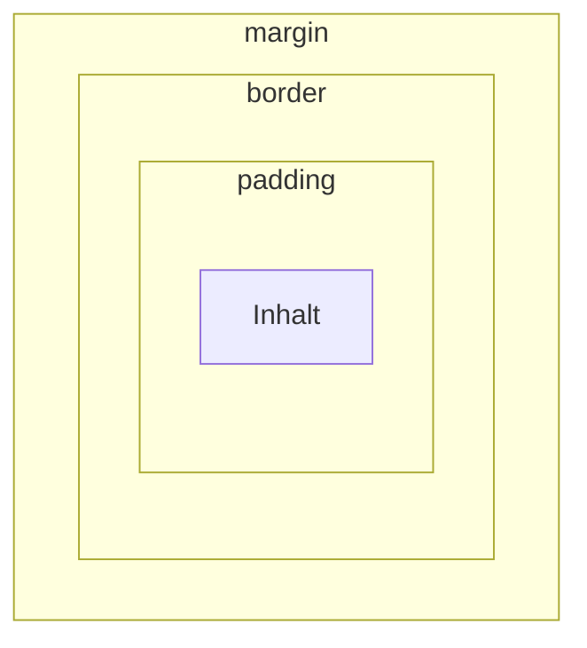

# Das Boxmodell

Jedes Element ist für den Browser ein Rechteck – eine **Box**. Wer das Boxmodell versteht, hört auf zu raten, warum irgendwo ein Abstand ist.

## Die vier Schichten



:::webide{id="web-4-4-box" height="350px"}

```html
<div class="box">Inhalt</div>
<div class="box">Zweite Box</div>
```

```css
body {
  background: hsl(220 15% 92%);
  font-family: system-ui, sans-serif;
}

.box {
  background: hsl(50 90% 80%);
  padding: 20px;
  border: 6px solid hsl(220 60% 40%);
  margin: 30px;
  width: 200px;
}
```

:::

:::snippet{#definition}
| Schicht | Bedeutung |
| --- | --- |
| **Inhalt** | Text oder andere Elemente |
| **padding** | Abstand zwischen Inhalt und Rahmen – **innerhalb** der Box, in der Hintergrundfarbe |
| **border** | der Rahmen selbst |
| **margin** | Abstand zu den **Nachbarn** – außerhalb der Box, immer durchsichtig |

Die Eselsbrücke: **padding** ist die Polsterung *in* der Kiste, **margin** ist der Platz, den die Kiste um sich herum beansprucht.
:::

:::snippet{#aufgabe}
a) Setze `padding` auf 0. Was ändert sich am gelben Bereich?

b) Setze `padding` zurück und `margin` auf 0. Was ändert sich?

c) Erhöhe `padding` auf 60px. Wie breit ist die Box jetzt insgesamt? Miss im Reiter *Elemente* der Entwicklerwerkzeuge nach – ganz unten steht dort eine Zeichnung des Boxmodells mit allen Zahlen.
:::

:::protect{password="web-4-4-1" description="Lösung. Erfrage das Passwort bei deiner Lehrkraft."}

a) Der Text klebt am Rahmen. Der gelbe Bereich wird kleiner, weil das Polster wegfällt.

b) Die beiden Kästen stoßen aneinander und an den Rand des Fensters. Der gelbe Bereich bleibt gleich groß – `margin` ist außerhalb.

c) Die Gesamtbreite beträgt **332 Pixel**: 200 Inhalt + zweimal 60 Polster + zweimal 6 Rahmen.

Das überrascht die meisten: Man hat `width: 200px` geschrieben und bekommt 332. Genau dieses Problem löst die nächste Regel.

:::

## Die eine Zeile, die alles einfacher macht

:::webide{id="web-4-4-borderbox" height="460px"}

```html
<div class="alt">width: 200px, ohne border-box</div>
<div class="neu">width: 200px, mit border-box</div>
```

```css
body {
  font-family: system-ui, sans-serif;
  background: hsl(220 15% 92%);
}

.alt, .neu {
  width: 200px;
  padding: 20px;
  border: 6px solid hsl(220 60% 40%);
  margin-block: 1rem;
  background: hsl(50 90% 80%);
}

.neu {
  box-sizing: border-box;
  background: hsl(140 60% 82%);
}
```

:::

:::snippet{#merken}
Voreingestellt zählt `width` nur den **Inhalt**. Polster und Rahmen kommen obendrauf.

Mit `box-sizing: border-box` zählt `width` die **ganze Box** einschließlich Polster und Rahmen. Das entspricht dem, was man erwartet.

Deshalb beginnt praktisch jedes :t[CSS]{#css}-Projekt mit dieser Regel:

```css
* {
  box-sizing: border-box;
}
```

Der `*` trifft **jedes** Element. Schreib diese drei Zeilen als Erstes in deine CSS-Datei und denk nie wieder darüber nach.
:::

## Kurzschreibweisen

:::snippet{#merken}
Bei `margin`, `padding` und `border` gibt es Abkürzungen:

```css
padding: 10px;                    /* alle vier Seiten */
padding: 10px 20px;               /* oben/unten | links/rechts */
padding: 10px 20px 30px 40px;     /* oben | rechts | unten | links, im Uhrzeigersinn */

margin-block: 1rem;               /* oben und unten */
margin-inline: auto;              /* links und rechts */
```

`margin-inline: auto` ist der übliche Weg, einen Kasten **waagerecht zu zentrieren** – er verteilt den übrigen Platz gleichmäßig auf beide Seiten. Das setzt voraus, dass der Kasten eine Breite hat.
:::

:::webide{id="web-4-4-zentrieren" height="500px"}

```html
<div class="karte">
  <h2>Zentrierter Kasten</h2>
  <p>Er hat eine Höchstbreite und teilt den Rest gleichmäßig auf.</p>
</div>
```

```css
* {
  box-sizing: border-box;
}

body {
  font-family: system-ui, sans-serif;
  background: hsl(220 15% 92%);
  margin: 0;
  padding: 1rem;
}

.karte {
  max-width: 30rem;
  margin-inline: auto;
  padding: 1.5rem;
  background: white;
  border-radius: 0.75rem;
  box-shadow: 0 2px 8px hsl(220 20% 60% / 40%);
}
```

:::

:::snippet{#aufgabe}
a) Entferne `margin-inline: auto`. Wo steht der Kasten jetzt?

b) Ersetze `max-width` durch `width`. Verkleinere dann die Vorschau, indem du die Trennlinie zwischen Vorschau und Editor verschiebst. Was passiert?

c) Setze `max-width` wieder ein und wiederhole b). Erkläre den Unterschied.
:::

:::protect{password="web-4-4-2" description="Lösung. Erfrage das Passwort bei deiner Lehrkraft."}

a) Links. Ohne `auto` bekommt der übrige Platz nur die rechte Seite.

b) Mit `width: 30rem` bleibt der Kasten **immer** 30rem breit. Wird die Vorschau schmaler, ragt er über den Rand hinaus und man muss seitlich scrollen.

c) `max-width` heißt **höchstens** so breit. Ist weniger Platz da, wird der Kasten schmaler. So passt er sich an, statt zu überstehen.

**Merke:** Für Kästen, die auf verschiedenen Bildschirmen funktionieren sollen, nimmt man `max-width` statt `width`. Mehr dazu in [Lektion 6](./06-responsiv-gestalten).

:::

## Abstände, die sich zusammenlegen

:::snippet{#brain}
Zwei Absätze untereinander: Der obere hat `margin-bottom: 20px`, der untere `margin-top: 30px`. Wie groß ist der Abstand dazwischen?

Nicht 50, sondern **30**. Senkrechte Außenabstände benachbarter Elemente **legen sich zusammen** – es gilt der größere von beiden.

Das ist Absicht: Sonst hätte man zwischen jedem Absatz doppelten Abstand. Es überrascht aber jeden, der es zum ersten Mal sieht.

Innerhalb einer Flexbox oder eines Grids passiert das nicht – dort regelt man Abstände mit `gap`, und der ist eindeutig. Ein Grund mehr, Layout mit den Werkzeugen aus [der nächsten Lektion](./05-layout-mit-flexbox-und-grid) zu bauen.
:::

## Aufgabe

:::snippet{#aufgabe}
Gestalte im Übungsbereich einen Hinweiskasten:

a) Beginne mit der `box-sizing`-Regel für alle Elemente.

b) Der Kasten bekommt: einen 1 Pixel breiten Rahmen, abgerundete Ecken von 8 Pixeln, 1rem Innenabstand und einen hellen Hintergrund.

c) Er soll höchstens 40rem breit und waagerecht zentriert sein.

d) Zwischen den Kästen sollen 1.5rem Abstand entstehen.
:::

::::collapsible{title="Tipp 1: Wo schreibe ich was hin?"}

Du brauchst genau zwei Regeln – eine für `*` und eine für die Klasse `kasten`:

```css
* {
  /* hierhin gehört a) */
}

.kasten {
  /* hierhin gehört alles von b) bis d) */
}
```

Die Klasse steht schon im HTML, du musst sie nur ansprechen.

::::

::::collapsible{title="Tipp 2: Welche Eigenschaft wofür?"}

| Verlangt | Eigenschaft |
| --- | --- |
| Rahmen | `border` |
| abgerundete Ecken | `border-radius` |
| Innenabstand | `padding` |
| höchstens so breit | `max-width` |
| waagerecht zentriert | `margin-inline: auto` |
| Abstand nach oben und unten | `margin-block` |

::::

:::webide{id="web-4-4-uebung" height="460px"}

```html
<div class="kasten">
  <h2>Erster Hinweis</h2>
  <p>Bitte die Werkzeuge zurücklegen.</p>
</div>

<div class="kasten">
  <h2>Zweiter Hinweis</h2>
  <p>Das Beet nicht betreten.</p>
</div>
```

```css

```

:::

:::protect{password="web-4-4-3" description="Lösung. Erfrage das Passwort bei deiner Lehrkraft."}

```css
* {
  box-sizing: border-box;
}

body {
  font-family: system-ui, sans-serif;
  background: hsl(220 15% 94%);
  padding: 1rem;
}

.kasten {
  max-width: 40rem;
  margin-inline: auto;
  margin-block: 1.5rem;
  padding: 1rem;
  border: 1px solid hsl(220 20% 75%);
  border-radius: 8px;
  background: white;
}
```

Weil die senkrechten Abstände sich zusammenlegen, beträgt der Abstand zwischen den beiden Kästen 1.5rem und nicht 3rem – obwohl beide je 1.5rem oben und unten haben.

:::

<!--
UV 10.2, Konkretisierte Kompetenzerwartung: formatieren Webseiten mit CSS (MI).
-->

---

## Selbsttest

::::multievent

**1. Welche Schicht liegt zwischen Inhalt und Rahmen?**

{r1{margin}}

{r1{!padding}}

{r1{border}}

{r1{outline}}

{h{Es ist die Polsterung innerhalb der Kiste.}}
{H{Richtig – und sie zeigt die Hintergrundfarbe.}}

**2. Welche Schicht ist immer durchsichtig?**

{r2{padding}}

{r2{!margin}}

{r2{border}}

{r2{der Inhalt}}

{h{Es ist der Abstand zu den Nachbarn, außerhalb der Box.}}
{H{Richtig.}}

**3. Eine Box hat width 200px, padding 20px und border 6px. Wie breit ist sie insgesamt ohne border-box?**

{z{252}}

{h{200 plus zweimal 20 plus zweimal 6.}}
{H{Richtig – genau deshalb nimmt man border-box.}}

**4. Was bewirkt box-sizing: border-box?**

{r3{Es entfernt den Rahmen.}}

{r3{!width zählt dann die ganze Box einschließlich Polster und Rahmen.}}

{r3{Es zentriert die Box.}}

{r3{Es macht die Box quadratisch.}}

{h{Es sorgt dafür, dass width das bedeutet, was man erwartet.}}
{H{Richtig – deshalb gehört die Regel an den Anfang jeder CSS-Datei.}}

**5. Womit zentriert man einen Kasten waagerecht?**

{r4{text-align: center}}

{r4{!margin-inline: auto zusammen mit einer Breite}}

{r4{padding: auto}}

{r4{border: center}}

{h{text-align zentriert den Text im Kasten, nicht den Kasten selbst.}}
{H{Richtig.}}

**6. Zwei Absätze untereinander haben 20px und 30px senkrechten Außenabstand. Wie groß ist der Abstand dazwischen?**

{z{30}}

{h{Senkrechte Außenabstände legen sich zusammen.}}
{H{Richtig – es gilt der größere von beiden.}}

::::
