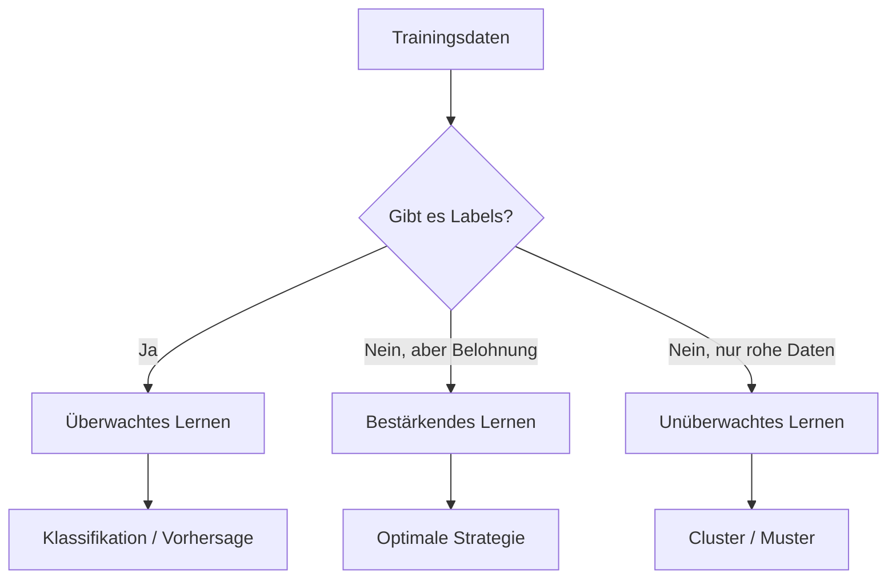

# Arten des maschinellen Lernens

Diskriminativ oder generativ — das ist die eine Unterscheidung. Aber wie lernt ein System beim :t[maschinellen Lernen]{#maschinelles-lernen} überhaupt? Dafür gibt es drei grundlegende Arten, und jede funktioniert auf eine andere Weise.

## Die drei Arten im Überblick

| Art | Gibt es Labels? | Wie lernt das System? | Typisches Beispiel |
| --- | --- | --- | --- |
| **Überwacht** | Ja — jeder Trainingsdatensatz hat ein Etikett | Vergleicht seine Vorhersage mit dem Etikett und korrigiert sich | Obst nach Foto sortieren |
| **Unüberwacht** | Nein — nur rohe Daten | Sucht selbständig nach Mustern und Gruppen | Kundensegmentierung |
| **Bestärkend** | Nein — sondern Belohnung/Bestrafung | Probiert aus, was die meiste Belohnung bringt | Spiel-KI lernt Schach |

## Überwachtes Lernen

Stell dir vor, du hast Hunderte Fotos von Äpfeln und Birnen. Jedes Foto ist beschriftet: „Apfel" oder „Birne". Das System lernt aus diesen Beispielen, welche Merkmale (Farbe, Form, Größe) auf einen Apfel und welche auf eine Birne deuten. Wenn ein neues Foto kommt, ordnet es eine der beiden Kategorien zu.

:::snippet{#definition}
**Überwachtes Lernen** arbeitet mit **gelabelten Daten**: Jeder Trainingsdatensatz trägt ein :t[Etikett]{#label}, das sagt, was die richtige Antwort ist. Das System lernt, von den Eingaben auf das Etikett zu schließen, und wird anhand seiner Trefferquote korrigiert.
:::

## Unüberwachtes Lernen

Jetzt hast du Hunderte Kundenprofile — Alter, Kaufverhalten, Wohnort —, aber keine Beschriftung. Niemand hat gesagt: „Das ist ein Sparertyp, das ein Premiumkunde." Das System sucht selbständig nach Gruppen von Kunden, die sich ähnlich sind, und bildet Cluster. Danach kannst du die Cluster interpretieren: „Cluster A sind junge Städter, Cluster B sind ältere Sparzahler."

:::snippet{#definition}
**Unüberwachtes Lernen** arbeitet **ohne Labels**. Das System sucht selbständig nach Mustern, Gruppen oder Strukturen in den Daten. Es gibt keine vorgegebene richtige Antwort — das System entdeckt, was es findet.
:::

## Bestärkendes Lernen

Ein Computer lernt Schach spielen. Niemand sagt ihm, welcher Zug der beste ist. Stattdessen spielt er Millionen Partien und bekommt am Ende **Belohnung** (gewonnen) oder **Bestrafung** (verloren). Im Laufe der Zeit lernt er, welche Züge häufiger zu Belohnung führen, und optimiert seine Strategie.

:::snippet{#definition}
**Bestärkendes Lernen** lernt durch **Versuch und Irrtum** mit Belohnung und Bestrafung. Das System wählt Aktionen, beobachtet das Ergebnis und passt sein Verhalten an, um die langfristige Belohnung zu maximieren.
:::

## Übersichtsdiagramm

:::snippet{#aufgabe}
**Ordne die Beispiele zu.**

Welche Art des maschinellen Lernens passt? Begründe jeweils kurz.

a) Ein System soll E-Mails in „Spam" und „kein Spam" einteilen und hat dafür 5000 bereits markierte E-Mails.

b) Ein Roboter soll Laufen lernen. Er kriegt Punkte, wenn er vorankommt, und verliert Punkte, wenn er fällt.

c) Ein Online-Shop möchte seine Kunden in Gruppen einteilen, ohne vorher zu sagen, welche Gruppen es gibt.
:::

::::collapsible{title="Tipp"}

Stelle dir die Frage: **Was weiß das System im Voraus?**

- Wenn es für jeden Trainingsdatensatz die richtige Antwort kennt → überwacht.
- Wenn es nur rohe Daten hat und selbst Muster suchen muss → unüberwacht.
- Wenn es durch Versuch und Irrtum Belohnung sammelt → bestärkend.

::::

:::protect{password="ai-1-2-1" description="Lösung. Erfrage das Passwort bei deiner Lehrkraft."}

a) **Überwachtes Lernen** — die E-Mails sind bereits als „Spam" oder „kein Spam" gelabelt. Das System lernt aus diesen Etiketten.

b) **Bestärkendes Lernen** — der Roboter hat keine gelabelten Beispiele, sondern lernt durch Belohnung (Punkte) und Bestrafung (Punkteverlust).

c) **Unüberwachtes Lernen** — es gibt keine Labels und keine Belohnung. Das System muss selbst Gruppen in den Daten finden.

:::

<!-- KLP EF: beschreiben die grundlegenden Funktionsweisen der Arten des maschinellen
     Lernens (A). Q-Phase: erläutern die grundlegenden Funktionsweisen (A) -->

---

## Selbsttest

::::multievent

**1. Welche der folgenden Beispiele nutzen überwachtes Lernen?** (Mehrfachauswahl)

{c1{!Obstsorten anhand gelabelter Fotos klassifizieren}}

{c1{Kundensegmentierung ohne Vorgaben}}

{c1{!Spam-Erkennung mit markierten Trainings-E-Mails}}

{c1{Spiel-KI, die durch Belohnung lernt}}

{h{Überwachtes Lernen braucht gelabelte Daten — Etiketten, die die richtige Antwort vorgeben.}}

{H{Richtig! Obstsorten und Spam-Erkennung haben gelabelte Trainingsdaten. Kundensegmentierung hat keine Labels, die Spiel-KI lernt durch Belohnung.}}

**2. Was kennzeichnet das überwachte Lernen?**

{r2{!Es nutzt gelabelte Daten}}

{r2{Es braucht keine Labels}}

{r2{Es lernt durch Belohnung und Bestrafung}}

{r2{Es sucht selbständig nach Mustern}}

{h{Das Wort „überwacht" bezieht sich auf die Labels, die wie ein Lehrer wirken.}}

{H{Richtig! Jeder Trainingsdatensatz hat ein Etikett mit der richtigen Antwort.}}

**3. Ergänze: Beim {t{unüberwachten}} Lernen gibt es keine vorgegebenen Labels.**

{h{Welche Art des Lernens kommt ohne Labels aus?}}

{H{Richtig! Unüberwachtes Lernen sucht selbst Muster in den Daten.}}

::::
