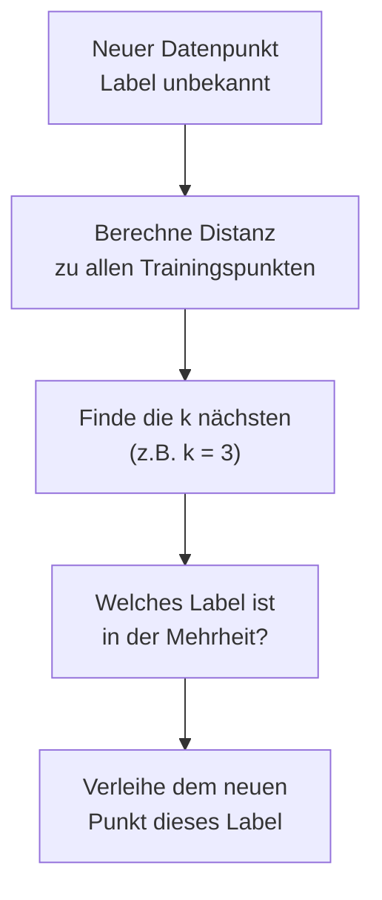

# Klassifizierung mit k-NN

Jetzt baust du dein erstes KI-Verfahren: **:t[k-NN]{#k-nn}** (k-nearest neighbors, deutsch: k-nächste Nachbarn). Es ist ein klassisches Verfahren des überwachten Lernens und gleichzeitig einfach genug, um es in ein paar Zeilen Java zu implementieren.

## Die Idee

k-NN ist faul: Es „lernt" nichts im Voraus. Statt ein kompliziertes Modell zu bauen, merkt es sich einfach alle Trainingsdaten. Wenn ein neuer, unbekannter Datenpunkt klassifiziert werden soll, schaut es sich die **k nächsten Nachbarn** in den Trainingsdaten an und gibt die Mehrheitsentscheidung zurück.



## Schritt 1: Die Distanz

Zwei Punkte haben die Koordinaten $(x_1, y_1)$ und $(x_2, y_2)$. Die euklidische Distanz ist:

$$d = \sqrt{(x_2 - x_1)^2 + (y_2 - y_1)^2}$$

In Java:

```java
double distanz = Math.sqrt(Math.pow(x2 - x1, 2) + Math.pow(y2 - y1, 2));
```

:::snippet{#brain}
Bevor du den Code anschaust: Berechne auf Papier die Distanz zwischen dem Punkt (150, 7) und dem Punkt (100, 3). Was kommt heraus?
:::

::::collapsible{title="Tipp"}

Setze ein: $x_1 = 150$, $y_1 = 7$, $x_2 = 100$, $y_2 = 3$.

$$d = \sqrt{(100 - 150)^2 + (3 - 7)^2} = \sqrt{(-50)^2 + (-4)^2} = \sqrt{2500 + 16} = \sqrt{2516}$$

::::

:::protect{password="ai-2-2-1" description="Lösung. Erfrage das Passwort bei deiner Lehrkraft."}

$\sqrt{2516} \approx 50{,}16$

:::

## Schritt 2: Die Distanz als Methode

Wir erweitern die `Datenpunkt`-Klasse um eine Methode, die die Distanz zu einem anderen Datenpunkt berechnet.

:::onlineide{height="520px" speed="1000000"}

```java Main.java
void main() {
    Datenpunkt apfel = new Datenpunkt(150, 7, "Apfel");
    Datenpunkt birne = new Datenpunkt(100, 3, "Birne");

    double d = apfel.distanzZu(birne);
    IO.println("Distanz: " + d);
}
```

```java Datenpunkt.java
public class Datenpunkt {
    private double gewicht;
    private double suessigkeit;
    private String label;

    public Datenpunkt(double pGewicht, double pSuessigkeit, String pLabel) {
        gewicht = pGewicht;
        suessigkeit = pSuessigkeit;
        label = pLabel;
    }

    public double gibGewicht() {
        return gewicht;
    }

    public double gibSuessigkeit() {
        return suessigkeit;
    }

    public String gibName() {
        return label;
    }

    public double distanzZu(Datenpunkt pOther) {
        double dg = pOther.gibGewicht() - gewicht;
        double ds = pOther.gibSuessigkeit() - suessigkeit;
        return Math.sqrt(dg * dg + ds * ds);
    }

    public void schreibe() {
        IO.println(gewicht + " g, Süßigkeit " + suessigkeit + " → " + label);
    }
}
```

:::

:::snippet{#aufgabe}
Vergleiche deine Papierberechnung mit dem Programm. Stimmt der Wert überein?

Füge einen dritten Punkt `new Datenpunkt(180, 8, "Apfel")` hinzu und berechne die Distanz vom Apfel (150, 7) zu diesem Punkt. Was fällt auf?
:::

::::collapsible{title="Tipp"}

Der zweite Apfel (180, 8) ist näher am Apfel (150, 7) als die Birne (100, 3). Das ist genau die Grundlage von k-NN: nähere Nachbarn sind aussagekräftiger.
::::

## Schritt 3: Den Klassifikator bauen

Jetzt bauen wir den :t[Klassifikator]{#klassifikator} als Klasse `KNNKlassifikator`. Sie speichert die Trainingsdaten in einem Feld und klassifiziert neue Punkte in drei Schritten:

1. Distanz zu allen Trainingspunkten berechnen
2. Die k nächsten finden
3. Mehrheitsentscheidung über die Labels

:::snippet{#brain}
Bevor du das Programm ausführst: Der Testpunkt ist (170, 7). Welches Label erwartest du? Begründe mit den Trainingsdaten im Programm unten.
:::

::::collapsible{title="Tipp"}

Es zählt nicht der eine nächste Nachbar, sondern die **Mehrheit unter den drei nächsten**. Rechne die Distanzen von (170, 7) zu allen sechs Trainingspunkten aus und ordne sie der Größe nach.
::::

:::onlineide{height="680px" speed="1000000"}

```java Main.java
void main() {
    Datenpunkt[] training = {
        new Datenpunkt(150, 7, "Apfel"),
        new Datenpunkt(180, 8, "Apfel"),
        new Datenpunkt(200, 6, "Apfel"),
        new Datenpunkt(120, 4, "Birne"),
        new Datenpunkt(100, 3, "Birne"),
        new Datenpunkt(110, 5, "Birne")
    };

    KNNKlassifikator knn = new KNNKlassifikator(training);

    Datenpunkt test = new Datenpunkt(170, 7, "");
    String ergebnis = knn.klassifiziere(test, 3);
    IO.println("Klassifizierung: " + ergebnis);
}
```

```java KNNKlassifikator.java
public class KNNKlassifikator {
    private Datenpunkt[] training;

    public KNNKlassifikator(Datenpunkt[] pTraining) {
        training = pTraining;
    }

    public String klassifiziere(Datenpunkt pPunkt, int pK) {
        // Schritt 1: Distanzen berechnen
        double[] distanzen = new double[training.length];
        for (int i = 0; i < training.length; i++) {
            distanzen[i] = pPunkt.distanzZu(training[i]);
        }

        // Schritt 2: Indizes der k nächsten sortieren
        // (Selection Sort nach Distanz, nur k Schritte)
        int[] nachbarn = new int[training.length];
        for (int i = 0; i < training.length; i++) {
            nachbarn[i] = i;
        }
        for (int i = 0; i < pK; i++) {
            int minIdx = i;
            for (int j = i + 1; j < training.length; j++) {
                if (distanzen[nachbarn[j]] < distanzen[nachbarn[minIdx]]) {
                    minIdx = j;
                }
            }
            int tmp = nachbarn[i];
            nachbarn[i] = nachbarn[minIdx];
            nachbarn[minIdx] = tmp;
        }

        // Schritt 3: Mehrheitsentscheidung
        int apfel = 0;
        int birne = 0;
        for (int i = 0; i < pK; i++) {
            String label = training[nachbarn[i]].gibName();
            if (label.equals("Apfel")) {
                apfel++;
            } else {
                birne++;
            }
        }

        IO.println("Stimmen: Apfel=" + apfel + ", Birne=" + birne);
        if (apfel > birne) {
            return "Apfel";
        } else {
            return "Birne";
        }
    }
}
```

```java Datenpunkt.java
public class Datenpunkt {
    private double gewicht;
    private double suessigkeit;
    private String label;

    public Datenpunkt(double pGewicht, double pSuessigkeit, String pLabel) {
        gewicht = pGewicht;
        suessigkeit = pSuessigkeit;
        label = pLabel;
    }

    public double gibGewicht() {
        return gewicht;
    }

    public double gibSuessigkeit() {
        return suessigkeit;
    }

    public String gibName() {
        return label;
    }

    public double distanzZu(Datenpunkt pOther) {
        double dg = pOther.gibGewicht() - gewicht;
        double ds = pOther.gibSuessigkeit() - suessigkeit;
        return Math.sqrt(dg * dg + ds * ds);
    }

    public void schreibe() {
        IO.println(gewicht + " g, Süßigkeit " + suessigkeit + " → " + label);
    }
}
```

:::

:::snippet{#merken}
k-NN ist ein **diskriminatives** Verfahren: Es ordnet Daten einer Kategorie zu. Es ist **überwacht**, weil es gelabelte Trainingsdaten benötigt. Und es ist **faul** (lazy learning), weil die meiste Arbeit erst bei der Klassifizierung passiert, nicht beim Training.
:::

:::snippet{#brain}
**Ein Merkmal entscheidet fast allein.** Das Gewicht liegt zwischen 90 und 200 Gramm, die Süßigkeit zwischen 2 und 9. Ein Unterschied von 50 Gramm geht mit 50 in die Distanz ein, ein Unterschied von 5 Süßigkeitsstufen nur mit 5. Die Süßigkeit fällt gegenüber dem Gewicht also kaum ins Gewicht — obwohl sie als Merkmal genauso wichtig sein könnte.

Echte KI-Systeme **normieren** deshalb ihre Merkmale: Sie rechnen jedes Merkmal auf denselben Bereich um (z.B. 0 bis 1), bevor sie Distanzen berechnen. Überlege: Wie würdest du die sechs Trainingspunkte auf den Bereich 0 bis 1 umrechnen?
:::

:::snippet{#aufgabe}
a) Setze den Testpunkt auf (140, 6) — eine Frucht genau zwischen den beiden Gruppen. Führe das Programm mit k = 1, k = 3 und k = 5 aus. Was fällt auf?

b) Füge einen Ausreißer hinzu: einen Apfel bei (300, 2). Wie verändert sich die Klassifizierung des Testpunkts (170, 7) bei k = 3?
:::

::::collapsible{title="Tipp zu a)"}

Achte auf die Zeile „Stimmen: …". Bei k = 1 gibt es nur eine Stimme, bei k = 3 sind es drei. Schau nach, **wer** diese Stimmen abgibt.
::::

::::collapsible{title="Tipp zu b)"}

Bei k = 3 werden die drei nächsten Nachbarn gezählt. Wenn ein Apfel weit weg liegt, ist er wahrscheinlich nicht unter den nächsten drei — er sollte das Ergebnis nicht verändern. Aber probiere es aus.
::::

:::protect{password="ai-2-2-2" description="Lösung. Erfrage das Passwort bei deiner Lehrkraft."}

Zu a): **Das Ergebnis kippt.** Die Distanzen von (140, 6) sind:

| Trainingspunkt | Label | Distanz |
| --- | --- | --- |
| (150, 7) | Apfel | 10,05 |
| (120, 4) | Birne | 20,10 |
| (110, 5) | Birne | 30,02 |
| (180, 8) | Apfel | 40,05 |
| (100, 3) | Birne | 40,11 |
| (200, 6) | Apfel | 60,00 |

- **k = 1:** nur der Apfel bei (150, 7) stimmt ab → „Apfel".
- **k = 3:** ein Apfel und zwei Birnen → „Birne".
- **k = 5:** zwei Äpfel und drei Birnen → „Birne".

Ein einziger Nachbar kann also in die Irre führen. Genau deshalb ist k = 1 anfällig — darauf kommen wir in Lektion 3.3 zurück.

Zu b): Der Ausreißer bei (300, 2) ist mit einer Distanz von rund 130 sehr weit vom Testpunkt (170, 7) entfernt. Bei k = 3 gehört er nicht zu den drei nächsten Nachbarn (10,05 / 20,00 / 30,02), also verändert er das Ergebnis nicht. Das zeigt eine Stärke von k-NN: weit entfernte Ausreißer haben keinen Einfluss, solange k klein genug ist.

:::

## Die Entscheidungsgrenze

Dieselben sechs Trainingspunkte, aber gezeichnet. Die eingefärbte Fläche zeigt, wie der Klassifikator **jeden** Punkt der Ebene einordnen würde — nicht nur den einen Testpunkt. Die Linie zwischen den beiden Farben heißt **Entscheidungsgrenze**.

<ki-punktwolke id="ai-knn-grenze" bearbeitbar testpunkt="140,6"
  x-min="80" x-max="220" y-min="2" y-max="10"></ki-punktwolke>

:::snippet{#aufgabe}
a) Der Testpunkt steht schon auf (140 | 6) — dem Punkt aus der letzten Aufgabe. Schiebe k von 1 auf 3 auf 5 und beobachte die Tabelle unter der Zeichnung. Findest du dein Ergebnis von eben wieder?

b) Klicke an verschiedene Stellen der Fläche. Wo liegt die Grenze so, dass du sie nicht erwartet hättest?

c) Setze das Werkzeug auf **+ Apfel** und setze einen Apfel weit rechts unten bei etwa (300 | 2) — den Ausreißer aus Aufgabe b). Verändert sich die Grenze in der Nähe des Testpunkts?

d) Setze den Haken bei **Merkmale normieren**. Die Grenze dreht sich. Erkläre mit dem Kasten oben, warum sie vorher fast senkrecht stand.
:::

::::collapsible{title="Tipp zu d)"}

Eine senkrechte Grenze bedeutet: Nur die x-Achse entscheidet, die y-Achse spielt keine Rolle. Was war noch einmal der Zahlenbereich des Gewichts, und was der der Süßigkeit?
::::

:::protect{password="ai-2-2-3" description="Lösung. Erfrage das Passwort bei deiner Lehrkraft."}

b) Auffällig ist, dass die Grenze **fast senkrecht** verläuft. Egal wie süß eine Frucht ist — ab etwa 145 Gramm gilt sie als Apfel. Die Süßigkeit wird praktisch ignoriert.

c) Nein. Der Apfel bei (300 | 2) ist so weit weg, dass er bei k = 3 nie unter die drei nächsten Nachbarn kommt. Die Grenze ändert sich nur in seiner eigenen Umgebung, ganz rechts.

d) Ohne Normierung geht ein Unterschied von 50 Gramm mit 50 in die Distanz ein, ein Unterschied von 5 Süßigkeitsstufen nur mit 5. Das Gewicht ist damit rund zehnmal so wichtig wie die Süßigkeit, und die Grenze richtet sich fast nur nach ihm. Nach dem Normieren zählen beide Merkmale gleich viel, und die Grenze kippt in die Schräge.
:::

<!-- KLP Q-Phase: erläutern die Funktionsweise eines konkreten Verfahrens zur
     Klassifizierung beim überwachten Lernen (A) -->

---

## Selbsttest

::::multievent

**1. Was bedeutet das k in k-NN?**

{r1{!Die Anzahl der Nachbarn, die betrachtet werden.}}

{r1{Die Anzahl der Trainingsdaten.}}

{r1{Die Anzahl der Klassen.}}

{r1{Die Anzahl der Merkmale.}}

{h{k steht für „k nearest" — die k nächsten Nachbarn.}}

{H{Richtig! k gibt an, wie viele der nächsten Nachbarn für die Mehrheitsentscheidung betrachtet werden.}}

**2. Welche Schritte führt k-NN bei der Klassifizierung aus?** (Mehrfachauswahl)

{c1{!Distanz zu allen Trainingspunkten berechnen}}

{c1{!Die k nächsten Nachbarn finden}}

{c1{!Mehrheitsentscheidung über die Labels der Nachbarn}}

{c1{Ein neuronales Netz trainieren}}

{h{Denk an die drei Schritte aus dem Code: Distanz, Auswahl, Abstimmung.}}

{H{Richtig! k-NN berechnet Distanzen, findet die k nächsten und entscheidet per Mehrheit. Ein neuronales Netz kommt hier nicht vor.}}

**3. Ist k-NN diskriminativ oder generativ?**

{r2{!Diskriminativ — es ordnet Daten einer Kategorie zu.}}

{r2{Generativ — es erzeugt neue Daten.}}

{r2{Beides}}

{r2{Weder}}

{h{k-NN gibt ein Label zurück — es erzeugt keinen neuen Inhalt.}}

{H{Richtig! k-NN ist ein Klassifikator, also diskriminativ.}}

**4. Was bedeutet „lazy learning" bei k-NN?**

{r3{!Die meiste Arbeit passiert erst bei der Klassifizierung, nicht beim Training.}}

{r3{Das System lernt langsam.}}

{r3{Das System ist zu faul zum Lernen und macht Fehler.}}

{r3{Das System lernt nicht aus den Daten.}}

{h{„Lazy" bedeutet: beim Training wird nur gespeichert, die eigentliche Arbeit folgt später.}}

{H{Richtig! k-NN baut kein Modell im Voraus, sondern speichert nur die Trainingsdaten und rechnet bei jedem neuen Punkt frisch.}}

::::
