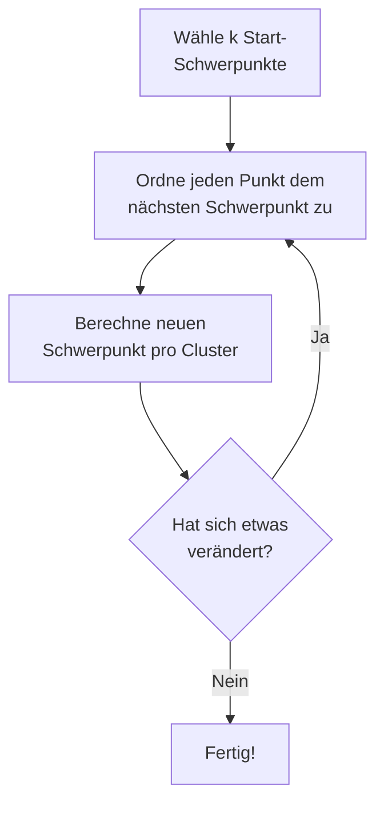

# Clusterbildung mit k-Means

:t[k-Means]{#k-means} ist ein konkretes Verfahren des unüberwachten Lernens. Es teilt Datenpunkte in k Gruppen (Cluster) ein, ohne vorher zu wissen, welche Gruppen es gibt. Jeder Cluster hat einen **Schwerpunkt** (Zentroid), und jeder Punkt wird dem nächstgelegenen Schwerpunkt zugeordnet.

## Die Idee



Der Algorithmus ist **iterativ**: er wiederholt zwei Schritte, bis sich nichts mehr verändert.

1. **Zuordnen:** Jeder Punkt kommt zum nächstgelegenen Schwerpunkt.
2. **Aktualisieren:** Jeder Schwerpunkt wandert in die Mitte seiner Punkte.

:::snippet{#definition}
**k-Means** ist ein iteratives Verfahren der Clusterbildung. Es teilt Datenpunkte in k Cluster ein, indem es abwechselnd die Punkte zu den nächsten Schwerpunkten zuordnet und die Schwerpunkte neu berechnet, bis sich die Zuordnung nicht mehr ändert.
:::

## Der Algorithmus in Java

Wir benutzen dieselbe `Datenpunkt`-Klasse aus Kapitel 2, aber **ohne Labels** — die gibt es im unüberwachten Lernen ja nicht.

:::onlineide{height="780px" speed="1000000"}

```java Main.java
void main() {
    // Datenpunkte ohne Labels
    Datenpunkt[] punkte = {
        new Datenpunkt(10, 20, ""),
        new Datenpunkt(12, 22, ""),
        new Datenpunkt(15, 18, ""),
        new Datenpunkt(50, 60, ""),
        new Datenpunkt(55, 65, ""),
        new Datenpunkt(52, 58, ""),
        new Datenpunkt(80, 20, ""),
        new Datenpunkt(85, 25, ""),
        new Datenpunkt(82, 18, "")
    };

    KMeans kmeans = new KMeans(punkte, 3);
    kmeans.trainiere(10);

    IO.println("--- Cluster-Zugehörigkeit ---");
    for (int i = 0; i < punkte.length; i++) {
        int cluster = kmeans.clusterVon(i);
        IO.println("Punkt " + i + " (" + punkte[i].gibGewicht() + ", " + punkte[i].gibSuessigkeit() + ") → Cluster " + cluster);
    }

    IO.println("--- Schwerpunkte ---");
    for (int c = 0; c < 3; c++) {
        Datenpunkt z = kmeans.schwerpunkt(c);
        IO.println("Cluster " + c + ": (" + z.gibGewicht() + ", " + z.gibSuessigkeit() + ")");
    }
}
```

```java KMeans.java
public class KMeans {
    private Datenpunkt[] punkte;
    private Datenpunkt[] zentroide;
    private int[] cluster;
    private int k;

    public KMeans(Datenpunkt[] pPunkte, int pK) {
        punkte = pPunkte;
        k = pK;
        zentroide = new Datenpunkt[k];
        cluster = new int[pPunkte.length];

        // Startpunkte: die ersten k Punkte. Bewusst einfach gewaehlt —
        // welche Folgen das hat, untersuchst du in Aufgabe c).
        for (int i = 0; i < k; i++) {
            zentroide[i] = new Datenpunkt(
                pPunkte[i].gibGewicht(),
                pPunkte[i].gibSuessigkeit(),
                ""
            );
        }
    }

    public void trainiere(int pMaxIterationen) {
        for (int iter = 0; iter < pMaxIterationen; iter++) {
            // Schritt 1: Jeden Punkt dem nächsten Zentroid zuordnen
            boolean veraendert = false;
            for (int i = 0; i < punkte.length; i++) {
                int bester = 0;
                double minDist = punkte[i].distanzZu(zentroide[0]);
                for (int c = 1; c < k; c++) {
                    double d = punkte[i].distanzZu(zentroide[c]);
                    if (d < minDist) {
                        minDist = d;
                        bester = c;
                    }
                }
                if (cluster[i] != bester) {
                    cluster[i] = bester;
                    veraendert = true;
                }
            }

            // Schritt 2: Zentroide neu berechnen
            for (int c = 0; c < k; c++) {
                double sumX = 0;
                double sumY = 0;
                int anzahl = 0;
                for (int i = 0; i < punkte.length; i++) {
                    if (cluster[i] == c) {
                        sumX = sumX + punkte[i].gibGewicht();
                        sumY = sumY + punkte[i].gibSuessigkeit();
                        anzahl++;
                    }
                }
                if (anzahl > 0) {
                    zentroide[c] = new Datenpunkt(sumX / anzahl, sumY / anzahl, "");
                }
            }

            IO.println("Iteration " + (iter + 1) + ": " + (veraendert ? "verändert" : "stabil"));
            if (!veraendert) {
                IO.println("Abbruch: Cluster sind stabil.");
                break;
            }
        }
    }

    public int clusterVon(int pIndex) {
        return cluster[pIndex];
    }

    public Datenpunkt schwerpunkt(int pCluster) {
        return zentroide[pCluster];
    }
}
```

```java Datenpunkt.java
public class Datenpunkt {
    private double gewicht;
    private double suessigkeit;
    private String label;

    public Datenpunkt(double pGewicht, double pSuessigkeit, String pLabel) {
        gewicht = pGewicht;
        suessigkeit = pSuessigkeit;
        label = pLabel;
    }

    public double gibGewicht() {
        return gewicht;
    }

    public double gibSuessigkeit() {
        return suessigkeit;
    }

    public String gibName() {
        return label;
    }

    public double distanzZu(Datenpunkt pOther) {
        double dg = pOther.gibGewicht() - gewicht;
        double ds = pOther.gibSuessigkeit() - suessigkeit;
        return Math.sqrt(dg * dg + ds * ds);
    }
}
```

:::

:::snippet{#brain}
Bevor du das Programm ausführst: Schau dir die 9 Punkte an. Sie bilden drei sichtbare Gruppen. Welche? Notiere deine Vermutung.
:::

::::collapsible{title="Tipp"}

Schau dir die Koordinaten an:
- Punkte nahe (10, 20) bilden eine Gruppe
- Punkte nahe (50, 60) bilden eine Gruppe
- Punkte nahe (80, 20) bilden eine Gruppe

→ 3 Cluster mit je 3 Punkten.

::::

:::snippet{#aufgabe}
a) Führe das Programm aus. Entspricht die Cluster-Zuordnung deiner Vermutung? Nach wie vielen Iterationen ist der Algorithmus stabil?

b) Ändere k auf 2. Welche zwei der drei sichtbaren Gruppen landen zusammen in einem Cluster?

c) Ändere k auf 4. Es entstehen **drei Cluster mit je einem einzigen Punkt** und einer mit sechs — die drei sichtbaren Gruppen werden gar nicht gefunden. Schau dir den Konstruktor an: Welche Punkte werden als Startpunkte benutzt? Erkläre damit das Ergebnis.

d) Behalte k = 4 und ändere im Konstruktor die Startpunkte so, dass sie über die Daten verteilt liegen — nimm statt `pPunkte[i]` die Punkte mit den Indizes 0, 3, 6 und 8. Was kommt jetzt heraus?
:::

::::collapsible{title="Tipp 1: zu c)"}

Der Konstruktor nimmt die **ersten k Punkte** als Startschwerpunkte. Schreibe die ersten vier Punkte des Feldes auf und zeichne sie ein. Wo liegen sie?
::::

::::collapsible{title="Tipp 2: zu d)"}

Du brauchst nur eine Zeile im Konstruktor. Lege dir ein Feld mit den gewünschten Indizes an und greife darüber zu:

```java
int[] start = {0, 3, 6, 8};
for (int i = 0; i < k; i++) {
    zentroide[i] = new Datenpunkt(
        pPunkte[start[i]].gibGewicht(),
        pPunkte[start[i]].gibSuessigkeit(),
        ""
    );
}
```
::::

:::protect{password="ai-3-1-1" description="Lösung. Erfrage das Passwort bei deiner Lehrkraft."}

a) Die Zuordnung stimmt mit der Vermutung überein: Punkte 0–2 bilden Cluster 0, Punkte 3–5 Cluster 1, Punkte 6–8 Cluster 2 — drei Cluster mit je drei Punkten. Nach der **dritten** Iteration meldet das Programm „stabil" und bricht ab.

b) Cluster 0 enthält die drei Punkte um (10, 20), Cluster 1 die **sechs** Punkte um (50, 60) und (80, 20) zusammen. Der Schwerpunkt von Cluster 1 landet bei (67,33 / 41,0) — mitten zwischen den beiden Gruppen, wo gar kein Datenpunkt liegt. Mit zu kleinem k verschmelzen echte Gruppen.

c) Die Startschwerpunkte sind die Punkte mit den Indizes 0, 1, 2 und 3, also (10, 20), (12, 22), (15, 18) und (50, 60). **Drei der vier Startpunkte liegen in derselben engen Gruppe.** Jeder von ihnen ist damit sich selbst am nächsten und behält genau einen Punkt; alle übrigen sechs Punkte sind dem vierten Startpunkt am nächsten und landen gemeinsam in Cluster 3. Schon nach der zweiten Iteration ist das stabil. Die Ursache ist also **nicht**, dass k zu groß wäre — sie liegt in der schlechten Wahl der Startpunkte.

d) Mit den Startpunkten 0, 3, 6 und 8 ergibt sich eine sinnvolle Aufteilung: 3 Punkte um (10, 20), 3 Punkte um (50, 60) und die dritte Gruppe wird in 2 + 1 Punkte zerlegt. Dasselbe k, dieselben Daten — ein völlig anderes Ergebnis.
:::

:::snippet{#merken}
**k-Means hängt von den Startpunkten ab.** Bei gleichen Daten und gleichem k können verschiedene Startschwerpunkte zu verschiedenen Clustern führen. Deshalb wird k-Means in der Praxis mehrfach mit unterschiedlichen zufälligen Startpunkten laufen gelassen; genommen wird das Ergebnis mit den kompaktesten Clustern.

Das ist ein wichtiger Unterschied zu k-NN: Dort liefert dieselbe Eingabe immer dasselbe Ergebnis.
:::

:::snippet{#merken}
k-Means ist **unüberwacht**: Es gibt keine Labels, und das System findet selbst Gruppen. Es ist **iterativ**: es wiederholt Zuordnen und Aktualisieren bis zur Stabilität. Und es ist **diskriminativ** im weiteren Sinn: Es teilt Daten in Gruppen ein, erzeugt aber keine neuen Daten.
:::

<!-- KLP Q-Phase: erläutern die Funktionsweise eines konkreten Verfahrens zur
     Clusterbildung beim unüberwachten Lernen (A) -->

---

## Selbsttest

::::multievent

**1. Was ist der Unterschied zwischen k-NN und k-Means?**

{r1{!k-NN ist überwacht (mit Labels), k-Means ist unüberwacht (ohne Labels).}}

{r1{k-NN ist unüberwacht, k-Means ist überwacht.}}

{r1{Beide sind überwacht.}}

{r1{Beide sind unüberwacht.}}

{h{k-NN braucht gelabelte Trainingsdaten. k-Means hat keine Labels.}}

{H{Richtig! k-NN klassifiziert mit Labels (überwacht), k-Means findet Cluster ohne Labels (unüberwacht).}}

**2. Welche zwei Schritte wiederholt k-Means?** (Mehrfachauswahl)

{c1{!Jeden Punkt dem nächsten Zentroid zuordnen}}

{c1{!Zentroide als Mittelwert ihrer Punkte neu berechnen}}

{c1{Labels aus den Trainingsdaten ablesen}}

{c1{Einen Zufallsbaum aufbauen}}

{h{Der Algorithmus besteht aus zwei abwechselnden Schritten: Zuordnen und Aktualisieren.}}

{H{Richtig! k-Means ordnet zu und aktualisiert abwechselnd, bis sich nichts mehr verändert.}}

**3. Wann bricht k-Means ab?**

{r2{!Wenn sich die Cluster-Zuordnung nicht mehr verändert.}}

{r2{Wenn alle Labels vergeben sind.}}

{r2{Wenn jeder Punkt sein eigener Cluster ist.}}

{r2{Wenn k = 1 ist.}}

{h{Der Algorithmus ist iterativ — er läuft, bis er stabil ist.}}

{H{Richtig! Wenn keine Punkte mehr den Cluster wechseln, ist das Ergebnis stabil und der Algorithmus bricht ab.}}

::::
