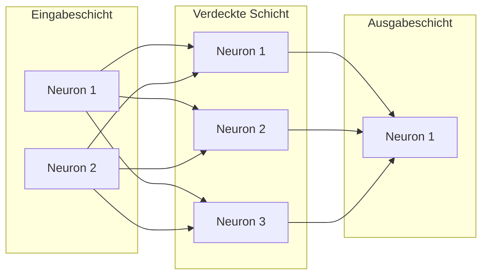

# Neuronen und Schichten

Ein künstliches :t[neuronales Netz]{#neuronales-netz} besteht aus **:t[Neuronen]{#neuron}**, die in **Schichten** angeordnet sind. Du baust zuerst die Klasse `Neuron` und dann die Klasse `Schicht`.

## Das biologische Vorbild

Ein biologisches Neuron empfängt Signale über Dendriten, verarbeitet sie im Zellkörper und gibt Signale über das Axon weiter. Ein künstliches Neuron ist eine vereinfachte Nachbildung: Es empfängt Zahlen, gewichtet sie, summiert sie und gibt eine Zahl weiter.



## Die drei Schichttypen

:::snippet{#definition}
- **Eingabeschicht:** Empfängt die Rohdaten. Jedes Neuron steht für ein Merkmal (z.B. Gewicht, Süßigkeit).
- **Verdeckte Schicht(en):** Liegen zwischen Ein- und Ausgabe. Hier passiert die eigentliche Verarbeitung. „Verdeckt" heißt: von außen nicht sichtbar.
- **Ausgabeschicht:** Liefert das Ergebnis (z.B. „Apfel" oder „Birne").
:::

## Die Neuron-Klasse

Ein Neuron hat **Gewichte** — eines für jedes Neuron der vorherigen Schicht — und einen **Bias-Wert** (nicht zu verwechseln mit Bias als Bewertungskriterium aus Kapitel 3).

:::onlineide{height="500px" speed="1000000"}

```java Main.java
void main() {
    // Ein Neuron, das 2 Eingaben empfängt
    Neuron n = new Neuron(2);

    // Gewichte und Bias setzen
    n.setzeGewicht(0, 0.5);
    n.setzeGewicht(1, -0.3);
    n.setzeBias(0.1);

    // Eingaben durchrechnen
    double[] eingabe = {1.0, 0.8};
    double ausgabe = n.berechne(eingabe);
    IO.println("Ausgabe: " + ausgabe);
}
```

```java Neuron.java
public class Neuron {
    private double[] gewichte;
    private double bias;

    public Neuron(int pAnzahlEingaben) {
        gewichte = new double[pAnzahlEingaben];
        for (int i = 0; i < pAnzahlEingaben; i++) {
            gewichte[i] = 0.0;
        }
        bias = 0.0;
    }

    public void setzeGewicht(int pIndex, double pWert) {
        gewichte[pIndex] = pWert;
    }

    public void setzeBias(double pWert) {
        bias = pWert;
    }

    public double berechne(double[] pEingabe) {
        double summe = bias;
        for (int i = 0; i < gewichte.length; i++) {
            summe = summe + gewichte[i] * pEingabe[i];
        }
        return summe;
    }
}
```

:::

:::snippet{#brain}
Bevor du das Programm ausführst: Berechne auf Papier. Die Gewichte sind 0.5 und -0.3, der Bias ist 0.1, die Eingaben sind 1.0 und 0.8. Was ist die Summe?
:::

::::collapsible{title="Tipp"}

summe = bias + gewicht[0] * eingabe[0] + gewicht[1] * eingabe[1]
summe = 0.1 + 0.5 * 1.0 + (-0.3) * 0.8
summe = 0.1 + 0.5 - 0.24
summe = 0.36

::::

:::alert{info}
**Kommazahlen sehen auf dem Bildschirm manchmal anders aus als auf dem Papier.** Die Online-IDE gibt eine `double`-Variable ohne `.0` aus — aus 0.2 wird `0.2`, aus 2.0 aber `2`. Und weil Kommazahlen im Rechner nur näherungsweise gespeichert werden, kann statt `0.2` auch einmal `0.20000000000000012` erscheinen. Das ist kein Fehler in deiner Rechnung: Vergleiche solche Werte immer nur auf die ersten Nachkommastellen.
:::

:::snippet{#merken}
Ein **Neuron** berechnet die gewichtete Summe seiner Eingaben plus einen Bias. Die Gewichte bestimmen, wie stark jede Eingabe zählt. Der Bias verschiebt das Ergebnis. Die Aktivierungsfunktion (kommen wir in der nächsten Lektion) entscheidet, was das Neuron weitergibt.
:::

:::snippet{#aufgabe}
a) Verifiziere deine Papierberechnung mit dem Programm.

b) Ändere beide Gewichte auf 0.0. Was ist die Ausgabe? Warum?

c) Erstelle ein Neuron mit 3 Eingaben. Setze alle Gewichte auf 0.2 und den Bias auf -1.0. Berechne die Ausgabe für die Eingaben {2.0, 3.0, 1.0}.
:::

::::collapsible{title="Tipp zu b)"}

Wenn alle Gewichte 0 sind, fällt die ganze Summe `gewichte[i] * pEingabe[i]` weg — egal, wie die Eingaben aussehen. Was bleibt dann von `summe` übrig?
::::

:::protect{password="ai-4-1-1" description="Lösung. Erfrage das Passwort bei deiner Lehrkraft."}

a) Das Programm gibt 0.36 aus — wie auf dem Papier.

b) Die Ausgabe ist **0.1**, also genau der Bias. Mit Gewichten von 0 wird jeder Summand `gewichte[i] * pEingabe[i]` zu 0; übrig bleibt nur der Startwert `summe = bias`. Das Neuron ignoriert seine Eingaben vollständig und gibt immer denselben Wert aus. Genau deshalb braucht ein Neuron beides: Der Bias allein macht es blind, die Gewichte allein nehmen ihm die Möglichkeit, auch bei lauter Null-Eingaben zu feuern.

c) Das Programm:

```java Main.java
void main() {
    Neuron n = new Neuron(3);
    n.setzeGewicht(0, 0.2);
    n.setzeGewicht(1, 0.2);
    n.setzeGewicht(2, 0.2);
    n.setzeBias(-1.0);

    double[] eingabe = {2.0, 3.0, 1.0};
    IO.println("Ausgabe: " + n.berechne(eingabe));
}
```

Auf dem Papier: summe = -1.0 + 0.2 · 2.0 + 0.2 · 3.0 + 0.2 · 1.0 = -1.0 + 0.4 + 0.6 + 0.2 = **0.2**.

Auf dem Bildschirm steht `0.20000000000000012` — das ist derselbe Wert, nur mit dem Rundungsfehler, den Kommazahlen im Rechner mit sich bringen (siehe den Hinweis weiter oben).
:::

<!-- KLP Q-Phase: erläutern die Grundlagen künstlicher neuronaler Netze (A) —
     Neuronen, Eingabeschicht, verdeckte Schichten, Ausgabeschicht -->

---

## Selbsttest

::::multievent

**1. Welche drei Schichttypen gibt es in einem neuronalen Netz?** (Mehrfachauswahl)

{c1{!Eingabeschicht}}

{c1{!Verdeckte Schicht}}

{c1{!Ausgabeschicht}}

{c1{Rückgabeschicht}}

{h{Es gibt Ein-, Verdeckt- und Ausgabeschichten.}}

{H{Richtig! Eingabeschicht empfängt Daten, verdeckte Schichten verarbeiten, Ausgabeschicht liefert das Ergebnis.}}

**2. Was speichert ein Neuron für jede Eingabe?**

{r2{!Ein Gewicht}}

{r2{Ein Label}}

{r2{Einen Cluster}}

{r2{Einen Zentroiden}}

{h{Gewichte bestimmen, wie stark jede Eingabe zählt.}}

{H{Richtig! Jedes Neuron hat pro Eingabe ein Gewicht, das bestimmt, wie stark diese Eingabe zur Summe beiträgt.}}

**3. Wozu dient der Bias eines Neurons?**

{r3{!Er verschiebt die gewichtete Summe.}}

{r3{Er löscht Eingaben.}}

{r3{Er ist ein Bewertungskriterium.}}

{r3{Er bestimmt die Anzahl der Schichten.}}

{h{Der Bias ist ein konstanter Wert, der zur gewichteten Summe addiert wird.}}

{H{Richtig! Der Bias verschiebt die Summe, sodass das Neuron auch dann aktiv sein kann, wenn alle Eingaben null sind.}}

::::
