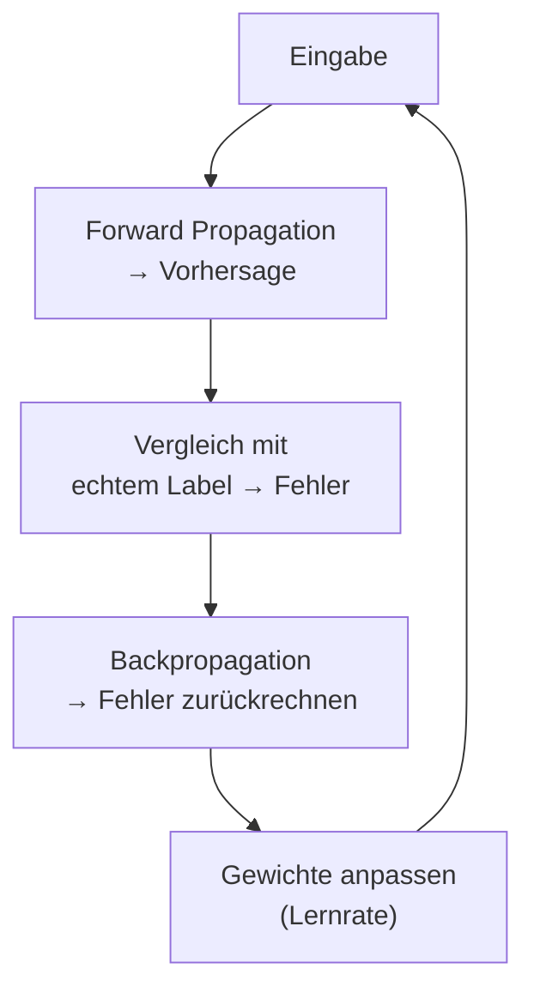

# Die Grundidee der Backpropagation

Forward Propagation berechnet eine Ausgabe. Aber woher weiß das Netz, ob die Ausgabe richtig ist? Und wie lernt es aus Fehlern? Die Antwort heißt **:t[Backpropagation]{#backpropagation}** — das Zurückrechnen des Fehlers durch das Netz.

## Der Lernzyklus



1. **Forward:** Das Netz berechnet eine Vorhersage.
2. **Fehler:** Vergleiche Vorhersage und echtes Label → wie weit liegt das Netz daneben?
3. **Backward:** Rechne den Fehler rückwärts durch das Netz. Jedes Gewicht erfährt, wie viel es zum Fehler beigetragen hat.
4. **Anpassen:** Jedes Gewicht wird ein kleines Stück in die Richtung korrigiert, die den Fehler verringert.

:::snippet{#definition}
**Backpropagation** ist ein Verfahren, das den Fehler des Netzes von der Ausgabeschicht rückwärts bis zur Eingabeschicht zurückrechnet. Für jedes Gewicht bestimmt es, wie stark es zum Fehler beigetragen hat. Dann werden die Gewichte mit einer **Lernrate** angepasst.
:::

## Die Lernrate

Die **:t[Lernrate]{#lernrate}** (learning rate) bestimmt, wie stark die Gewichte bei jedem Schritt angepasst werden:

- **Zu klein:** Das Netz lernt sehr langsam — viele Schritte nötig.
- **Zu groß:** Das Netz springt über das Optimum hinaus und kann instabil werden.
- **Typischer Wert:** 0.01 bis 0.1

:::snippet{#merken}
Backpropagation ist die **Grundidee**, wie neuronale Netze lernen: Der Fehler wird rückwärts durch das Netz gereicht, und jedes Gewicht wird ein kleines Stück korrigiert. Die **Lernrate** steuert, wie groß diese Schritte sind. In diesem Lernpfad implementieren wir die Backpropagation nicht vollständig (das wäre Stoff für den Leistungskurs) — aber du verstehst die Grundidee.
:::

## Ein einfaches Beispiel am einzelnen Neuron

Ein Neuron hat ein Gewicht $w = 0.5$ und gibt für die Eingabe $x = 2.0$ die Ausgabe $y = w \cdot x = 1.0$. Das echte Label ist $y_{echt} = 1.5$. Der Fehler ist:

$$\text{Fehler} = y_{echt} - y = 1.5 - 1.0 = 0.5$$

Mit Lernrate $\eta = 0.1$ wird das Gewicht angepasst:

$$w_{neu} = w + \eta \cdot \text{Fehler} \cdot x = 0.5 + 0.1 \cdot 0.5 \cdot 2.0 = 0.5 + 0.1 = 0.6$$

Nach der Anpassung ist die Ausgabe $y_{neu} = 0.6 \cdot 2.0 = 1.2$ — näher an 1.5. Ein weiterer Schritt bringt uns noch näher.

:::onlineide{height="480px" speed="1000000"}

```java Main.java
void main() {
    double w = 0.5;
    double x = 2.0;
    double yEcht = 1.5;
    double lernrate = 0.1;
    int schritte = 10;          // fuer Aufgabe b) erhoehen

    IO.println("Start: w = " + w);
    for (int i = 0; i < schritte; i++) {
        double y = w * x;
        double fehler = yEcht - y;
        w = w + lernrate * fehler * x;
        IO.println("Schritt " + (i + 1) + ": y = " + y + ", Fehler = " + fehler + ", w = " + w);
    }
    IO.println("Endergebnis: w = " + w + ", y = " + (w * x));
}
```

:::

:::snippet{#brain}
Bevor du das Programm ausführst: Nach wie vielen Schritten ist die Ausgabe näher als 0.01 an 1.5? Schreibe deine Vermutung auf.
:::

:::snippet{#aufgabe}
a) Führe das Programm aus. Nach wie vielen Schritten ist der Fehler zum ersten Mal kleiner als 0.01?

b) Setze die Lernrate auf 0.01. Mit 10 Schritten kommst du jetzt nicht mehr ans Ziel — erhöhe `schritte` so lange, bis der Fehler wieder unter 0.01 liegt. Wie viele brauchst du?

c) Setze die Lernrate auf 0.5 und lass 10 Schritte laufen. Was passiert mit `y`? Wird das Ergebnis besser oder schlechter?
:::

::::collapsible{title="Tipp zu a) und b)"}

Der Fehler steht in jeder Ausgabezeile. Suche die erste Zeile, in der davor eine 0 und danach höchstens eine 0 steht — also `Fehler = 0.00…`.
::::

::::collapsible{title="Tipp zu c)"}

Mit einer zu großen Lernrate kann das Verfahren „oszillieren" — es springt über das Ziel hinaus und kommt nicht zur Ruhe. Schreibe die `y`-Werte der ersten vier Schritte untereinander und schau sie dir an.
::::

:::protect{password="ai-4-4-1" description="Lösung. Erfrage das Passwort bei deiner Lehrkraft."}

a) In **Schritt 9**: Die `y`-Werte laufen 1.0 → 1.2 → 1.32 → 1.392 → 1.4352 → 1.4611 → 1.4767 → 1.486 → 1.4916, und 1.5 − 1.4916 = 0.0084 liegt erstmals unter 0.01. Der Fehler wird in jedem Schritt auf 60 % des vorherigen verkleinert.

b) Rund **97 Schritte** (`schritte = 100` genügt also). Mit Lernrate 0.01 schrumpft der Fehler pro Schritt nur auf 96 % — nach den ursprünglichen 10 Schritten ist y erst bei 1.1676. Zehnmal kleinere Schritte bedeuten also ungefähr **zehnmal so viele** Schritte. Das Ergebnis ist dasselbe, nur der Weg dorthin ist viel länger.

c) Das Verfahren kommt nie an: y springt zwischen 1.0 und 2.0 hin und her, immer im selben Abstand von 0.5 zum Ziel. Nach 10 Schritten ist w wieder genau der Startwert 0.5.

Der Grund lässt sich ausrechnen: Der Fehler wird pro Schritt mit dem Faktor (1 − η · x²) multipliziert. Bei η = 0.1 und x = 2 ist das 1 − 0.4 = 0.6 — der Fehler schrumpft. Bei η = 0.5 ist es 1 − 2 = −1 — der Fehler behält seinen Betrag und wechselt nur das Vorzeichen. Bei noch größerer Lernrate würde er mit jedem Schritt **wachsen**, und das Netz liefe ganz aus dem Ruder.
:::

<!-- KLP Q-Phase: erläutern die Grundlagen künstlicher neuronaler Netze (A) —
     Grundidee der Backpropagation -->

---

## Selbsttest

::::multievent

**1. Was ist die Grundidee der Backpropagation?**

{r1{!Der Fehler wird von der Ausgabe rückwärts durch das Netz gereicht und jedes Gewicht wird korrigiert.}}

{r1{Die Daten werden vorwärts durch das Netz geschickt.}}

{r1{Die Trainingsdaten werden in Cluster eingeteilt.}}

{r1{Die Ausgabeschicht wird gelöscht und neu aufgebaut.}}

{h{„Back" = zurück, „propagation" = Weitergabe. Der Fehler wird rückwärts weitergegeben.}}

{H{Richtig! Backpropagation rechnet den Fehler zurück und passt die Gewichte an.}}

**2. Wozu dient die Lernrate?**

{r2{!Sie bestimmt, wie stark die Gewichte bei jedem Schritt angepasst werden.}}

{r2{Sie bestimmt, wie viele Schichten das Netz hat.}}

{r2{Sie bestimmt, wie viele Trainingsdaten es gibt.}}

{r2{Sie bestimmt die Aktivierungsfunktion.}}

{h{Die Lernrate ist ein Faktor, der die Schrittgröße der Gewichtsanpassung steuert.}}

{H{Richtig! Die Lernrate steuert, wie große Schritte das Netz beim Lernen macht.}}

**3. Was passiert, wenn die Lernrate zu groß ist?**

{r3{!Das Netz kann über das Optimum hinausspringen und instabil werden.}}

{r3{Das Netz lernt besonders schnell und genau.}}

{r3{Das Netz lernt gar nichts.}}

{r3{Die Gewichte werden alle null.}}

{h{Zu große Schritte können das Ziel überspringen.}}

{H{Richtig! Eine zu große Lernrate führt dazu, dass das Netz „oszilliert" und nicht konvergiert.}}

::::
