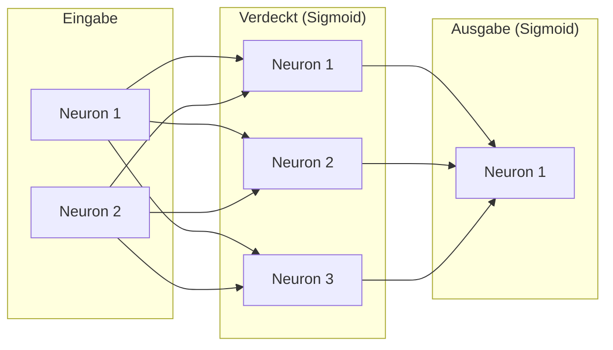

# Ein einfaches Netz

Jetzt setzt du alles zusammen: Neuronen, Schichten und Aktivierungsfunktionen. Eine `Netz`-Klasse verbindet mehrere Schichten und führt die Forward Propagation durch.

## Die Architektur

Wir bauen ein Netz mit:
- **Eingabeschicht:** 2 Neuronen (z.B. Gewicht und Süßigkeit)
- **Verdeckte Schicht:** 3 Neuronen, Sigmoid
- **Ausgabeschicht:** 1 Neuron, Sigmoid (Wert zwischen 0 und 1)



## Die Netz-Klasse

:::snippet{#brain}
Bevor du das Programm ausführst: Die Ausgabe ist ein Wert zwischen 0 und 1 (wegen Sigmoid). Nahe 0 bedeutet „Birne", nahe 1 bedeutet „Apfel". Welchen Wert erwartest du für die Eingabe {0.9, 0.7} — eher Apfel oder Birne?
:::

::::collapsible{title="Tipp"}

Die Eingabe {0.9, 0.7} könnte für einen Apfel stehen (hohes Gewicht, hohe Süßigkeit). Man würde also eine Ausgabe nahe 1 erwarten. Aber Vorsicht: Die Gewichte wurden von Hand gesetzt, nicht gelernt. Schau genau hin, was wirklich herauskommt.
::::

:::onlineide{height="800px" speed="1000000"}

```java Main.java
void main() {
    // Netz: 2 Eingaben → 3 verdeckt (Sigmoid) → 1 Ausgabe (Sigmoid)
    Netz netz = new Netz(new int[]{2, 3, 1}, new Sigmoid());

    // Gewichte der verdeckten Schicht setzen
    netz.setzeGewicht(1, 0, 0, 0.5);  netz.setzeGewicht(1, 0, 1, -0.3);
    netz.setzeGewicht(1, 1, 0, 0.8);  netz.setzeGewicht(1, 1, 1, 0.2);
    netz.setzeGewicht(1, 2, 0, -0.4); netz.setzeGewicht(1, 2, 1, 0.9);
    netz.setzeBias(1, 0, 0.1); netz.setzeBias(1, 1, -0.5); netz.setzeBias(1, 2, 0.3);

    // Gewichte der Ausgabeschicht setzen
    netz.setzeGewicht(2, 0, 0, 0.6); netz.setzeGewicht(2, 0, 1, -0.7); netz.setzeGewicht(2, 0, 2, 0.4);
    netz.setzeBias(2, 0, -0.2);

    // Forward Propagation
    double[] eingabe = {0.9, 0.7};
    double[] ausgabe = netz.berechne(eingabe);

    IO.println("Ausgabe des Netzes: " + ausgabe[0]);
    IO.println("(0 = Birne, 1 = Apfel)");
}
```

```java Netz.java
public class Netz {
    private Schicht[] schichten;

    public Netz(int[] pStruktur, Aktivierung pAktivierung) {
        schichten = new Schicht[pStruktur.length - 1];
        for (int i = 0; i < schichten.length; i++) {
            schichten[i] = new Schicht(pStruktur[i + 1], pStruktur[i], pAktivierung);
        }
    }

    public void setzeGewicht(int pSchicht, int pNeuron, int pEingabe, double pWert) {
        schichten[pSchicht - 1].setzeGewicht(pNeuron, pEingabe, pWert);
    }

    public void setzeBias(int pSchicht, int pNeuron, double pWert) {
        schichten[pSchicht - 1].setzeBias(pNeuron, pWert);
    }

    public double[] berechne(double[] pEingabe) {
        double[] werte = pEingabe;
        for (int i = 0; i < schichten.length; i++) {
            werte = schichten[i].berechne(werte);
        }
        return werte;
    }
}
```

```java Schicht.java
public class Schicht {
    private Neuron[] neuronen;
    public Schicht(int pAnzahlNeuronen, int pAnzahlEingaben, Aktivierung pAktivierung) {
        neuronen = new Neuron[pAnzahlNeuronen];
        for (int i = 0; i < pAnzahlNeuronen; i++) {
            neuronen[i] = new Neuron(pAnzahlEingaben, pAktivierung);
        }
    }
    public void setzeGewicht(int pNeuron, int pEingabe, double pWert) {
        neuronen[pNeuron].setzeGewicht(pEingabe, pWert);
    }
    public void setzeBias(int pNeuron, double pWert) {
        neuronen[pNeuron].setzeBias(pWert);
    }
    public double[] berechne(double[] pEingabe) {
        double[] ausgabe = new double[neuronen.length];
        for (int i = 0; i < neuronen.length; i++) {
            ausgabe[i] = neuronen[i].berechne(pEingabe);
        }
        return ausgabe;
    }
}
```

```java Neuron.java
public class Neuron {
    private double[] gewichte;
    private double bias;
    private Aktivierung aktivierung;
    public Neuron(int pAnzahlEingaben, Aktivierung pAktivierung) {
        gewichte = new double[pAnzahlEingaben];
        for (int i = 0; i < pAnzahlEingaben; i++) { gewichte[i] = 0.0; }
        bias = 0.0;
        aktivierung = pAktivierung;
    }
    public void setzeGewicht(int pIndex, double pWert) { gewichte[pIndex] = pWert; }
    public void setzeBias(double pWert) { bias = pWert; }
    public double berechne(double[] pEingabe) {
        double summe = bias;
        for (int i = 0; i < gewichte.length; i++) {
            summe += gewichte[i] * pEingabe[i];
        }
        return aktivierung.aktiviere(summe);
    }
}
```

```java Aktivierung.java
public interface Aktivierung {
    double aktiviere(double pWert);
}
```

```java Sigmoid.java
public class Sigmoid implements Aktivierung {
    public double aktiviere(double pWert) {
        return 1.0 / (1.0 + Math.exp(-pWert));
    }
}
```

:::

:::snippet{#merken}
Dieses Netz ist die **komplette Architektur eines neuronalen Netzes** in Java:
- `Neuron` hat Gewichte, Bias und eine Aktivierungsfunktion (Polymorphie).
- `Schicht` hat mehrere Neuronen (1:n-Assoziation) und berechnet alle nacheinander.
- `Netz` hat mehrere Schichten (1:n-Assoziation) und führt Forward Propagation durch.
- Die Daten fließen von Schicht zu Schicht — jede Ausgabe wird zur Eingabe der nächsten.
:::

:::snippet{#aufgabe}
a) Führe das Programm aus. Ist die Ausgabe näher an 0 (Birne) oder an 1 (Apfel)?

b) Probiere eine andere Eingabe: {0.3, 0.2} (kleine Frucht, wenig Süßigkeit). Ändert sich die Ausgabe?

c) Ändere die Gewichte der Ausgabeschicht alle auf positive Werte (z.B. 0.5). Wie verändert sich die Ausgabe für {0.9, 0.7}?
:::

::::collapsible{title="Tipp zu a) und b)"}

Vergleiche die beiden Ausgaben nicht mit 0 oder 1, sondern **miteinander** und mit 0.5. Wie weit liegen sie auseinander? Und liegt der „Apfel" wirklich höher als die „Birne"?
::::

:::protect{password="ai-4-5-1" description="Lösung. Erfrage das Passwort bei deiner Lehrkraft."}

a) Die Ausgabe ist **≈ 0.498** — also praktisch genau in der Mitte. Das Netz sagt damit weder „Apfel" noch „Birne", sondern: „keine Ahnung".

b) Für {0.3, 0.2} kommt **≈ 0.513** heraus. Die beiden Ausgaben unterscheiden sich um weniger als zwei Hundertstel — und die vermeintliche Birne bekommt sogar den **höheren** Wert als der vermeintliche Apfel. Die Zuordnung ist also nicht nur unsicher, sie ist verkehrt herum.

Das ist die wichtigste Erkenntnis dieser Lektion: Die Gewichte wurden von Hand gesetzt, nicht gelernt. Ein Netz mit ungelernten Gewichten rechnet einwandfrei und liefert eine Zahl zwischen 0 und 1 — diese Zahl bedeutet aber **nichts**. Erst das Training (Kapitel 4.4) macht aus der Architektur ein Modell.

c) Mit allen drei Ausgabegewichten auf 0.5 steigt die Ausgabe für {0.9, 0.7} auf **≈ 0.670**. Der Grund: Die drei verdeckten Neuronen liefern alle Werte um 0.6, und statt sie gegeneinander zu verrechnen (0.6, -0.7, 0.4) addiert das Ausgabeneuron sie jetzt alle mit positivem Vorzeichen. Die Ausgabe sagt damit „eher Apfel" — aber aus demselben Grund wie vorher: weil wir die Gewichte so gewählt haben, nicht weil das Netz etwas über Äpfel weiß. Für {0.3, 0.2} ergäbe sich mit 0.644 fast derselbe Wert.
:::

## Warum es die verdeckte Schicht braucht

In Lektion 4.2 bist du an XOR gescheitert — ein einzelnes Neuron kann es nicht. Dieses Netz hat dieselbe Architektur wie dein Programm: 2 Eingaben, 3 verdeckte Neuronen, 1 Ausgabe. Damit geht es.

<ki-neuron modus="netz" ziel="xor" eingabe="0.9,0.7"></ki-neuron>

:::snippet{#aufgabe}
a) Die Gewichte stehen noch auf den Werten aus dem Programm. Schau in die Wahrheitstabelle: Wie viele der vier XOR-Zeilen stimmen?

b) Öffne **Gewichte des Netzes** und drücke auf **XOR-Lösung**. Jetzt stimmen alle vier. Sieh dir die beiden ersten verdeckten Neuronen an: Eines rechnet ODER, das andere UND. Welches ist welches?

c) Setze das Gewicht von h2 zur Ausgabe auf einen positiven Wert. Welche Zeile kippt zuerst, und warum gerade die?

d) Drücke auf **Zufällig** und dann mehrmals erneut. Wie oft kommt XOR dabei heraus? Was sagt dir das darüber, warum Netze trainiert werden müssen?
:::

::::collapsible{title="Tipp zu b)"}

Stelle die Eingabe nacheinander auf (1 | 0) und (1 | 1) und lies die Werte in h1 und h2 ab. Welches Neuron feuert schon bei einer einzelnen 1, welches erst bei zwei?
::::

:::protect{password="ai-4-5-2" description="Lösung. Erfrage das Passwort bei deiner Lehrkraft."}

b) **h1 rechnet ODER** (Gewichte 4 und 4, Bias −2): Es feuert schon, wenn eine der beiden Eingaben 1 ist. **h2 rechnet UND** (Gewichte 4 und 4, Bias −6): Es feuert erst, wenn beide 1 sind.

Die Ausgabeschicht bildet daraus „ODER, aber nicht UND" — und genau das ist XOR. Das Netz hat das Problem also in zwei Fragen zerlegt, die ein einzelnes Neuron je beantworten kann. Das ist der ganze Sinn einer verdeckten Schicht.

c) Zuerst kippt die Zeile (1 | 1). Dort ist h2 als Einziges aktiv; sein Gewicht zur Ausgabe war das Einzige, was diese Zeile nach unten gedrückt hat. Ohne das negative Gewicht wird aus XOR wieder ODER.

d) So gut wie nie. Von Hand gesetzte oder zufällige Gewichte lösen die Aufgabe nur in den seltensten Fällen — und dieses Netz hat bloß 13 Zahlen. Ein echtes Netz hat Millionen. Deshalb werden Gewichte nicht geraten, sondern über die Backpropagation aus Lektion 4.4 schrittweise angepasst.
:::

<!-- KLP Q-Phase: erläutern die Grundlagen künstlicher neuronaler Netze (A) —
     Eingabeschicht, verdeckte Schichten, Ausgabeschicht, Forward Propagation -->

---

## Selbsttest

::::multievent

**1. Wie ist die OO-Struktur des neuronalen Netzes aufgebaut?** (Mehrfachauswahl)

{c1{!Netz „hat" mehrere Schichten (1:n-Assoziation)}}

{c1{!Schicht „hat" mehrere Neuronen (1:n-Assoziation)}}

{c1{!Neuron „hat" eine Aktivierungsfunktion (Polymorphie)}}

{c1{Netz „ist ein" Schicht (Vererbung)}}

{h{Netz → Schicht → Neuron heisst jeweils hat ein, nicht ist ein.}}

{H{Richtig! Netz hat Schichten, Schicht hat Neuronen (Assoziation), Neuron hat eine Aktivierung (Polymorphie). Keine Vererbung zwischen diesen Klassen.}}

**2. Wie fließen Daten durch das Netz bei der Forward Propagation?**

{r2{!Von der Eingabeschicht durch jede verdeckte Schicht zur Ausgabeschicht.}}

{r2{Von der Ausgabeschicht rückwärts zur Eingabeschicht.}}

{r2{Von der verdeckten Schicht gleichzeitig zu Ein- und Ausgabe.}}

{r2{Daten fließen nicht — das Netz speichert nur.}}

{h{„Forward" = vorwärts: Ein → Verdeckt → Aus.}}

{H{Richtig! Jede Schicht nimmt die Ausgabe der vorherigen als Eingabe.}}

**3. Was bedeutet eine Ausgabe von 0.85 bei einem Sigmoid-Neuron?**

{r3{!Das Neuron ist stark aktiv — nahe am Maximum von 1.}}

{r3{Das Neuron ist inaktiv — nahe an 0.}}

{r3{Das Neuron hat einen Fehler gemacht.}}

{r3{Das Neuron hat 85 % der Eingaben verarbeitet.}}

{h{Sigmoid liefert Werte zwischen 0 und 1. 0.85 ist nahe an 1.}}

{H{Richtig! Sigmoid erzeugt Werte in (0, 1). 0.85 bedeutet: das Neuron ist stark aktiv.}}

::::
